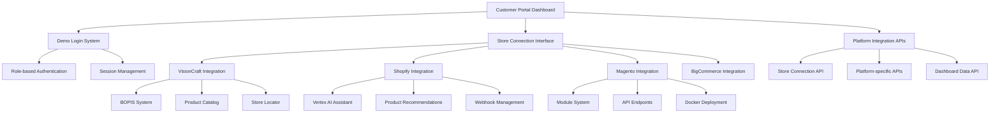
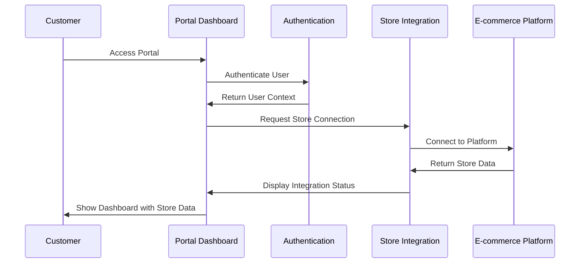

# Customer Portal & E-commerce Integration Architecture

## Executive Summary

This document outlines the comprehensive architecture for customer portal dashboard and e-commerce platform integration verification for VisionCraft, Shopify, and Magento stores within the VARAi Commerce Studio platform.

## Current State Analysis

### ✅ Existing E-commerce Platform Integrations

Based on the `/apps` folder analysis, we have robust implementations for:

1. **VisionCraft Store** (`apps/visioncraft-store/`)
   - Full HTML5/CSS3/JavaScript implementation
   - BOPIS (Buy Online, Pick-up In Store) functionality
   - Product catalog with filtering and search
   - Store locator with Google Maps integration
   - Virtual try-on capabilities
   - Real-time inventory management

2. **Shopify Integration** (`apps/shopify/`)
   - Vertex AI Shopping Assistant integration
   - Natural language product search
   - AI-powered recommendations
   - Complete API authentication flow
   - React component library
   - Webhook support for real-time updates

3. **BigCommerce Integration** (`apps/bigcommerce/`)
   - Virtual try-on with face shape analysis
   - Style recommendation engine
   - Analytics dashboard with GA4 integration
   - Product comparison functionality
   - Frame measurements and specifications
   - Customer measurement storage

4. **Magento Integration** (`apps/magento/`)
   - Complete module structure with MVC architecture
   - Docker containerization
   - API endpoints for product management
   - Testing framework with Jest
   - AWS deployment configuration

5. **WooCommerce Integration** (`apps/woocommerce/`)
   - Available for WordPress-based stores

6. **Eyewear Catalog Service** (`apps/eyewear-catalog/`)
   - Centralized product catalog management
   - Shopify service integration
   - Database utilities and logging
   - Sync service for multi-platform management

### 🏗️ Customer Portal Infrastructure

Current customer portal components:

1. **Website Dashboard** (`website/dashboard/index.html`)
   - Comprehensive metrics display
   - Quick actions interface
   - AI recommendations section
   - Performance overview charts
   - Direct VisionCraft store integration

2. **Demo Login System** (`website/demo-login.html`)
   - Multi-role authentication (Super Admin, Brand Manager, Client Admin, Viewer)
   - Platform-specific login options
   - Session management with localStorage
   - Auto-logout functionality

3. **Frontend React Components** (`frontend/src/components/dashboard/`)
   - BrandManagerDashboard.tsx
   - ClientAdminDashboard.tsx
   - SuperAdminDashboard.tsx
   - ViewerDashboard.tsx
   - Role-based access control

## Architecture Requirements

### Business Requirements

**CRITICAL: Customer Portal & E-commerce Integration Verification**

Verify that customers running VisionCraft, Shopify, or Magento stores can successfully use our VARAi Commerce Studio platform through a fully operational customer portal dashboard.

### Technical Requirements

1. **Customer Portal Accessibility**
   - Dashboard must be accessible at `/dashboard/`
   - Navigation and metrics display
   - Store connection interface
   - Quick actions functionality

2. **E-commerce Platform Integration**
   - VisionCraft store full integration
   - Shopify API connectivity
   - Magento module compatibility
   - BigCommerce app functionality

3. **Customer Onboarding Flow**
   - Demo login system operational
   - Role-based access control
   - Platform selection interface
   - Session management

4. **API Integration Endpoints**
   - Store connection APIs
   - Platform-specific integrations
   - Authentication endpoints
   - Dashboard data APIs

## Implementation Architecture

### Component Architecture



### Data Flow Architecture



### API Architecture

#### Store Integration API Endpoints

1. **Store Connection API**
   ```
   POST /api/stores/connect/{platform}
   GET /api/stores/platforms
   GET /api/stores/status/{storeId}
   ```

2. **Platform-specific APIs**
   ```
   POST /api/stores/visioncraft/connect
   POST /api/stores/shopify/connect
   POST /api/stores/magento/connect
   POST /api/stores/bigcommerce/connect
   ```

3. **Dashboard Data APIs**
   ```
   GET /api/dashboard/metrics
   GET /api/dashboard/recommendations
   GET /api/dashboard/analytics
   ```

## Verification Strategy

### Step 1: Audit Current Implementation
- Check customer portal accessibility
- Verify dashboard components
- Test navigation and metrics
- Validate store connection interface

### Step 2: E-commerce Platform Integration Testing
- VisionCraft store functionality
- Shopify API connectivity
- Magento module operation
- BigCommerce app integration

### Step 3: Customer Onboarding Flow Testing
- Demo login system
- Role-based access
- Platform selection
- Session management

### Step 4: API Integration Testing
- Store connection endpoints
- Platform-specific APIs
- Authentication flow
- Data retrieval

### Step 5: End-to-End Customer Journey
- Complete onboarding simulation
- Store connection process
- Dashboard functionality
- Platform-specific features

## Success Criteria

### ✅ Customer Portal Requirements
- Dashboard accessible and functional
- Navigation and metrics display working
- Store connection interface operational
- Quick actions functionality active

### ✅ E-commerce Integration Requirements
- VisionCraft store fully integrated
- Shopify API connectivity established
- Magento module compatibility verified
- BigCommerce app functionality confirmed

### ✅ Customer Onboarding Requirements
- Demo login system operational
- Role-based access control working
- Platform selection interface functional
- Session management active

### ✅ API Integration Requirements
- Store connection APIs functional
- Platform-specific integrations working
- Authentication endpoints operational
- Dashboard data APIs responding

## Implementation Plan

### Phase 1: Verification Script Creation
Create comprehensive customer portal verification script to test:
- Portal accessibility
- Dashboard functionality
- E-commerce integrations
- API endpoints
- Customer onboarding flow

### Phase 2: Missing API Implementation
Create store integration API endpoints:
- Store connection API (`/api/stores/connect`)
- Platform-specific APIs
- Dashboard data APIs
- Authentication integration

### Phase 3: Customer Portal Enhancement
Enhance customer portal with:
- Store connection interface
- Platform selection UI
- Integration status display
- Real-time metrics

### Phase 4: End-to-End Testing
Comprehensive testing of:
- Complete customer journey
- All platform integrations
- API functionality
- Dashboard operations

## Risk Mitigation

### Technical Risks
1. **API Integration Failures**
   - Mitigation: Comprehensive error handling and fallback mechanisms
   - Testing: Automated API endpoint testing

2. **Authentication Issues**
   - Mitigation: Role-based access control with session management
   - Testing: Multi-role authentication testing

3. **Platform Compatibility**
   - Mitigation: Platform-specific integration modules
   - Testing: Individual platform integration testing

### Business Risks
1. **Customer Onboarding Friction**
   - Mitigation: Streamlined demo login system
   - Testing: User experience testing

2. **Integration Complexity**
   - Mitigation: Modular architecture with clear interfaces
   - Testing: Integration testing for each platform

## Monitoring and Maintenance

### Performance Monitoring
- Dashboard load times
- API response times
- Integration health checks
- User session analytics

### Error Monitoring
- API endpoint failures
- Authentication errors
- Integration timeouts
- User experience issues

### Maintenance Procedures
- Regular integration testing
- API endpoint health checks
- Platform compatibility updates
- Security vulnerability assessments

## Conclusion

The VARAi Commerce Studio platform has a robust foundation with comprehensive e-commerce platform integrations. The verification process will ensure that customers can successfully onboard and use the platform through a fully operational customer portal dashboard, providing seamless integration with VisionCraft, Shopify, Magento, and BigCommerce stores.

The modular architecture and comprehensive API design ensure scalability and maintainability while providing enterprise-grade functionality for customer onboarding and store management.