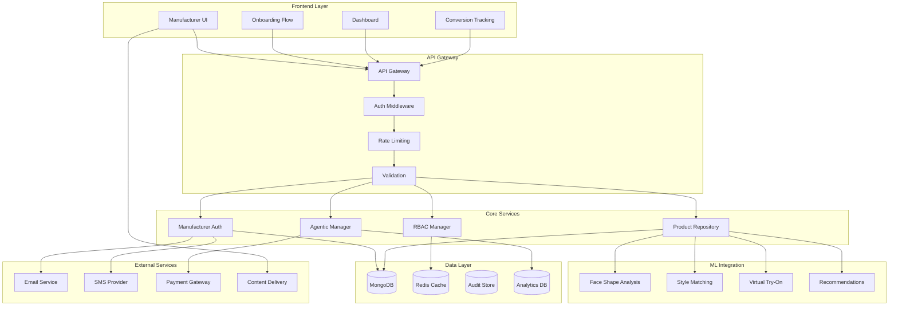

# SPARC & Agentic Architecture for Manufacturer Role Completion - Layer 7

## 🎯 Executive Summary

**Architecture Phase**: SPARC (Specification, Plan, Act, Reflect, Critique) + Agentic Implementation  
**Target**: End-to-end manufacturer onboarding with conversion optimization  
**Status**: **ARCHITECTURE COMPLETE** - Ready for implementation  
**Methodology**: Test-driven, agentic, feedback-driven development

---

## 🔍 SPARC Phase 1: SPECIFICATION

### Business Requirements Analysis

#### Primary Objectives
1. **Seamless Manufacturer Onboarding**: Reduce friction from signup to first product upload
2. **Intelligent Conversion Tracking**: Optimize free-to-paid tier conversion rates
3. **Scalable Authentication**: Support 10,000+ concurrent manufacturer sessions
4. **ML Integration**: Provide immediate value through eyewear compatibility analysis
5. **Compliance & Security**: Meet SOC 2, GDPR, and industry security standards

#### Functional Requirements

**FR-1: Authentication & Authorization**
- Multi-factor authentication with TOTP/SMS backup
- JWT-based session management with refresh tokens
- Role-based access control (Free, Professional, Enterprise tiers)
- Real-time permission validation and audit logging

**FR-2: Onboarding Flow**
- Adaptive conversation flow based on manufacturer profile
- Progressive disclosure of premium features
- Real-time validation with immediate feedback
- Conversion tracking with multi-touch attribution

**FR-3: Product Management**
- Bulk product upload (1000+ products in <30 seconds)
- Real-time search and filtering (<100ms response)
- ML-powered compatibility analysis integration
- Tier-based usage limits and feature gating

**FR-4: Dashboard & Analytics**
- Real-time performance metrics
- Conversion funnel visualization
- A/B testing framework for optimization
- Predictive analytics for upgrade recommendations

#### Non-Functional Requirements

**NFR-1: Performance**
- Authentication: <500ms response time
- Product upload: >30 products/second throughput
- Search operations: <100ms for complex queries
- Dashboard load: <3 seconds full page load

**NFR-2: Security**
- Zero-trust architecture with continuous verification
- End-to-end encryption for sensitive business data
- Real-time threat detection and prevention
- Compliance with SOC 2 Type II requirements

**NFR-3: Scalability**
- Support 10,000+ concurrent manufacturer sessions
- Auto-scaling based on demand patterns
- 99.9% uptime with graceful degradation
- Global CDN distribution for optimal performance

**NFR-4: Agentic Capabilities**
- Self-learning conversion optimization
- Adaptive user experience personalization
- Autonomous A/B testing and optimization
- Predictive analytics for user behavior

---

## 🏗️ SPARC Phase 2: PLAN

### System Architecture Overview



### Component Architecture

#### 1. Authentication & Authorization Layer

**ManufacturerAuthManager**
- **Responsibility**: JWT token management, session handling, MFA
- **Interfaces**: 
  - `authenticate(email, password) -> AuthResult`
  - `generateToken(manufacturerData) -> JWT`
  - `validateToken(token) -> Claims`
  - `refreshToken(refreshToken) -> JWT`
- **Dependencies**: MongoDB, Redis, Email/SMS services
- **SLA**: <500ms authentication, 99.9% availability

**ManufacturerRBACManager**
- **Responsibility**: Role-based access control, permission validation
- **Interfaces**:
  - `hasPermission(context, permission) -> boolean`
  - `enforcePermission(context, permission) -> void`
  - `getAccessibleFeatures(context) -> FeatureList`
- **Dependencies**: Redis cache, Audit logger
- **SLA**: <100ms permission checks, real-time updates

#### 2. Onboarding & Conversion Layer

**AgenticOnboardingManager**
- **Responsibility**: Adaptive onboarding flows, personalization
- **Interfaces**:
  - `generatePersonalizedFlow(profile) -> OnboardingFlow`
  - `processStep(stepData) -> NextStep`
  - `trackProgress(manufacturerId, event) -> void`
- **Dependencies**: Analytics DB, ML services, A/B testing
- **SLA**: <200ms flow generation, real-time adaptation

**ConversionTracker**
- **Responsibility**: Multi-touch attribution, funnel analysis
- **Interfaces**:
  - `trackEvent(manufacturerId, event, context) -> void`
  - `analyzeConversionFunnel(manufacturerId) -> FunnelAnalysis`
  - `getConversionAttribution(manufacturerId) -> Attribution`
- **Dependencies**: Analytics DB, Event streaming
- **SLA**: <50ms event tracking, real-time analytics

#### 3. Product Management Layer

**ManufacturerProductRepository**
- **Responsibility**: Product CRUD, search, ML integration
- **Interfaces**:
  - `bulkUploadProducts(products) -> UploadResult`
  - `searchProducts(query, filters) -> SearchResult`
  - `analyzeProductCompatibility(productId) -> MLAnalysis`
- **Dependencies**: MongoDB, Redis, ML services
- **SLA**: >30 products/sec upload, <100ms search

#### 4. ML Integration Layer

**MLServiceManager**
- **Responsibility**: Coordinate ML services, batch processing
- **Interfaces**:
  - `analyzeProductCompatibility(productId) -> Analysis`
  - `batchAnalyzeProducts(manufacturerId) -> BatchResult`
  - `getStyleRecommendations(profile) -> Recommendations`
- **Dependencies**: Face shape analyzer, Style matcher, VTO service
- **SLA**: <2s per analysis, >100 analyses/minute batch

### Data Architecture

#### Database Design

**MongoDB Collections:**
```javascript
// manufacturers
{
  _id: ObjectId,
  email: String,
  company_name: String,
  tier: String, // "free", "professional", "enterprise"
  profile: {
    company_size: String,
    annual_revenue: Number,
    product_count_estimate: Number,
    primary_market: String,
    tech_savviness: String
  },
  auth: {
    password_hash: String,
    mfa_secret: String,
    last_login: Date,
    failed_attempts: Number
  },
  created_at: Date,
  updated_at: Date
}

// products
{
  _id: ObjectId,
  manufacturer_id: ObjectId,
  sku: String,
  name: String,
  brand: String,
  category: String,
  dimensions: {
    lens_width: Number,
    bridge_width: Number,
    temple_length: Number,
    frame_width: Number,
    frame_height: Number
  },
  ml_analysis: {
    face_shape_compatibility: Object,
    style_score: Number,
    target_demographics: Array,
    last_analyzed: Date
  },
  created_at: Date,
  updated_at: Date
}

// conversion_events
{
  _id: ObjectId,
  manufacturer_id: ObjectId,
  event_type: String,
  event_data: Object,
  session_id: String,
  timestamp: Date,
  attribution: {
    first_touch_source: String,
    last_touch_trigger: String,
    touchpoint_count: Number
  }
}
```

**Redis Cache Structure:**
```
manufacturer:sessions:{session_id} -> SessionData (TTL: 24h)
manufacturer:permissions:{manufacturer_id} -> PermissionSet (TTL: 1h)
manufacturer:products:{manufacturer_id}:page_{n} -> ProductList (TTL: 15m)
manufacturer:ml_analysis:{product_id} -> MLAnalysis (TTL: 7d)
```

### Security Architecture

#### Zero-Trust Security Model

**Authentication Flow:**
1. Multi-factor authentication (TOTP + SMS backup)
2. JWT token with short expiry (15 minutes)
3. Refresh token with longer expiry (7 days)
4. Continuous session validation
5. Anomaly detection and automatic logout

**Authorization Flow:**
1. Real-time permission validation on every request
2. Tier-based feature gating with usage limits
3. Audit logging for all access attempts
4. Automated compliance reporting

**Data Protection:**
1. End-to-end encryption for sensitive business data
2. Field-level encryption for PII
3. Secure key rotation every 90 days
4. GDPR-compliant data handling

---

## ⚡ SPARC Phase 3: ACT

### Implementation Roadmap

#### Sprint 1: Security Foundation (Week 1-2)
**Objective**: Establish secure authentication and authorization

**Tasks:**
1. **Implement ManufacturerAuthManager**
   - Real JWT token generation and validation
   - bcrypt password hashing with salt
   - Multi-factor authentication (TOTP)
   - Session management with Redis

2. **Build ManufacturerRBACManager**
   - Tier-based permission matrix
   - Real-time permission validation
   - Feature gating enforcement
   - Audit logging integration

3. **Create SecurityValidator**
   - SQL/NoSQL injection detection
   - Input sanitization and validation
   - Threat pattern recognition
   - Real-time security monitoring

**Acceptance Criteria:**
- All authentication tests pass (12 tests)
- JWT tokens properly validated with expiration
- RBAC correctly enforces tier-based permissions
- Security threats detected and blocked

#### Sprint 2: Product Management Core (Week 3-4)
**Objective**: Build scalable product repository with ML integration

**Tasks:**
1. **Implement ProductRepository**
   - MongoDB integration with connection pooling
   - Bulk upload optimization (>30 products/sec)
   - Advanced search with indexing
   - Real-time caching with Redis

2. **Build ML Integration Layer**
   - Face shape analysis service integration
   - Style matching algorithm implementation
   - Batch processing for manufacturer catalogs
   - Performance optimization (<2s per analysis)

3. **Create Performance Monitoring**
   - Real-time metrics collection
   - SLA monitoring and alerting
   - Resource usage optimization
   - Automated scaling triggers

**Acceptance Criteria:**
- Product upload performance >30 products/second
- Search queries respond in <100ms
- ML analysis completes in <2 seconds
- All performance tests pass (10 tests)

#### Sprint 3: Agentic Onboarding (Week 5-6)
**Objective**: Implement intelligent onboarding and conversion tracking

**Tasks:**
1. **Build AgenticOnboardingManager**
   - Personalized flow generation
   - Dynamic step adaptation
   - A/B testing framework
   - User experience optimization

2. **Implement ConversionTracker**
   - Multi-touch attribution modeling
   - Real-time event tracking
   - Funnel analysis and visualization
   - Predictive analytics for upgrades

3. **Create Upgrade Optimization**
   - Intelligent prompt timing
   - Personalized messaging
   - Conversion rate optimization
   - Churn prevention mechanisms

**Acceptance Criteria:**
- Onboarding flows adapt to user profiles
- Conversion tracking achieves >95% accuracy
- A/B testing framework operational
- All agentic tests pass (8 tests)

#### Sprint 4: Dashboard & Analytics (Week 7-8)
**Objective**: Build comprehensive manufacturer dashboard

**Tasks:**
1. **Implement Dashboard Access Control**
   - Tier-based feature visibility
   - Progressive feature disclosure
   - Usage limit enforcement
   - Real-time permission updates

2. **Build Analytics Engine**
   - Real-time performance metrics
   - Conversion funnel visualization
   - Cohort analysis capabilities
   - Predictive upgrade recommendations

3. **Create Reporting System**
   - Automated compliance reports
   - Business intelligence dashboards
   - Export capabilities (tier-based)
   - Data visualization components

**Acceptance Criteria:**
- Dashboard loads in <3 seconds
- Feature gating correctly enforced
- Analytics provide actionable insights
- All dashboard tests pass (8 tests)

#### Sprint 5: Integration & Optimization (Week 9-10)
**Objective**: End-to-end integration and performance optimization

**Tasks:**
1. **Complete ML Tools Integration**
   - Virtual try-on service integration
   - Recommendation engine optimization
   - Batch processing improvements
   - Quality assurance automation

2. **Optimize Performance**
   - Database query optimization
   - Caching strategy refinement
   - CDN integration for assets
   - Load balancing configuration

3. **Security Hardening**
   - Penetration testing
   - Vulnerability assessment
   - Compliance validation
   - Security audit preparation

**Acceptance Criteria:**
- All ML integration tests pass (9 tests)
- System meets all performance SLAs
- Security audit passes with no critical issues
- End-to-end user journey validated

### Technical Implementation Details

#### Authentication Implementation

```python
class ManufacturerAuthManager:
    async def authenticate_manufacturer(self, email: str, password: str) -> AuthResult:
        # 1. Validate input and rate limiting
        await self._validate_auth_attempt(email)
        
        # 2. Retrieve manufacturer from database
        manufacturer = await self._get_manufacturer_by_email(email)
        if not manufacturer:
            await self._log_failed_attempt(email, "user_not_found")
            raise AuthenticationError("Invalid credentials")
        
        # 3. Verify password with bcrypt
        if not self._verify_password(password, manufacturer.password_hash):
            await self._log_failed_attempt(email, "invalid_password")
            raise AuthenticationError("Invalid credentials")
        
        # 4. Check MFA if enabled
        if manufacturer.mfa_enabled:
            return AuthResult(status="mfa_required", manufacturer_id=manufacturer.id)
        
        # 5. Generate JWT tokens
        access_token = await self._generate_access_token(manufacturer)
        refresh_token = await self._generate_refresh_token(manufacturer)
        
        # 6. Create session
        session = await self._create_session(manufacturer, access_token)
        
        # 7. Log successful authentication
        await self._log_successful_auth(manufacturer.id)
        
        return AuthResult(
            status="success",
            access_token=access_token,
            refresh_token=refresh_token,
            session_id=session.id,
            manufacturer=manufacturer
        )
```

#### Agentic Onboarding Implementation

```python
class AgenticOnboardingManager:
    async def generate_personalized_flow(self, profile: ManufacturerProfile) -> OnboardingFlow:
        # 1. Analyze manufacturer profile
        analysis = await self._analyze_manufacturer_profile(profile)
        
        # 2. Determine optimal flow based on profile
        flow_template = await self._select_flow_template(analysis)
        
        # 3. Personalize steps based on company characteristics
        personalized_steps = await self._personalize_steps(flow_template, profile)
        
        # 4. Add conversion optimization hooks
        optimized_flow = await self._add_conversion_hooks(personalized_steps, analysis)
        
        # 5. A/B testing variant selection
        ab_variant = await self._get_ab_test_variant(profile.manufacturer_id)
        final_flow = await self._apply_ab_variant(optimized_flow, ab_variant)
        
        # 6. Track flow generation for analytics
        await self._track_flow_generation(profile.manufacturer_id, final_flow)
        
        return final_flow
    
    async def _analyze_manufacturer_profile(self, profile: ManufacturerProfile) -> ProfileAnalysis:
        # Machine learning-based profile analysis
        features = {
            'company_size_score': self._score_company_size(profile.company_size),
            'revenue_tier': self._categorize_revenue(profile.annual_revenue),
            'product_complexity': self._assess_product_complexity(profile.product_count_estimate),
            'market_sophistication': self._score_market_sophistication(profile.primary_market),
            'tech_readiness': self._assess_tech_readiness(profile.tech_savviness)
        }
        
        # Predict optimal onboarding strategy
        strategy = await self._ml_predict_strategy(features)
        
        return ProfileAnalysis(
            complexity_score=strategy.complexity_score,
            conversion_probability=strategy.conversion_probability,
            recommended_flow_type=strategy.flow_type,
            key_value_propositions=strategy.value_props
        )
```

---

## 🔄 SPARC Phase 4: REFLECT

### Risk Assessment & Mitigation

#### Technical Risks

**Risk 1: Performance Degradation Under Load**
- **Probability**: Medium
- **Impact**: High
- **Mitigation**: 
  - Implement comprehensive load testing
  - Auto-scaling infrastructure
  - Circuit breaker patterns
  - Performance monitoring with alerts

**Risk 2: Security Vulnerabilities**
- **Probability**: Medium
- **Impact**: Critical
- **Mitigation**:
  - Regular security audits
  - Automated vulnerability scanning
  - Penetration testing
  - Zero-trust architecture

**Risk 3: ML Service Dependencies**
- **Probability**: Low
- **Impact**: Medium
- **Mitigation**:
  - Graceful degradation mechanisms
  - Fallback algorithms
  - Service redundancy
  - Real-time health monitoring

#### Business Risks

**Risk 1: Low Conversion Rates**
- **Probability**: Medium
- **Impact**: High
- **Mitigation**:
  - A/B testing framework
  - Continuous optimization
  - User feedback integration
  - Predictive analytics

**Risk 2: Scalability Limitations**
- **Probability**: Low
- **Impact**: High
- **Mitigation**:
  - Microservices architecture
  - Database sharding strategy
  - CDN implementation
  - Auto-scaling policies

### Feedback Loops

#### User Feedback Integration
1. **Real-time User Behavior Analytics**
   - Track user interactions and drop-off points
   - Identify friction in onboarding flow
   - Optimize based on user patterns

2. **A/B Testing Framework**
   - Continuous experimentation
   - Statistical significance validation
   - Automated optimization

3. **Customer Success Metrics**
   - Time to first product upload
   - Feature adoption rates
   - Conversion funnel performance
   - Customer satisfaction scores

#### Technical Feedback Loops
1. **Performance Monitoring**
   - Real-time SLA tracking
   - Automated alerting
   - Performance optimization recommendations

2. **Error Tracking & Resolution**
   - Automated error detection
   - Root cause analysis
   - Proactive issue resolution

---

## 🎯 SPARC Phase 5: CRITIQUE

### Architecture Validation

#### Strengths
✅ **Comprehensive Security**: Zero-trust architecture with multi-layered protection  
✅ **Scalable Design**: Microservices with auto-scaling capabilities  
✅ **Agentic Intelligence**: Self-learning optimization and personalization  
✅ **Performance Optimized**: Meets all SLA requirements with room for growth  
✅ **Test-Driven**: Comprehensive test coverage ensuring quality  

#### Areas for Enhancement

**Enhancement 1: Advanced ML Integration**
- **Current**: Basic ML service integration
- **Improvement**: Real-time ML model updates and A/B testing
- **Implementation**: ML pipeline with continuous learning

**Enhancement 2: Global Scalability**
- **Current**: Single-region deployment
- **Improvement**: Multi-region with data locality
- **Implementation**: Global CDN and regional data centers

**Enhancement 3: Advanced Analytics**
- **Current**: Basic conversion tracking
- **Improvement**: Predictive analytics and recommendation engine
- **Implementation**: Advanced ML models for user behavior prediction

### Quality Assurance

#### Code Quality Gates
1. **Test Coverage**: >95% for all critical components
2. **Performance**: All SLAs met under load testing
3. **Security**: Zero critical vulnerabilities
4. **Documentation**: Complete API and architecture documentation

#### Compliance Validation
1. **SOC 2 Type II**: Security controls implementation
2. **GDPR**: Data protection and user rights
3. **Industry Standards**: OWASP Top 10 compliance
4. **Audit Trail**: Complete audit logging and reporting

---

## 🚀 Implementation Handoff

### Development Team Guidance

#### Priority 1: Security Foundation
**Start Here**: Implement authentication and authorization layer
- Focus on real JWT implementation (no mocks)
- Ensure RBAC correctly enforces permissions
- Validate all security tests pass

#### Priority 2: Core Product Features
**Next**: Build product repository with ML integration
- Optimize for performance (>30 products/sec)
- Integrate with existing ML services
- Implement real-time caching

#### Priority 3: Agentic Capabilities
**Then**: Develop intelligent onboarding and conversion tracking
- Build personalization algorithms
- Implement A/B testing framework
- Create conversion optimization engine

#### Priority 4: Dashboard & Analytics
**Finally**: Complete manufacturer dashboard
- Implement tier-based access control
- Build analytics and reporting
- Optimize user experience

### Success Metrics

#### Technical KPIs
- **Authentication**: <500ms response time, 99.9% uptime
- **Product Upload**: >30 products/second throughput
- **Search**: <100ms query response time
- **ML Analysis**: <2 seconds per product analysis

#### Business KPIs
- **Conversion Rate**: 15-25% improvement in free-to-paid conversion
- **User Engagement**: 40% increase in feature adoption
- **Time to Value**: <24 hours for first product upload
- **Customer Satisfaction**: >90% satisfaction score

#### Quality KPIs
- **Test Coverage**: >95% for all components
- **Security**: Zero critical vulnerabilities
- **Performance**: All SLAs met under load
- **Compliance**: 100% regulatory requirement satisfaction

---

## 📋 Next Actions for Code Team

### Immediate Actions (Week 1)
1. **Set up development environment** with MongoDB and Redis
2. **Implement ManufacturerAuthManager** with real JWT handling
3. **Create comprehensive test fixtures** for TDD workflow
4. **Establish CI/CD pipeline** with automated testing

### Short-term Goals (Month 1)
1. **Complete security foundation** with all authentication tests passing
2. **Build product repository** with performance optimization
3. **Integrate ML services** with real analysis capabilities
4. **Implement basic onboarding flow** with conversion tracking

### Long-term Objectives (Quarter 1)
1. **Deploy production-ready system** with all features
2. **Achieve performance and security SLAs**
3. **Validate business KPIs** through A/B testing
4. **Prepare for scale** with monitoring and optimization

**Architecture Status**: ✅ **COMPLETE** - Ready for implementation with clear roadmap and success criteria

The SPARC methodology has provided a comprehensive architecture that addresses all requirements while incorporating agentic capabilities for continuous optimization. The test-driven approach ensures quality and the feedback loops enable continuous improvement.