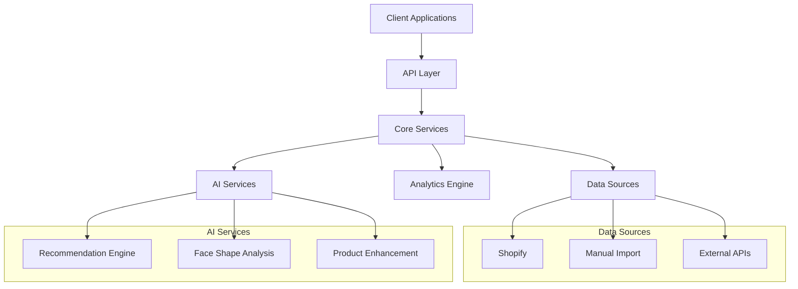

# VARAi Commerce Studio Platform Review & Roadmap

## Current Platform Overview

Commerce Studio by VARAi is an AI-powered SaaS platform focused on revolutionizing the eyewear industry through intelligent product management, enhanced customer experiences, and seamless integration between physical and online retail channels. The platform, also known as EyewearML, includes SKU-Genie as a core component for data quality management.

### Core Components

1. **Product Integration Hub**
   - Centralized product database with AI-enhanced metadata
   - Support for multiple data sources (Shopify, manual import, API)
   - EAN code-based product identification system

2. **Store Integration Layer**
   - Physical store management
   - Online store connectors (Shopify, custom e-commerce)
   - Inventory synchronization across channels

3. **App Marketplace**
   - Eyewear recommendation engine
   - Face shape analysis tools
   - Virtual try-on capabilities
   - A/B testing framework

4. **Analytics Dashboard**
   - Performance metrics
   - A/B test results
   - Customer behavior insights
   - Face shape analytics

### Current Technical Architecture

## Improvement Opportunities

### 1. User Experience & Brand Identity

The platform needs a cohesive, Apple-like home page that clearly communicates our value proposition to brands and retailers. Key improvements:

- **Modern Landing Page**: Create a sleek, minimalist landing page that showcases the platform's capabilities with compelling visuals and clear messaging
- **Unified Design Language**: Develop a consistent design system across all platform components
- **Intuitive Onboarding**: Streamline the signup and onboarding process with guided tours and interactive demos

### 2. Integration Capabilities

Enhance the platform's ability to connect with various retail systems:

- **Expanded Connectors**: Add support for additional e-commerce platforms (WooCommerce, Magento, BigCommerce)
- **POS Integration**: Develop direct integrations with popular POS systems for physical stores
- **API Enhancement**: Expand the API to support more granular operations and bulk processing

### 3. AI Capabilities

Strengthen the AI offerings to provide more value to retailers:

- **Advanced Recommendation Algorithms**: Implement hybrid recommendation systems that combine collaborative filtering, content-based filtering, and contextual awareness
- **Enhanced Face Shape Analysis**: Improve accuracy and add support for more diverse facial features
- **Trend Prediction**: Add capabilities to predict upcoming eyewear trends based on market data

### 4. Analytics & Insights

Provide deeper insights to help retailers make data-driven decisions:

- **Customer Journey Mapping**: Visualize the complete customer journey across channels
- **Inventory Optimization**: Provide AI-driven inventory recommendations
- **Competitive Analysis**: Offer insights on market positioning relative to competitors

## Database Interaction Guidelines

When integrating with client systems, SKU-Genie follows these important principles:

1. **Master Database**: SKU-Genie maintains its own master database of product information.

2. **EAN Code as Primary Key**: The EAN (European Article Number) code is used as the primary key for identifying products across systems.

3. **Read and Update Operations**: SKU-Genie can read and update client files/records, but cannot delete files from client databases.

4. **Product Status Preservation**: Products in client systems may have different statuses (live, published, closed, unpublished). SKU-Genie never changes the status of a product on the client system.

5. **Data Synchronization**: When updating product information, SKU-Genie ensures that the client's product status remains unchanged while enhancing the product data.

## Proposed Home Page Design

The new home page should follow Apple's design principles of simplicity, elegance, and clarity:

1. **Hero Section**
   - Bold headline: "The Future of Eyewear Retail"
   - Subheading: "AI-powered solutions for seamless omnichannel experiences"
   - Background: Subtle animation showing the platform's capabilities
   - CTA: "Get Started" button prominently displayed

2. **Key Features Section**
   - Clean, icon-based representation of core features
   - Minimal text with maximum impact
   - Subtle animations that trigger on scroll

3. **Integration Showcase**
   - Visual representation of how SKU-Genie connects physical and online stores
   - Logos of supported platforms and systems
   - Success metrics from current clients

4. **App Marketplace Preview**
   - Carousel of available apps with brief descriptions
   - Visual examples of each app in action
   - "Explore Apps" CTA

5. **Testimonials**
   - Quotes from satisfied retailers
   - Before/after metrics showing impact
   - Industry recognition and awards

6. **Pricing & Plans**
   - Transparent, simple pricing structure
   - Feature comparison across plans
   - Custom enterprise solutions option

7. **Sign-up Section**
   - Streamlined form with minimal required fields
   - Option to schedule a demo
   - Immediate access to a limited trial

## Implementation Roadmap

### Phase 1: Foundation (Q2 2025)
- Redesign the platform home page and landing experience
- Implement consistent design system across all components
- Enhance the core API for better performance and reliability

### Phase 2: Integration Expansion (Q3 2025)
- Add support for additional e-commerce platforms
- Develop POS integration capabilities
- Enhance the data import/export functionality

### Phase 3: AI Enhancement (Q4 2025)
- Upgrade recommendation algorithms
- Improve face shape analysis accuracy
- Implement trend prediction capabilities

### Phase 4: Analytics Evolution (Q1 2026)
- Develop advanced customer journey mapping
- Create inventory optimization tools
- Build competitive analysis features

## Next Steps

1. **Design Sprint**: Conduct a design sprint to create the new home page and establish the design system
2. **User Research**: Gather feedback from current and potential customers on the proposed changes
3. **Technical Assessment**: Evaluate the current architecture to identify any limitations for the proposed enhancements
4. **Prototype Development**: Create a functional prototype of the new home page and key features
5. **Iterative Testing**: Test with real users and refine based on feedback