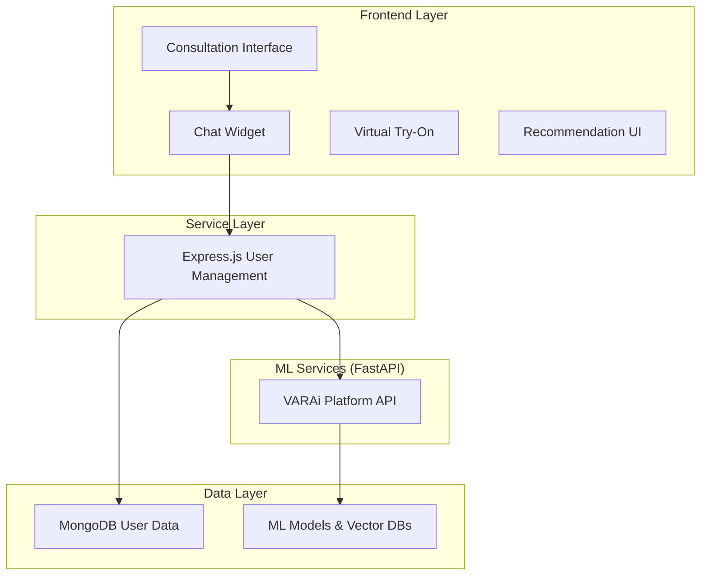

# Commerce Studio - Production Deployment

## 🚀 Production Status

The Commerce Studio platform is now live in production, featuring an advanced, ML-powered recommendations engine.

- **Production API**: [`https://commerce-studio-api-ddtojwjn7a-uc.a.run.app`](https://commerce-studio-api-ddtojwjn7a-uc.a.run.app)
- **Demo Store**: [`https://storage.googleapis.com/eyewear-demo-store-ml-datadriven-recos/index.html`](https://storage.googleapis.com/eyewear-demo-store-ml-datadriven-recos/index.html)

## 🏗️ System Architecture

The production architecture separates user management from ML services for scalability and maintainability.



- **Express.js User Management**: Handles authentication, user profiles, and acts as a proxy to the ML services.
- **FastAPI ML Services**: Provides advanced functionalities like personalized recommendations, face analysis, and real-time scoring.

## 🛠️ Key Features

- **Advanced Recommendations**: Real-time, personalized product recommendations powered by a hybrid ML model.
- **Multi-Platform Integration**: Seamless integration with Shopify, Magento, WooCommerce, and BigCommerce.
- **Comprehensive Analytics**: Real-time monitoring of recommendation performance and user engagement.
- **Secure and Scalable**: Production-ready infrastructure on Google Cloud Platform (GCP).

## 📚 Documentation

- **[API Contract Specifications](docs/architecture/API_CONTRACT_SPECIFICATIONS.md)**: Detailed documentation for the production API.
- **[Advanced Recommendations Engine Architecture](docs/architecture/ADVANCED_RECOMMENDATIONS_ENGINE_ARCHITECTURE.md)**: In-depth look at the recommendation engine's design.
- **[ML Pipeline Specifications](docs/architecture/ML_PIPELINE_SPECIFICATIONS.md)**: Technical details of the machine learning pipeline.
- **[Platform Integration Guide](docs/platform-integrations/MULTI_PLATFORM_CONSULTATION_GUIDE.md)**: Guides for integrating with e-commerce platforms.
- **[Demo Execution Guide](DEMO_EXECUTION_GUIDE.md)**: Instructions for running the production demo.

## 🚀 Quick Start

### Prerequisites

- Node.js 18+
- Docker
- Google Cloud SDK

### Environment Setup

1.  Clone the repository.
2.  Configure environment variables in `.env.secure` by copying from `.env.template`.
3.  Run the setup script:
    ```bash
    ./scripts/setup-environment.sh
    ```

### Running the System

To start all services, including the Express.js proxy and connections to the production ML services:

```bash
npm start
```

## 🧪 Testing

Run the complete test suite to ensure all integrations are working correctly:

```bash
npm test
```

This includes unit tests, integration tests with the production API, and performance checks.

## 🔒 Security

The platform follows best practices for security, including:

- **Authentication**: JWT-based authentication handled by the Express.js service.
- **Data Privacy**: Secure handling of user data and PII.
- **API Security**: Rate limiting, CORS, and input validation are enforced.

---

**Version**: 2.0.0 (Production)
**Last Updated**: July 2025
**Status**: Live
