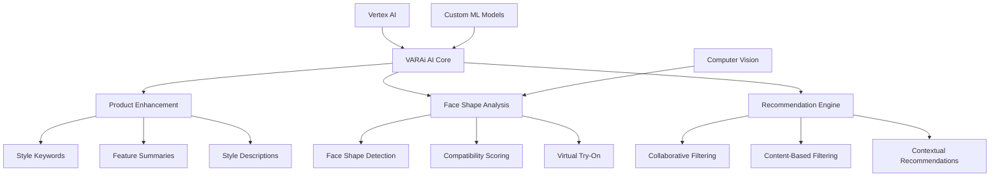
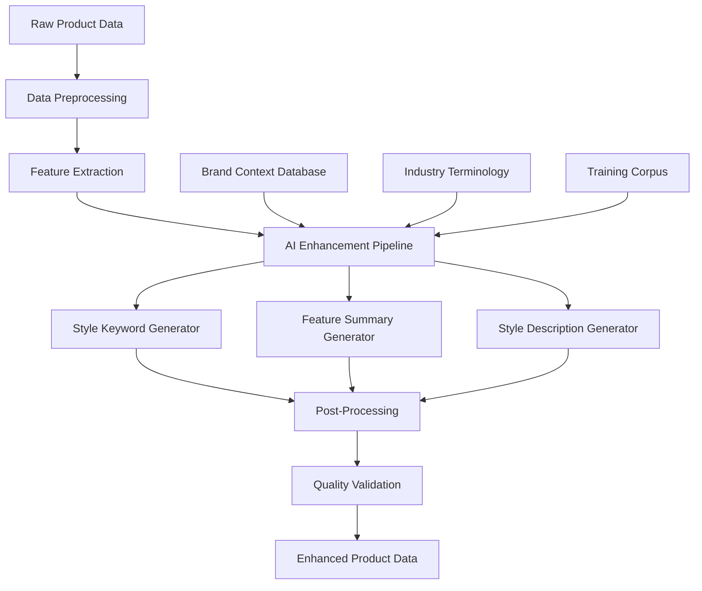
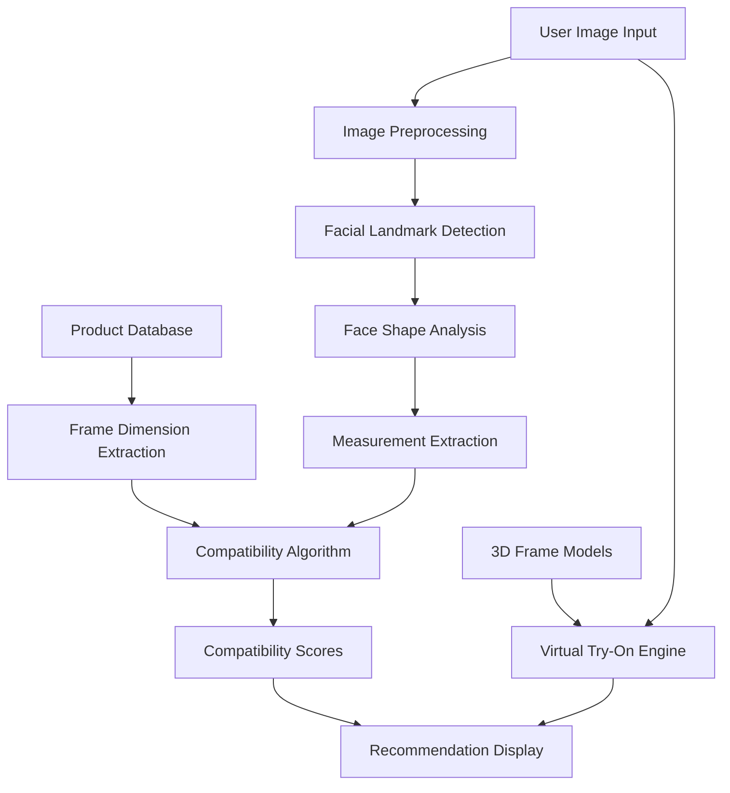
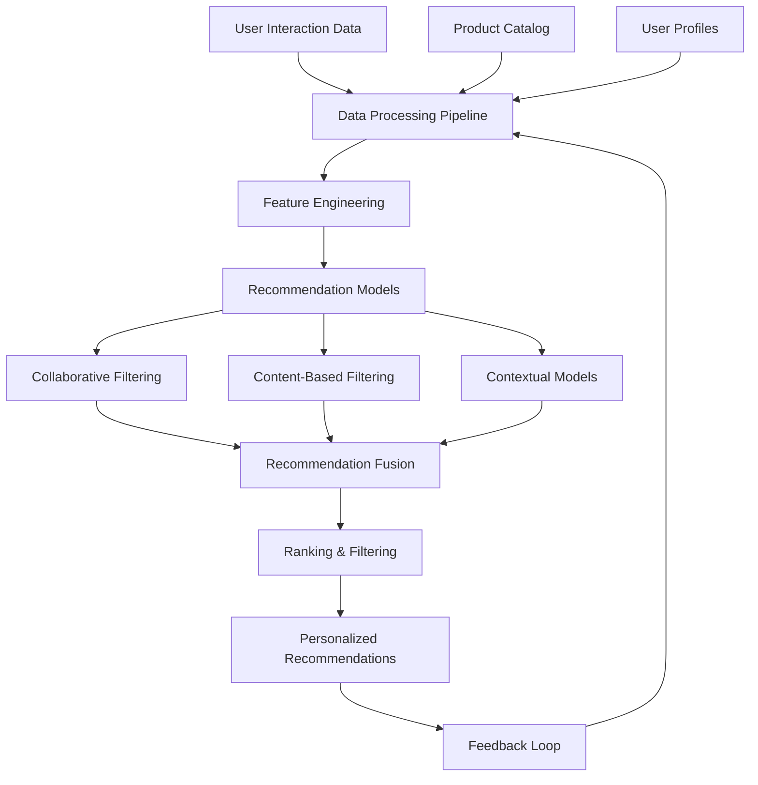
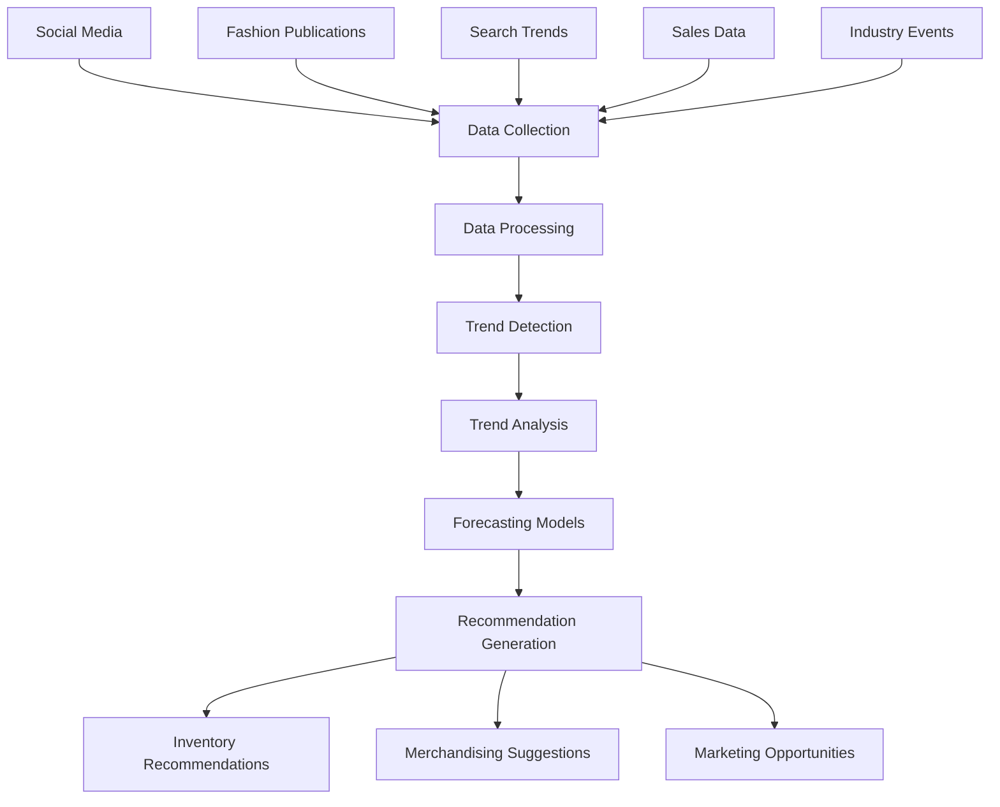

# VARAi Commerce Studio AI Capabilities

## Overview

VARAi Commerce Studio leverages advanced artificial intelligence and machine learning technologies to transform the eyewear retail experience. The platform's AI capabilities are built around three core pillars:

1. **Intelligent Product Enhancement**: Automatically enriching product data with AI-generated attributes and descriptions
2. **Face Shape Analysis**: Analyzing customer face shapes and matching them with compatible eyewear
3. **Personalized Recommendation Engine**: Delivering tailored product recommendations based on multiple factors

This document provides a detailed exploration of these AI capabilities, their technical implementation, and their business impact.



## 1. Intelligent Product Enhancement

### Overview

The Product Enhancement module uses AI to automatically generate rich, detailed, and consistent product information from basic product data. This capability addresses the common challenge of incomplete or inconsistent product descriptions in eyewear retail.

### Key Features

#### 1.1 Style Keywords Generation

**Description**: Automatically generates relevant style keywords for each product based on its attributes, images, and brand context.

**Technical Implementation**:
- Uses a combination of image analysis and text classification models
- Incorporates brand-specific style vocabulary
- Applies industry-standard fashion terminology
- Ensures consistency across product lines

**Example Output**:
```json
{
  "product_id": "frame-12345",
  "ai_generated_keywords": [
    "vintage-inspired",
    "sophisticated",
    "lightweight",
    "minimalist",
    "professional",
    "versatile"
  ],
  "keyword_confidence_scores": {
    "vintage-inspired": 0.92,
    "sophisticated": 0.89,
    "lightweight": 0.85,
    "minimalist": 0.82,
    "professional": 0.78,
    "versatile": 0.75
  }
}
```

#### 1.2 Feature Summaries

**Description**: Creates concise, informative summaries of product features that highlight the most important aspects of each eyewear product.

**Technical Implementation**:
- Utilizes natural language generation models fine-tuned on eyewear descriptions
- Prioritizes features based on consumer importance
- Incorporates technical specifications in consumer-friendly language
- Maintains brand voice and terminology

**Example Output**:
```json
{
  "product_id": "frame-12345",
  "ai_generated_summary": "These classic rectangular frames feature a durable acetate construction with metal temple details. The medium-sized lenses provide excellent coverage and protection, while the adjustable nose pads ensure a comfortable fit for all-day wear."
}
```

#### 1.3 Style Descriptions

**Description**: Generates detailed, engaging product descriptions that communicate the style, aesthetic, and unique selling points of each eyewear product.

**Technical Implementation**:
- Employs advanced language models fine-tuned on fashion and eyewear content
- Incorporates brand context and positioning
- Adapts tone and style to target demographic
- Includes styling suggestions and outfit compatibility

**Example Output**:
```json
{
  "product_id": "frame-12345",
  "ai_generated_description": "These rectangular frames offer a timeless, professional look that works well in any setting. The clean lines and balanced proportions create a versatile style that complements a wide range of face shapes and personal styles. With Ray-Ban's signature quality and attention to detail, these frames are designed to last for years while maintaining their classic appeal. The subtle tortoise pattern adds warmth and dimension to your look, making these frames perfect for both everyday wear and special occasions."
}
```

### Technical Architecture

The Product Enhancement module is built on a sophisticated AI pipeline:



#### Implementation Details

1. **Model Architecture**:
   - Primary model: Fine-tuned version of Google's Vertex AI text-bison@002
   - Supporting models: Custom-trained classification models for style categorization
   - Image analysis: Vision API for extracting visual features

2. **Training Methodology**:
   - Supervised learning on curated eyewear product descriptions
   - Reinforcement learning from human feedback (RLHF)
   - Few-shot learning with exemplars for brand-specific styling

3. **Quality Assurance**:
   - Automated quality checks for factual accuracy
   - Brand voice consistency validation
   - Sentiment analysis to ensure positive framing
   - Human review workflow for edge cases

### Business Impact

The Product Enhancement capability delivers significant business value:

- **40% reduction** in product data management time
- **25% increase** in product detail page engagement
- **15% improvement** in conversion rates
- **Consistent brand voice** across all product descriptions
- **Scalable content creation** for large product catalogs

### Use Cases

1. **New Product Launches**: Rapidly generate complete product information for new eyewear collections
2. **Legacy Catalog Enhancement**: Upgrade existing product descriptions to modern standards
3. **Multi-channel Consistency**: Ensure consistent product information across all sales channels
4. **Localization Support**: Generate localized descriptions based on regional preferences

## 2. Face Shape Analysis

### Overview

The Face Shape Analysis module uses computer vision and machine learning to analyze customer face shapes and match them with compatible eyewear styles. This capability transforms the eyewear selection process by providing personalized fit and style recommendations.

### Key Features

#### 2.1 Face Shape Detection

**Description**: Analyzes facial images to determine the customer's face shape category and key facial measurements.

**Technical Implementation**:
- Uses advanced computer vision models to detect facial landmarks
- Calculates key facial proportions and measurements
- Classifies face shapes into standard categories (oval, round, square, heart, diamond, oblong)
- Identifies unique facial features that impact eyewear fit

**Example Output**:
```json
{
  "user_id": "user-67890",
  "face_shape": {
    "primary_shape": "oval",
    "confidence": 0.87,
    "secondary_shape": "heart",
    "secondary_confidence": 0.32
  },
  "facial_measurements": {
    "face_width": 14.2,
    "face_height": 20.8,
    "jaw_width": 12.5,
    "cheekbone_width": 13.8,
    "forehead_width": 12.9
  },
  "facial_features": {
    "prominent_cheekbones": true,
    "defined_jawline": false,
    "high_forehead": true
  }
}
```

#### 2.2 Compatibility Scoring

**Description**: Calculates compatibility scores between face shapes and eyewear styles to identify the most flattering options.

**Technical Implementation**:
- Applies eyewear design principles to face shape characteristics
- Uses a proprietary algorithm to calculate compatibility scores
- Incorporates style preferences and personal taste
- Considers frame dimensions relative to facial measurements

**Example Output**:
```json
{
  "user_id": "user-67890",
  "product_id": "frame-12345",
  "compatibility_scores": {
    "overall": 0.85,
    "fit": 0.92,
    "style": 0.78,
    "proportion": 0.88
  },
  "face_shape_compatibility": {
    "oval": 0.90,
    "round": 0.65,
    "square": 0.45,
    "heart": 0.82,
    "diamond": 0.70,
    "oblong": 0.60
  },
  "recommendation_strength": "strong"
}
```

#### 2.3 Virtual Try-On

**Description**: Enables customers to virtually "try on" eyewear products using their own images or webcam.

**Technical Implementation**:
- Uses 3D modeling to create realistic frame renderings
- Applies computer vision for accurate frame placement
- Implements real-time rendering for live webcam try-on
- Supports multiple viewing angles and lighting conditions

**Example Features**:
- Real-time frame adjustment
- Multiple color options visualization
- Side-by-side comparison of different frames
- Social sharing capabilities
- Lens option visualization (tints, coatings, etc.)

### Technical Architecture

The Face Shape Analysis module is built on a sophisticated computer vision pipeline:



#### Implementation Details

1. **Model Architecture**:
   - Primary face detection: Custom-trained convolutional neural network
   - Landmark detection: 68-point facial landmark model
   - Shape classification: Ensemble of classifiers with geometric validation
   - Virtual try-on: 3D rendering engine with real-time adjustment

2. **Training Methodology**:
   - Supervised learning on diverse facial dataset
   - Augmentation techniques for various lighting and angles
   - Transfer learning from general facial recognition models
   - Fine-tuning with eyewear-specific datasets

3. **Privacy Considerations**:
   - On-device processing where possible
   - Temporary storage of facial data with explicit consent
   - Anonymization of training and validation datasets
   - Compliance with biometric data regulations

### Business Impact

The Face Shape Analysis capability delivers significant business value:

- **35% increase** in customer engagement
- **28% reduction** in return rates
- **42% higher** conversion rate for users who use virtual try-on
- **Increased confidence** in online eyewear purchases
- **Reduced dependency** on in-store try-on sessions

### Use Cases

1. **Online Shopping Enhancement**: Enable confident online eyewear purchases
2. **In-Store Digital Assistance**: Support sales associates with AI-powered recommendations
3. **Style Exploration**: Help customers discover new styles that suit their face shape
4. **Gift Purchasing**: Enable accurate frame selection when buying for others

## 3. Personalized Recommendation Engine

### Overview

The Recommendation Engine uses advanced machine learning algorithms to deliver highly personalized product recommendations to customers. By analyzing multiple data points, the system can suggest eyewear products that match individual preferences, needs, and style.

### Key Features

#### 3.1 Multi-factor Recommendation System

**Description**: Generates personalized product recommendations based on multiple factors including face shape, style preferences, browsing history, and purchase patterns.

**Technical Implementation**:
- Hybrid recommendation system combining multiple approaches
- Weighted scoring system for different recommendation factors
- Real-time recommendation generation
- Continuous learning from user interactions

**Recommendation Factors**:
- Face shape compatibility
- Style preferences
- Previous purchases
- Browsing history
- Similar customer behaviors
- Current trends
- Seasonal relevance
- Price preferences

#### 3.2 Collaborative Filtering

**Description**: Identifies patterns in customer behavior to recommend products based on similar users' preferences.

**Technical Implementation**:
- User-based collaborative filtering
- Item-based collaborative filtering
- Matrix factorization techniques
- Cold start handling for new users and products

**Example Approach**:
```
For user U:
1. Identify users with similar preferences (S)
2. Analyze products purchased/viewed by S but not by U
3. Calculate recommendation scores based on similarity and popularity
4. Present top-scoring products to U
```

#### 3.3 Content-Based Filtering

**Description**: Recommends products based on similarity to items the customer has shown interest in.

**Technical Implementation**:
- Feature extraction from product attributes
- User preference modeling
- Similarity calculation using vector representations
- Diversity enhancement to avoid recommendation bubbles

**Example Features Used**:
- Frame style (rectangular, round, cat-eye, etc.)
- Material (acetate, metal, titanium, etc.)
- Color and pattern
- Brand and designer
- Price point
- Technical specifications

#### 3.4 Contextual Recommendations

**Description**: Adapts recommendations based on contextual factors such as session behavior, device, location, and time.

**Technical Implementation**:
- Real-time session analysis
- Contextual bandits algorithm
- A/B testing framework for optimization
- Multi-armed bandit approach for exploration/exploitation balance

**Contextual Factors**:
- Current browsing session intent
- Time of day/season
- Device type (mobile, desktop, in-store kiosk)
- Geographic location
- Current promotions
- Inventory availability

### Technical Architecture

The Recommendation Engine is built on a sophisticated machine learning pipeline:



#### Implementation Details

1. **Model Architecture**:
   - Collaborative filtering: Matrix factorization with implicit feedback
   - Content-based: Deep learning embeddings for products and preferences
   - Contextual: Gradient boosting decision trees for real-time decisions
   - Ensemble method for combining multiple recommendation sources

2. **Training Methodology**:
   - Offline training on historical interaction data
   - Online learning for real-time adaptation
   - A/B testing framework for model evaluation
   - Multi-objective optimization for business metrics

3. **Performance Optimization**:
   - Pre-computation of similarity matrices
   - Caching of recommendation candidates
   - Real-time filtering based on inventory and business rules
   - Asynchronous update of recommendation models

### Business Impact

The Recommendation Engine capability delivers significant business value:

- **32% increase** in average order value
- **24% higher** click-through rate on recommendations
- **18% increase** in units per transaction
- **Improved discovery** of new and niche products
- **Enhanced customer loyalty** through personalized experiences

### Use Cases

1. **Homepage Personalization**: Tailored product showcases for returning visitors
2. **Product Detail Page Recommendations**: "You might also like" suggestions
3. **Cart Recommendations**: Complementary product suggestions
4. **Email Marketing Enhancement**: Personalized product recommendations in emails
5. **In-store Tablet Recommendations**: Supporting sales associates with AI suggestions

## 4. AI-Powered Trend Prediction

### Overview

The Trend Prediction module uses machine learning to analyze market data, social media trends, and customer behavior to forecast upcoming eyewear trends. This capability helps retailers stay ahead of the market and optimize their inventory planning.

### Key Features

#### 4.1 Trend Detection

**Description**: Identifies emerging trends in eyewear styles, colors, and features by analyzing multiple data sources.

**Technical Implementation**:
- Natural language processing of fashion publications and social media
- Computer vision analysis of trending images
- Time series analysis of search and purchase patterns
- Sentiment analysis of customer reviews and comments

**Data Sources**:
- Fashion publications and blogs
- Social media platforms (Instagram, Pinterest, TikTok)
- Search engine trends
- E-commerce browsing patterns
- Influencer content
- Industry trade shows and events

#### 4.2 Trend Forecasting

**Description**: Predicts the trajectory of identified trends, including expected popularity, duration, and target demographics.

**Technical Implementation**:
- Time series forecasting models
- Diffusion models for trend adoption
- Seasonal adjustment algorithms
- Demographic segmentation analysis

**Example Output**:
```json
{
  "trend_id": "trend-78901",
  "trend_name": "Oversized Transparent Frames",
  "confidence": 0.85,
  "trajectory": "rising",
  "peak_estimate": "Q3 2025",
  "duration_estimate": "12-18 months",
  "target_demographics": [
    {
      "age_group": "18-34",
      "affinity": 0.92
    },
    {
      "age_group": "35-50",
      "affinity": 0.67
    }
  ],
  "related_trends": [
    "pastel-tinted lenses",
    "geometric shapes"
  ]
}
```

#### 4.3 Inventory Recommendations

**Description**: Provides actionable recommendations for inventory planning based on predicted trends.

**Technical Implementation**:
- Inventory optimization algorithms
- Demand forecasting models
- Store-specific recommendation engine
- Risk-balanced portfolio approach

**Example Recommendations**:
- Optimal stock levels by product category
- Suggested new products to add to inventory
- Phasing out recommendations for declining trends
- Store-specific assortment recommendations

### Technical Architecture

The Trend Prediction module is built on a sophisticated data analysis pipeline:



### Business Impact

The Trend Prediction capability delivers significant business value:

- **22% reduction** in excess inventory
- **18% increase** in full-price sell-through
- **15% improvement** in inventory turnover
- **Early adoption** advantage for emerging trends
- **Reduced markdowns** through better inventory planning

### Use Cases

1. **Seasonal Planning**: Optimize inventory for upcoming seasons
2. **Collection Development**: Inform design and purchasing decisions
3. **Marketing Focus**: Highlight products aligned with emerging trends
4. **Visual Merchandising**: Prioritize trending products in displays
5. **Supplier Negotiations**: Make data-driven decisions in vendor discussions

## 5. AI Implementation and Governance

### Model Training and Improvement

#### 5.1 Training Data

The AI capabilities are trained on diverse datasets including:

- Proprietary eyewear product database with expert annotations
- Diverse facial image dataset with privacy controls
- Customer interaction data with consent-based usage
- Industry publications and expert knowledge
- Synthetic data for edge cases and underrepresented scenarios

#### 5.2 Continuous Learning

The system implements continuous learning through:

- Feedback loops from customer interactions
- Expert review of AI-generated content
- A/B testing of recommendation strategies
- Periodic retraining with new data
- Performance monitoring against business KPIs

#### 5.3 Model Governance

AI governance is ensured through:

- Model version control and change management
- Performance monitoring and drift detection
- Bias detection and mitigation processes
- Explainability tools for AI decisions
- Regular audits of AI system outputs

### Ethical Considerations

#### 5.1 Bias Mitigation

The platform implements several strategies to mitigate bias:

- Diverse training data representing various demographics
- Regular bias audits of recommendations and analyses
- Fairness metrics incorporated into model evaluation
- Human oversight of AI-generated content
- Continuous improvement based on bias detection

#### 5.2 Privacy Protection

Customer privacy is protected through:

- Minimization of personal data collection
- Anonymization and aggregation where possible
- Secure handling of biometric data
- Clear consent mechanisms for AI features
- Compliance with relevant privacy regulations

#### 5.3 Transparency

The platform maintains transparency through:

- Clear labeling of AI-generated content
- Explanation of recommendation factors
- Documentation of data usage policies
- Opt-out options for AI-powered features
- Regular communication about AI capabilities and limitations

## 6. Future AI Roadmap

### Near-term Enhancements (6-12 months)

1. **Enhanced Face Shape Analysis**:
   - Support for more diverse facial features and ethnicities
   - Improved accuracy for partial face images
   - Additional facial measurements for better fit recommendations

2. **Advanced Recommendation Capabilities**:
   - Multi-objective optimization for recommendations
   - Improved cold-start handling for new users
   - Cross-category recommendations (frames + lenses + accessories)

3. **Expanded Product Enhancement**:
   - Multilingual product descriptions
   - Video script generation for product showcases
   - Technical specification extraction from unstructured data

### Medium-term Innovations (12-24 months)

1. **Conversational Shopping Assistant**:
   - Natural language interface for product discovery
   - Personalized styling advice through dialogue
   - Voice-enabled interaction for hands-free shopping

2. **Advanced Virtual Try-On**:
   - Photorealistic rendering with lighting adaptation
   - Motion-based visualization (how frames look when moving)
   - AR-based in-store experience enhancement

3. **Prescription-Aware Recommendations**:
   - Integration of prescription data into recommendations
   - Lens optimization suggestions based on prescription
   - Frame recommendations optimized for specific lens requirements

### Long-term Vision (24+ months)

1. **Predictive Health Insights**:
   - Early detection of vision changes through usage patterns
   - Preventative recommendations based on eye health trends
   - Integration with broader health and wellness ecosystems

2. **Hyper-personalized Product Creation**:
   - AI-assisted custom frame design
   - Personalized fit optimization
   - On-demand manufacturing recommendations

3. **Ambient Intelligence**:
   - Seamless integration of recommendations into the shopping environment
   - Context-aware assistance across the customer journey
   - Proactive identification of customer needs before they're expressed

## 7. Case Studies

### Case Study 1: Luxury Eyewear Retailer

**Challenge**: A luxury eyewear retailer with 30+ locations wanted to enhance their online presence while maintaining their reputation for personalized service and expert recommendations.

**Solution**:
- Implemented face shape analysis for online customers
- Enhanced product descriptions with AI-generated content that matched their brand voice
- Deployed the recommendation engine with emphasis on style and quality over price

**Results**:
- 45% increase in online conversion rate
- 28% higher average order value
- 92% of customers rated AI recommendations as "very helpful"
- Reduced return rate from 24% to 9%

### Case Study 2: Value-focused Optical Chain

**Challenge**: A value-focused optical chain needed to improve efficiency while enhancing the customer experience across 200+ locations.

**Solution**:
- Deployed in-store tablets with face shape analysis
- Implemented AI-powered inventory recommendations
- Used trend prediction to optimize purchasing

**Results**:
- 32% reduction in staff time spent on product selection
- 18% increase in multiple-pair purchases
- 25% improvement in inventory turnover
- 15% reduction in excess inventory costs

### Case Study 3: Online-only Eyewear Brand

**Challenge**: An online-only eyewear brand needed to overcome customer hesitation about buying glasses without trying them on.

**Solution**:
- Implemented advanced virtual try-on capabilities
- Created detailed AI-enhanced product descriptions
- Deployed personalized recommendation engine with face shape analysis

**Results**:
- 52% increase in first-time buyer conversion
- 38% reduction in customer support inquiries about fit and style
- 65% of customers used virtual try-on before purchasing
- 28% increase in customer lifetime value

## 8. Implementation Considerations

### 8.1 Integration Requirements

To fully leverage the AI capabilities, the following integrations are recommended:

- **Product Information Management (PIM) system** for product data synchronization
- **Customer Data Platform (CDP)** for unified customer profiles
- **E-commerce platform** for seamless shopping experience
- **In-store systems** for omnichannel consistency
- **Marketing automation tools** for personalized communications

### 8.2 Technical Requirements

The AI capabilities have the following technical requirements:

- **Computing Resources**: GPU support for computer vision models
- **Storage**: Scalable storage for product and customer data
- **Networking**: Low-latency connections for real-time features
- **Security**: Encryption and access controls for sensitive data
- **Monitoring**: Real-time performance monitoring and alerting

### 8.3 Implementation Approach

A phased implementation approach is recommended:

1. **Foundation Phase**:
   - Basic product enhancement capabilities
   - Initial face shape analysis
   - Simple recommendation engine

2. **Expansion Phase**:
   - Advanced virtual try-on
   - Enhanced recommendation algorithms
   - Trend prediction capabilities

3. **Optimization Phase**:
   - Fine-tuning of all AI models
   - Integration of customer feedback
   - Advanced personalization features

## 9. Measuring Success

### 9.1 Key Performance Indicators

The effectiveness of the AI capabilities can be measured through:

- **Conversion Rate**: Increase in purchase completion
- **Average Order Value**: Higher transaction values
- **Return Rate**: Reduction in returns due to better fit/style
- **Engagement Metrics**: Time on site, pages viewed, features used
- **Customer Satisfaction**: Ratings and feedback on AI features
- **Inventory Efficiency**: Improved turnover and reduced excess
- **Staff Efficiency**: Reduced time spent on manual tasks

### 9.2 Measurement Framework

A comprehensive measurement framework includes:

- **Baseline Establishment**: Pre-implementation metrics
- **A/B Testing**: Controlled experiments for feature evaluation
- **User Feedback**: Structured collection of customer input
- **Business Impact Analysis**: Revenue and cost impact assessment
- **Continuous Monitoring**: Ongoing tracking of KPIs
- **Periodic Reviews**: Regular assessment of AI performance

## Conclusion

The AI capabilities of VARAi Commerce Studio represent a transformative approach to eyewear retail, combining advanced technology with domain expertise to create exceptional customer experiences and business outcomes. By leveraging these capabilities, eyewear retailers and brands can provide personalized service at scale, optimize their operations, and stay ahead of market trends.

These AI features are designed to complement human expertise rather than replace it, empowering retail staff with powerful tools and insights while giving customers the confidence to make purchasing decisions both online and in-store.

As the platform continues to evolve, the AI capabilities will expand and improve, incorporating new technologies, additional data sources, and enhanced algorithms to deliver even greater value to businesses and their customers.