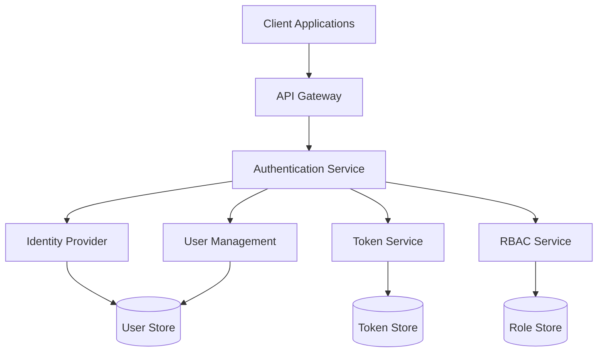

# Authentication Service Implementation

This directory contains the implementation of the Authentication Service for the VARAi Commerce Studio platform. The Authentication Service provides secure user authentication and authorization using OAuth 2.0 and OpenID Connect standards.

## Overview

The Authentication Service is a critical component of the platform's security infrastructure, responsible for:

- User authentication
- Token issuance and validation
- Role-based access control
- User profile management
- Single sign-on capabilities

## Architecture



## Implementation Approach

The Authentication Service is implemented using a combination of:

1. **Keycloak**: An open-source Identity and Access Management solution
2. **Custom Integration Layer**: For platform-specific authentication needs
3. **Kong OAuth2 Plugin**: For API Gateway integration

### Keycloak

Keycloak provides:
- OAuth 2.0 and OpenID Connect implementation
- User management
- Role-based access control
- Federation with external identity providers
- Admin console for user and role management

### Custom Integration Layer

The custom integration layer provides:
- Platform-specific user attributes
- Integration with the platform's user management
- Custom authentication flows
- Audit logging

### Kong OAuth2 Plugin

The Kong OAuth2 Plugin provides:
- Token validation at the API Gateway
- Introspection of tokens
- Scopes validation
- Rate limiting based on client credentials

## Directory Structure

```
auth-service/
├── keycloak/
│   ├── themes/            # Custom Keycloak themes
│   ├── extensions/        # Custom Keycloak extensions
│   └── config/            # Keycloak configuration
├── integration/
│   ├── src/               # Custom integration code
│   └── config/            # Integration configuration
├── docker-compose.yml     # Docker Compose configuration
├── README.md              # This file
└── scripts/               # Utility scripts
```

## Implementation Plan

### Phase 1: Initial Setup (Weeks 1-2)

#### Week 1: Environment Setup

**Tasks:**
1. Set up Keycloak in Docker
   - Configure database
   - Set up admin user
   - Configure basic realm

2. Create custom theme
   - Implement VARAi branding
   - Customize login pages
   - Customize admin console

3. Configure basic user attributes
   - Define user profile schema
   - Configure required attributes
   - Set up email verification

**Deliverables:**
- Working Keycloak instance
- Custom branded theme
- Basic user profile configuration

#### Week 2: OAuth 2.0 Configuration

**Tasks:**
1. Configure OAuth 2.0 clients
   - Set up client for web application
   - Set up client for mobile application
   - Configure client scopes

2. Configure token settings
   - Set token lifetimes
   - Configure signature algorithms
   - Set up refresh token behavior

3. Implement basic role structure
   - Define realm roles
   - Create client roles
   - Set up role mappings

**Deliverables:**
- Configured OAuth 2.0 clients
- Token settings documentation
- Role structure documentation

### Phase 2: Integration (Weeks 3-4)

#### Week 3: API Gateway Integration

**Tasks:**
1. Configure Kong OAuth 2.0 plugin
   - Set up introspection endpoint
   - Configure token validation
   - Set up scope validation

2. Implement token relay
   - Configure token forwarding
   - Set up header transformation
   - Implement token refresh handling

3. Test authentication flows
   - Verify authorization code flow
   - Test client credentials flow
   - Validate implicit flow

**Deliverables:**
- Kong OAuth 2.0 plugin configuration
- Token relay documentation
- Authentication flow test results

#### Week 4: Custom Integration Layer

**Tasks:**
1. Develop user synchronization
   - Implement user creation/update
   - Configure attribute mapping
   - Set up event listeners

2. Implement custom authentication flows
   - Create step-up authentication
   - Implement risk-based authentication
   - Configure multi-factor authentication

3. Set up audit logging
   - Configure event logging
   - Implement log forwarding
   - Create audit reports

**Deliverables:**
- User synchronization code
- Custom authentication flow documentation
- Audit logging configuration

### Phase 3: Advanced Features (Weeks 5-6)

#### Week 5: Role-Based Access Control

**Tasks:**
1. Implement comprehensive role structure
   - Define hierarchical roles
   - Create composite roles
   - Set up role inheritance

2. Configure fine-grained permissions
   - Define resource-based permissions
   - Implement attribute-based access control
   - Set up permission evaluation

3. Develop role management API
   - Create role assignment endpoints
   - Implement role query API
   - Set up role validation

**Deliverables:**
- Comprehensive role structure
- Permission model documentation
- Role management API specification

#### Week 6: Single Sign-On

**Tasks:**
1. Configure identity brokering
   - Set up social login (Google, Microsoft)
   - Configure SAML federation
   - Implement identity provider mappers

2. Implement session management
   - Configure session settings
   - Implement single logout
   - Set up session monitoring

3. Develop user account management
   - Create self-service account management
   - Implement password policies
   - Set up account linking

**Deliverables:**
- Identity brokering configuration
- Session management documentation
- User account management interface

### Phase 4: Testing and Deployment (Weeks 7-8)

#### Week 7: Security Testing

**Tasks:**
1. Perform security assessment
   - Conduct penetration testing
   - Validate token security
   - Test authentication bypass scenarios

2. Implement security hardening
   - Configure secure headers
   - Implement brute force protection
   - Set up rate limiting

3. Conduct performance testing
   - Test authentication throughput
   - Measure token validation performance
   - Assess database scaling

**Deliverables:**
- Security assessment report
- Hardening configuration
- Performance test results

#### Week 8: Production Deployment

**Tasks:**
1. Create deployment documentation
   - Document installation procedures
   - Create configuration guide
   - Develop backup procedures

2. Implement monitoring
   - Set up health checks
   - Configure alerting
   - Implement dashboard

3. Conduct user acceptance testing
   - Validate all authentication flows
   - Test integration points
   - Verify user experience

**Deliverables:**
- Deployment documentation
- Monitoring configuration
- UAT test results

## Technical Implementation Details

### Keycloak Configuration

Keycloak will be configured with the following settings:

```yaml
# Example realm configuration
realm: varai
enabled: true
displayName: VARAi Commerce Studio
accessTokenLifespan: 900
ssoSessionIdleTimeout: 1800
ssoSessionMaxLifespan: 36000
offlineSessionIdleTimeout: 2592000
accessCodeLifespan: 60
accessCodeLifespanUserAction: 300
accessCodeLifespanLogin: 1800
actionTokenGeneratedByAdminLifespan: 43200
actionTokenGeneratedByUserLifespan: 300
```

### OAuth 2.0 Flows

The authentication service will support the following OAuth 2.0 flows:

1. **Authorization Code Flow**
   - For web applications
   - Secure token exchange
   - Support for PKCE

2. **Client Credentials Flow**
   - For service-to-service authentication
   - Limited to trusted services
   - Restricted scopes

3. **Resource Owner Password Credentials Flow**
   - For legacy applications
   - Limited usage
   - Gradual migration plan

4. **Implicit Flow**
   - For JavaScript applications
   - Limited token lifetime
   - Restricted scopes

### Token Configuration

Tokens will be configured with the following settings:

```json
{
  "access_token": {
    "lifetime": 900,
    "signature_algorithm": "RS256",
    "include_permissions": true,
    "include_groups": true
  },
  "refresh_token": {
    "lifetime": 86400,
    "absolute_lifetime": 2592000,
    "rotation": true,
    "one_time_use": true
  },
  "id_token": {
    "lifetime": 900,
    "signature_algorithm": "RS256",
    "include_claims": [
      "name",
      "email",
      "preferred_username",
      "given_name",
      "family_name",
      "locale"
    ]
  }
}
```

### Role Structure

The role structure will be organized as follows:

```
- System Administrator
  - Organization Administrator
    - Store Manager
      - Customer Service Representative
    - Product Manager
    - Marketing Manager
  - API User
- Customer/End User
```

Each role will have associated permissions defined as client roles.

## Integration with API Gateway

The Authentication Service will integrate with the API Gateway using the Kong OAuth 2.0 plugin:

```yaml
plugins:
  - name: oauth2
    config:
      enable_authorization_code: true
      enable_client_credentials: true
      enable_implicit_grant: true
      enable_password_grant: false
      accept_http_if_already_terminated: true
      global_credentials: false
      token_expiration: 900
      refresh_token_expiration: 86400
      provision_key: "${README_SECRET_1}"
      introspection_endpoint: "http://auth-service:8080/auth/realms/varai/protocol/openid-connect/token/introspect"
      scopes:
        - "openid"
        - "profile"
        - "email"
        - "roles"
```

## Security Considerations

The Authentication Service implementation addresses the following security considerations:

1. **Token Security**
   - Use of asymmetric signing keys
   - Regular key rotation
   - Short token lifetimes
   - Secure storage of refresh tokens

2. **Authentication Security**
   - Brute force protection
   - Password complexity requirements
   - Multi-factor authentication options
   - Account lockout policies

3. **Infrastructure Security**
   - TLS for all communications
   - Network isolation
   - Regular security updates
   - Principle of least privilege

4. **Compliance**
   - GDPR compliance for user data
   - Audit logging for compliance reporting
   - Data minimization principles
   - User consent management

## Getting Started

### Prerequisites

- Docker and Docker Compose
- Java Development Kit (JDK) 11 or later
- Maven 3.6 or later

### Installation

1. Clone the repository
2. Navigate to the auth-service directory
3. Run `docker-compose up -d`
4. Access the Keycloak admin console at http://localhost:8080/auth/admin
5. Log in with the default admin credentials (admin/admin)
6. Follow the setup guide to configure your realm

### Configuration

1. Create a new realm
2. Configure the required clients
3. Set up the role structure
4. Create test users
5. Configure the API Gateway integration

## Next Steps

After implementing the Authentication Service, the next steps will be:

1. **User Management Service**
   - User profile management
   - User preferences
   - User groups and organizations

2. **Permission Management Service**
   - Fine-grained permissions
   - Resource-based access control
   - Permission evaluation engine

3. **Audit Service**
   - Comprehensive audit logging
   - Compliance reporting
   - Security analytics

## References

- [OAuth 2.0 Specification](https://oauth.net/2/)
- [OpenID Connect Specification](https://openid.net/connect/)
- [Keycloak Documentation](https://www.keycloak.org/documentation)
- [Kong OAuth 2.0 Plugin](https://docs.konghq.com/hub/kong-inc/oauth2/)