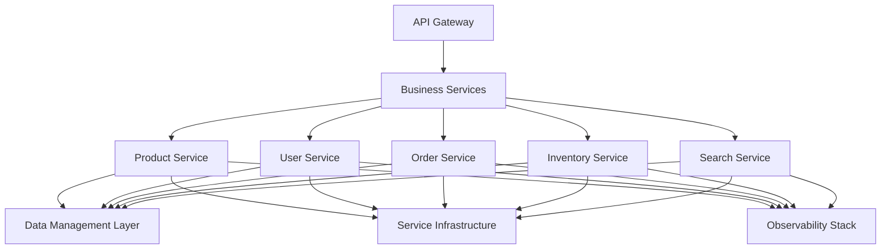
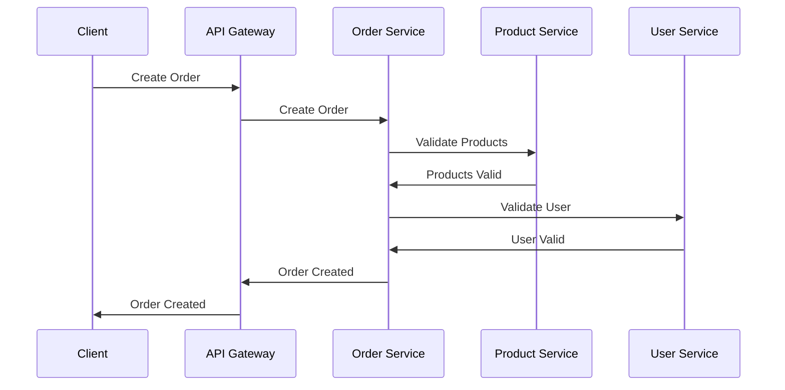
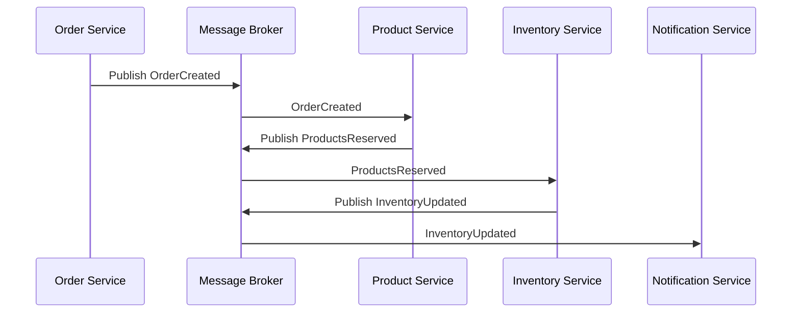
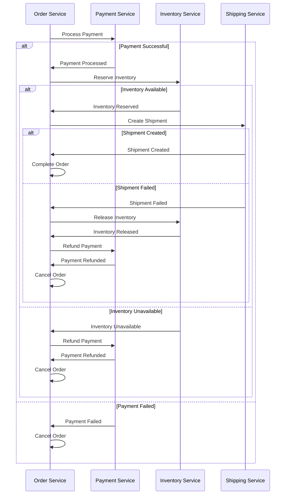

# Business Services Implementation

This directory contains the implementation of the Business Services for the VARAi Commerce Studio platform. The Business Services provide the core functionality for managing products, users, orders, and other business entities.

## Overview

The Business Services are a critical component of the platform's architecture, responsible for:

- Product management and catalog operations
- User management and profile operations
- Order processing and fulfillment
- Inventory management
- Pricing and promotion management
- Search and recommendation

## Architecture



## Implementation Approach

The Business Services are implemented using a combination of:

1. **Microservices Architecture**: Each business domain has its own service
2. **Domain-Driven Design**: Services are organized around business capabilities
3. **Event-Driven Architecture**: Services communicate via events for loose coupling
4. **CQRS Pattern**: Separation of command and query responsibilities

### Product Service

The Product Service provides:
- Product catalog management
- Product variant management
- Product categorization
- Product search and filtering
- Product recommendations

### User Service

The User Service provides:
- User profile management
- User preferences
- User authentication integration
- User activity tracking
- User permissions and roles

### Order Service

The Order Service provides:
- Order creation and management
- Order fulfillment
- Payment processing
- Shipping and delivery
- Order history and tracking

### Inventory Service

The Inventory Service provides:
- Inventory tracking
- Stock level management
- Inventory allocation
- Warehouse management
- Supplier integration

### Search Service

The Search Service provides:
- Full-text search
- Faceted search
- Search relevance tuning
- Search analytics
- Personalized search results

## Directory Structure

```
business-services/
├── product-service/
│   ├── src/                # Source code
│   ├── tests/              # Tests
│   ├── Dockerfile          # Container definition
│   └── docker-compose.yml  # Local development setup
├── user-service/
│   ├── src/                # Source code
│   ├── tests/              # Tests
│   ├── Dockerfile          # Container definition
│   └── docker-compose.yml  # Local development setup
├── order-service/
│   ├── src/                # Source code
│   ├── tests/              # Tests
│   ├── Dockerfile          # Container definition
│   └── docker-compose.yml  # Local development setup
├── inventory-service/
│   ├── src/                # Source code
│   ├── tests/              # Tests
│   ├── Dockerfile          # Container definition
│   └── docker-compose.yml  # Local development setup
├── search-service/
│   ├── src/                # Source code
│   ├── tests/              # Tests
│   ├── Dockerfile          # Container definition
│   └── docker-compose.yml  # Local development setup
├── docker-compose.yml      # Docker Compose configuration
├── README.md               # This file
└── scripts/                # Utility scripts
```

## Implementation Plan

### Phase 1: Product Service (Weeks 1-2)

#### Week 1: Core Product Management

**Tasks:**
1. Implement product model
   - Define product schema
   - Create product repository
   - Implement CRUD operations

2. Develop product API
   - Create product endpoints
   - Implement validation
   - Add error handling

3. Implement product categorization
   - Define category schema
   - Create category hierarchy
   - Implement product-category relationships

**Deliverables:**
- Product model implementation
- Product API endpoints
- Product categorization

#### Week 2: Advanced Product Features

**Tasks:**
1. Implement product variants
   - Define variant schema
   - Create variant management
   - Implement variant selection

2. Develop product search
   - Implement search indexing
   - Create search filters
   - Add sorting and pagination

3. Add product recommendations
   - Implement recommendation algorithms
   - Create recommendation API
   - Add personalization

**Deliverables:**
- Product variants implementation
   - Search functionality
   - Recommendation engine

### Phase 2: User Service (Weeks 3-4)

#### Week 3: Core User Management

**Tasks:**
1. Implement user model
   - Define user schema
   - Create user repository
   - Implement CRUD operations

2. Develop user API
   - Create user endpoints
   - Implement validation
   - Add error handling

3. Implement authentication integration
   - Connect to Keycloak
   - Implement token validation
   - Add role-based access control

**Deliverables:**
- User model implementation
- User API endpoints
- Authentication integration

#### Week 4: Advanced User Features

**Tasks:**
1. Implement user preferences
   - Define preference schema
   - Create preference management
   - Implement preference API

2. Develop user activity tracking
   - Implement activity logging
   - Create activity feed
   - Add activity analytics

3. Add user segmentation
   - Implement segmentation rules
   - Create segment management
   - Add segment-based targeting

**Deliverables:**
- User preferences implementation
- Activity tracking
- User segmentation

### Phase 3: Order Service (Weeks 5-6)

#### Week 5: Core Order Management

**Tasks:**
1. Implement order model
   - Define order schema
   - Create order repository
   - Implement CRUD operations

2. Develop order API
   - Create order endpoints
   - Implement validation
   - Add error handling

3. Implement order workflow
   - Define order states
   - Create state transitions
   - Implement workflow events

**Deliverables:**
- Order model implementation
- Order API endpoints
- Order workflow

#### Week 6: Advanced Order Features

**Tasks:**
1. Implement payment processing
   - Connect to payment gateway
   - Implement payment methods
   - Add payment validation

2. Develop shipping integration
   - Connect to shipping providers
   - Implement shipping methods
   - Add shipping tracking

3. Add order analytics
   - Implement order metrics
   - Create order reports
   - Add order insights

**Deliverables:**
- Payment processing
- Shipping integration
- Order analytics

### Phase 4: Integration and Testing (Weeks 7-8)

#### Week 7: Service Integration

**Tasks:**
1. Implement service communication
   - Define event schema
   - Create event publishers
   - Implement event subscribers

2. Develop cross-service workflows
   - Order creation workflow
   - Inventory allocation workflow
   - User activity workflow

3. Add service discovery
   - Register services with Consul
   - Implement service health checks
   - Add service metrics

**Deliverables:**
- Service communication
- Cross-service workflows
- Service discovery

#### Week 8: Testing and Documentation

**Tasks:**
1. Implement integration tests
   - Create test scenarios
   - Implement test data
   - Add test automation

2. Develop performance tests
   - Define performance benchmarks
   - Create load tests
   - Add stress tests

3. Create documentation
   - API documentation
   - Service documentation
   - Integration documentation

**Deliverables:**
- Integration tests
- Performance tests
- Comprehensive documentation

## Technical Implementation Details

### Product Service

#### Product Model

```typescript
// Product model
interface Product {
  id: string;
  name: string;
  description: string;
  brand: string;
  categories: string[];
  price: {
    amount: number;
    currency: string;
  };
  images: {
    url: string;
    alt: string;
    isPrimary: boolean;
  }[];
  attributes: Record<string, any>;
  variants: ProductVariant[];
  inventory: {
    sku: string;
    quantity: number;
    isInStock: boolean;
  };
  ai_enhanced: {
    face_shape_compatibility: Record<string, number>;
    style_keywords: string[];
    feature_summary: string;
    style_description: string;
  };
  metadata: {
    created_at: Date;
    updated_at: Date;
    created_by: string;
    updated_by: string;
  };
}

// Product variant model
interface ProductVariant {
  id: string;
  name: string;
  attributes: Record<string, any>;
  price: {
    amount: number;
    currency: string;
  };
  inventory: {
    sku: string;
    quantity: number;
    isInStock: boolean;
  };
  images: {
    url: string;
    alt: string;
    isPrimary: boolean;
  }[];
}
```

#### Product API Endpoints

```
# Product API Endpoints

## Product Management
GET    /api/products                # List products
POST   /api/products                # Create product
GET    /api/products/:id            # Get product by ID
PUT    /api/products/:id            # Update product
DELETE /api/products/:id            # Delete product

## Product Variants
GET    /api/products/:id/variants           # List variants
POST   /api/products/:id/variants           # Create variant
GET    /api/products/:id/variants/:variantId # Get variant
PUT    /api/products/:id/variants/:variantId # Update variant
DELETE /api/products/:id/variants/:variantId # Delete variant

## Product Categories
GET    /api/categories              # List categories
POST   /api/categories              # Create category
GET    /api/categories/:id          # Get category
PUT    /api/categories/:id          # Update category
DELETE /api/categories/:id          # Delete category
GET    /api/categories/:id/products # List products in category

## Product Search
GET    /api/products/search         # Search products
GET    /api/products/recommendations # Get recommendations
```

### User Service

#### User Model

```typescript
// User model
interface User {
  id: string;
  username: string;
  email: string;
  firstName: string;
  lastName: string;
  role: string;
  profile: {
    face_shape: string;
    preferences: {
      brands: string[];
      styles: string[];
      price_range: {
        min: number;
        max: number;
      };
    };
    measurements: {
      pupillary_distance: number;
      face_width: number;
    };
  };
  addresses: {
    id: string;
    type: string;
    street: string;
    city: string;
    state: string;
    postalCode: string;
    country: string;
    isDefault: boolean;
  }[];
  payment_methods: {
    id: string;
    type: string;
    provider: string;
    last4: string;
    expiry: string;
    isDefault: boolean;
  }[];
  activity: {
    last_login: Date;
    last_order: Date;
    visit_count: number;
    order_count: number;
  };
  metadata: {
    created_at: Date;
    updated_at: Date;
  };
}
```

#### User API Endpoints

```
# User API Endpoints

## User Management
GET    /api/users                   # List users
POST   /api/users                   # Create user
GET    /api/users/:id               # Get user by ID
PUT    /api/users/:id               # Update user
DELETE /api/users/:id               # Delete user

## User Profile
GET    /api/users/:id/profile       # Get user profile
PUT    /api/users/:id/profile       # Update user profile

## User Addresses
GET    /api/users/:id/addresses     # List addresses
POST   /api/users/:id/addresses     # Create address
PUT    /api/users/:id/addresses/:addressId # Update address
DELETE /api/users/:id/addresses/:addressId # Delete address

## User Payment Methods
GET    /api/users/:id/payment-methods     # List payment methods
POST   /api/users/:id/payment-methods     # Create payment method
PUT    /api/users/:id/payment-methods/:paymentId # Update payment method
DELETE /api/users/:id/payment-methods/:paymentId # Delete payment method

## User Activity
GET    /api/users/:id/activity      # Get user activity
POST   /api/users/:id/activity      # Record user activity
```

### Order Service

#### Order Model

```typescript
// Order model
interface Order {
  id: string;
  user_id: string;
  status: string;
  items: {
    product_id: string;
    variant_id: string;
    name: string;
    quantity: number;
    price: {
      unit_price: number;
      total_price: number;
      currency: string;
    };
    attributes: Record<string, any>;
  }[];
  billing_address: {
    street: string;
    city: string;
    state: string;
    postalCode: string;
    country: string;
  };
  shipping_address: {
    street: string;
    city: string;
    state: string;
    postalCode: string;
    country: string;
  };
  payment: {
    method: string;
    status: string;
    transaction_id: string;
    amount: number;
    currency: string;
  };
  shipping: {
    method: string;
    carrier: string;
    tracking_number: string;
    estimated_delivery: Date;
    shipping_cost: number;
  };
  totals: {
    subtotal: number;
    tax: number;
    shipping: number;
    discount: number;
    total: number;
    currency: string;
  };
  discounts: {
    code: string;
    description: string;
    amount: number;
    type: string;
  }[];
  notes: string;
  metadata: {
    created_at: Date;
    updated_at: Date;
  };
}
```

#### Order API Endpoints

```
# Order API Endpoints

## Order Management
GET    /api/orders                  # List orders
POST   /api/orders                  # Create order
GET    /api/orders/:id              # Get order by ID
PUT    /api/orders/:id              # Update order
DELETE /api/orders/:id              # Delete order

## Order Items
GET    /api/orders/:id/items        # List order items
POST   /api/orders/:id/items        # Add order item
PUT    /api/orders/:id/items/:itemId # Update order item
DELETE /api/orders/:id/items/:itemId # Remove order item

## Order Payment
GET    /api/orders/:id/payment      # Get payment details
POST   /api/orders/:id/payment      # Process payment
PUT    /api/orders/:id/payment      # Update payment

## Order Shipping
GET    /api/orders/:id/shipping     # Get shipping details
POST   /api/orders/:id/shipping     # Process shipping
PUT    /api/orders/:id/shipping     # Update shipping

## Order Workflow
POST   /api/orders/:id/status       # Update order status
GET    /api/orders/:id/history      # Get order history
```

## Service Communication Patterns

The Business Services implement several communication patterns:

### 1. Request-Response

For synchronous communication between services:



### 2. Event-Driven

For asynchronous communication between services:



### 3. Saga Pattern

For distributed transactions:



## Domain Events

The Business Services publish and subscribe to the following domain events:

### Product Service Events

- ProductCreated
- ProductUpdated
- ProductDeleted
- ProductCategorized
- InventoryUpdated
- PriceChanged

### User Service Events

- UserCreated
- UserUpdated
- UserDeleted
- UserLoggedIn
- UserLoggedOut
- PreferenceUpdated

### Order Service Events

- OrderCreated
- OrderUpdated
- OrderCancelled
- OrderCompleted
- PaymentProcessed
- ShipmentCreated

## API Documentation

The Business Services provide comprehensive API documentation using OpenAPI (Swagger):

```yaml
openapi: 3.0.0
info:
  title: VARAi Commerce Studio API
  description: API for VARAi Commerce Studio Business Services
  version: 1.0.0
servers:
  - url: https://api.varai.com/v1
    description: Production server
  - url: https://staging-api.varai.com/v1
    description: Staging server
  - url: http://localhost:8000/v1
    description: Local development server
paths:
  /products:
    get:
      summary: List products
      description: Returns a list of products
      parameters:
        - name: page
          in: query
          description: Page number
          schema:
            type: integer
            default: 1
        - name: limit
          in: query
          description: Number of items per page
          schema:
            type: integer
            default: 20
        - name: sort
          in: query
          description: Sort field
          schema:
            type: string
            enum: [name, price, created_at]
            default: created_at
        - name: order
          in: query
          description: Sort order
          schema:
            type: string
            enum: [asc, desc]
            default: desc
      responses:
        '200':
          description: A list of products
          content:
            application/json:
              schema:
                type: object
                properties:
                  data:
                    type: array
                    items:
                      $ref: '#/components/schemas/Product'
                  pagination:
                    $ref: '#/components/schemas/Pagination'
```

## Getting Started

### Prerequisites

- Docker and Docker Compose
- Node.js 16 or later
- MongoDB
- Redis

### Installation

1. Clone the repository
2. Navigate to the business-services directory
3. Run `docker-compose up -d`
4. Access the services:
   - Product Service: http://localhost:3010
   - User Service: http://localhost:3011
   - Order Service: http://localhost:3012

### Configuration

1. Configure service connections
2. Set up environment variables
3. Initialize databases

## Next Steps

After implementing the Business Services, the next steps will be:

1. **Frontend Integration**
   - API client
   - State management
   - UI components

2. **Deployment Pipeline**
   - CI/CD pipeline
   - Environment management
   - Release automation

3. **Analytics and Reporting**
   - Business intelligence
   - Reporting dashboards
   - Data warehousing

## References

- [Domain-Driven Design](https://domainlanguage.com/ddd/)
- [Microservices Patterns](https://microservices.io/patterns/index.html)
- [Event-Driven Architecture](https://martinfowler.com/articles/201701-event-driven.html)
- [CQRS Pattern](https://martinfowler.com/bliki/CQRS.html)