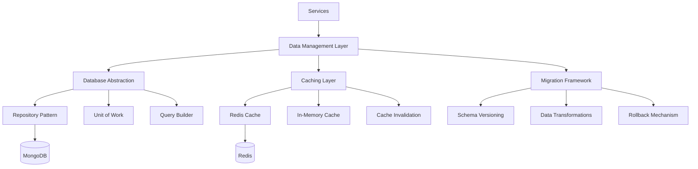

# Data Management Layer Implementation

This directory contains the implementation of the Data Management Layer for the VARAi Commerce Studio platform. The Data Management Layer provides a robust foundation for data storage, retrieval, caching, and migration.

## Overview

The Data Management Layer is a critical component of the platform's architecture, responsible for:

- Database abstraction and access patterns
- Caching strategy and implementation
- Data migration and versioning
- Data validation and integrity
- Performance optimization

## Architecture



## Implementation Approach

The Data Management Layer is implemented using a combination of:

1. **MongoDB Abstraction**: For document database operations
2. **Redis Cache**: For distributed caching
3. **Mongoose**: For schema definition and validation
4. **Migration Framework**: For database schema and data migrations

### MongoDB Abstraction

The MongoDB abstraction provides:
- Repository pattern implementation
- Unit of work for transaction management
- Query builder for complex queries
- Projection and aggregation utilities

### Redis Cache

The Redis cache provides:
- Distributed caching for shared data
- Cache invalidation strategies
- Time-to-live (TTL) management
- Cache-aside pattern implementation

### Mongoose Integration

Mongoose integration provides:
- Schema definition and validation
- Middleware for pre/post operations
- Plugins for common functionality
- Virtual properties and population

### Migration Framework

The migration framework provides:
- Schema versioning
- Data transformations
- Rollback capabilities
- Migration history tracking

## Directory Structure

```
data-management/
├── mongodb/
│   ├── connection/        # MongoDB connection management
│   ├── repositories/      # Repository implementations
│   ├── schemas/           # Mongoose schemas
│   └── utils/             # MongoDB utilities
├── redis/
│   ├── connection/        # Redis connection management
│   ├── cache/             # Cache implementations
│   └── utils/             # Redis utilities
├── migrations/
│   ├── framework/         # Migration framework
│   ├── versions/          # Migration versions
│   └── utils/             # Migration utilities
├── docker-compose.yml     # Docker Compose configuration
├── README.md              # This file
└── scripts/               # Utility scripts
```

## Implementation Plan

### Phase 1: Database Abstraction (Weeks 1-2)

#### Week 1: MongoDB Connection and Repository Pattern

**Tasks:**
1. Set up MongoDB connection management
   - Configure connection pooling
   - Implement retry logic
   - Set up event listeners

2. Implement repository pattern
   - Create base repository
   - Implement CRUD operations
   - Add query methods

3. Create unit of work pattern
   - Implement transaction support
   - Create session management
   - Add commit/rollback functionality

**Deliverables:**
- MongoDB connection manager
- Base repository implementation
- Unit of work implementation

#### Week 2: Mongoose Schemas and Validation

**Tasks:**
1. Define core schemas
   - Create product schema
   - Implement user schema
   - Define order schema

2. Add validation
   - Implement field validation
   - Add custom validators
   - Create validation middleware

3. Create schema relationships
   - Define references
   - Implement population
   - Add virtual fields

**Deliverables:**
- Core Mongoose schemas
- Validation framework
- Relationship documentation

### Phase 2: Caching Strategy (Weeks 3-4)

#### Week 3: Redis Setup and Cache Implementation

**Tasks:**
1. Set up Redis connection
   - Configure connection pooling
   - Implement retry logic
   - Set up event listeners

2. Implement cache manager
   - Create cache interface
   - Implement Redis cache provider
   - Add in-memory cache provider

3. Create cache patterns
   - Implement cache-aside pattern
   - Add write-through caching
   - Create cache invalidation

**Deliverables:**
- Redis connection manager
- Cache manager implementation
- Caching patterns documentation

#### Week 4: Advanced Caching

**Tasks:**
1. Implement distributed caching
   - Configure cache synchronization
   - Add cache partitioning
   - Implement cache replication

2. Create cache invalidation strategies
   - Time-based invalidation
   - Event-based invalidation
   - Pattern-based invalidation

3. Add performance monitoring
   - Cache hit/miss metrics
   - Cache size monitoring
   - Performance benchmarks

**Deliverables:**
- Distributed caching implementation
- Cache invalidation strategies
- Monitoring dashboard

### Phase 3: Migration Framework (Weeks 5-6)

#### Week 5: Migration Framework Implementation

**Tasks:**
1. Create migration framework
   - Implement migration runner
   - Add version tracking
   - Create migration registry

2. Implement migration operations
   - Schema changes
   - Data transformations
   - Index management

3. Add rollback support
   - Create rollback operations
   - Implement transaction support
   - Add state verification

**Deliverables:**
- Migration framework
- Migration operations
- Rollback implementation

#### Week 6: Migration Tools and Testing

**Tasks:**
1. Create migration CLI
   - Implement migration commands
   - Add status reporting
   - Create migration generation

2. Develop testing framework
   - Create migration tests
   - Implement test data generation
   - Add performance testing

3. Create documentation
   - Migration guide
   - Best practices
   - Example migrations

**Deliverables:**
- Migration CLI
- Testing framework
- Comprehensive documentation

### Phase 4: Integration and Optimization (Weeks 7-8)

#### Week 7: Service Integration

**Tasks:**
1. Integrate with service infrastructure
   - Connect to service registry
   - Implement health checks
   - Add metrics reporting

2. Create data access services
   - Implement product data service
   - Create user data service
   - Add order data service

3. Develop API layer
   - Create data access API
   - Implement query API
   - Add mutation API

**Deliverables:**
- Service integration documentation
- Data access services
- API layer implementation

#### Week 8: Performance Optimization

**Tasks:**
1. Perform database optimization
   - Index optimization
   - Query optimization
   - Schema optimization

2. Optimize caching
   - Cache size tuning
   - TTL optimization
   - Eviction policy tuning

3. Conduct load testing
   - Performance benchmarks
   - Scalability testing
   - Failure testing

**Deliverables:**
- Optimization report
- Performance benchmarks
- Load testing results

## Technical Implementation Details

### MongoDB Connection Configuration

```javascript
// MongoDB connection configuration
const mongoConfig = {
  uri: process.env.MONGODB_URI || 'mongodb://localhost:27017/varai',
  options: {
    useNewUrlParser: true,
    useUnifiedTopology: true,
    maxPoolSize: 10,
    serverSelectionTimeoutMS: 5000,
    socketTimeoutMS: 45000,
    family: 4
  }
};

// Connection manager
class MongoConnectionManager {
  constructor(config) {
    this.config = config;
    this.client = null;
    this.db = null;
  }

  async connect() {
    if (this.client) return this.db;

    try {
      this.client = new MongoClient(this.config.uri, this.config.options);
      await this.client.connect();
      this.db = this.client.db();
      console.log('Connected to MongoDB');
      return this.db;
    } catch (error) {
      console.error('Failed to connect to MongoDB', error);
      throw error;
    }
  }

  async close() {
    if (this.client) {
      await this.client.close();
      this.client = null;
      this.db = null;
      console.log('Disconnected from MongoDB');
    }
  }
}
```

### Repository Pattern Implementation

```javascript
// Base repository
class BaseRepository {
  constructor(db, collectionName) {
    this.collection = db.collection(collectionName);
  }

  async findById(id) {
    return this.collection.findOne({ _id: new ObjectId(id) });
  }

  async find(query = {}, options = {}) {
    return this.collection.find(query, options).toArray();
  }

  async findOne(query = {}, options = {}) {
    return this.collection.findOne(query, options);
  }

  async create(data) {
    const result = await this.collection.insertOne(data);
    return { ...data, _id: result.insertedId };
  }

  async update(id, data) {
    const result = await this.collection.updateOne(
      { _id: new ObjectId(id) },
      { $set: data }
    );
    return result.modifiedCount > 0;
  }

  async delete(id) {
    const result = await this.collection.deleteOne({ _id: new ObjectId(id) });
    return result.deletedCount > 0;
  }
}

// Product repository
class ProductRepository extends BaseRepository {
  constructor(db) {
    super(db, 'products');
  }

  async findByBrand(brand) {
    return this.find({ brand });
  }

  async findByCategory(category) {
    return this.find({ categories: category });
  }

  async findFeatured() {
    return this.find({ featured: true });
  }
}
```

### Redis Cache Implementation

```javascript
// Redis cache provider
class RedisCacheProvider {
  constructor(config) {
    this.client = redis.createClient(config);
    this.client.on('error', (err) => console.error('Redis error:', err));
    this.client.connect();
  }

  async get(key) {
    const value = await this.client.get(key);
    return value ? JSON.parse(value) : null;
  }

  async set(key, value, ttl = 3600) {
    await this.client.set(key, JSON.stringify(value), { EX: ttl });
  }

  async delete(key) {
    await this.client.del(key);
  }

  async clear() {
    await this.client.flushDb();
  }

  async close() {
    await this.client.quit();
  }
}

// Cache manager
class CacheManager {
  constructor(provider) {
    this.provider = provider;
  }

  async get(key) {
    return this.provider.get(key);
  }

  async set(key, value, ttl) {
    await this.provider.set(key, value, ttl);
  }

  async delete(key) {
    await this.provider.delete(key);
  }

  async clear() {
    await this.provider.clear();
  }

  // Cache-aside pattern
  async getOrSet(key, factory, ttl) {
    const cached = await this.get(key);
    if (cached) return cached;

    const value = await factory();
    await this.set(key, value, ttl);
    return value;
  }
}
```

### Migration Framework

```javascript
// Migration framework
class MigrationFramework {
  constructor(db) {
    this.db = db;
    this.migrations = new Map();
    this.migrationCollection = db.collection('migrations');
  }

  register(version, migration) {
    this.migrations.set(version, migration);
  }

  async getAppliedMigrations() {
    return this.migrationCollection.find().sort({ version: 1 }).toArray();
  }

  async applyMigration(version) {
    const migration = this.migrations.get(version);
    if (!migration) {
      throw new Error(`Migration version ${version} not found`);
    }

    const session = this.db.client.startSession();
    try {
      await session.withTransaction(async () => {
        await migration.up(this.db, session);
        await this.migrationCollection.insertOne({
          version,
          appliedAt: new Date()
        }, { session });
      });
      console.log(`Applied migration: ${version}`);
    } catch (error) {
      console.error(`Failed to apply migration ${version}:`, error);
      throw error;
    } finally {
      await session.endSession();
    }
  }

  async rollbackMigration(version) {
    const migration = this.migrations.get(version);
    if (!migration) {
      throw new Error(`Migration version ${version} not found`);
    }

    const session = this.db.client.startSession();
    try {
      await session.withTransaction(async () => {
        await migration.down(this.db, session);
        await this.migrationCollection.deleteOne({ version }, { session });
      });
      console.log(`Rolled back migration: ${version}`);
    } catch (error) {
      console.error(`Failed to rollback migration ${version}:`, error);
      throw error;
    } finally {
      await session.endSession();
    }
  }

  async migrateToLatest() {
    const appliedMigrations = await this.getAppliedMigrations();
    const appliedVersions = new Set(appliedMigrations.map(m => m.version));
    
    const pendingMigrations = Array.from(this.migrations.keys())
      .filter(version => !appliedVersions.has(version))
      .sort();
    
    for (const version of pendingMigrations) {
      await this.applyMigration(version);
    }
  }
}
```

## Data Models

### Product Schema

```javascript
const ProductSchema = new mongoose.Schema({
  name: {
    type: String,
    required: true,
    trim: true
  },
  brand: {
    type: String,
    required: true,
    trim: true
  },
  description: {
    type: String,
    required: true
  },
  price: {
    type: Number,
    required: true,
    min: 0
  },
  categories: [{
    type: String,
    trim: true
  }],
  attributes: {
    type: Map,
    of: mongoose.Schema.Types.Mixed
  },
  images: [{
    url: String,
    alt: String,
    isPrimary: Boolean
  }],
  inventory: {
    quantity: {
      type: Number,
      default: 0
    },
    sku: {
      type: String,
      unique: true
    },
    isInStock: {
      type: Boolean,
      default: false
    }
  },
  ai_enhanced: {
    face_shape_compatibility: {
      oval: Number,
      round: Number,
      square: Number,
      heart: Number,
      diamond: Number,
      oblong: Number
    },
    style_keywords: [String],
    feature_summary: String,
    style_description: String
  },
  metadata: {
    created_at: {
      type: Date,
      default: Date.now
    },
    updated_at: {
      type: Date,
      default: Date.now
    },
    created_by: String,
    updated_by: String
  }
}, {
  timestamps: {
    createdAt: 'metadata.created_at',
    updatedAt: 'metadata.updated_at'
  }
});

// Indexes
ProductSchema.index({ name: 1 });
ProductSchema.index({ brand: 1 });
ProductSchema.index({ categories: 1 });
ProductSchema.index({ 'inventory.sku': 1 }, { unique: true });
ProductSchema.index({ 'ai_enhanced.style_keywords': 1 });
```

### User Schema

```javascript
const UserSchema = new mongoose.Schema({
  username: {
    type: String,
    required: true,
    unique: true,
    trim: true
  },
  email: {
    type: String,
    required: true,
    unique: true,
    trim: true,
    lowercase: true
  },
  password: {
    type: String,
    required: true
  },
  firstName: {
    type: String,
    trim: true
  },
  lastName: {
    type: String,
    trim: true
  },
  role: {
    type: String,
    enum: ['customer', 'store_manager', 'product_manager', 'marketing_manager', 'customer_service_representative', 'organization_administrator', 'system_administrator'],
    default: 'customer'
  },
  profile: {
    face_shape: {
      type: String,
      enum: ['oval', 'round', 'square', 'heart', 'diamond', 'oblong']
    },
    preferences: {
      brands: [String],
      styles: [String],
      price_range: {
        min: Number,
        max: Number
      }
    },
    measurements: {
      pupillary_distance: Number,
      face_width: Number
    }
  },
  metadata: {
    created_at: {
      type: Date,
      default: Date.now
    },
    updated_at: {
      type: Date,
      default: Date.now
    },
    last_login: Date
  }
}, {
  timestamps: {
    createdAt: 'metadata.created_at',
    updatedAt: 'metadata.updated_at'
  }
});

// Indexes
UserSchema.index({ username: 1 }, { unique: true });
UserSchema.index({ email: 1 }, { unique: true });
UserSchema.index({ role: 1 });
```

## Caching Strategies

The Data Management Layer implements several caching strategies:

### 1. Cache-Aside (Lazy Loading)

```javascript
async function getProductById(id) {
  const cacheKey = `product:${id}`;
  
  // Try to get from cache first
  const cachedProduct = await cacheManager.get(cacheKey);
  if (cachedProduct) {
    return cachedProduct;
  }
  
  // If not in cache, get from database
  const product = await productRepository.findById(id);
  if (product) {
    // Store in cache for future requests
    await cacheManager.set(cacheKey, product, 3600); // 1 hour TTL
  }
  
  return product;
}
```

### 2. Write-Through

```javascript
async function updateProduct(id, data) {
  // Update in database
  const success = await productRepository.update(id, data);
  
  if (success) {
    // Update in cache
    const cacheKey = `product:${id}`;
    const product = await productRepository.findById(id);
    await cacheManager.set(cacheKey, product, 3600);
    
    // Invalidate related caches
    await cacheManager.delete(`products:brand:${product.brand}`);
    for (const category of product.categories) {
      await cacheManager.delete(`products:category:${category}`);
    }
  }
  
  return success;
}
```

### 3. Time-Based Expiration

```javascript
// Cache frequently accessed data with appropriate TTL
await cacheManager.set('featured-products', featuredProducts, 300); // 5 minutes
await cacheManager.set('product-categories', categories, 3600); // 1 hour
await cacheManager.set('brand-list', brands, 86400); // 1 day
```

### 4. Event-Based Invalidation

```javascript
// Listen for product update events
messageBroker.subscribe('product.updated', async (message) => {
  const productId = message.productId;
  
  // Invalidate specific product cache
  await cacheManager.delete(`product:${productId}`);
  
  // Invalidate related caches
  await cacheManager.delete(`products:brand:${message.brand}`);
  for (const category of message.categories) {
    await cacheManager.delete(`products:category:${category}`);
  }
});
```

## Migration Examples

### 1. Adding a New Field

```javascript
// Migration: 20250410-add-product-ratings
module.exports = {
  version: '20250410-add-product-ratings',
  
  async up(db, session) {
    // Add ratings field to all products
    await db.collection('products').updateMany(
      {},
      { 
        $set: { 
          ratings: {
            average: 0,
            count: 0,
            distribution: {
              1: 0,
              2: 0,
              3: 0,
              4: 0,
              5: 0
            }
          }
        } 
      },
      { session }
    );
    
    // Create index on ratings.average
    await db.collection('products').createIndex(
      { 'ratings.average': -1 },
      { session }
    );
  },
  
  async down(db, session) {
    // Remove ratings field from all products
    await db.collection('products').updateMany(
      {},
      { $unset: { ratings: "" } },
      { session }
    );
    
    // Drop index on ratings.average
    await db.collection('products').dropIndex(
      { 'ratings.average': -1 },
      { session }
    );
  }
};
```

### 2. Data Transformation

```javascript
// Migration: 20250415-normalize-brand-names
module.exports = {
  version: '20250415-normalize-brand-names',
  
  async up(db, session) {
    // Get all products
    const products = await db.collection('products').find({}, { session }).toArray();
    
    // Brand name mapping
    const brandMapping = {
      'ray ban': 'Ray-Ban',
      'ray-ban': 'Ray-Ban',
      'rayban': 'Ray-Ban',
      'oakley': 'Oakley',
      'oakleys': 'Oakley',
      'gucci': 'Gucci',
      'prada': 'Prada'
    };
    
    // Update each product with normalized brand name
    for (const product of products) {
      const currentBrand = product.brand.toLowerCase();
      if (brandMapping[currentBrand] && brandMapping[currentBrand] !== product.brand) {
        await db.collection('products').updateOne(
          { _id: product._id },
          { $set: { brand: brandMapping[currentBrand] } },
          { session }
        );
      }
    }
    
    // Create backup of original data
    await db.collection('brand_normalization_backup').insertMany(
      products.filter(p => brandMapping[p.brand.toLowerCase()] && brandMapping[p.brand.toLowerCase()] !== p.brand),
      { session }
    );
  },
  
  async down(db, session) {
    // Restore from backup
    const backup = await db.collection('brand_normalization_backup').find({}, { session }).toArray();
    
    for (const product of backup) {
      await db.collection('products').updateOne(
        { _id: product._id },
        { $set: { brand: product.brand } },
        { session }
      );
    }
  }
};
```

## Getting Started

### Prerequisites

- Docker and Docker Compose
- Node.js 16 or later
- MongoDB CLI (optional)
- Redis CLI (optional)

### Installation

1. Clone the repository
2. Navigate to the data-management directory
3. Run `docker-compose up -d`
4. Access MongoDB at mongodb://localhost:27017
5. Access Redis at localhost:6379

### Configuration

1. Configure MongoDB connection
2. Set up Redis connection
3. Initialize migration framework

## Next Steps

After implementing the Data Management Layer, the next steps will be:

1. **Observability Stack**
   - Centralized logging
   - Metrics collection
   - Distributed tracing

2. **Business Services**
   - Product service
   - User service
   - Order service

3. **Frontend Integration**
   - API client
   - State management
   - UI components

## References

- [MongoDB Documentation](https://docs.mongodb.com/)
- [Redis Documentation](https://redis.io/documentation)
- [Mongoose Documentation](https://mongoosejs.com/docs/)
- [Database Migration Patterns](https://martinfowler.com/articles/evodb.html)