# Agentic Implementation Roadmap
## MongoDB Foundation & Complete System Integration

> **🎯 Mission**: Orchestrate MongoDB Foundation implementation and complete aiGI recursive workflow integration using the full Roo mode stack with adaptive recursion and minimal human intervention.

---

## Executive Summary

This roadmap defines the **agentic execution source of truth** for implementing MongoDB Foundation, Store Generation Service, AI Chat, Shopify Integration, and Data Flow Pipeline. Each deliverable leverages specialized Roo modes with **adaptive recursion**, **automated feedback loops**, and **intelligent artifact handoffs**.

**Current State**: 70% platform complete with robust infrastructure  
**Target State**: 100% MVP with MongoDB-driven store generation and AI-powered user experiences  
**Timeline**: 4 weeks with parallel agentic execution  
**Success Metric**: End-to-end user journey from AI consultation to store deployment

---

## 🏗️ Core Architecture & Mode Orchestration

### Agentic Workflow Layers

```mermaid
graph TB
    subgraph "Layer 1: Requirements & Planning"
        A1[📘 Tutorial Mode] --> A2[🏗️ Architect Mode]
        A2 --> A3[💬 Prompt Generator]
    end
    
    subgraph "Layer 2: Implementation Cycle"
        B1[🧪 TDD Mode] --> B2[🧠 Auto-Coder Mode]
        B2 --> B3[🧐 Critic Mode] --> B4[🎯 Scorer Mode]
        B4 --> B5[🔄 Reflection Mode]
        B5 --> B1
    end
    
    subgraph "Layer 3: Integration & Assembly"
        C1[♾️ MCP Integration] --> C2[🧠 Memory Manager]
        C2 --> C3[🏁 Final Assembly]
    end
    
    subgraph "Layer 4: Orchestration"
        D1[🤖 aiGI Orchestrator]
    end
    
    A1 --> B1
    B5 --> C1
    D1 --> A1
    D1 --> B1
    D1 --> C1
    
    classDef primary fill:#2196F3,stroke:#1976D2,color:#fff
    classDef secondary fill:#4CAF50,stroke:#388E3C,color:#fff
    classDef tertiary fill:#FF9800,stroke:#F57C00,color:#fff
    
    class A1,A2,A3 primary
    class B1,B2,B3,B4,B5 secondary
    class C1,C2,C3 tertiary
```



---

## 🎯 Major Deliverables & Mode Mapping

### 1. MongoDB Foundation Service
**Objective**: Implement comprehensive MongoDB schema and services for eyewear catalog management  
**Success Criteria**: 
- Store 10,000+ products with full schema validation
- Sub-100ms query performance for product lookups
- Real-time sync with SKU Genie data pipeline
- Complete CRUD operations with audit logging

#### Step-by-Step Decomposition

**Phase 1A: Schema Design & Validation** *(1 week)*
- **🏗️ Architect Mode**: Design MongoDB collections and relationships
  - Input: Current SKU Genie output format, business requirements
  - Output: Comprehensive schema documentation with indexes and constraints
  - Artifact: [`mongodb_schema_design.md`](src/database/mongodb_schema_design.md:1)

- **🧪 TDD Mode**: Create schema validation tests
  - Input: Schema design from Architect
  - Output: Test specifications for all collections and operations
  - Artifact: [`test_mongodb_schema.py`](tests/mongodb_foundation/test_mongodb_schema.py:1)

- **🧠 Auto-Coder Mode**: Implement MongoDB models and services
  - Input: Schema design + test specifications
  - Output: Pydantic models, MongoDB service classes, migration scripts
  - Artifact: [`mongodb_service.py`](src/database/mongodb_service.py:1)

**Phase 1B: Performance Optimization** *(3 days)*
- **🧐 Critic Mode**: Analyze performance bottlenecks
  - Input: Initial implementation + load test results
  - Output: Performance analysis report with optimization recommendations
  - Failure Trigger: >200ms average query time → Recursive optimization sub-loop

- **🎯 Scorer Mode**: Evaluate implementation quality
  - Input: Performance metrics + code quality analysis
  - Output: Scored evaluation with specific improvement targets
  - Termination Condition: Score >85/100 with all critical criteria met

- **🔄 Reflection Mode**: Generate improvement iterations
  - Input: Critic analysis + Scorer evaluation
  - Output: Refined implementation plan for next iteration
  - Loop Control: Max 3 iterations or score threshold reached

**Phase 1C: Integration Testing** *(2 days)*
- **♾️ MCP Integration**: Connect with external data sources
  - Input: MongoDB service + external API specifications
  - Output: Validated data pipeline connections
  - Artifact: [`mcp_mongodb_connectors.py`](src/integrations/mcp_mongodb_connectors.py:1)

**Adaptive Recursion Pattern**:
```python
while not_meeting_criteria and iteration_count < max_iterations:
    critic_analysis = critic_mode.analyze(current_implementation)
    if critic_analysis.has_critical_issues():
        scorer_evaluation = scorer_mode.evaluate(current_implementation)
        reflection_plan = reflection_mode.generate_improvements(critic_analysis, scorer_evaluation)
        current_implementation = auto_coder_mode.apply_improvements(reflection_plan)
        iteration_count += 1
    else:
        break
```

### 2. Store Generation Service
**Objective**: Automated HTML/Shopify store creation from MongoDB product data  
**Success Criteria**:
- Generate stores in <30 seconds for 1000+ products
- Mobile-responsive themes with 95+ Lighthouse scores
- SEO-optimized product pages with structured data
- Asset pipeline with CDN integration

#### Step-by-Step Decomposition

**Phase 2A: Template Engine Foundation** *(1 week)*
- **💬 Prompt Generator**: Create batched prompts for template development
  - Input: Store design requirements, theme specifications
  - Output: Detailed prompts for each template component
  - Artifact: [`template_prompts_batch.md`](prompts/template_prompts_batch.md:1)

- **🧪 TDD Mode**: Define template rendering test suite
  - Input: Template requirements + performance benchmarks
  - Output: Comprehensive test coverage for all template scenarios
  - Artifact: [`test_template_engine.py`](tests/template_engine/test_template_engine.py:1)

- **🧠 Auto-Coder Mode**: Build template engine with Jinja2
  - Input: TDD specifications + template prompts
  - Output: Template engine service with theme support
  - Artifact: [`template_engine.py`](src/services/template_engine.py:1)

**Phase 2B: Store Generation Pipeline** *(1 week)*
- **🧐 Critic Mode**: Review template quality and performance
  - Input: Generated templates + performance metrics
  - Output: Quality assessment with improvement recommendations
  - Recursive Trigger: Lighthouse score <90 → Template optimization loop

- **🎯 Scorer Mode**: Evaluate store generation metrics
  - Input: Generated stores + quality metrics
  - Output: Performance scores across multiple dimensions
  - Success Threshold: >90/100 composite score

- **🔄 Reflection Mode**: Optimize generation process
  - Input: Performance data + quality assessments
  - Output: Process improvements and optimization strategies
  - Termination: All critical performance metrics met

**Human Intervention Points**:
- **Manual Review Required**: Final theme approval before production deployment
- **Auto-Execution**: Template generation, asset optimization, performance testing
- **Approval Gateway**: Store generation pipeline before Shopify integration

### 3. AI Chat Interface Integration
**Objective**: Frontend conversational interface with backend AI services  
**Success Criteria**:
- <2 second response times for AI recommendations
- Context-aware conversation management
- Face shape analysis integration
- Product recommendation display

#### Step-by-Step Decomposition

**Phase 3A: Chat Widget Development** *(1 week)*
- **🏗️ Architect Mode**: Design chat interface architecture
  - Input: UI/UX requirements, API specifications
  - Output: Component architecture with state management design
  - Artifact: [`chat_architecture.md`](docs/architecture/chat_architecture.md:1)

- **🧪 TDD Mode**: Create chat widget test suite
  - Input: Component specifications + user interaction flows
  - Output: React Testing Library test suite
  - Artifact: [`test_chat_widget.tsx`](tests/frontend/test_chat_widget.tsx:1)

- **🧠 Auto-Coder Mode**: Implement React chat components
  - Input: Architecture design + test specifications
  - Output: Chat widget with real-time messaging
  - Artifact: [`ChatWidget.tsx`](frontend/src/components/ChatWidget.tsx:1)

**Phase 3B: AI Service Integration** *(3 days)*
- **♾️ MCP Integration**: Connect to Vertex AI backend
  - Input: Chat widget + AI service endpoints
  - Output: Integrated AI chat with recommendation engine
  - Artifact: [`ai_chat_connector.ts`](frontend/src/services/ai_chat_connector.ts:1)

**Adaptive Feedback Loop**:
- **Performance Monitoring**: Real-time response time tracking
- **Auto-Optimization**: Automatic retry logic and caching
- **Quality Gates**: User satisfaction metrics trigger improvement cycles

### 4. Shopify Integration Service
**Objective**: Bidirectional sync between MongoDB catalog and Shopify stores  
**Success Criteria**:
- Complete catalog sync in <5 minutes
- Real-time inventory updates
- Theme deployment automation
- Order processing integration

#### Step-by-Step Decomposition

**Phase 4A: Shopify API Integration** *(1 week)*
- **🧪 TDD Mode**: Define Shopify sync test scenarios
  - Input: Shopify API documentation + sync requirements
  - Output: Comprehensive integration test suite
  - Artifact: [`test_shopify_integration.py`](tests/integrations/test_shopify_integration.py:1)

- **🧠 Auto-Coder Mode**: Build Shopify connector service
  - Input: Test specifications + API documentation
  - Output: Shopify service with CRUD operations
  - Artifact: [`shopify_service.py`](src/integrations/shopify_service.py:1)

**Phase 4B: Sync Pipeline Implementation** *(3 days)*
- **🧐 Critic Mode**: Analyze sync performance and reliability
  - Input: Sync operations + error logs
  - Output: Reliability assessment with failure analysis
  - Recursive Pattern: Sync failures trigger automated retry with exponential backoff

- **🧠 Memory Manager**: Store sync history and conflict resolution
  - Input: Sync operations + conflict scenarios
  - Output: Intelligent conflict resolution with history tracking
  - Artifact: [`sync_memory_store.py`](src/services/sync_memory_store.py:1)

### 5. Data Flow Pipeline Integration
**Objective**: End-to-end data flow from SKU Genie through MongoDB to store generation  
**Success Criteria**:
- Automated data pipeline with error handling
- Real-time update propagation
- Data quality validation at each stage
- Audit logging and monitoring

#### Step-by-Step Decomposition

**Phase 5A: Pipeline Architecture** *(3 days)*
- **🏗️ Architect Mode**: Design data flow architecture
  - Input: SKU Genie output + MongoDB schema + store requirements
  - Output: Pipeline architecture with queue management
  - Artifact: [`data_pipeline_architecture.md`](docs/architecture/data_pipeline_architecture.md:1)

**Phase 5B: Pipeline Implementation** *(1 week)*
- **🧪 TDD Mode**: Create pipeline integration tests
  - Input: Pipeline architecture + data quality requirements
  - Output: End-to-end pipeline test suite
  - Artifact: [`test_data_pipeline.py`](tests/integration/test_data_pipeline.py:1)

- **🧠 Auto-Coder Mode**: Implement pipeline services
  - Input: Architecture + test specifications
  - Output: Data pipeline with queue management and monitoring
  - Artifact: [`data_pipeline_service.py`](src/services/data_pipeline_service.py:1)

**Phase 5C: Quality Assurance** *(2 days)*
- **🧐 Critic Mode**: Validate data quality and pipeline reliability
  - Input: Pipeline execution logs + data quality metrics
  - Output: Quality assessment with improvement recommendations
  - Auto-Recovery: Failed quality checks trigger automated data repair

- **🎯 Scorer Mode**: Evaluate pipeline performance
  - Input: Throughput metrics + error rates + data quality scores
  - Output: Composite performance score with improvement targets
  - Success Gate: >95/100 score required for production deployment

---

## 🔄 Artifact Handoff Protocols

### Between Modes
```yaml
architect_to_tdd:
  input: "Architectural design documents with component specifications"
  output: "Test specifications with acceptance criteria"
  validation: "All architectural components covered by tests"

tdd_to_code:
  input: "Test specifications with failing test suite"
  output: "Implementation code that passes all tests"
  validation: "100% test coverage with all tests passing"

code_to_critic:
  input: "Implementation code with test results"
  output: "Code quality analysis with improvement recommendations"
  validation: "No critical issues identified"

critic_to_scorer:
  input: "Code analysis + performance metrics"
  output: "Quantitative quality scores across multiple dimensions"
  validation: "Scores meet minimum threshold requirements"

scorer_to_reflection:
  input: "Quality scores + performance data"
  output: "Improvement plan for next iteration"
  validation: "Clear improvement path identified"

reflection_to_final_assembly:
  input: "Validated implementation + documentation"
  output: "Production-ready deliverable with deployment instructions"
  validation: "All success criteria met"
```

### Integration Checkpoints
- **Week 1 Checkpoint**: MongoDB Foundation + Template Engine foundation
- **Week 2 Checkpoint**: Store Generation + AI Chat integration
- **Week 3 Checkpoint**: Shopify Integration + Data Pipeline
- **Week 4 Checkpoint**: End-to-end testing + Production deployment

---

## 🤖 Mode-Specific Responsibilities

### Auto-Execution vs Human Review

**Fully Automated** *(No human intervention required)*:
- Code generation from validated test specifications
- Performance optimization iterations
- Data pipeline quality checks
- Automated testing and validation
- Memory management and conflict resolution

**Human Review Required**:
- Final architectural decisions affecting business logic
- Production deployment approvals
- Theme design sign-offs
- Security configuration reviews
- Go-live authorization

**Approval Gateways**:
1. **Architecture Review**: Human approval required before TDD phase
2. **Security Review**: Human validation of security implementations
3. **Performance Gate**: Automated approval if metrics >90/100, human review if 80-90
4. **Production Deployment**: Human authorization required

### Adaptive Recursion & Feedback Loops

**Performance Optimization Loop**:


**Quality Assurance Loop**:


**Termination Conditions**:
- **Success**: All acceptance criteria met with scores >85/100
- **Iteration Limit**: Maximum 3 improvement cycles per component
- **Time Constraint**: 2-hour limit per optimization loop
- **Diminishing Returns**: <5% improvement between iterations
- **Critical Failure**: Escalate to human intervention

---

## 🔗 MCP Integration & Final Assembly

### MCP Integration Points
- **External APIs**: Shopify, payment processors, CDN services
- **Monitoring**: Prometheus, Grafana, logging aggregation
- **Security**: Authentication providers, secret management
- **Analytics**: User behavior tracking, performance monitoring

### Final Assembly Workflow
1. **Component Integration**: Assemble all validated components
2. **System Testing**: End-to-end user journey validation
3. **Performance Validation**: Load testing and optimization
4. **Security Hardening**: Security review and penetration testing
5. **Documentation Generation**: Auto-generated API docs and user guides
6. **Deployment Preparation**: Production configuration and rollout plan

### Integration Checkpoint Matrix
| Week | MongoDB | Store Gen | AI Chat | Shopify | Pipeline | Status |
|------|---------|-----------|---------|---------|----------|---------|
| 1    | ✓ Schema | ✓ Engine | - Design | - Spec  | - Arch   | 🟡      |
| 2    | ✓ Service| ✓ Pipeline| ✓ Widget| ✓ API   | ✓ Basic  | 🟡      |
| 3    | ✓ Optimized| ✓ Production| ✓ Integrated| ✓ Sync | ✓ Complete| 🟢   |
| 4    | ✓ Deployed| ✓ Live   | ✓ Live  | ✓ Live  | ✓ Monitored| 🟢    |

---

## 📊 Traceability & Extensibility Framework

### Artifact Tracking
```yaml
traceability_matrix:
  requirements_to_tests:
    format: "REQ-{id} → TEST-{id}"
    validation: "All requirements covered by tests"
  
  tests_to_implementation:
    format: "TEST-{id} → IMPL-{file}:{line}"
    validation: "All tests have corresponding implementation"
  
  implementation_to_deployment:
    format: "IMPL-{component} → DEPLOY-{environment}"
    validation: "All components deployed successfully"
```

### Extensibility Patterns
- **New Platform Integration**: Template pattern for adding e-commerce platforms
- **Additional AI Services**: Plugin architecture for new AI capabilities  
- **Custom Themes**: Theme SDK for third-party theme development
- **Analytics Extensions**: Hook system for custom analytics providers

### Version Control & Rollback
- **Feature Flags**: Gradual rollout with instant rollback capability
- **Database Migrations**: Reversible schema changes with data preservation
- **Configuration Management**: Environment-specific configs with validation
- **Artifact Versioning**: Semantic versioning for all deployable components

---

## 🎯 Success Metrics & KPIs

### Technical Success Criteria
- [ ] **MongoDB Foundation**: 10,000+ products with <100ms query time
- [ ] **Store Generation**: <30 seconds for 1000+ product stores
- [ ] **AI Chat**: <2 second response time with 95% accuracy
- [ ] **Shopify Sync**: <5 minute full catalog synchronization
- [ ] **Data Pipeline**: 99.9% uptime with automated error recovery

### Business Success Criteria
- [ ] **End-to-End Journey**: Complete user flow from AI consultation to purchase
- [ ] **Multi-Channel Deployment**: HTML + Shopify stores operational
- [ ] **Performance Standards**: Mobile-first with >90 Lighthouse scores
- [ ] **Scalability**: Support for 100+ concurrent users
- [ ] **Reliability**: 99.5% system availability

### Quality Gates
- **Code Quality**: >90/100 code quality score
- **Test Coverage**: >95% for critical components
- **Performance**: All response times within SLA
- **Security**: Zero critical vulnerabilities
- **Documentation**: Complete API and user documentation

---

## 📈 Visual Execution Overview


---

## ⚡ Execution Commands

### Automated Workflow Triggers
```bash
# Initialize aiGI workflow
roo orchestrator start --plan=mongodb_foundation --mode=architect

# Execute phase-based deployment
roo batch-execute --phases=1,2,3 --auto-approve=performance --human-review=security

# Monitor execution progress
roo status --dashboard --alerts --metrics

# Trigger adaptive recursion
roo optimize --component=store_generation --target-score=90 --max-iterations=3

# Final assembly and deployment
roo assemble --environment=production --validate-all --deploy
```

---

## 📋 Conclusion

This agentic implementation roadmap serves as the **execution source of truth** for all aiGI collaborators. It provides:

✅ **Clear mode mapping** for each deliverable with specific responsibilities  
✅ **Adaptive recursion patterns** with automated quality gates  
✅ **Artifact handoff protocols** ensuring seamless collaboration  
✅ **Integration checkpoints** with clear success criteria  
✅ **Extensibility framework** for future feature development  
✅ **Automated execution** with minimal human intervention  

**Next Action**: Initialize MongoDB Foundation implementation using [`🏗️ Architect Mode`](architect:1) with the schema design specifications outlined in Phase 1A.

---

> **🤖 Note to AI Collaborators**: This document is the **agentic execution source of truth** for aiGI. All modes should reference this roadmap for task prioritization, artifact handoffs, and success criteria validation. The adaptive recursion patterns defined here are mandatory for quality assurance and automated optimization workflows.