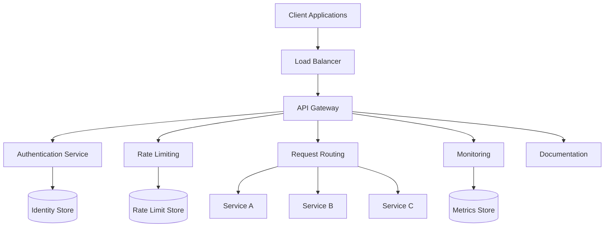
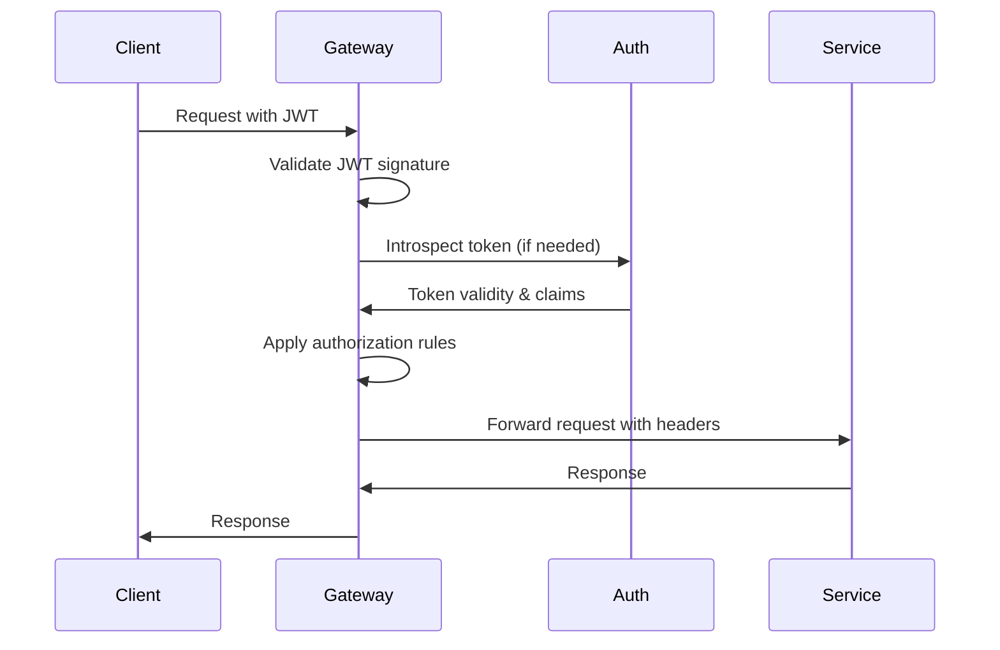
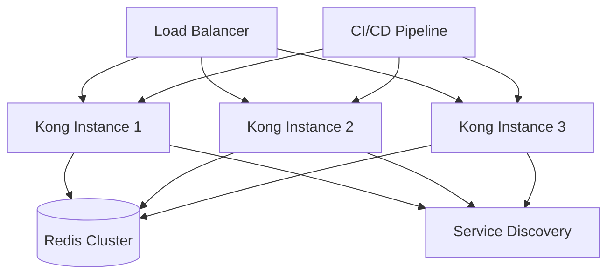

# API Gateway Implementation Plan

## Overview

This document outlines the detailed implementation plan for the API Gateway component of the VARAi Commerce Studio platform. The API Gateway will serve as the central entry point for all client interactions with the platform, providing routing, security, documentation, and monitoring capabilities.

## Objectives

1. Establish a centralized entry point for all API requests
2. Implement robust security controls and authentication
3. Enable rate limiting and throttling for API stability
4. Provide comprehensive API documentation
5. Implement monitoring and observability for API traffic
6. Support versioning and backward compatibility

## Architecture



## Technology Selection

After evaluating several options, we recommend using **Kong API Gateway** for the implementation based on the following criteria:

| Criteria | Kong | AWS API Gateway | Apigee | Custom Solution |
|----------|------|----------------|--------|----------------|
| Feature Completeness | 5/5 | 4/5 | 5/5 | 3/5 |
| Deployment Flexibility | 5/5 | 2/5 | 3/5 | 5/5 |
| Cost | 4/5 | 2/5 | 2/5 | 3/5 |
| Community Support | 4/5 | 4/5 | 3/5 | 2/5 |
| Integration Ease | 4/5 | 3/5 | 3/5 | 4/5 |
| Performance | 5/5 | 4/5 | 4/5 | 3/5 |
| **Total Score** | **27/30** | **19/30** | **20/30** | **20/30** |

Kong provides:
- Open-source core with enterprise options
- Kubernetes-native deployment
- Extensive plugin ecosystem
- High performance and low latency
- Flexible configuration options

## Implementation Phases

### Phase 1: Initial Setup (Weeks 1-2)

#### Week 1: Environment Setup and Basic Configuration

**Tasks:**
1. Set up development environment for Kong
   - Deploy Kong in Docker for local development
   - Configure basic routing
   - Establish CI/CD pipeline for Kong configuration

2. Define API gateway architecture
   - Document network topology
   - Define security boundaries
   - Plan for high availability

3. Create initial Kong configuration
   - Configure admin API access
   - Set up basic service and route definitions
   - Implement health checks

**Deliverables:**
- Working Kong instance in development environment
- Architecture documentation
- Initial configuration files in version control

#### Week 2: Authentication Integration

**Tasks:**
1. Integrate with authentication service
   - Configure OAuth 2.0 plugin
   - Set up JWT validation
   - Implement token introspection

2. Configure CORS settings
   - Define allowed origins
   - Configure preflight request handling
   - Set appropriate headers

3. Implement basic security controls
   - Configure TLS
   - Set up IP restriction if needed
   - Implement basic request validation

**Deliverables:**
- Authentication integration documentation
- Security configuration in version control
- Working authentication flow in development environment

### Phase 2: Core Functionality (Weeks 3-4)

#### Week 3: Traffic Management

**Tasks:**
1. Implement rate limiting
   - Configure global rate limits
   - Set up consumer-specific limits
   - Implement response headers for limit information

2. Configure request throttling
   - Set up queuing mechanisms
   - Configure concurrency limits
   - Implement backpressure mechanisms

3. Set up service routing
   - Configure routes for all platform services
   - Implement path-based routing
   - Set up header-based routing for special cases

**Deliverables:**
- Traffic management configuration
- Rate limiting documentation
- Service routing documentation

#### Week 4: Monitoring and Logging

**Tasks:**
1. Implement request logging
   - Configure log formats
   - Set up log rotation
   - Integrate with centralized logging

2. Set up metrics collection
   - Configure Prometheus integration
   - Define key metrics
   - Set up dashboards

3. Implement tracing
   - Configure distributed tracing
   - Integrate with tracing backend
   - Implement correlation IDs

**Deliverables:**
- Logging configuration
- Metrics dashboards
- Tracing integration documentation

### Phase 3: Documentation and Testing (Weeks 5-6)

#### Week 5: API Documentation

**Tasks:**
1. Implement OpenAPI/Swagger integration
   - Configure documentation plugin
   - Generate API specifications
   - Set up interactive documentation UI

2. Create developer portal
   - Configure developer portal plugin
   - Customize portal appearance
   - Set up API catalog

3. Implement API versioning
   - Define versioning strategy
   - Configure version routing
   - Document deprecation policy

**Deliverables:**
- API documentation portal
- OpenAPI specifications for all services
- Versioning documentation

#### Week 6: Testing and Optimization

**Tasks:**
1. Perform load testing
   - Define test scenarios
   - Execute performance tests
   - Identify bottlenecks

2. Conduct security testing
   - Perform penetration testing
   - Validate authentication flows
   - Test rate limiting effectiveness

3. Optimize configuration
   - Tune for performance
   - Optimize resource usage
   - Configure caching if needed

**Deliverables:**
- Load testing report
- Security testing report
- Optimized configuration

### Phase 4: Deployment and Rollout (Weeks 7-8)

#### Week 7: Staging Deployment

**Tasks:**
1. Deploy to staging environment
   - Configure staging environment
   - Deploy optimized configuration
   - Verify all functionality

2. Conduct integration testing
   - Test all service integrations
   - Verify end-to-end flows
   - Validate error handling

3. Finalize documentation
   - Update architecture documentation
   - Create operational runbooks
   - Prepare training materials

**Deliverables:**
- Staging environment deployment
- Integration test results
- Updated documentation

#### Week 8: Production Deployment and Monitoring

**Tasks:**
1. Create production deployment plan
   - Define rollout strategy
   - Create rollback procedures
   - Schedule deployment

2. Deploy to production
   - Execute deployment plan
   - Verify production functionality
   - Monitor for issues

3. Establish ongoing monitoring
   - Set up alerts
   - Configure dashboards
   - Implement health checks

**Deliverables:**
- Production deployment
- Monitoring dashboards
- Alert configuration

## Technical Implementation Details

### Kong Configuration

The Kong API Gateway will be configured using declarative configuration files:

```yaml
_format_version: "2.1"
_transform: true

services:
  - name: product-service
    url: http://product-service:8000
    routes:
      - name: product-routes
        paths:
          - /api/v1/products
        strip_path: false
        protocols:
          - http
          - https
    plugins:
      - name: rate-limiting
        config:
          minute: 60
          policy: local
      - name: cors
        config:
          origins:
            - '*'
          methods:
            - GET
            - POST
            - PUT
            - DELETE
          headers:
            - Content-Type
            - Authorization
          exposed_headers:
            - X-Auth-Token
          credentials: true
          max_age: 3600

  - name: user-service
    url: http://user-service:8000
    routes:
      - name: user-routes
        paths:
          - /api/v1/users
        strip_path: false
        protocols:
          - http
          - https
    plugins:
      - name: jwt
        config:
          claims_to_verify:
            - exp
          key_claim_name: kid
          secret_is_base64: false
```

### Authentication Flow

The API Gateway will implement the following authentication flow:



### Rate Limiting Implementation

Rate limiting will be implemented with the following considerations:

1. **Global Limits**: Base limits applied to all unauthenticated requests
2. **Consumer Limits**: Specific limits based on consumer tier
3. **Service-Specific Limits**: Different limits for different services
4. **Response Headers**:
   - `X-RateLimit-Limit`: Request limit
   - `X-RateLimit-Remaining`: Remaining requests
   - `X-RateLimit-Reset`: Time until reset

### Monitoring and Alerting

The following metrics will be collected and monitored:

1. **Request Metrics**:
   - Request count by service
   - Request latency
   - Error rate by status code
   - Request size

2. **Authentication Metrics**:
   - Authentication success/failure rate
   - Token validation time
   - Invalid token attempts

3. **Rate Limiting Metrics**:
   - Rate limit hits
   - Throttled requests
   - Consumer-specific limit utilization

Alerts will be configured for:
- Error rate exceeding threshold
- Latency exceeding threshold
- Authentication failure rate spike
- Rate limit threshold approaching

## Deployment Architecture

The API Gateway will be deployed in a high-availability configuration:



### Kubernetes Deployment

For Kubernetes deployment, the following resources will be created:

```yaml
apiVersion: apps/v1
kind: Deployment
metadata:
  name: kong
  namespace: api-gateway
spec:
  replicas: 3
  selector:
    matchLabels:
      app: kong
  template:
    metadata:
      labels:
        app: kong
    spec:
      containers:
      - name: kong
        image: kong:2.8
        ports:
        - containerPort: 8000
          name: proxy
        - containerPort: 8443
          name: proxy-ssl
        - containerPort: 8001
          name: admin-api
        - containerPort: 8444
          name: admin-api-ssl
        env:
        - name: KONG_DATABASE
          value: "off"
        - name: KONG_DECLARATIVE_CONFIG
          value: /kong/declarative/kong.yml
        - name: KONG_PROXY_ACCESS_LOG
          value: /dev/stdout
        - name: KONG_ADMIN_ACCESS_LOG
          value: /dev/stdout
        - name: KONG_PROXY_ERROR_LOG
          value: /dev/stderr
        - name: KONG_ADMIN_ERROR_LOG
          value: /dev/stderr
        volumeMounts:
        - name: kong-config
          mountPath: /kong/declarative
      volumes:
      - name: kong-config
        configMap:
          name: kong-config
---
apiVersion: v1
kind: Service
metadata:
  name: kong-proxy
  namespace: api-gateway
spec:
  type: LoadBalancer
  ports:
  - port: 80
    targetPort: 8000
    protocol: TCP
    name: proxy
  - port: 443
    targetPort: 8443
    protocol: TCP
    name: proxy-ssl
  selector:
    app: kong
```

## Risk Management

| Risk | Impact | Probability | Mitigation |
|------|--------|------------|------------|
| Performance bottleneck | High | Medium | Load testing, performance tuning, horizontal scaling |
| Authentication issues | High | Low | Thorough testing, fallback mechanisms, gradual rollout |
| Configuration errors | Medium | Medium | Automated validation, canary deployments, rollback plan |
| Integration failures | Medium | Medium | Comprehensive integration testing, service mocks |
| Scalability limitations | High | Low | Design for horizontal scaling, load testing at 10x expected volume |

## Success Criteria

The API Gateway implementation will be considered successful when:

1. All client requests are routed through the gateway
2. Authentication and authorization are properly enforced
3. Rate limiting effectively prevents abuse
4. API documentation is comprehensive and up-to-date
5. Monitoring provides clear visibility into API usage
6. Performance meets or exceeds requirements:
   - 99.9% availability
   - <100ms average latency
   - Support for 1000+ requests per second

## Next Steps

1. Finalize technology selection and obtain approvals
2. Set up development environment and initial configuration
3. Begin implementation of authentication integration
4. Schedule initial architecture review

## Appendix: Comparison of API Gateway Options

### Kong API Gateway

**Pros:**
- Open-source core with enterprise options
- Extensive plugin ecosystem
- High performance
- Kubernetes-native deployment
- Strong community support

**Cons:**
- Complex configuration for advanced scenarios
- Requires additional components for full functionality
- Enterprise features require paid license

### AWS API Gateway

**Pros:**
- Fully managed service
- Tight integration with AWS services
- Pay-per-use pricing model
- Built-in CloudWatch integration

**Cons:**
- Vendor lock-in
- Limited customization options
- Can become expensive at scale
- Limited deployment options

### Apigee

**Pros:**
- Comprehensive API management
- Strong analytics capabilities
- Enterprise support
- Developer portal included

**Cons:**
- Expensive
- Complex deployment
- Steeper learning curve
- Less flexible than Kong

### Custom Solution

**Pros:**
- Complete control over functionality
- No licensing costs
- Can be optimized for specific needs
- No vendor lock-in

**Cons:**
- Development and maintenance overhead
- Limited community support
- Requires significant expertise
- Missing advanced features