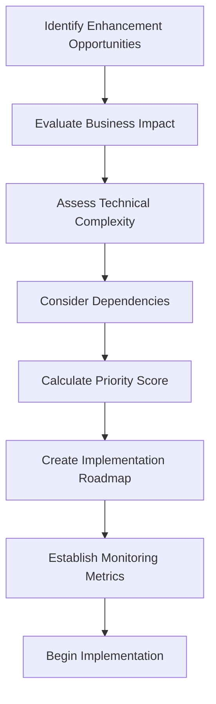

# Architecture Enhancement Prioritization Plan

## Overview

This document outlines the process for prioritizing architecture enhancements for the VARAi Commerce Studio platform based on the Architecture Gap Analysis. It provides a structured approach to evaluating, scoring, and scheduling architectural improvements to maximize business value while managing technical risk.

## Prioritization Process



## Step 1: Identify Enhancement Opportunities

Based on the Architecture Gap Analysis, we've identified the following key enhancement opportunities:

### API Gateway Layer
1. Implement centralized API gateway
2. Establish comprehensive API documentation
3. Implement rate limiting and throttling
4. Enhance authentication and security controls

### Service Infrastructure
1. Implement service registry and discovery
2. Establish message broker for asynchronous communication
3. Create standardized service templates
4. Implement resilience patterns

### Data Management Layer
1. Enhance database abstraction with repository patterns
2. Implement connection pooling and optimization
3. Establish caching strategy with Redis
4. Create data migration framework

### Security Framework
1. Implement comprehensive RBAC system
2. Enhance authentication with OAuth 2.0
3. Establish secrets management
4. Implement security monitoring

### Integration Framework
1. Create adapter framework for multiple platforms
2. Implement event bus for integration events
3. Enhance data transformation capabilities
4. Establish integration monitoring

### Observability Stack
1. Implement centralized logging
2. Establish metrics collection and dashboards
3. Implement distributed tracing
4. Create comprehensive alerting system

## Step 2: Evaluate Business Impact

Each enhancement opportunity is evaluated based on its business impact using the following criteria:

| Criterion | Weight | Description |
|-----------|--------|-------------|
| Revenue Impact | 5 | Direct impact on platform's ability to generate revenue |
| Customer Experience | 4 | Impact on end-user experience and satisfaction |
| Operational Efficiency | 3 | Impact on internal operations and maintenance |
| Competitive Advantage | 3 | Contribution to market differentiation |
| Regulatory Compliance | 5 | Impact on meeting regulatory requirements |

Each opportunity is scored from 1-5 on each criterion, then multiplied by the weight and summed for a total business impact score.

### Business Impact Scoring Example

| Enhancement | Revenue Impact (5) | Customer Experience (4) | Operational Efficiency (3) | Competitive Advantage (3) | Regulatory Compliance (5) | Total Score |
|-------------|-------------------|------------------------|----------------------------|---------------------------|---------------------------|------------|
| Implement RBAC system | 3 (15) | 2 (8) | 4 (12) | 2 (6) | 5 (25) | 66 |
| Implement API gateway | 4 (20) | 4 (16) | 5 (15) | 3 (9) | 3 (15) | 75 |
| Implement caching strategy | 5 (25) | 5 (20) | 4 (12) | 4 (12) | 1 (5) | 74 |

## Step 3: Assess Technical Complexity

Each enhancement is evaluated for technical complexity using the following criteria:

| Criterion | Weight | Description |
|-----------|--------|-------------|
| Implementation Effort | 4 | Estimated person-hours required |
| Technical Risk | 5 | Potential for technical issues or failures |
| Team Capability | 3 | Current team's ability to implement |
| Testing Complexity | 3 | Difficulty in validating the enhancement |
| Operational Impact | 4 | Effect on running systems during implementation |

Each opportunity is scored from 1-5 on each criterion (with 1 being most complex and 5 being least complex), then multiplied by the weight and summed for a total complexity score.

### Technical Complexity Scoring Example

| Enhancement | Implementation Effort (4) | Technical Risk (5) | Team Capability (3) | Testing Complexity (3) | Operational Impact (4) | Total Score |
|-------------|--------------------------|-------------------|---------------------|------------------------|------------------------|------------|
| Implement RBAC system | 2 (8) | 3 (15) | 4 (12) | 3 (9) | 2 (8) | 52 |
| Implement API gateway | 2 (8) | 2 (10) | 3 (9) | 2 (6) | 1 (4) | 37 |
| Implement caching strategy | 3 (12) | 4 (20) | 4 (12) | 3 (9) | 3 (12) | 65 |

## Step 4: Consider Dependencies

Identify dependencies between enhancement opportunities. Create a dependency matrix to visualize which enhancements must precede others.

### Dependency Matrix Example

| Enhancement | Dependencies |
|-------------|-------------|
| Implement service discovery | API gateway implementation |
| Implement event bus | Message broker implementation |
| Implement distributed tracing | Centralized logging implementation |
| Implement RBAC system | Authentication enhancement |

## Step 5: Calculate Priority Score

Calculate a priority score for each enhancement using the formula:

```
Priority Score = (Business Impact Score × 0.7) + (Technical Complexity Score × 0.3)
```

This formula gives more weight to business impact while still considering technical complexity.

### Priority Score Calculation Example

| Enhancement | Business Impact Score | Technical Complexity Score | Priority Score |
|-------------|----------------------|---------------------------|---------------|
| Implement RBAC system | 66 | 52 | 61.8 |
| Implement API gateway | 75 | 37 | 63.6 |
| Implement caching strategy | 74 | 65 | 71.3 |

## Step 6: Create Implementation Roadmap

Based on priority scores and dependencies, create a phased implementation roadmap.

### Phase 1: Foundation (Months 1-3)

| Enhancement | Priority Score | Dependencies | Timeline | Owner |
|-------------|---------------|-------------|----------|-------|
| Implement API gateway | 63.6 | None | Months 1-2 | API Team |
| Enhance authentication | 62.4 | None | Months 1-2 | Security Team |
| Implement centralized logging | 58.9 | None | Months 2-3 | DevOps Team |
| Establish metrics collection | 57.2 | None | Month 3 | DevOps Team |

### Phase 2: Core Services (Months 4-6)

| Enhancement | Priority Score | Dependencies | Timeline | Owner |
|-------------|---------------|-------------|----------|-------|
| Implement RBAC system | 61.8 | Authentication enhancement | Months 4-5 | Security Team |
| Implement service discovery | 59.3 | API gateway | Month 4 | API Team |
| Implement message broker | 56.7 | None | Months 4-5 | Integration Team |
| Implement caching strategy | 71.3 | None | Months 5-6 | Data Team |

### Phase 3: Integration & Resilience (Months 7-9)

| Enhancement | Priority Score | Dependencies | Timeline | Owner |
|-------------|---------------|-------------|----------|-------|
| Create adapter framework | 55.4 | Message broker | Months 7-8 | Integration Team |
| Implement event bus | 54.8 | Message broker | Month 7 | Integration Team |
| Implement resilience patterns | 53.2 | Service discovery | Months 8-9 | API Team |
| Implement distributed tracing | 52.6 | Centralized logging | Month 9 | DevOps Team |

### Phase 4: Optimization & Completion (Months 10-12)

| Enhancement | Priority Score | Dependencies | Timeline | Owner |
|-------------|---------------|-------------|----------|-------|
| Enhance data transformation | 51.9 | Adapter framework | Month 10 | Integration Team |
| Create data migration framework | 50.7 | None | Months 10-11 | Data Team |
| Implement security monitoring | 49.8 | Centralized logging, Metrics collection | Month 11 | Security Team |
| Create comprehensive alerting | 48.5 | Metrics collection | Months 11-12 | DevOps Team |

## Step 7: Establish Monitoring Metrics

For each enhancement, establish metrics to monitor its implementation success:

### API Gateway Metrics
- Request latency
- Error rates
- Throughput
- Authentication success/failure rates

### Service Infrastructure Metrics
- Service discovery time
- Message delivery latency
- Service template adoption rate
- Circuit breaker activation frequency

### Data Management Metrics
- Query performance
- Cache hit/miss rates
- Connection pool utilization
- Migration success rate

### Security Framework Metrics
- Authentication latency
- Authorization error rates
- Secrets rotation compliance
- Security incident detection time

### Integration Framework Metrics
- Integration error rates
- Event processing latency
- Transformation success rate
- Integration availability

### Observability Metrics
- Log ingestion rate
- Dashboard utilization
- Trace sampling rate
- Alert accuracy (false positive rate)

## Step 8: Begin Implementation

With the prioritization complete and roadmap established, begin implementation of Phase 1 enhancements:

### Implement API Gateway

1. **Week 1-2: Research and Selection**
   - Evaluate API gateway options (Kong, AWS API Gateway, etc.)
   - Select appropriate solution based on requirements
   - Define architecture and deployment strategy

2. **Week 3-4: Initial Setup**
   - Deploy API gateway in development environment
   - Configure basic routing and authentication
   - Establish CI/CD pipeline for gateway configuration

3. **Week 5-6: Core Functionality**
   - Implement rate limiting and throttling
   - Configure monitoring and logging
   - Establish security controls

4. **Week 7-8: Documentation and Testing**
   - Create API documentation with OpenAPI/Swagger
   - Perform load testing and security testing
   - Finalize deployment strategy

### Enhance Authentication

1. **Week 1-2: Requirements and Design**
   - Define authentication requirements
   - Design OAuth 2.0/OpenID Connect implementation
   - Plan migration from existing authentication

2. **Week 3-4: Implementation**
   - Implement authentication service
   - Configure identity providers
   - Develop token management

3. **Week 5-6: Integration and Testing**
   - Integrate with API gateway
   - Perform security testing
   - Conduct user acceptance testing

4. **Week 7-8: Rollout and Monitoring**
   - Deploy to production
   - Monitor authentication metrics
   - Provide documentation and training

## Conclusion

This prioritization plan provides a structured approach to enhancing the VARAi Commerce Studio architecture. By evaluating business impact, technical complexity, and dependencies, we've created a roadmap that maximizes value while managing risk.

The phased implementation approach allows for incremental improvement while maintaining system stability. Regular monitoring of success metrics will ensure that enhancements deliver the expected benefits and allow for course correction if needed.

The next step is to begin implementation of Phase 1 enhancements, starting with the API gateway and authentication improvements.