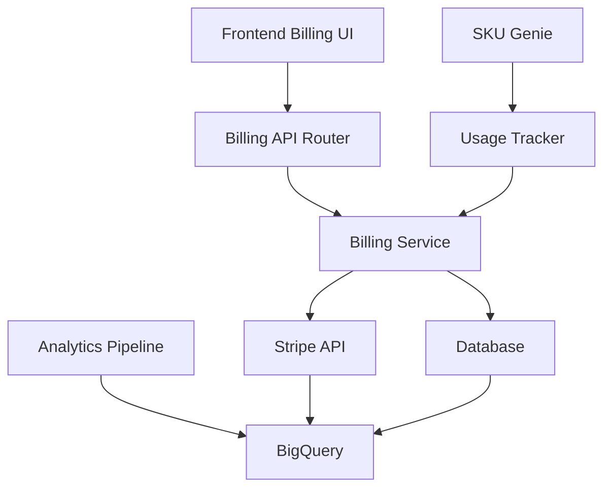

# Eyewear ML Platform - Billing Engine & Payments Subsystem Analysis

## Executive Summary

The eyewear platform includes a **comprehensive billing engine and payments subsystem** with **Stripe integration** as the primary payment processor. The system supports subscription management, usage-based billing, and multi-tenant payment processing across all platform studios.

## Core Billing Infrastructure

### 1. Primary Billing Service Architecture

**Location**: [`src/api/services/billing_service.py`](src/api/services/billing_service.py:32)

The platform implements a full-featured billing service with:
- **Stripe Integration**: Direct API integration for payment processing
- **Subscription Management**: Complete lifecycle management with plans, trials, and cancellations
- **Usage Tracking**: Metered billing for platform features and API usage
- **Invoice Management**: Automated invoice generation and payment processing
- **Multi-tenant Support**: Isolated billing per tenant organization

### 2. Database Schema & Models

**Core Tables** (defined in [`src/api/core/database.py`](src/api/core/database.py:143)):
- `plans` - Subscription plans with Stripe product/price IDs
- `subscriptions` - Active subscriptions with billing cycles
- `invoices` - Generated invoices with payment tracking
- `payment_methods` - Stored payment methods with Stripe tokens
- `tenant_payment_info` - Stripe customer IDs per tenant

**Billing Models** ([`src/api/models/billing.py`](src/api/models/billing.py:30)):
- Plan management with feature-based differentiation
- Subscription lifecycle with trial periods
- Invoice generation with line items
- Payment method handling with multiple providers

### 3. API Endpoints & Integration

**Billing Router** ([`src/api/routers/billing.py`](src/api/routers/billing.py:33)):
Complete REST API covering:
- Plan CRUD operations
- Subscription management (create, update, cancel)
- Invoice generation and payment processing
- Payment method management
- Usage tracking and reporting

## SKU Genie Billing Integration

### Usage-Based Billing Model

**Implementation** ([`docs/sku-genie/SKU-Genie-Billing-and-Updates.md`](docs/sku-genie/SKU-Genie-Billing-and-Updates.md:90)):

**Billing Plans**:
1. **Basic Plan**: Pay-per-update with manual approval
2. **Standard Plan**: Scheduled updates with reduced per-item fees
3. **Premium Plan**: Unlimited updates with flat monthly rate

**Usage Calculation Logic**:
```python
# From SKU Genie billing documentation
def calculate_billing_amount(job_execution, billing_plan):
    amount = billing_plan.base_fee
    if billable_items > billing_plan.included_items:
        excess_items = billable_items - billing_plan.included_items
        amount += excess_items * billing_plan.per_item_fee
    return amount
```

### Database Integration

**SKU Genie Billing Tables** ([`src/sku_genie/core/database.py`](src/sku_genie/core/database.py:130)):
- `billing_plans` - SKU Genie specific billing plans
- `subscriptions` - Client subscriptions with usage tracking
- `billing_events` - Usage events for metered billing

## Revenue Analytics & Reporting

### Stripe Data Pipeline

**Analytics Integration** ([`src/dashboard/scripts/setup_data_pipeline.py`](src/dashboard/scripts/setup_data_pipeline.py:169)):

**Automated Data Ingestion**:
- Stripe invoices, subscriptions, and usage records
- BigQuery integration for analytics
- Scheduled data synchronization every 6-12 hours

**Revenue Metrics Tracked** ([`docs/agents/full_platform_insights.md`](docs/agents/full_platform_insights.md:23)):
- Monthly Recurring Revenue (MRR)
- Annual Contract Value (ACV)
- Usage-based billing trends
- Plugin adoption per client
- Net Revenue Retention (NRR)

## Frontend Billing Interface

### Account Management

**Billing UI Components** ([`frontend/src/pages/commerce-studio/settings/AccountSettingsPage.tsx`](frontend/src/pages/commerce-studio/settings/AccountSettingsPage.tsx:409)):
- Subscription plan display and management
- Payment method configuration
- Billing history and invoice access
- Usage reporting dashboards

### Multi-tenant Administration

**Tenant Billing Management** ([`frontend/src/auth/components/admin/TenantManagement.tsx`](frontend/src/auth/components/admin/TenantManagement.tsx:40)):
- Billing email configuration per tenant
- Plan assignment and management
- Technical contact management

## Commercial Readiness Assessment

### ✅ Strengths

1. **Complete Payment Infrastructure**
   - Full Stripe integration with webhooks
   - Multi-tenant payment isolation
   - Subscription lifecycle management

2. **Usage-Based Billing**
   - Metered billing for platform features
   - SKU Genie specific billing models
   - API usage tracking and limits

3. **Enterprise Features**
   - Multi-currency support
   - Invoice generation and management
   - Payment method flexibility

4. **Analytics & Reporting**
   - Revenue analytics pipeline
   - Usage reporting dashboards
   - Business intelligence integration

### 🚧 Areas for Enhancement

1. **Advanced Billing Features**
   - Volume discounts and enterprise pricing
   - Custom billing cycles for enterprise clients
   - Dunning management for failed payments

2. **Integration Extensibility**
   - Additional payment gateway support
   - ERP system integration capabilities
   - Custom invoicing workflows

### 📊 Implementation Status

- **Core Billing Engine**: ✅ Production Ready
- **Stripe Integration**: ✅ Production Ready
- **Usage Tracking**: ✅ Production Ready
- **Multi-tenant Support**: ✅ Production Ready
- **Frontend Interface**: ✅ Production Ready
- **Analytics Pipeline**: ✅ Production Ready

## Technical Architecture Summary



## Conclusion

The eyewear platform possesses a **production-ready billing engine** with comprehensive Stripe integration, supporting subscription management, usage-based billing, and multi-tenant operations. The system is architecturally sound and commercially viable for immediate deployment with enterprise clients.

**Commercial Readiness**: **PRODUCTION READY** with robust payment processing, subscription management, and revenue analytics capabilities.