# Core Platform Architecture Implementation

## Overview

This document explains the implementation approach for the core platform architecture of VARAi Commerce Studio. When we refer to "implementing core platform architecture," we're describing the process of building the foundational technical components that support all platform capabilities, ensuring they work together as a cohesive system.

## What Constitutes Core Platform Architecture

The core platform architecture consists of several critical components that form the foundation of the entire system:

```mermaid
graph TD
    A[Core Platform Architecture] --> B[API Gateway Layer]
    A --> C[Service Infrastructure]
    A --> D[Data Management Layer]
    A --> E[Security Framework]
    A --> F[Integration Framework]
    A --> G[Observability Stack]
    
    B --> B1[API Gateway]
    B --> B2[Load Balancer]
    B --> B3[Rate Limiting]
    B --> B4[API Documentation]
    
    C --> C1[Service Registry]
    C --> C2[Service Discovery]
    C --> C3[Message Broker]
    C --> C4[Service Templates]
    
    D --> D1[Database Abstraction]
    D --> D2[Data Access Patterns]
    D --> D3[Caching Strategy]
    D --> D4[Data Migration Framework]
    
    E --> E1[Authentication Service]
    E --> E2[Authorization Framework]
    E --> E3[Secrets Management]
    E --> E4[Security Monitoring]
    
    F --> F1[Integration Adapters]
    F --> F2[Event Bus]
    F --> F3[Transformation Engine]
    F --> F4[Protocol Handlers]
    
    G --> G1[Logging Infrastructure]
    G --> G2[Metrics Collection]
    G --> G3[Distributed Tracing]
    G --> G4[Alerting System]
```

## Why Core Architecture Implementation Is Critical

Implementing the core platform architecture is a foundational step that:

1. **Establishes Technical Standards**: Defines coding practices, patterns, and architectural principles
2. **Enables Feature Development**: Provides the infrastructure for building business capabilities
3. **Ensures Scalability**: Creates a foundation that can grow with user and data volume
4. **Supports Reliability**: Implements resilience patterns and failure handling
5. **Facilitates Maintenance**: Makes the system easier to update, monitor, and troubleshoot

Without a properly implemented core architecture, individual features may work in isolation but fail to function as a cohesive platform. It's similar to building a house - you need a solid foundation before adding rooms and decorations.

## Implementation Approach

### 1. API Gateway Layer

The API Gateway serves as the entry point for all client interactions with the platform.

**Implementation Tasks**:
- Deploy and configure API Gateway (Kong, AWS API Gateway, or similar)
- Implement authentication middleware
- Configure rate limiting and throttling
- Set up request routing to appropriate services
- Establish monitoring and logging for all API traffic
- Create comprehensive API documentation with OpenAPI/Swagger

**Key Considerations**:
- Performance optimization for high-traffic endpoints
- Security hardening against common API vulnerabilities
- Versioning strategy for API evolution
- Cross-origin resource sharing (CORS) configuration

### 2. Service Infrastructure

The service infrastructure provides the environment in which all platform services operate.

**Implementation Tasks**:
- Establish service registry and discovery mechanism
- Implement message broker for asynchronous communication
- Create service templates with standardized patterns
- Configure service health checks and circuit breakers
- Implement retry and backoff strategies
- Set up deployment pipelines for services

**Key Considerations**:
- Service isolation and fault containment
- Efficient inter-service communication
- Resource allocation and scaling policies
- Service lifecycle management

### 3. Data Management Layer

The data management layer handles all aspects of data storage, retrieval, and manipulation.

**Implementation Tasks**:
- Implement database abstraction layer
- Establish data access patterns (repository, unit of work)
- Configure connection pooling and optimization
- Set up caching strategy (Redis, in-memory)
- Create data migration framework
- Implement data validation and sanitization

**Key Considerations**:
- Performance optimization for common queries
- Data consistency across distributed systems
- Backup and recovery procedures
- Data partitioning for scalability

### 4. Security Framework

The security framework ensures the protection of platform data and functionality.

**Implementation Tasks**:
- Implement authentication service (OAuth 2.0, OpenID Connect)
- Create authorization framework (RBAC, ABAC)
- Set up secrets management (HashiCorp Vault, AWS Secrets Manager)
- Configure encryption for data at rest and in transit
- Implement security monitoring and alerting
- Establish security testing procedures

**Key Considerations**:
- Compliance with relevant regulations (GDPR, HIPAA)
- Defense in depth strategy
- Regular security audits and penetration testing
- Security incident response procedures

### 5. Integration Framework

The integration framework enables connectivity with external systems and services.

**Implementation Tasks**:
- Create adapter framework for external systems
- Implement event bus for integration events
- Build transformation engine for data mapping
- Set up protocol handlers (REST, GraphQL, SOAP, etc.)
- Implement webhook management
- Create integration monitoring and alerting

**Key Considerations**:
- Error handling and recovery for integration failures
- Versioning strategy for external APIs
- Performance optimization for high-volume integrations
- Testing strategy for external dependencies

### 6. Observability Stack

The observability stack provides visibility into platform behavior and performance.

**Implementation Tasks**:
- Implement centralized logging infrastructure
- Set up metrics collection and dashboards
- Configure distributed tracing
- Create alerting system with appropriate thresholds
- Implement health check endpoints
- Build operational dashboards for system status

**Key Considerations**:
- Log aggregation and search capabilities
- Correlation of events across services
- Alert fatigue prevention
- Performance impact of observability tools

## Implementation Phases

The core platform architecture implementation follows a phased approach:

### Phase 1: Foundation (Weeks 1-4)

- Establish development environment and CI/CD pipeline
- Implement basic API Gateway configuration
- Set up core authentication service
- Create initial database abstractions
- Implement logging infrastructure

### Phase 2: Core Services (Weeks 5-8)

- Expand API Gateway capabilities
- Implement service discovery and registry
- Create message broker configuration
- Develop authorization framework
- Set up metrics collection

### Phase 3: Integration & Resilience (Weeks 9-12)

- Implement integration adapters for key systems
- Create resilience patterns (circuit breakers, retries)
- Set up distributed tracing
- Implement caching strategy
- Develop secrets management

### Phase 4: Optimization & Completion (Weeks 13-16)

- Performance optimization across all components
- Security hardening and penetration testing
- Complete documentation and runbooks
- Operational readiness review
- Knowledge transfer and training

## Technical Stack Considerations

The implementation of the core platform architecture requires careful selection of technologies:

### Primary Technology Stack

- **Programming Languages**: Node.js, TypeScript, Python
- **API Gateway**: Kong or AWS API Gateway
- **Service Infrastructure**: Kubernetes, Docker
- **Message Broker**: RabbitMQ or Apache Kafka
- **Databases**: MongoDB Atlas, Redis
- **Authentication**: Auth0 or Keycloak
- **Observability**: ELK Stack, Prometheus, Grafana, Jaeger

### Selection Criteria

Technology choices are based on:
1. **Alignment with team skills**
2. **Scalability requirements**
3. **Integration capabilities**
4. **Community support and maturity**
5. **Total cost of ownership**
6. **Security considerations**

## Implementation Challenges and Mitigations

### Challenge 1: System Complexity

**Challenge**: The core architecture involves multiple interconnected components that must work together seamlessly.

**Mitigation**:
- Modular implementation approach with clear interfaces
- Comprehensive integration testing
- Phased rollout with validation at each stage
- Architecture decision records (ADRs) to document key decisions

### Challenge 2: Performance at Scale

**Challenge**: Ensuring the architecture performs well as the system grows in users and data volume.

**Mitigation**:
- Early performance testing with realistic loads
- Scalability built into initial design
- Monitoring to identify bottlenecks
- Design reviews focused on performance implications

### Challenge 3: Security Integration

**Challenge**: Implementing security that is both robust and user-friendly across all components.

**Mitigation**:
- Security-first design approach
- Regular security reviews and penetration testing
- Automated security scanning in CI/CD pipeline
- Comprehensive security documentation and training

### Challenge 4: Integration Complexity

**Challenge**: Managing the complexity of integrating with multiple external systems.

**Mitigation**:
- Standardized integration patterns
- Comprehensive integration testing
- Simulation/mock services for development
- Clear error handling and recovery procedures

## Success Criteria

The core platform architecture implementation is considered successful when:

1. **All Components Operational**: All architectural components are deployed and functioning
2. **Performance Metrics Met**: System meets defined performance benchmarks
3. **Security Validation Complete**: Security testing shows no critical vulnerabilities
4. **Observability Functional**: Monitoring provides clear visibility into system behavior
5. **Integration Tests Passing**: All integration points function as expected
6. **Documentation Complete**: Architecture is fully documented for developers and operators
7. **Knowledge Transfer Complete**: Team is trained on architecture maintenance and evolution

## Conclusion

Implementing the core platform architecture is a critical foundation for the VARAi Commerce Studio platform. This work establishes the technical infrastructure that enables all business capabilities, ensures system reliability and security, and provides the foundation for future growth and evolution.

By taking a methodical, phased approach to this implementation, we ensure that the resulting architecture is robust, scalable, and maintainable, setting up the platform for long-term success.