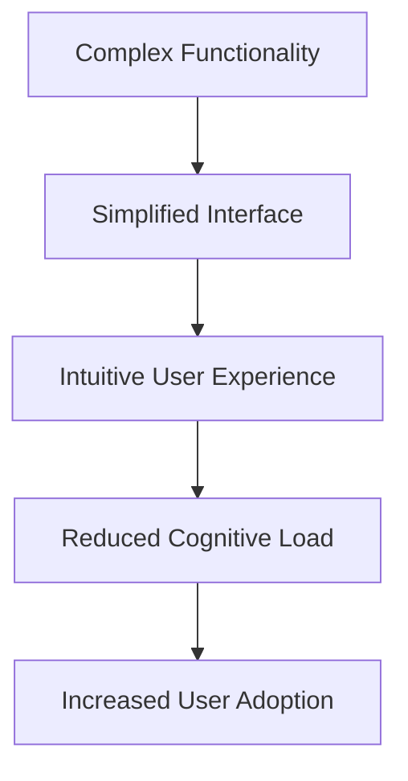

# VARAi Commerce Studio Design Implementation Story

## Overview

This document outlines the design implementation journey for the VARAi Commerce Studio platform, detailing the process from concept to production-ready interface. The design implementation is guided by user-centered principles, brand consistency, and technical feasibility to create an exceptional user experience for eyewear retailers, brands, and their customers.

## The Challenge

VARAi Commerce Studio needed a design that would:

1. **Communicate Sophistication**: Reflect the advanced AI capabilities of the platform
2. **Ensure Usability**: Provide intuitive access to complex features
3. **Maintain Consistency**: Create a unified experience across multiple modules
4. **Support Multiple User Roles**: Adapt to the needs of different user types
5. **Scale Effectively**: Accommodate growing feature sets and user bases

## Design Philosophy

Our design approach is built on three core principles:

### 1. Clarity Through Simplicity



We believe that even the most sophisticated features should be accessible through clear, simple interfaces. By reducing visual noise and focusing on essential elements, we help users understand and leverage the platform's capabilities without overwhelming them.

### 2. Contextual Intelligence

The interface adapts to provide the right tools and information based on:
- User role and permissions
- Current task and workflow stage
- Previous interactions and preferences
- Device and environment

This contextual awareness ensures that users see what they need when they need it, reducing friction and increasing productivity.

### 3. Guided Empowerment


The design guides users from basic to advanced features through:
- Intuitive onboarding flows
- Progressive disclosure of complex features
- Contextual help and suggestions
- Celebration of mastery milestones

This approach empowers users to grow with the platform, discovering new capabilities as they become more comfortable with the basics.

## User Personas and Journeys

### Primary Personas

1. **Sarah - Optical Retail Manager**
   - Oversees multiple store locations
   - Focuses on inventory optimization and staff efficiency
   - Needs quick access to performance metrics and inventory status
   - Values: Efficiency, clarity, actionable insights

2. **Miguel - Product Data Specialist**
   - Manages product catalog and data quality
   - Works with multiple brands and product lines
   - Needs powerful data management tools and quality metrics
   - Values: Accuracy, batch operations, validation tools

3. **Aisha - Marketing Director**
   - Drives customer engagement and sales campaigns
   - Works across digital and physical channels
   - Needs customer insights and campaign performance data
   - Values: Customer understanding, trend visualization, campaign tools

4. **Raj - IT Administrator**
   - Manages platform configuration and integrations
   - Oversees user access and security
   - Needs system health metrics and configuration tools
   - Values: Reliability, security, detailed logs

### Key User Journeys

We mapped detailed user journeys for critical paths through the system:

1. **New Product Onboarding**
   - Importing product data
   - Enhancing with AI capabilities
   - Quality validation
   - Channel distribution

2. **Customer Recommendation Flow**
   - Face shape analysis
   - Style preference capture
   - Personalized recommendations
   - Virtual try-on

3. **Performance Analysis**
   - KPI dashboard review
   - Trend identification
   - Action planning
   - Implementation tracking

4. **System Integration**
   - Connection configuration
   - Data mapping
   - Testing and validation
   - Monitoring setup

## Design System Development

### Component Library

We developed a comprehensive component library that includes:

1. **Core Elements**
   - Typography system with accessibility considerations
   - Color palette with contrast validation
   - Spacing and layout grid
   - Iconography system

2. **UI Components**
   - Navigation elements (global nav, contextual nav, breadcrumbs)
   - Data display (tables, cards, charts, metrics)
   - Forms and inputs (fields, selectors, validation)
   - Feedback mechanisms (alerts, notifications, progress indicators)

3. **Pattern Library**
   - Data filtering and search
   - Multi-step workflows
   - Comparison views
   - Dashboard configuration
   - Bulk operations

### Design Tokens

We implemented a token-based design system that enables:
- Consistent application of design decisions
- Theming and customization
- Accessibility compliance
- Responsive adaptation

```json
{
  "color": {
    "primary": {
      "base": "#0A2463",
      "light": "#3E5C94",
      "dark": "#061539"
    },
    "secondary": {
      "base": "#00A6A6",
      "light": "#33BFBF",
      "dark": "#007A7A"
    },
    "neutral": {
      "white": "#FFFFFF",
      "gray-100": "#F8F9FA",
      "gray-200": "#E9ECEF",
      "gray-300": "#DEE2E6",
      "gray-400": "#CED4DA",
      "gray-500": "#ADB5BD",
      "gray-600": "#6C757D",
      "gray-700": "#495057",
      "gray-800": "#343A40",
      "gray-900": "#212529",
      "black": "#000000"
    },
    "feedback": {
      "success": "#28A745",
      "warning": "#FFC107",
      "error": "#DC3545",
      "info": "#17A2B8"
    }
  },
  "typography": {
    "fontFamily": {
      "primary": "Inter, -apple-system, BlinkMacSystemFont, 'Segoe UI', Roboto, sans-serif",
      "secondary": "SF Pro Display, -apple-system, BlinkMacSystemFont, 'Segoe UI', Roboto, sans-serif",
      "mono": "SF Mono, Menlo, Monaco, Consolas, 'Liberation Mono', monospace"
    },
    "fontSize": {
      "xs": "0.75rem",
      "sm": "0.875rem",
      "base": "1rem",
      "lg": "1.125rem",
      "xl": "1.25rem",
      "2xl": "1.5rem",
      "3xl": "1.875rem",
      "4xl": "2.25rem",
      "5xl": "3rem"
    },
    "fontWeight": {
      "light": 300,
      "regular": 400,
      "medium": 500,
      "semibold": 600,
      "bold": 700
    },
    "lineHeight": {
      "tight": 1.25,
      "normal": 1.5,
      "relaxed": 1.75
    }
  },
  "spacing": {
    "0": "0",
    "1": "0.25rem",
    "2": "0.5rem",
    "3": "0.75rem",
    "4": "1rem",
    "5": "1.25rem",
    "6": "1.5rem",
    "8": "2rem",
    "10": "2.5rem",
    "12": "3rem",
    "16": "4rem",
    "20": "5rem",
    "24": "6rem",
    "32": "8rem"
  },
  "breakpoints": {
    "xs": "320px",
    "sm": "576px",
    "md": "768px",
    "lg": "992px",
    "xl": "1200px",
    "2xl": "1400px"
  }
}
```

## Design-to-Development Workflow

We established a streamlined workflow between design and development:

### 1. Design in Figma

- Component-based design system
- Interactive prototypes
- Design specs and documentation
- Handoff annotations

### 2. Development in Storybook

- Component implementation and testing
- Interaction patterns
- Accessibility validation
- Responsive behavior testing

### 3. Integration and Testing

- Component integration into application
- User flow validation
- Performance testing
- Cross-browser compatibility

### 4. Feedback and Iteration

- User testing sessions
- Analytics review
- Stakeholder feedback
- Continuous improvement

## Key Interface Designs

### 1. Dashboard Experience

The dashboard serves as the primary landing page for users, providing:

- Role-specific KPIs and metrics
- Actionable insights and recommendations
- Quick access to common tasks
- Notification center for system updates

**Design Considerations:**
- Information hierarchy based on user priorities
- Progressive disclosure of complex metrics
- Customization options for personal preferences
- Clear visualization of trends and patterns

### 2. Product Management Interface

The product management interface enables efficient handling of large product catalogs:

- Bulk editing capabilities
- AI enhancement controls
- Quality validation tools
- Multi-channel publishing

**Design Considerations:**
- Efficient handling of large data sets
- Clear feedback on AI processes
- Intuitive validation workflows
- Visual representation of product relationships

### 3. Customer Experience Tools

Tools for managing the customer-facing aspects of the platform:

- Face shape analysis configuration
- Recommendation engine settings
- Virtual try-on experience builder
- A/B testing interface

**Design Considerations:**
- Visual representation of complex algorithms
- Intuitive controls for non-technical users
- Preview capabilities for customer experiences
- Clear performance metrics for optimization

### 4. System Configuration

Interface for technical users to manage the platform:

- Integration management
- User and role administration
- System health monitoring
- Backup and maintenance tools

**Design Considerations:**
- Clear visualization of system relationships
- Fail-safe controls for critical operations
- Comprehensive logging and audit trails
- Efficient troubleshooting workflows

## Responsive Design Strategy

The platform is designed to work across multiple devices and contexts:

### 1. Desktop Experience (Primary)

- Full-featured interface
- Advanced data visualization
- Multi-panel workflows
- Keyboard shortcuts and power user features

### 2. Tablet Experience

- Optimized for in-store staff
- Touch-friendly controls
- Simplified workflows for common tasks
- Customer-facing presentation mode

### 3. Mobile Experience

- Essential monitoring capabilities
- Approval workflows
- Notification management
- Limited data entry

### 4. In-Store Kiosk Mode

- Customer-facing interface
- Guided experiences
- Simplified navigation
- Brand-forward presentation

## Accessibility Approach

We prioritized accessibility throughout the design process:

- **WCAG 2.1 AA Compliance**: All interfaces meet or exceed standards
- **Keyboard Navigation**: Complete functionality without mouse dependency
- **Screen Reader Support**: Semantic markup and ARIA attributes
- **Color Contrast**: All text meets minimum contrast requirements
- **Reduced Motion Options**: Alternatives to animations and transitions
- **Font Scaling**: Interface adapts to user font size preferences

## Localization Considerations

The design accommodates multiple languages and regional preferences:

- Text expansion/contraction in translations
- Right-to-left language support
- Date, time, and number format adaptation
- Cultural considerations in iconography and imagery

## Implementation Timeline

The design implementation follows a phased approach:

### Phase 1: Foundation (Q2 2025)

- Design system development
- Core component library
- Primary user flows
- Design-to-code workflow establishment

### Phase 2: Core Interfaces (Q3 2025)

- Dashboard experience
- Product management interface
- Basic reporting and analytics
- System administration

### Phase 3: Advanced Features (Q4 2025)

- AI configuration interfaces
- Advanced analytics and reporting
- Integration management tools
- Customization capabilities

### Phase 4: Optimization (Q1 2026)

- Performance enhancements
- Advanced accessibility features
- Extended localization
- Design system expansion

## Success Metrics

We measure the success of our design implementation through:

- **Task Completion Rates**: Percentage of users who successfully complete key tasks
- **Time-to-Proficiency**: How quickly new users become productive
- **Support Request Volume**: Reduction in help requests related to interface confusion
- **User Satisfaction Scores**: Direct feedback on interface usability
- **Feature Adoption Rates**: Percentage of users leveraging advanced capabilities
- **Efficiency Metrics**: Time saved on common workflows compared to previous solutions

## Lessons Learned

Throughout the design implementation process, we've gathered valuable insights:

1. **Early User Involvement**: Engaging users from the beginning led to more intuitive interfaces
2. **Design System Investment**: The upfront effort in building a robust design system paid dividends in consistency and development speed
3. **Prototype-Driven Development**: Interactive prototypes significantly improved developer understanding and implementation accuracy
4. **Accessibility as Foundation**: Building accessibility from the start was more efficient than retrofitting
5. **Cross-Functional Collaboration**: Regular sessions between designers, developers, and product managers ensured alignment and reduced rework

## Future Design Direction

As the platform evolves, our design approach will focus on:

1. **AI-Enhanced Interfaces**: Leveraging AI to personalize the user experience based on behavior patterns
2. **Contextual Help Systems**: Intelligent assistance that adapts to user proficiency and current tasks
3. **Cross-Device Continuity**: Seamless transition between devices in multi-context workflows
4. **Visualization Innovations**: New ways to represent complex data relationships and trends
5. **Collaborative Features**: Tools for team-based decision making and workflow management

## Conclusion

The design implementation for VARAi Commerce Studio represents a thoughtful balance between sophisticated functionality and intuitive user experience. By focusing on user needs, maintaining consistency through a robust design system, and establishing efficient design-to-development workflows, we've created an interface that empowers users to leverage the full capabilities of the platform while minimizing complexity and cognitive load.

This design foundation provides a scalable framework that will evolve with the platform, accommodating new features and capabilities while maintaining a cohesive and intuitive user experience.