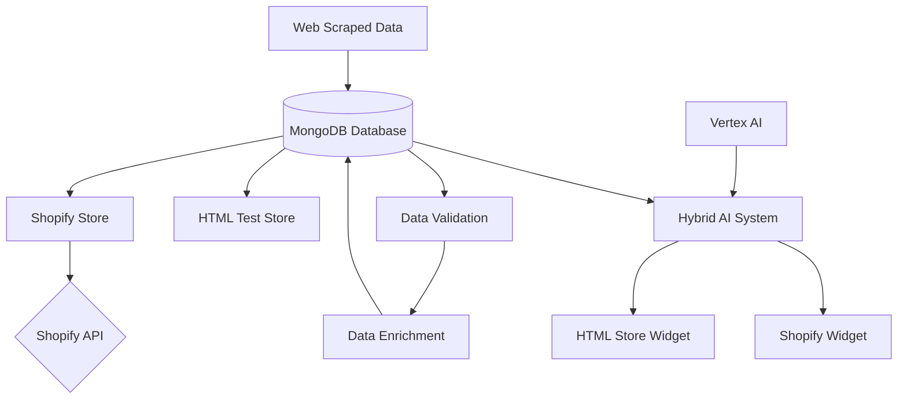

# EyewearML Full MVP Implementation

This documentation outlines the complete implementation plan for the EyewearML Hybrid AI Shopping Platform MVP. The platform leverages MongoDB for product data storage, AI-driven recommendations, and multi-channel store deployment.

## Core Components

1. **Master Eyewear Database** (MongoDB)
   - Central repository for all eyewear product data
   - Source of truth for product information across all channels

2. **Data Validation & Enrichment**
   - Verification of scraped data in MongoDB
   - Enrichment with AI-generated attributes

3. **Multi-Channel Deployment**
   - HTML-based test store generation
   - Shopify store integration

4. **Hybrid AI Shopping Assistant**
   - Vertex AI integration
   - Domain-specific eyewear expertise
   - Multi-channel deployment

## Implementation Flow

## Documentation Structure

The implementation documentation is organized into the following sections:

### Architecture
- [Database Schema](./architecture/database_schema.md) - MongoDB data model
- [System Architecture](./architecture/system_architecture.md) - Overall system design
- [Integration Architecture](./architecture/integration_architecture.md) - Component interactions

### Integrations
- [MongoDB Integration](./integrations/mongodb_integration.md) - Database setup and access
- [HTML Store Integration](./integrations/html_store_integration.md) - Test store implementation
- [Shopify Integration](./integrations/shopify_integration.md) - Shopify store setup

### Prompts
- [Database Validation Agent](./prompts/database_validation_agent.md) - Data verification
- [Store Generation Agent](./prompts/store_generation_agent.md) - Store creation
- [Hybrid Assistant Agent](./prompts/hybrid_assistant_agent.md) - Shopping assistant

## Implementation Phases

The implementation follows these sequential phases:

1. **Data Validation Phase**
   - Connect to MongoDB database
   - Verify scraped data structure and completeness
   - Document data quality metrics

2. **Store Generation Phase**
   - Generate HTML test store from MongoDB data
   - Create Shopify store from MongoDB data
   - Implement basic product browsing

3. **AI Integration Phase**
   - Connect Vertex AI to product data
   - Implement domain expertise layer
   - Deploy conversational shopping experience

4. **Testing & Optimization Phase**
   - End-to-end testing across all channels
   - Performance optimization
   - User experience refinement

## Getting Started

To begin implementing the full MVP:

1. [Set up MongoDB connection](./integrations/mongodb_integration.md#setup)
2. [Validate scraped data](./prompts/database_validation_agent.md#validation-process)
3. [Generate test stores](./integrations/html_store_integration.md#generation)
4. [Configure Hybrid AI Assistant](./prompts/hybrid_assistant_agent.md#configuration)

## Success Metrics

The MVP implementation will be considered successful when:

1. All scraped data is validated and accessible in MongoDB
2. Both HTML and Shopify stores are generated with complete product data
3. The Hybrid AI Shopping Assistant is successfully integrated and providing recommendations
4. End-to-end user journey is functional across both store types
