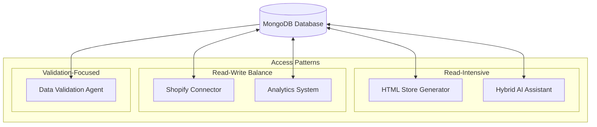
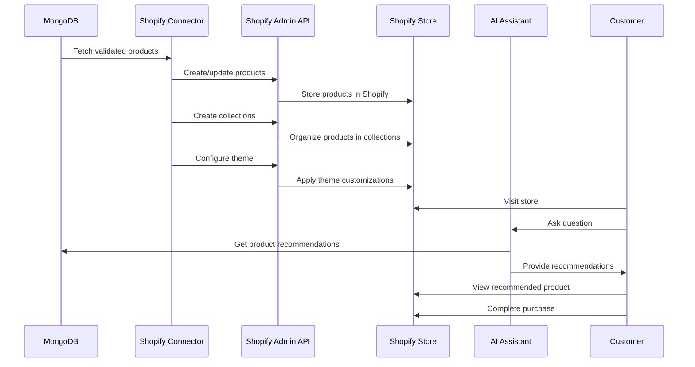
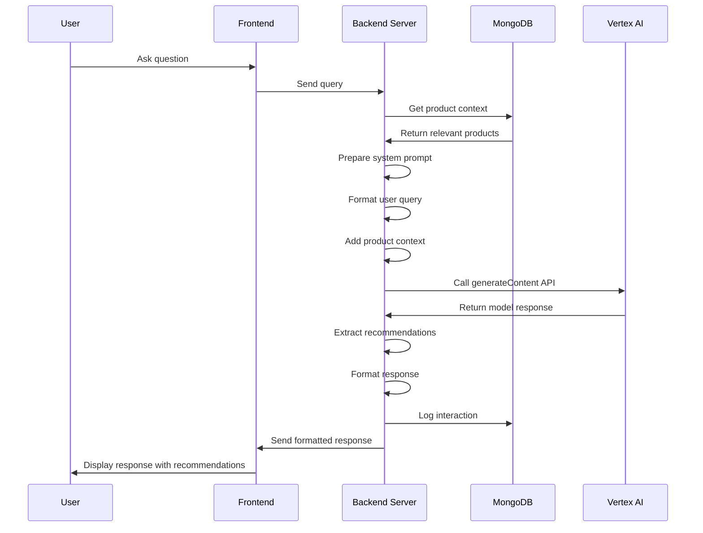
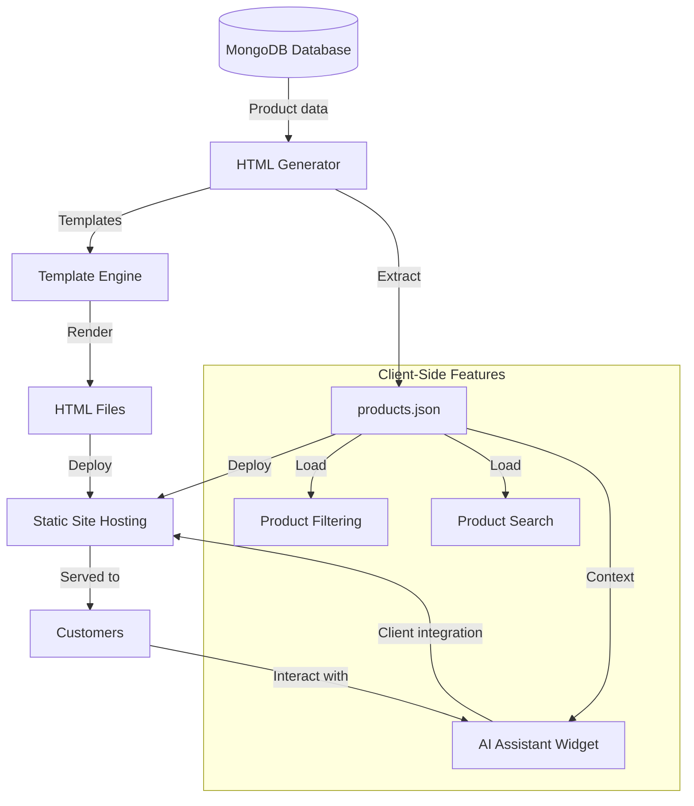

# Integration Architecture for EyewearML Full MVP

This document details the integration architecture for the EyewearML Hybrid AI Shopping Platform MVP, focusing on how the various components interface with each other to create a cohesive system.

## Overview

The EyewearML platform achieves its functionality through a series of well-defined integrations between components. These integrations enable data flow, functionality sharing, and a consistent user experience across multiple channels.


## Core Integration Points

### 1. MongoDB Data Integration

The MongoDB database serves as the central integration hub for the entire system, connecting to virtually all other components.

#### Key Integration Interfaces

| Interface | Connected Components | Purpose |
|-----------|---------------------|---------|
| MongoDB Driver API | Data Validation Agent | Validate and verify data quality |
| MongoDB Driver API | HTML Store Generator | Extract product data for HTML store |
| MongoDB Driver API | Shopify Connector | Extract product data for Shopify store |
| MongoDB Driver API | Hybrid AI Assistant | Access product data for recommendations |
| MongoDB Driver API | Analytics System | Store and retrieve usage data |

#### Data Access Patterns



#### Integration Implementation

MongoDB integration is implemented through:

1. **Connection Management**:
   ```javascript
   // Node.js example
   const { MongoClient } = require('mongodb');
   
   const uri = process.env.MONGODB_URI;
   const client = new MongoClient(uri);
   
   async function connectToDatabase() {
     try {
       await client.connect();
       console.log("Connected to MongoDB");
       return client.db("eyewear_database");
     } catch (error) {
       console.error("Failed to connect to MongoDB", error);
       throw error;
     }
   }
   ```

2. **Data Access Abstraction**:
   ```javascript
   // Product repository example
   class ProductRepository {
     constructor(db) {
       this.collection = db.collection('products');
     }
     
     async findById(id) {
       return this.collection.findOne({ id });
     }
     
     async findByFaceShape(faceShape, options = {}) {
       const { limit = 10, sort = { "reviews.average_rating": -1 } } = options;
       
       return this.collection
         .find({ ${INTEGRATION_ARCHITECTURE_SECRET_1}: faceShape })
         .sort(sort)
         .limit(limit)
         .toArray();
     }
     
     async updateValidationStatus(id, status, metrics) {
       return this.collection.updateOne(
         { id },
         { 
           $set: { 
             "metadata.validation_status": status,
             "metadata.data_completeness_score": metrics.completeness,
             "metadata.validation_issues": metrics.issues
           }
         }
       );
     }
   }
   ```

3. **Data Synchronization**:
   ```javascript
   // Shopify synchronization example
   async function synchronizeProducts(db, shopifyClient) {
     const products = await db.collection('products')
       .find({ "metadata.validation_status": "validated" })
       .toArray();
       
     for (const product of products) {
       // Check if product exists in Shopify
       const shopifyProductId = product.shopify?.product_id;
       
       if (shopifyProductId) {
         // Update existing product
         await updateShopifyProduct(shopifyClient, shopifyProductId, product);
       } else {
         // Create new product
         const newShopifyProduct = await createShopifyProduct(shopifyClient, product);
         
         // Store Shopify ID back in MongoDB
         await db.collection('products').updateOne(
           { id: product.id },
           { 
             $set: { 
               "shopify.product_id": newShopifyProduct.id,
               "shopify.handle": newShopifyProduct.handle
             }
           }
         );
       }
     }
   }
   ```

### 2. Shopify Platform Integration

The Shopify integration connects the EyewearML system to the Shopify e-commerce platform.

#### Key Integration Interfaces

| Interface | Purpose | Implementation |
|-----------|---------|----------------|
| Shopify Admin API | Product and collection management | REST and GraphQL |
| Shopify Storefront API | Frontend access to product data | GraphQL |
| Shopify App Bridge | Embedded app functionality | JavaScript SDK |
| Shopify Theme App Extensions | Frontend customizations | Liquid, JSON templates |

#### Shopify Integration Flow



#### Integration Implementation

Shopify integration is implemented through:

1. **Admin API for Product Management**:
   ```javascript
   // Create a product in Shopify
   async function createShopifyProduct(shopify, product) {
     try {
       const shopifyProduct = await shopify.product.create({
         title: product.name,
         body_html: product.description,
         vendor: product.brand,
         product_type: product.specifications.frame_type,
         tags: product.tags.join(','),
         variants: [
           {
             price: product.price.toString(),
             sku: product.model,
             inventory_quantity: 10,
             inventory_management: "shopify"
           }
         ],
         metafields: [
           {
             namespace: "eyewear",
             key: "${INTEGRATION_ARCHITECTURE_SECRET}",
             value: product.specifications.${INTEGRATION_ARCHITECTURE_SECRET},
             type: "single_line_text_field"
           },
           {
             namespace: "eyewear",
             key: "${INTEGRATION_ARCHITECTURE_SECRET_1}",
             value: JSON.stringify(product.${INTEGRATION_ARCHITECTURE_SECRET_1}),
             type: "json"
           }
         ]
       });
       
       // Upload images
       if (product.images.main_image) {
         await shopify.productImage.create({
           product_id: shopifyProduct.id,
           src: `https://eyewearml-images.storage.googleapis.com/${product.images.main_image}`
         });
       }
       
       return shopifyProduct;
     } catch (error) {
       console.error(`Error creating Shopify product ${product.id}:`, error);
       throw error;
     }
   }
   ```

2. **Shopify App for AI Assistant Integration**:
   ```javascript
   // Shopify app endpoint for AI assistant
   app.post('/api/assistant', async (req, res) => {
     try {
       const { query, shop } = req.body;
       
       // Connect to MongoDB
       const db = await connectToDatabase();
       
       // Get relevant products
       const productRepo = new ProductRepository(db);
       const relevantProducts = await productRepo.searchByQuery(query);
       
       // Call Vertex AI with context
       const assistantResponse = await callVertexAI(
         query, 
         {
           products: relevantProducts,
           storeType: 'shopify',
           shop
         }
       );
       
       // Log interaction
       await logAssistantInteraction(db, {
         shop,
         query,
         response: assistantResponse,
         relevantProducts: relevantProducts.map(p => p.id)
       });
       
       res.json({ response: assistantResponse });
     } catch (error) {
       console.error('AI Assistant error:', error);
       res.status(500).json({ error: 'An error occurred with the AI assistant' });
     }
   });
   ```

3. **Theme App Extension for Frontend Integration**:
   ```javascript
   // theme-extension/blocks/app-block.liquid
   <div id="eyewear-assistant" 
     data-shop-domain="{{ shop.permanent_domain }}"
     data-api-url="{{ app.metafields.eyewear.api_url }}">
   </div>
   
   <script src="{{ 'eyewear-assistant.js' | asset_url }}" defer></script>
   
   
   {
     "name": "Eyewear AI Assistant",
     "target": "body",
     "settings": [
       {
         "type": "color",
         "id": "button_color",
         "label": "Chat Button Color",
         "default": "#5c6ac4"
       },
       {
         "type": "select",
         "id": "position",
         "label": "Button Position",
         "options": [
           { "value": "bottom-right", "label": "Bottom Right" },
           { "value": "bottom-left", "label": "Bottom Left" }
         ],
         "default": "bottom-right"
       }
     ]
   }
   
   ```

### 3. Vertex AI Integration

The Vertex AI integration connects the EyewearML system to Google's Vertex AI platform for machine learning capabilities.

#### Key Integration Interfaces

| Interface | Purpose | Implementation |
|-----------|---------|----------------|
| Vertex AI API | Access to AI models | REST API |
| Google Cloud Authentication | Secure access to Vertex AI | Service Account |
| Hybrid Assistant | Conversation and recommendation | Custom middleware |

#### Vertex AI Integration Flow



#### Integration Implementation

Vertex AI integration is implemented through:

1. **Vertex AI Client Setup**:
   ```javascript
   // Node.js Vertex AI client setup
   const { VertexAI } = require('@google-cloud/vertexai');
   
   // Initialize Vertex with your Google Cloud project and location
   const vertex = new VertexAI({
     project: process.env.GOOGLE_CLOUD_PROJECT,
     location: process.env.VERTEX_AI_LOCATION,
   });
   
   // Get the model
   const model = vertex.preview.getGenerativeModel({
     model: "gemini-pro",
     generationConfig: {
       temperature: 0.2,
       topP: 0.8,
       topK: 40,
     },
   });
   ```

2. **AI Assistant Integration**:
   ```javascript
   // Function to call Vertex AI for shopping assistance
   async function callVertexAI(query, context) {
     try {
       // Load the system prompt template
       const systemPrompt = await loadPromptTemplate('hybrid_assistant');
       
       // Format the product context
       const productContext = formatProductContext(context.products);
       
       // Prepare the complete prompt
       const completeSystemPrompt = systemPrompt
         .replace('{{STORE_TYPE}}', context.storeType)
         .replace('{{PRODUCT_CONTEXT}}', productContext);
       
       // Call Vertex AI
       const result = await model.generateContent({
         contents: [
           { role: 'system', parts: [{ text: completeSystemPrompt }] },
           { role: 'user', parts: [{ text: query }] }
         ],
       });
       
       // Extract and return the response
       return result.response.text();
     } catch (error) {
       console.error('Vertex AI call failed:', error);
       return "I'm sorry, I encountered an error while processing your request. Please try again.";
     }
   }
   
   // Format product context for the AI
   function formatProductContext(products) {
     if (!products || products.length === 0) {
       return "No specific products are available for this query.";
     }
     
     return products.map(product => `
       Product ID: ${product.id}
       Name: ${product.name}
       Brand: ${product.brand}
       Price: ${product.price} ${product.currency}
       Frame Type: ${product.specifications.frame_type}
       Frame Shape: ${product.specifications.${INTEGRATION_ARCHITECTURE_SECRET}}
       Frame Material: ${product.specifications.frame_material}
       Frame Color: ${product.specifications.frame_color}
       Recommended Face Shapes: ${product.${INTEGRATION_ARCHITECTURE_SECRET_1}.join(', ')}
       Description: ${product.short_description || product.description.substring(0, 100) + '...'}
     `).join('\n\n');
   }
   ```

3. **Response Processing**:
   ```javascript
   // Process AI response to extract recommendations
   function processAIResponse(aiResponse, availableProducts) {
     // Extract product IDs mentioned in the response
     const productMatches = [];
     
     for (const product of availableProducts) {
       // Check if product name or ID is mentioned in the response
       if (
         aiResponse.includes(product.name) || 
         aiResponse.includes(product.id)
       ) {
         productMatches.push({
           product_id: product.id,
           product_name: product.name,
           match_confidence: 0.9, // Simple matching for MVP
         });
       }
     }
     
     return {
       text_response: aiResponse,
       recommended_products: productMatches
     };
   }
   ```

### 4. HTML Store Integration

The HTML Store integration connects the EyewearML database to a static HTML store for testing and demonstration.

#### Key Integration Interfaces

| Interface | Purpose | Implementation |
|-----------|---------|----------------|
| HTML Generator | Create static HTML files | Template engine |
| Client-side JavaScript | Implement filtering and search | ES6 modules |
| AI Assistant Widget | Integrate AI shopping assistant | Web components |

#### HTML Store Integration Flow



#### Integration Implementation

HTML Store integration is implemented through:

1. **HTML Generation Script**:
   ```javascript
   // Generate HTML files from MongoDB data
   async function generateHTMLStore(db, outputDir) {
     // Create output directories
     fs.mkdirSync(`${outputDir}/products`, { recursive: true });
     fs.mkdirSync(`${outputDir}/categories`, { recursive: true });
     
     // Load templates
     const productTemplate = fs.readFileSync('./templates/product.html', 'utf-8');
     const categoryTemplate = fs.readFileSync('./templates/category.html', 'utf-8');
     const indexTemplate = fs.readFileSync('./templates/index.html', 'utf-8');
     
     // Get all validated products
     const products = await db.collection('products')
       .find({ "metadata.validation_status": "validated" })
       .toArray();
     
     // Generate product pages
     for (const product of products) {
       const productHTML = generateProductHTML(product, productTemplate);
       fs.writeFileSync(`${outputDir}/products/${product.id}.html`, productHTML);
     }
     
     // Get all categories
     const categories = await db.collection('categories')
       .find({ is_active: true })
       .toArray();
     
     // Generate category pages
     for (const category of categories) {
       const categoryProducts = products.filter(p => 
         p.categories.includes(category.name)
       );
       
       const categoryHTML = generateCategoryHTML(
         category, 
         categoryProducts, 
         categoryTemplate
       );
       
       fs.writeFileSync(`${outputDir}/categories/${category.slug}.html`, categoryHTML);
     }
     
     // Generate index page
     const featuredProducts = products
       .filter(p => p.html_store?.featured)
       .sort((a, b) => a.html_store.display_order - b.html_store.display_order);
     
     const indexHTML = generateIndexHTML(featuredProducts, categories, indexTemplate);
     fs.writeFileSync(`${outputDir}/index.html`, indexHTML);
     
     // Generate products.json for client-side features
     const productsJSON = products.map(p => ({
       id: p.id,
       name: p.name,
       brand: p.brand,
       price: p.price,
       currency: p.currency,
       frame_type: p.specifications.frame_type,
       ${INTEGRATION_ARCHITECTURE_SECRET}: p.specifications.${INTEGRATION_ARCHITECTURE_SECRET},
       frame_material: p.specifications.frame_material,
       frame_color: p.specifications.frame_color,
       categories: p.categories,
       tags: p.tags,
       ${INTEGRATION_ARCHITECTURE_SECRET_1}: p.${INTEGRATION_ARCHITECTURE_SECRET_1},
       gender: p.gender,
       main_image: p.images.main_image,
       url: `/products/${p.id}.html`
     }));
     
     fs.writeFileSync(`${outputDir}/data/products.json`, JSON.stringify(productsJSON));
     
     // Copy static assets
     copyStaticAssets(outputDir);
   }
   ```

2. **AI Assistant Widget Integration**:
   ```html
   <!-- HTML store AI widget integration -->
   <div id="ai-assistant-widget" class="assistant-widget">
     <button id="assistant-toggle" class="assistant-toggle">
       <span class="assistant-icon">💬</span>
       <span class="assistant-label">Shopping Assistant</span>
     </button>
     
     <div id="assistant-container" class="assistant-container hidden">
       <div class="assistant-header">
         <h3>Eyewear Shopping Assistant</h3>
         <button id="assistant-close" class="assistant-close">×</button>
       </div>
       
       <div id="assistant-messages" class="assistant-messages">
         <div class="assistant-message">
           Hi! I'm your eyewear shopping assistant. How can I help you find the perfect frames today?
         </div>
       </div>
       
       <div class="assistant-input">
         <input type="text" id="assistant-input-field" placeholder="Ask me about eyewear...">
         <button id="assistant-send">Send</button>
       </div>
     </div>
   </div>
   
   <script src="/js/ai-assistant.js"></script>
   ```

3. **Client-side JavaScript for AI Widget**:
   ```javascript
   // JavaScript for HTML store AI integration
   document.addEventListener('DOMContentLoaded', function() {
     // Elements
     const toggleButton = document.getElementById('assistant-toggle');
     const closeButton = document.getElementById('assistant-close');
     const container = document.getElementById('assistant-container');
     const messagesContainer = document.getElementById('assistant-messages');
     const inputField = document.getElementById('assistant-input-field');
     const sendButton = document.getElementById('assistant-send');
     
     // Products data
     let productsData = [];
     
     // Load products data
     fetch('/data/products.json')
       .then(response => response.json())
       .then(data => {
         productsData = data;
       })
       .catch(error => console.error('Error loading products:', error));
     
     // Toggle chat window
     toggleButton.addEventListener('click', function() {
       container.classList.toggle('hidden');
     });
     
     // Close chat window
     closeButton.addEventListener('click', function() {
       container.classList.add('hidden');
     });
     
     // Send message
     function sendMessage() {
       const userInput = inputField.value.trim();
       if (!userInput) return;
       
       // Add user message to chat
       addMessage('user', userInput);
       
       // Clear input field
       inputField.value = '';
       
       // Show typing indicator
       addTypingIndicator();
       
       // Call backend API
       fetch('/api/assistant', {
         method: 'POST',
         headers: {
           'Content-Type': 'application/json'
         },
         body: JSON.stringify({
           query: userInput,
           storeType: 'html'
         })
       })
       .then(response => response.json())
       .then(data => {
         // Remove typing indicator
         removeTypingIndicator();
         
         // Add assistant response
         addMessage('assistant', data.response);
         
         // Enhance response with product links
         enhanceResponseWithProductLinks(data.response);
       })
       .catch(error => {
         console.error('Error calling assistant API:', error);
         removeTypingIndicator();
         addMessage('assistant', "I'm sorry, I encountered an error. Please try again.");
       });
     }
     
     // Send on button click
     sendButton.addEventListener('click', sendMessage);
     
     // Send on Enter key
     inputField.addEventListener('keydown', function(event) {
       if (event.key === 'Enter') {
         sendMessage();
       }
     });
     
     // Add message to chat
     function addMessage(role, content) {
       const messageElement = document.createElement('div');
       messageElement.className = `${role}-message`;
       messageElement.textContent = content;
       messagesContainer.appendChild(messageElement);
       
       // Scroll to bottom
       messagesContainer.scrollTop = messagesContainer.scrollHeight;
     }
     
     // Add typing indicator
     function addTypingIndicator() {
       const indicator = document.createElement('div');
       indicator.className = 'typing-indicator';
       indicator.id = 'typing-indicator';
       indicator.innerHTML = '<span></span><span></span><span></span>';
       messagesContainer.appendChild(indicator);
       messagesContainer.scrollTop = messagesContainer.scrollHeight;
     }
     
     // Remove typing indicator
     function removeTypingIndicator() {
       const indicator = document.getElementById('typing-indicator');
       if (indicator) {
         indicator.remove();
       }
     }
     
     // Enhance response with product links
     function enhanceResponseWithProductLinks(response) {
       // Simple implementation for MVP
       // In a full implementation, this would use more sophisticated
       // techniques to identify product mentions
       
       for (const product of productsData) {
         if (response.includes(product.name) || response.includes(product.id)) {
           const productLink = document.createElement('a');
           productLink.href = product.url;
           productLink.className = 'product-recommendation';
           productLink.innerHTML = `
             
             <div class="product-details">
               <h4>${product.name}</h4>
               <p class="brand">${product.brand}</p>
               <p class="price">${product.price} ${product.currency}</p>
             </div>
           `;
           
           messagesContainer.appendChild(productLink);
           messagesContainer.scrollTop = messagesContainer.scrollHeight;
         }
       }
     }
   });
   ```

## Implementation Patterns

### Repository Pattern

The repository pattern is used to abstract data access across the system:

```javascript
// Base repository
class BaseRepository {
  constructor(db, collectionName) {
    this.collection = db.collection(collectionName);
  }
  
  async findOne(query) {
    return this.collection.findOne(query);
  }
  
  async find(query, options = {}) {
    return this.collection.find(query, options).toArray();
  }
  
  async create(document) {
    const result = await this.collection.insertOne(document);
    return { ...document, _id: result.insertedId };
  }
  
  async update(id, update) {
    return this.collection.updateOne(
      { _id: id },
      { $set: update }
    );
  }
  
  async delete(id) {
    return this.collection.deleteOne({ _id: id });
  }
}

// Product-specific repository
class ProductRepository extends BaseRepository {
  constructor(db) {
    super(db, 'products');
  }
  
  async findByFaceShape(faceShape, limit = 10) {
    return this.find(
      { ${INTEGRATION_ARCHITECTURE_SECRET_1}: faceShape },
      { limit, sort: { "reviews.average_rating": -1 } }
    );
  }
  
  async findByFrameType(frameType, limit = 10) {
    return this.find(
      { "specifications.frame_type": frameType },
      { limit, sort: { "reviews.average_rating": -1 } }
    );
  }
  
  async searchByKeywords(keywords, limit = 10) {
    const keywordRegexes = keywords.map(keyword => 
      new RegExp(keyword, 'i')
    );
    
    return this.find({
      $or: [
        { name: { $in: keywordRegexes } },
        { description: { $in: keywordRegexes } },
        { "specifications.frame_material": { $in: keywordRegexes } },
        { "specifications.frame_color": { $in: keywordRegexes } },
        { tags: { $in: keywordRegexes } }
      ]
    }, { limit });
  }
}
```

### Service Pattern

The service pattern is used to encapsulate business logic:

```javascript
// AI Assistant Service
class AssistantService {
  constructor(db, vertexAI) {
    this.productRepository = new ProductRepository(db);
    this.assistantLogRepository = new BaseRepository(db, 'aiAssistantLogs');
    this.vertexAI = vertexAI;
  }
  
  async processQuery(query, storeType, sessionId = null) {
    try {
      // Extract keywords for product search
      const keywords = this.extractKeywords(query);
      
      // Get relevant products
      const relevantProducts = await this.productRepository.searchByKeywords(keywords);
      
      // Prepare context for AI
      const context = {
        storeType,
        products: relevantProducts,
        sessionId
      };
      
      // Get AI response
      const aiResponse = await this.callVertexAI(query, context);
      
      // Process response to extract recommendations
      const processedResponse = this.processAIResponse(
        aiResponse, 
        relevantProducts
      );
      
      // Log interaction
      await this.logInteraction(query, processedResponse, context);
      
      return processedResponse;
    } catch (error) {
      console.error('Error processing assistant query:', error);
      throw error;
    }
  }
  
  // Helper methods
  extractKeywords(query) { /* implementation */ }
  async callVertexAI(query, context) { /* implementation */ }
  processAIResponse(response, products) { /* implementation */ }
  async logInteraction(query, response, context) { /* implementation */ }
}
```

### Observer Pattern

The observer pattern is used for event handling across the system:

```javascript
// Event system for cross-component communication
class EventBus {
  constructor() {
    this.subscribers = {};
  }
  
  subscribe(event, callback) {
    if (!this.subscribers[event]) {
      this.subscribers[event] = [];
    }
    
    this.subscribers[event].push(callback);
    
    // Return unsubscribe function
    return () => {
      this.subscribers[event] = this.subscribers[event].filter(
        cb => cb !== callback
      );
    };
  }
  
  publish(event, data) {
    if (!this.subscribers[event]) {
      return;
    }
    
    this.subscribers[event].forEach(callback => {
      try {
        callback(data);
      } catch (error) {
        console.error(`Error in event subscriber for ${event}:`, error);
      }
    });
  }
}

// Usage example
const eventBus = new EventBus();

// Subscribe to product view events
eventBus.subscribe('product_viewed', async (data) => {
  // Log product view
  await logProductView(data.productId, data.sessionId);
  
  // Update recommendation model
  updateRecommendationData(data.productId, data.sessionId);
});

// Publish event when product is viewed
function viewProduct(productId, sessionId) {
  // Display product
  showProductDetails(productId);
  
  // Publish event
  eventBus.publish('product_viewed', { productId, sessionId });
}
```

## Authentication and Security

### API Authentication

```javascript
// API authentication middleware
function authenticateAPI(req, res, next) {
  const apiKey = req.headers['x-api-key'];
  
  if (!apiKey) {
    return res.status(401).json({ error: 'API key is required' });
  }
  
  // Verify API key
  verifyAPIKey(apiKey)
    .then(valid => {
      if (valid) {
        next();
      } else {
        res.status(403).json({ error: 'Invalid API key' });
      }
    })
    .catch(error => {
      console.error('API key verification error:', error);
      res.status(500).json({ error: 'Authentication error' });
    });
}

// API routes
app.use('/api', authenticateAPI);
app.use('/api/assistant', assistantRoutes);
app.use('/api/products', productRoutes);
```

### Shopify Authentication

```javascript
// Shopify authentication
app.use('/shopify', shopify.auth.begin());
app.use('/shopify/callback', shopify.auth.callback(), shopify.redirectToShopifyOrAppRoot());

// Shopify authenticated routes
app.use('/shopify/api', shopify.validateAuthenticatedSession(), shopifyAPIRoutes);
```

## Error Handling

Error handling is implemented consistently across all integration points:

### Centralized Error Handling

```javascript
// Centralized error handler
class ErrorHandler {
  constructor(logger) {
    this.logger = logger;
  }
  
  // Handle API errors
  handleAPIError(error, req, res) {
    const errorId = uuidv4();
    
    this.logger.error({
      id: errorId,
      path: req.path,
      method: req.method,
      query: req.query,
      body: req.body,
      error: error.message,
      stack: error.stack,
      user: req.user?.id
    });
    
    // Determine appropriate status code
    let statusCode = 500;
    if (error.name === 'ValidationError') statusCode = 400;
    if (error.name === 'AuthenticationError') statusCode = 401;
    if (error.name === 'AuthorizationError') statusCode = 403;
    if (error.name === 'NotFoundError') statusCode = 404;
    
    // Send appropriate error response
    res.status(statusCode).json({
      error: {
        message: error.message,
        id: errorId,
        code: error.code || 'unknown_error'
      }
    });
  }
  
  // Handle database errors
  async handleDBError(error, operation) {
    this.logger.error({
      component: 'database',
      operation,
      error: error.message,
      stack: error.stack
    });
    
    // Specific handling for common MongoDB errors
    if (error.code === 11000) { // Duplicate key error
      throw new ValidationError('A record with this identifier already exists');
    }
    
    // Re-throw with more context
    throw new DatabaseError(`Database operation '${operation}' failed: ${error.message}`);
  }
  
  // Handle integration errors
  async handleIntegrationError(error, integration, operation) {
    this.logger.error({
      component: integration,
      operation,
      error: error.message,
      stack: error.stack
    });
    
    // Track integration health
    await this.trackIntegrationHealth(integration, false, error.message);
    
    // Re-throw with more context
    throw new IntegrationError(`${integration} operation '${operation}' failed: ${error.message}`);
  }
  
  // Track integration health
  async trackIntegrationHealth(integration, isHealthy, message = null) {
    // Implementation to track integration health status
    // This could update a status dashboard, send alerts, etc.
  }
}
```

### API Error Middleware

```javascript
// Express error handling middleware
app.use((err, req, res, next) => {
  errorHandler.handleAPIError(err, req, res);
});
```

### Retry Logic

```javascript
// Retry logic for external API calls
async function withRetry(operation, maxRetries = 3, delay = 1000) {
  let lastError;
  
  for (let attempt = 1; attempt <= maxRetries; attempt++) {
    try {
      return await operation();
    } catch (error) {
      lastError = error;
      
      // Don't retry if the error is client-side
      if (error.status >= 400 && error.status < 500) {
        throw error;
      }
      
      console.warn(`Attempt ${attempt} failed, retrying in ${delay}ms...`);
      await new Promise(resolve => setTimeout(resolve, delay));
      
      // Exponential backoff
      delay *= 2;
    }
  }
  
  throw lastError;
}

// Usage
async function callVertexAIWithRetry(query, context) {
  return withRetry(() => callVertexAI(query, context));
}
```

## Integration Testing

The integration points are tested using the following strategies:

### MongoDB Integration Tests

```javascript
describe('MongoDB Integration', () => {
  let db, client;
  
  beforeAll(async () => {
    // Connect to test database
    client = new MongoClient(process.env.TEST_MONGODB_URI);
    await client.connect();
    db = client.db('test_eyewear_database');
    
    // Seed test data
    await seedTestData(db);
  });
  
  afterAll(async () => {
    await client.close();
  });
  
  test('should retrieve products by face shape', async () => {
    const repo = new ProductRepository(db);
    const products = await repo.findByFaceShape('oval');
    
    expect(products).toHaveLength(3);
    expect(products[0].${INTEGRATION_ARCHITECTURE_SECRET_1}).toContain('oval');
  });
  
  test('should update validation status', async () => {
    const repo = new ProductRepository(db);
    const productId = 'test-product-1';
    
    await repo.updateValidationStatus(productId, 'validated', {
      completeness: 0.95,
      issues: []
    });
    
    const product = await repo.findById(productId);
    expect(product.metadata.validation_status).toBe('validated');
    expect(product.metadata.data_completeness_score).toBe(0.95);
  });
});
```

### Shopify Integration Tests

```javascript
describe('Shopify Integration', () => {
  let shopifyMock;
  
  beforeEach(() => {
    // Mock Shopify API
    shopifyMock = {
      product: {
        create: jest.fn().mockResolvedValue({
          id: 'shopify-product-id',
          handle: 'test-product'
        }),
        update: jest.fn().mockResolvedValue({})
      },
      productImage: {
        create: jest.fn().mockResolvedValue({})
      }
    };
  });
  
  test('should create Shopify product', async () => {
    const product = {
      id: 'test-product-1',
      name: 'Test Product',
      brand: 'Test Brand',
      price: 149.99,
      description: 'Test description',
      specifications: {
        frame_type: 'full-rim',
        ${INTEGRATION_ARCHITECTURE_SECRET}: 'rectangle',
        frame_material: 'acetate',
        frame_color: 'black'
      },
      images: {
        main_image: 'test-image.jpg'
      },
      tags: ['test', 'product'],
      ${INTEGRATION_ARCHITECTURE_SECRET_1}: ['oval', 'round']
    };
    
    const result = await createShopifyProduct(shopifyMock, product);
    
    expect(shopifyMock.product.create).toHaveBeenCalled();
    expect(shopifyMock.productImage.create).toHaveBeenCalled();
    expect(result.id).toBe('shopify-product-id');
  });
});
```

### Vertex AI Integration Tests

```javascript
describe('Vertex AI Integration', () => {
  let vertexAIMock;
  
  beforeEach(() => {
    // Mock Vertex AI client
    vertexAIMock = {
      generateContent: jest.fn().mockResolvedValue({
        response: {
          text: () => "I recommend the Model XYZ sunglasses for oval faces."
        }
      })
    };
  });
  
  test('should call Vertex AI with correct context', async () => {
    const query = "What sunglasses do you recommend for oval faces?";
    const context = {
      storeType: 'html',
      products: [
        {
          id: 'test-product-1',
          name: 'Model XYZ Sunglasses',
          // other product details
        }
      ]
    };
    
    const response = await callVertexAI(query, context, vertexAIMock);
    
    expect(vertexAIMock.generateContent).toHaveBeenCalled();
    expect(response).toContain('Model XYZ sunglasses');
  });
  
  test('should handle Vertex AI errors gracefully', async () => {
    vertexAIMock.generateContent.mockRejectedValue(new Error('API error'));
    
    const query = "What sunglasses do you recommend?";
    const context = { storeType: 'html', products: [] };
    
    const response = await callVertexAI(query, context, vertexAIMock);
    
    expect(response).toContain("I'm sorry");
  });
});
```

## Cross-Cutting Concerns

### Monitoring and Logging

Integration monitoring is implemented using:

```javascript
// Winston logger configuration
const logger = winston.createLogger({
  level: process.env.LOG_LEVEL || 'info',
  format: winston.format.combine(
    winston.format.timestamp(),
    winston.format.json()
  ),
  defaultMeta: { service: 'eyewear-platform' },
  transports: [
    new winston.transports.Console(),
    new winston.transports.File({ filename: 'error.log', level: 'error' }),
    new winston.transports.File({ filename: 'combined.log' })
  ]
});

// Integration-specific logging
function logIntegrationEvent(integration, event, data) {
  logger.info({
    integration,
    event,
    data,
    timestamp: new Date().toISOString()
  });
}

// Usage examples
logIntegrationEvent('mongodb', 'connection_established', { host: 'mongodb.example.com' });
logIntegrationEvent('shopify', 'product_created', { id: 'product-123', shop: 'store.myshopify.com' });
logIntegrationEvent('vertex_ai', 'api_call', { model: 'gemini-pro', tokens: 350 });
```

### Performance Tracking

Integration performance is tracked using:

```javascript
// Performance monitoring
function trackPerformance(operation, startTime) {
  const duration = Date.now() - startTime;
  
  logger.info({
    type: 'performance',
    operation,
    duration_ms: duration,
    timestamp: new Date().toISOString()
  });
  
  // Send to monitoring system
  metrics.recordOperationDuration(operation, duration);
}

// Usage with async/await
async function measuredOperation(operationName, operation) {
  const startTime = Date.now();
  try {
    return await operation();
  } finally {
    trackPerformance(operationName, startTime);
  }
}

// Example usage
async function getProductRecommendations(query) {
  return measuredOperation('get_product_recommendations', async () => {
    // Implementation
  });
}
```

## Conclusion

The integration architecture of the EyewearML platform connects multiple components through well-defined interfaces and data flows. By following established patterns like repositories and services, the system maintains modularity while enabling complex functionality across different stores and the AI shopping assistant.

Key principles of this integration architecture include:

1. **Centralized Data**: MongoDB serves as the central integration hub
2. **Well-Defined Interfaces**: Components interact through clear APIs
3. **Error Handling**: Consistent error handling across all integrations
4. **Observability**: Comprehensive logging and monitoring
5. **Testability**: Integration testing for all components
6. **Performance**: Measurement and optimization of integration points

The architecture supports the full MVP implementation flow, from data validation through store generation to AI-powered shopping assistance, creating a cohesive system that can be extended and enhanced in the future.
