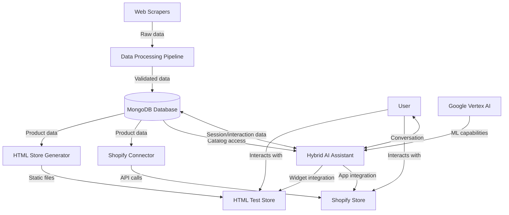
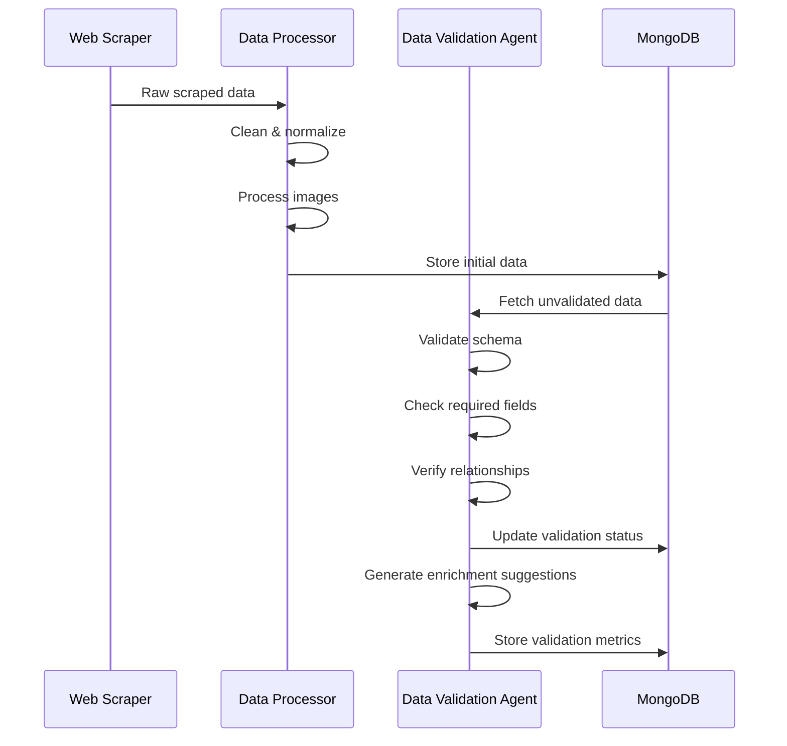
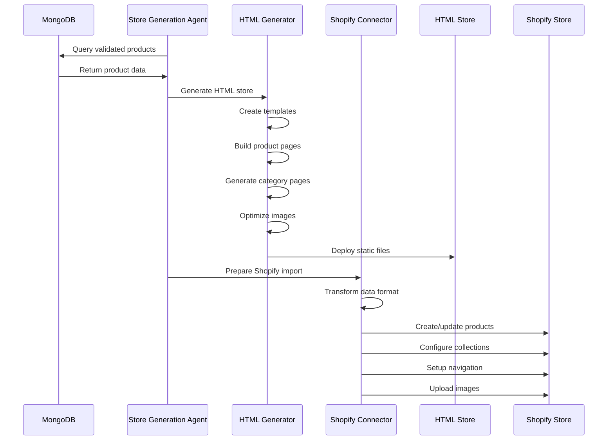
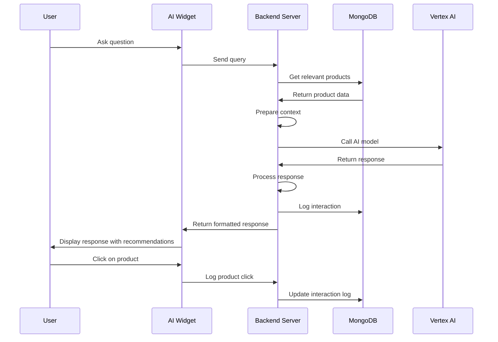

# System Architecture for EyewearML Full MVP

This document outlines the system architecture for the EyewearML Hybrid AI Shopping Platform MVP. It describes how the various components interact to provide a cohesive eyewear shopping experience powered by AI.

## Architecture Overview

The EyewearML architecture follows a modular design that integrates data storage, multi-channel store generation, and AI-powered shopping assistance.

### High-Level Architecture

### Architecture Components

The system consists of these core components:

#### 1. Data Management Layer

- **MongoDB Database**: Central data repository storing product information, session data, and AI interaction logs
- **Data Processing Pipeline**: Validates and enriches scraped data before storage
- **Data Validation Agent**: Ensures data quality and completeness

#### 2. Store Generation Layer

- **HTML Store Generator**: Creates a static HTML test store from MongoDB data
- **Shopify Connector**: Synchronizes product data to a Shopify store
- **Store Generation Agent**: Coordinates the store creation process

#### 3. AI Layer

- **Vertex AI Integration**: Connects to Google Vertex AI for ML capabilities
- **Hybrid AI Assistant**: Provides shopping assistance across store channels
- **Domain Knowledge Engine**: Encapsulates eyewear expertise for recommendations

#### 4. Frontend Layer

- **HTML Store Interface**: Static website for eyewear browsing and testing
- **Shopify Store Interface**: Full e-commerce functionality with shopping cart
- **AI Assistant Widget**: User interface for interacting with the AI assistant

## Component Details

### Data Management Layer

#### MongoDB Database

The MongoDB database serves as the central data repository, with collections for:

- **Products**: Comprehensive eyewear product information
- **Brands**: Brand details and metadata
- **Categories**: Product categorization and hierarchy
- **FaceShapes**: Face shape information for recommendations
- **Sessions**: User browsing session data
- **AIAssistantLogs**: Records of AI assistant interactions

See [Database Schema](./database_schema.md) for detailed information on the database structure.

#### Data Processing Pipeline

The data processing pipeline handles:

1. Data ingestion from web scrapers
2. Data cleaning and normalization
3. Schema validation
4. Image processing and optimization
5. AI-powered data enrichment
6. Database insertion and updating

#### Data Validation Agent

The Data Validation Agent:

- Verifies data against the expected schema
- Ensures required fields are present
- Validates relationships between entities
- Generates data quality metrics
- Identifies enrichment opportunities
- See [Database Validation Agent](../prompts/database_validation_agent.md) for implementation details

### Store Generation Layer

#### HTML Store Generator

The HTML Store Generator creates a static HTML store by:

1. Querying the MongoDB for validated product data
2. Generating HTML templates for different page types
3. Populating templates with product information
4. Optimizing images for web display
5. Creating navigation and search functionality
6. Building a responsive, modern user interface

The generated HTML store includes:

- Homepage with featured products
- Category browsing pages
- Product detail pages
- Search functionality
- Filtering capabilities
- Basic analytics tracking

#### Shopify Connector

The Shopify Connector synchronizes data between MongoDB and Shopify by:

1. Mapping MongoDB product schema to Shopify product structure
2. Creating or updating products via Shopify Admin API
3. Managing product images, variants, and metafields
4. Organizing products into collections
5. Setting up navigation and store structure
6. Configuring Shopify themes and customizations

#### Store Generation Agent

The Store Generation Agent coordinates the store creation process:

- Determines the optimal store structure
- Controls the data transformation process
- Manages asset generation and optimization
- Configures store settings and navigation
- Implements search and filtering functionality
- See [Store Generation Agent](../prompts/store_generation_agent.md) for implementation details

### AI Layer

#### Vertex AI Integration

The Vertex AI Integration:

- Establishes secure connection to Google Vertex AI
- Manages API authentication and request handling
- Configures LLM parameters for optimal performance
- Handles model responses and error conditions
- Optimizes token usage and manages costs
- Integrates with application logging and monitoring

#### Hybrid AI Assistant

The Hybrid AI Assistant provides shopping guidance by:

- Analyzing user queries using natural language understanding
- Accessing product data from MongoDB to provide recommendations
- Leveraging domain knowledge about eyewear and face shapes
- Generating natural, helpful responses to customer inquiries
- Tracking conversation context for meaningful interactions
- Adapting to different store contexts (HTML vs. Shopify)

#### Domain Knowledge Engine

The Domain Knowledge Engine encapsulates expertise about:

- Face shapes and compatible frame styles
- Eyewear materials and their properties
- Optical measurements and specifications
- Style trends and fashion considerations
- User preference modeling
- Product recommendation algorithms

### Frontend Layer

#### HTML Store Interface

The HTML Store Interface provides:

- Responsive design for all device types
- Modern, clean visual presentation
- Optimized loading performance
- Client-side filtering and sorting
- Product image galleries
- SEO-friendly structure

#### Shopify Store Interface

The Shopify Store Interface offers:

- Complete e-commerce functionality
- Secure checkout process
- User account management
- Order history and tracking
- Integrated payment processing
- Mobile-optimized experience

#### AI Assistant Widget

The AI Assistant Widget features:

- Chat-based interface for natural interaction
- Contextual product recommendations with images
- Response streaming for better user experience
- Conversation history management
- Responsive design across devices
- Analytics tracking for performance optimization

## Data Flow

### Data Ingestion Flow

### Store Generation Flow

### AI Assistant Interaction Flow

## Integration Points

### MongoDB Integration

The MongoDB database integrates with:

- **Data Validation Agent**: For ensuring data quality
- **HTML Store Generator**: For creating test store
- **Shopify Connector**: For populating Shopify store
- **Hybrid AI Assistant**: For product recommendations
- **Analytics System**: For session and performance tracking

Integration is achieved through:

- Native MongoDB drivers for Node.js and Python
- Connection pooling for optimal performance
- Secured database access via authentication
- Optimized queries using appropriate indexes

### Shopify Integration

The Shopify integration is handled through:

- **Shopify Admin API**: For product and collection management
- **Shopify Storefront API**: For frontend access to product data
- **Shopify App Bridge**: For embedded app functionality
- **Shopify Theme App Extensions**: For frontend customizations

API integration follows Shopify best practices:

- GraphQL queries for efficient data retrieval
- REST API for administrative operations
- Webhooks for event-driven updates
- Authentication using OAuth for secure access

### Vertex AI Integration

The Vertex AI integration consists of:

- **API Configuration**: Setting up appropriate authentication
- **Model Selection**: Choosing the right model for the use case
- **Prompt Engineering**: Crafting effective prompts
- **Response Processing**: Handling and formatting AI responses
- **Error Handling**: Managing API limits and failures

## Security Considerations

### Data Security

- **Database Security**: MongoDB access is restricted using authentication and network controls
- **API Security**: All API endpoints use HTTPS and appropriate authentication
- **Credential Management**: API keys and credentials are stored securely in environment variables
- **Data Encryption**: Sensitive data is encrypted at rest and in transit

### User Privacy

- **Session Data**: Personally identifiable information is minimized
- **Conversation Logs**: User conversations are stored with appropriate anonymization
- **Analytics Data**: Usage data is aggregated to protect individual privacy
- **Compliance**: System adheres to relevant privacy regulations

## Deployment Architecture

### Development Environment

- **Local Development**: Developers run components locally with development databases
- **CI/CD Pipeline**: Automated testing and deployment processes
- **Staging Environment**: Pre-production environment for testing

### Production Environment

The production deployment consists of:

- **MongoDB Atlas**: Managed MongoDB cluster for database
- **Node.js Backend**: For API and AI integration services
- **Static File Hosting**: For HTML test store (e.g., AWS S3, Vercel)
- **Shopify Platform**: For the Shopify store deployment
- **Google Cloud Platform**: For Vertex AI services

## Performance Considerations

### Scalability

- **Database Scalability**: MongoDB scales horizontally as data volume grows
- **API Scalability**: Backend services use horizontal scaling for increased load
- **Cost Management**: Resource usage is monitored and optimized
- **Caching Strategy**: Frequent queries and AI responses are cached when appropriate

### Optimization

- **Query Optimization**: Database queries are optimized with proper indexes
- **Image Optimization**: Product images are optimized for different screen sizes
- **API Efficiency**: API calls are batched and minimized
- **Token Optimization**: AI prompts are designed for token efficiency

## Monitoring and Analytics

The system implements monitoring at several levels:

- **Database Monitoring**: Performance metrics, query patterns, storage utilization
- **Application Monitoring**: Error rates, response times, resource usage
- **AI Metrics**: Response times, token usage, recommendation effectiveness
- **Business Analytics**: Conversion rates, engagement metrics, sales performance

## Future Architecture Extensions

The architecture is designed to accommodate future enhancements:

1. **Multi-tenant Support**
   - Client isolation in database
   - White-labeled stores
   - Client-specific AI customization

2. **Advanced Analytics**
   - Real-time dashboards
   - A/B testing framework
   - Recommendation performance analysis

3. **Enhanced AI Capabilities**
   - Visual search integration
   - Virtual try-on technology
   - Personalization engine

4. **Additional Channels**
   - Mobile app integration
   - Social commerce channels
   - In-store kiosk experiences

## Implementation Guidelines

When implementing this architecture:

1. **Modular Development**: Build components with clear interfaces
2. **Documentation**: Maintain comprehensive documentation for each component
3. **Testing**: Implement unit, integration, and end-to-end tests
4. **Iterative Approach**: Deploy in phases, starting with core functionality
5. **Monitoring**: Establish monitoring from the beginning
6. **Security Reviews**: Conduct security reviews at each milestone

## Conclusion

The EyewearML system architecture provides a comprehensive framework for building a hybrid AI shopping platform. By integrating MongoDB data storage, multi-channel store generation, and AI-powered shopping assistance, the system delivers a cohesive shopping experience that leverages modern AI capabilities while maintaining scalability and performance.

For implementation details, refer to the specific component documentation:

- [Database Schema](./database_schema.md)
- [Database Validation Agent](../prompts/database_validation_agent.md)
- [Store Generation Agent](../prompts/store_generation_agent.md)
- [Hybrid Assistant Agent](../prompts/hybrid_assistant_agent.md)
