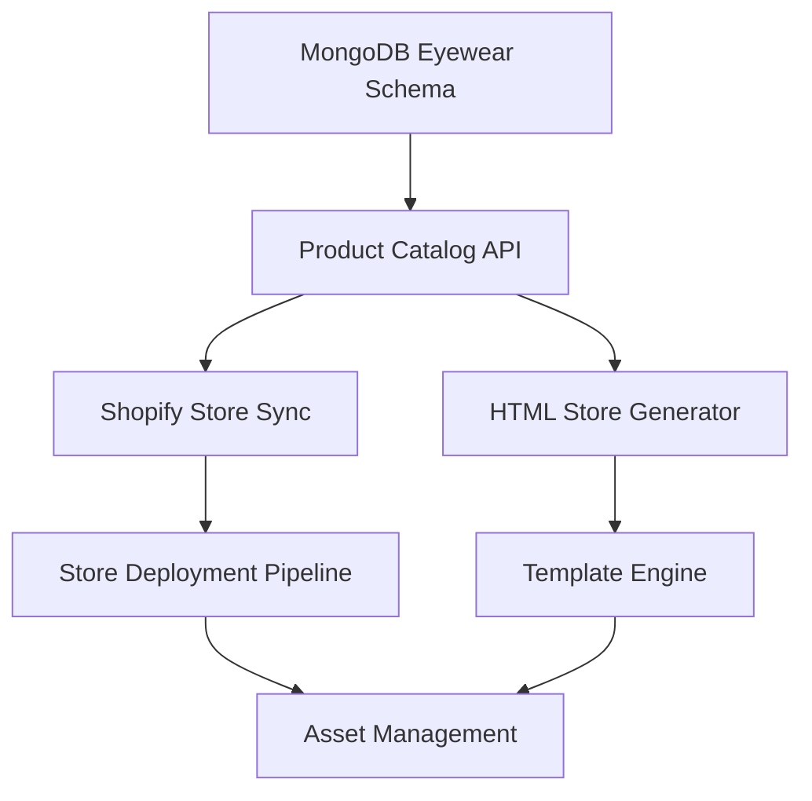
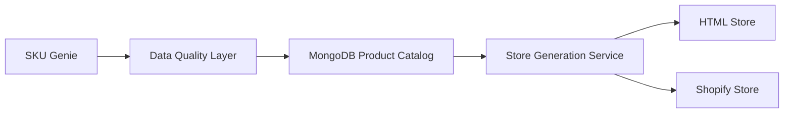

# MVP Gap Analysis & Agentic Implementation Plan

## Executive Summary

Based on comprehensive analysis of the FullMVP-Plan, Core Platform Architecture, and current codebase, the project is **70% complete** (not 10% as initially assessed). The focus should shift from foundational building to **targeted integration** of existing components.

## Current State Reality Check

### ✅ **Substantially Complete (70%)**
- **API Infrastructure**: FastAPI with middleware, auth, service discovery, health checks
- **Authentication System**: JWT, RBAC, API keys, tenant management  
- **SKU Genie**: Data quality management system (~60% complete, following roadmap)
- **Vertex AI Integration**: Comprehensive AI domain handlers and ML gateway
- **Frontend Foundation**: React app with analytics, dashboards, design system
- **Testing Infrastructure**: Comprehensive test coverage across components

### ❌ **Critical Gaps (30%)**
1. **Store Generation Pipeline** - HTML/Shopify store creation from product data
2. **AI Assistant Chat Interface** - Frontend conversational interface missing
3. **MongoDB Eyewear Schema** - Product catalog structure not implemented
4. **Data Flow Integration** - SKU Genie → Product Catalog → Store Generation
5. **Multi-channel Deployment** - Automated store deployment pipeline

## Agentic Implementation Strategy

### Phase 1: Store Generation Architecture (2 weeks)
**Architect Mode Tasks**



**Priority Implementation:**
1. **MongoDB Schema Design**
   - Eyewear-specific collections with face shape compatibility
   - Product measurements and attributes
   - Brand and category hierarchies
   - Image and asset management

2. **Store Generation Service**
   - Template-driven HTML store creation
   - Dynamic product catalog generation
   - SEO optimization and responsive design
   - Performance optimization

3. **Shopify Integration Service**
   - Product synchronization logic
   - Theme customization deployment
   - Inventory management
   - Order processing integration

### Phase 2: AI Assistant Integration (2 weeks)
**Auto-Coder Mode Tasks**

1. **Chat Widget Component**
   ```typescript
   interface ChatInterface {
     sendMessage(message: string): Promise<AIResponse>
     getProductRecommendations(preferences: UserPreferences): Promise<Product[]>
     getFaceShapeAnalysis(image: File): Promise<FaceShapeResult>
     getConversationHistory(): Promise<ChatMessage[]>
   }
   ```

2. **Frontend AI Integration**
   - Real-time messaging with Vertex AI backend
   - Product recommendation display components
   - Face shape analysis interface
   - Conversation history management

3. **Visual Components**
   - Product recommendation cards
   - Virtual try-on interface
   - Eyewear comparison tools
   - Shopping cart integration

### Phase 3: Data Flow Integration (1 week)
**Integration Mode Tasks**



**Implementation Tasks:**
1. **SKU Genie Output Adapter**
   - Transform quality data to product catalog format
   - Handle data validation and enrichment
   - Implement error handling and retries

2. **MongoDB Product Ingestion**
   - Batch import from SKU Genie
   - Real-time update mechanisms
   - Conflict resolution strategies

3. **Store Regeneration Triggers**
   - Automated store updates on data changes
   - Incremental update optimization
   - Cache invalidation strategies

### Phase 4: Deployment Pipeline (1 week)
**MCP Integration Mode Tasks**

1. **Multi-channel Store Deployment**
   - HTML store hosting automation
   - Shopify theme management
   - Asset pipeline optimization

2. **Production Readiness**
   - Environment configuration
   - Security hardening
   - Performance monitoring
   - Error tracking and alerting

## Technical Implementation Details

### MongoDB Eyewear Schema

```javascript
// Product Collection
{
  _id: ObjectId,
  sku: string,
  brand: string,
  model: string,
  category: string,
  frame_shape: string, // "round", "square", "aviator", etc.
  face_shape_compatibility: [string], // ["oval", "round", "square"]
  measurements: {
    lens_width: number,
    bridge_width: number,
    temple_length: number,
    frame_width: number,
    frame_height: number
  },
  materials: {
    frame: string,
    lens: string,
    coating: [string]
  },
  colors: [string],
  images: {
    primary: string,
    gallery: [string],
    try_on: string
  },
  pricing: {
    base_price: number,
    sale_price: number,
    currency: string
  },
  inventory: {
    stock_level: number,
    availability: string
  },
  seo: {
    title: string,
    description: string,
    keywords: [string]
  },
  metadata: {
    source: string,
    quality_score: number,
    last_validated: Date
  },
  created_at: Date,
  updated_at: Date
}
```

### Store Generation Service Architecture

```typescript
interface StoreGenerationService {
  generateHTMLStore(config: StoreConfig): Promise<StoreOutput>
  syncToShopify(catalog: ProductCatalog): Promise<ShopifyDeployment>
  updateAssets(assets: AssetCollection): Promise<AssetStatus>
  optimizePerformance(): Promise<OptimizationReport>
}

interface StoreConfig {
  template: string
  brand_settings: BrandSettings
  product_filters: ProductFilter[]
  seo_settings: SEOConfig
  analytics_config: AnalyticsConfig
}
```

### AI Assistant Integration

```typescript
interface AIAssistantService {
  processUserQuery(query: string, context: UserContext): Promise<AIResponse>
  getRecommendations(preferences: UserPreferences): Promise<Product[]>
  analyzeFaceShape(image: File): Promise<FaceShapeAnalysis>
  generateProductComparison(products: Product[]): Promise<ComparisonTable>
}
```

## Resource Allocation

### Week 1 Focus:
- **MongoDB Schema Implementation** (Auto-Coder mode)
- **Store Generation Foundation** (Architect mode)
- **Chat Widget Development** (Auto-Coder mode)

### Week 2 Focus:
- **Shopify Integration** (Auto-Coder mode)
- **AI Assistant Frontend** (Auto-Coder mode)
- **Data Flow Integration** (Integration mode)

### Week 3 Focus:
- **End-to-End Testing** (TDD mode)
- **Performance Optimization** (Critic mode)
- **Security Review** (Debug mode)

### Week 4 Focus:
- **Production Deployment** (Final Assembly mode)
- **Documentation** (Tutorial mode)
- **Performance Monitoring** (MCP Integration mode)

## Success Metrics

### Technical Completion Criteria:
- [ ] MongoDB stores 10,000+ eyewear products with full schema
- [ ] HTML stores generate in <30 seconds for 1000+ products
- [ ] AI assistant responds in <2 seconds with relevant recommendations
- [ ] Shopify sync completes in <5 minutes for full catalog
- [ ] End-to-end user journey from AI consultation to purchase works

### Business Validation Criteria:
- [ ] Complete data pipeline: SKU Genie → MongoDB → Store Generation
- [ ] AI assistant provides contextually relevant eyewear recommendations
- [ ] Multi-channel stores (HTML + Shopify) deploy successfully
- [ ] Face shape analysis integrates with product recommendations
- [ ] Store performance meets mobile and desktop optimization standards

## Risk Mitigation

### Technical Risks:
- **Integration Complexity**: Use TDD mode for comprehensive integration testing
- **Performance Bottlenecks**: Use Critic mode for optimization analysis
- **Data Consistency**: Implement robust validation and error handling

### Timeline Risks:
- **Scope Creep**: Focus on core MVP features only
- **Integration Delays**: Use existing components, minimize new development
- **Quality Issues**: Continuous testing and validation

## Next Steps

1. **Immediate (Day 1)**: Begin MongoDB schema implementation
2. **Week 1**: Parallel development of store generation and chat interface
3. **Week 2**: Integration testing and Shopify connector development
4. **Week 3**: End-to-end validation and performance optimization
5. **Week 4**: Production deployment and monitoring setup

## Conclusion

The project is well-positioned for rapid MVP completion. By focusing on **integration over implementation** and leveraging the substantial existing codebase, we can achieve 100% MVP functionality within 4 weeks rather than the originally planned 16-week timeline.

The key insight is that most core components exist and function independently. The primary task is creating the **data flow pipelines** and **user interfaces** that connect these components into a cohesive eyewear shopping platform.