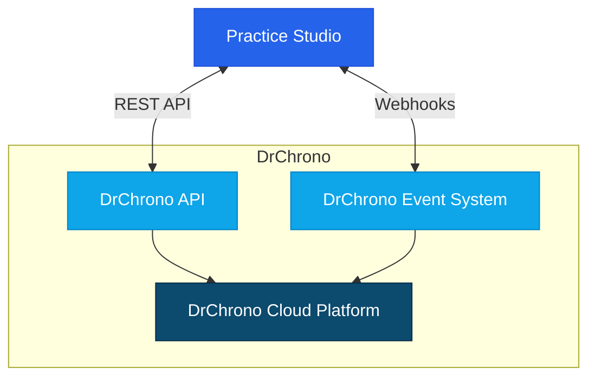

# DrChrono Integration Guide

## Overview

This guide provides detailed instructions for integrating Practice Studio with DrChrono's cloud-based electronic health record and practice management platform. The integration enables seamless data exchange between Practice Studio and DrChrono, supporting efficient clinical and administrative workflows for ambulatory practices.




## Integration Methods

Practice Studio supports the following integration methods with DrChrono:

1. **REST API Integration** - Primary method for bidirectional data exchange
2. **Webhook Integration** - Real-time event notifications

## Prerequisites

Before implementing DrChrono integration, ensure you have:

1. **DrChrono Access and Credentials**
   - DrChrono API client ID and client secret
   - Appropriate API scopes and permissions
   - Account with administrative access

2. **Technical Requirements**
   - TLS 1.2+ for secure communication
   - Public endpoint for webhook receipt (if using webhooks)
   - Required data mapping specifications

3. **Compliance Documentation**
   - Business Associate Agreement (BAA)
   - DrChrono API agreement
   - HIPAA compliance documentation

## REST API Integration

### API Overview

DrChrono provides a comprehensive REST API that enables integration with all aspects of their EHR and practice management platform:

- JSON-based data exchange
- OAuth 2.0 authentication
- Rate limited (limit varies by endpoint)
- Pagination for large data sets

### Authentication Setup

1. **Register for API Access**
   - Log in to your DrChrono account
   - Navigate to API Management
   - Create a new application
   - Specify required scopes
   - Obtain client ID and client secret

2. **Configure Authentication in Practice Studio**
   - Navigate to Settings > Integrations > DrChrono
   - Enter API endpoint URL (https://app.drchrono.com/api/)
   - Input client ID and client secret
   - Configure redirect URL
   - Test connection

### OAuth 2.0 Flow

DrChrono uses the OAuth 2.0 authorization code flow:

1. **Authorization Request**
   - Redirect user to DrChrono authorization URL
   - User logs in and approves access
   - DrChrono redirects back with authorization code

2. **Token Exchange**
   - Exchange authorization code for access token
   - Store refresh token for long-term access
   - Implement token refresh logic

3. **API Access**
   - Include access token in Authorization header
   - Handle token expiration and refresh
   - Monitor rate limiting headers

### API Configuration

1. **Patient Data Integration**
   - Configure patient demographics retrieval
   - Set up patient search functionality
   - Implement patient creation and update workflows

2. **Appointment Management**
   - Configure appointment booking and management
   - Set up provider schedule retrieval
   - Implement appointment synchronization

3. **Clinical Data Exchange**
   - Configure clinical document exchange
   - Set up medication and allergy retrieval
   - Implement lab and diagnostic result access

### Sample API Calls

#### Patient Search

```http
GET https://app.drchrono.com/api/patients?first_name=John&last_name=Smith
Authorization: Bearer {access_token}
```

#### Create Appointment

```http
POST https://app.drchrono.com/api/appointments
Content-Type: application/json
Authorization: Bearer {access_token}

{
  "doctor": 12345,
  "patient": 54321,
  "scheduled_time": "2023-06-15T09:00:00",
  "duration": 30,
  "exam_room": 1,
  "office": 1,
  "reason": "Annual physical examination"
}
```

### Common API Endpoints

| Endpoint | Description | Key Parameters |
|----------|-------------|----------------|
| /patients | Patient management | first_name, last_name, date_of_birth |
| /appointments | Appointment scheduling | doctor, patient, scheduled_time, duration |
| /doctors | Provider information | id, first_name, last_name |
| /offices | Office location management | id, name, address |
| /clinical_notes | Clinical documentation | patient, doctor, date |
| /medications | Medication management | patient, name, dosage |
| /allergies | Allergy management | patient, name, reaction |
| /labs | Lab order and result management | patient, status, results |

## Webhook Integration

DrChrono provides a webhook system for real-time event notifications:

### Webhook Setup

1. **Register Webhook Endpoints**
   - Navigate to API Management in DrChrono
   - Register webhook endpoints for events of interest
   - Configure notification URLs
   - Specify event types to monitor

2. **Configure Practice Studio Webhook Receiver**
   - Navigate to Settings > Integrations > DrChrono > Webhooks
   - Configure webhook processing rules
   - Set up event routing logic
   - Implement verification endpoint

### Supported Webhook Events

| Event Type | Description | Payload Elements |
|------------|-------------|------------------|
| PATIENT_CREATE | New patient created | patient_id, demographics |
| PATIENT_UPDATE | Patient information updated | patient_id, changed_fields |
| APPOINTMENT_CREATE | New appointment created | appointment_id, patient_id, doctor_id, scheduled_time |
| APPOINTMENT_UPDATE | Appointment updated | appointment_id, changed_fields |
| APPOINTMENT_DELETE | Appointment cancelled/deleted | appointment_id |
| CLINICAL_NOTE_CREATE | New clinical note created | clinical_note_id, patient_id |
| CLINICAL_NOTE_UPDATE | Clinical note updated | clinical_note_id, changed_fields |
| LAB_RESULT | New lab result received | lab_id, patient_id, results |

### Webhook Processing

1. **Verification Handling**
   - Implement verification challenge response
   - Authenticate incoming webhook requests
   - Validate webhook signatures

2. **Event Processing**
   - Parse incoming webhook payloads
   - Identify event types
   - Route to appropriate handlers

3. **Data Synchronization**
   - Update Practice Studio data based on events
   - Trigger workflows based on events
   - Maintain synchronization audit logs

## Special Considerations for DrChrono

### API Rate Limits

DrChrono implements rate limiting on their API:

1. **Rate Limit Handling**
   - Monitor rate limit headers in responses
   - Implement exponential backoff for retries
   - Schedule bulk operations during off-peak hours

2. **Pagination**
   - Use pagination for large datasets
   - Implement cursor-based pagination
   - Process records in batches

### Custom Fields and Templates

DrChrono offers extensive customization:

1. **Custom Field Mapping**
   - Identify practice-specific custom fields
   - Configure mappings for custom data
   - Handle custom field data types

2. **Template Integration**
   - Map custom clinical templates
   - Handle template-specific data structures
   - Implement template versioning

### Mobile Integration

DrChrono offers native mobile applications:

1. **Deep Linking**
   - Implement deep link generation for mobile app
   - Configure URL schemes for integration
   - Handle state transitions

2. **kiosk Mode Integration**
   - Configure integration with DrChrono kiosk mode
   - Set up patient check-in workflows
   - Implement form completion notifications

## Implementation Workflow

### Phase 1: Planning and Requirements

1. **Gather Requirements**
   - Identify data elements to exchange
   - Define integration scenarios
   - Document workflow requirements

2. **Solution Design**
   - Select appropriate integration methods
   - Design data flows and mappings
   - Define error handling and recovery procedures

3. **DrChrono Coordination**
   - Engage DrChrono API support if needed
   - Review API documentation
   - Understand rate limits and constraints

### Phase 2: Development and Configuration

1. **Environment Setup**
   - Configure development environment
   - Establish API connectivity
   - Set up OAuth authentication

2. **Data Mapping Implementation**
   - Configure field mappings
   - Implement transformations
   - Develop validation rules

3. **Integration Development**
   - Build API integration components
   - Develop webhook processors
   - Create data synchronization workflows

### Phase 3: Testing and Validation

1. **Unit Testing**
   - Test individual integration components
   - Validate data mappings
   - Verify error handling

2. **Integration Testing**
   - End-to-end workflow testing
   - Bi-directional data exchange validation
   - Performance and load testing

3. **User Acceptance Testing**
   - Validate with end users
   - Confirm workflow functionality
   - Document test results

### Phase 4: Deployment and Monitoring

1. **Production Deployment**
   - Coordinate go-live activities
   - Monitor initial data exchange
   - Provide go-live support

2. **Ongoing Monitoring**
   - Implement integration monitoring
   - Set up alerting for failures
   - Establish support procedures

3. **Maintenance and Updates**
   - Regular integration review
   - Monitor for API changes
   - Implement feature enhancements

## Troubleshooting

### Common Issues and Solutions

| Issue | Possible Causes | Resolution |
|-------|----------------|------------|
| Authentication failures | Expired tokens, invalid scopes | Refresh OAuth tokens, verify API permissions |
| Rate limit exceeded | Too many API calls | Implement backoff strategy, optimize API usage |
| Webhook delivery failures | Connectivity issues, invalid endpoint | Verify endpoint accessibility, check logs |
| Data mapping issues | Custom field configuration | Update field mappings, validate transformations |
| Patient matching failures | Duplicate patients, inconsistent identifiers | Implement robust matching algorithms, manual resolution process |

### Logging and Debugging

1. **API Logs**
   - Access at Settings > Integrations > Logs > DrChrono
   - Filter by endpoint and time range
   - Export logs for analysis

2. **Webhook Logs**
   - Access at Settings > Integrations > Logs > Webhooks
   - Review delivery status and payloads
   - Analyze processing results

3. **Error Handling**
   - Review error queues at Settings > Integrations > Error Management
   - Reprocess failed transactions
   - Analyze error patterns

## Best Practices

1. **Data Synchronization**
   - Implement idempotent operations
   - Use unique identifiers across systems
   - Maintain audit trails of synchronized data

2. **Security and Compliance**
   - Encrypt all data in transit and at rest
   - Implement least privilege access
   - Maintain detailed audit logs for compliance

3. **Performance Optimization**
   - Use incremental synchronization
   - Implement caching strategies
   - Optimize API calls to minimize rate limit impact

4. **Maintenance and Support**
   - Document all integration components
   - Monitor for API changes and deprecations
   - Establish monitoring and alerting

## DrChrono API Version Compatibility

| API Version | Compatible Features | Known Limitations |
|-------------|---------------------|-------------------|
| v2021 | Full API functionality, webhooks | None |
| v2020 | Most API functionality | Limited webhook support |
| v2019 and older | Basic API functionality | Limited endpoint availability, no webhook support |

## Resources and Support

- [DrChrono API Documentation](https://app.drchrono.com/api-docs/)
- [Practice Studio Integration Support](mailto:integration-support@practicestudio.com)
- [DrChrono Developer Portal](https://www.drchrono.com/api/)
- [OAuth 2.0 Documentation](https://oauth.net/2/)

## Appendix: Field Mappings

### Patient Demographics Mapping

| DrChrono Field | Practice Studio Field | Notes |
|----------------|------------------------|-------|
| id | external_id | DrChrono patient identifier |
| first_name | first_name | |
| last_name | last_name | |
| date_of_birth | date_of_birth | Format: YYYY-MM-DD |
| gender | gender | Mapped M/F/O/U to corresponding codes |
| address | address.line1 | |
| apartment | address.line2 | |
| city | address.city | |
| state | address.state | |
| zip_code | address.postal_code | |
| home_phone | phone_home | Format standardized to E.164 |
| cell_phone | phone_mobile | Format standardized to E.164 |
| email | email | |
| preferred_language | preferred_language | Mapped from DrChrono language codes |
| race | race | Mapped from DrChrono race codes |
| ethnicity | ethnicity | Mapped from DrChrono ethnicity codes |

### Appointment Mapping

| DrChrono Field | Practice Studio Field | Notes |
|----------------|------------------------|-------|
| id | external_id | DrChrono appointment identifier |
| patient | patient_id | Mapped to Practice Studio patient ID |
| doctor | provider_id | Mapped to Practice Studio provider ID |
| appointment_type | appointment_type | Mapped to corresponding types |
| scheduled_time | start_time | Converted to UTC |
| duration | end_time | Calculated from start time + duration |
| status | status | Mapped to corresponding statuses |
| reason | reason | |
| office | location_id | Mapped to Practice Studio location |
| notes | notes | |
