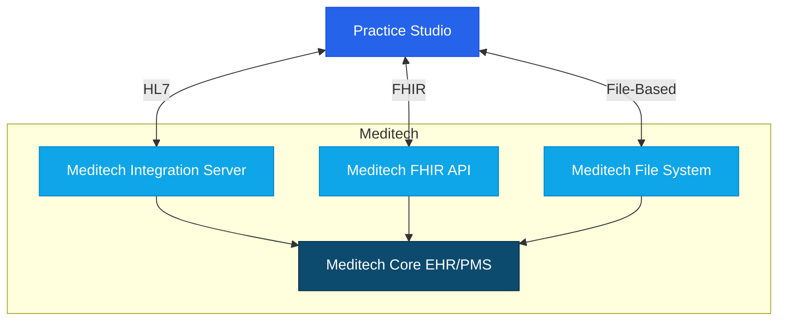

# Meditech Integration Guide

## Overview

This guide provides detailed instructions for integrating Practice Studio with Meditech's electronic health record and practice management systems. The integration enables seamless data exchange between Practice Studio and Meditech Expanse, as well as older Meditech platforms like Magic, Client/Server, and Web EHR.




## Integration Methods

Practice Studio supports the following integration methods with Meditech:

1. **HL7 Interface** - Traditional healthcare data exchange
2. **FHIR API Integration** - Modern standards-based integration (primarily for Expanse)
3. **File-Based Integration** - Batch operations for specific workflows

## Prerequisites

Before implementing Meditech integration, ensure you have:

1. **Meditech Access and Credentials**
   - Meditech API credentials (if applicable)
   - Meditech environment information and version
   - Appropriate access permissions

2. **Technical Requirements**
   - TLS 1.2+ for secure communication
   - IP whitelisting for connections
   - Required data mapping specifications

3. **Compliance Documentation**
   - Business Associate Agreement (BAA)
   - Meditech interface agreement
   - HIPAA compliance documentation

## FHIR API Integration

### FHIR Overview

Meditech Expanse provides FHIR-based RESTful API services:

- JSON-based data exchange
- OAuth 2.0 authentication
- Support for standard FHIR resources
- Compatible with Expanse platform

### Authentication Setup

1. **Register for FHIR API Access**
   - Contact Meditech to register as an integration partner
   - Obtain OAuth client ID and client secret
   - Configure authorized redirect URLs

2. **Configure Authentication in Practice Studio**
   - Navigate to Settings > Integrations > Meditech > FHIR
   - Enter FHIR endpoint URL
   - Input client ID and client secret
   - Test connection

### FHIR Resource Configuration

1. **Patient Resource Integration**
   - Configure patient demographics retrieval
   - Set up patient search functionality
   - Implement patient matching rules

2. **Appointment Resource Integration**
   - Configure appointment booking and management
   - Set up provider schedule retrieval
   - Implement appointment synchronization

3. **Clinical Resource Integration**
   - Configure clinical document exchange
   - Set up medication and allergy retrieval
   - Implement lab and diagnostic result access

### Sample FHIR Requests

#### Patient Search

```http
GET https://fhir.meditech.com/api/FHIR/R4/Patient?family=Smith&given=John
Authorization: Bearer {access_token}
Accept: application/fhir+json
```

#### Retrieve Appointment

```http
GET https://fhir.meditech.com/api/FHIR/R4/Appointment/{id}
Authorization: Bearer {access_token}
Accept: application/fhir+json
```

### Common FHIR Resources

| Resource | Description | Key Parameters |
|----------|-------------|----------------|
| Patient | Patient demographics | name, birthDate, identifier |
| Appointment | Scheduling information | participant, status, start, end |
| Practitioner | Provider information | name, identifier, specialty |
| Location | Facility information | name, address, type |
| Observation | Clinical measurements | code, value, subject, date |
| Medication | Medication information | code, form, ingredient |
| AllergyIntolerance | Patient allergies | patient, substance, severity |

## HL7 Integration

For clinical data exchange, Practice Studio supports HL7 v2.x integration with all Meditech platforms:

### HL7 Interface Setup

1. **Configure Meditech Interface**
   - Work with Meditech interface team to set up HL7 endpoints
   - Define message types to exchange (ADT, SIU, ORU, etc.)
   - Set up transport method (MLLP, TCP/IP, secure file transfer)

2. **Configure Practice Studio HL7 Receiver**
   - Navigate to Settings > Integrations > HL7
   - Configure connection parameters
   - Set up message filtering and transformation rules
   - Define acknowledgment settings

### Supported HL7 Message Types

| Message Type | Description | Direction |
|--------------|-------------|-----------|
| ADT A01, A04 | Patient Registration | Meditech → Practice Studio |
| ADT A08 | Patient Update | Meditech → Practice Studio |
| SIU S12 | Appointment Notification | Bi-directional |
| SIU S14 | Appointment Modification | Bi-directional |
| SIU S15 | Appointment Cancellation | Bi-directional |
| ORU R01 | Observation Result | Meditech → Practice Studio |
| DFT P03 | Financial Transaction | Meditech → Practice Studio |
| MDM T02 | Document Notification | Meditech → Practice Studio |

### Sample HL7 Message

```
MSH|^~\&|MEDITECH|MTHOST|PRACTICESTUDIO|PSSERVER|20220315142658||ADT^A04|12345|P|2.3|
EVN|A04|20220315142658|||
PID|1||12345^^^MEDITECH^MRN||DOE^JOHN^||19800515|M||White|123 MAIN ST^^SPRINGFIELD^IL^62701^USA^^^SANGAMON|SANGAMON|(555)555-1234|(555)555-5678|ENG|M|CHR|100000^^^MEDITECH^FIN NBR|123-45-6789|||
NK1|1|DOE^JANE^|SPO||(555)555-4321||EC|||||||||||
PV1|1|O|CLINIC^^^FACILITY|||||12345^JOHNSON^JANE^^^^^MEDITECH^^^^PROVID|||||||||||100000^^^MEDITECH^FIN NBR|||||||||||||||||||||||||20220315142658|
IN1|1|BC123^BLUE CROSS|BLUEINS|BLUE CROSS|123 INSURANCE WAY^^SPRINGFIELD^IL^62701^USA^^^SANGAMON|||(555)555-9876|100|FAMILY PLAN||||JOHN DOE|SELF|19800515|123 MAIN ST^^SPRINGFIELD^IL^62701^USA^^^SANGAMON|Y|CO|BC123456789|||||||||||||||BC987654321||||||||||
```

## File-Based Integration

For batch processes or specific workflows, Practice Studio supports file-based integration with Meditech:

### File Integration Setup

1. **Configure File Locations**
   - Set up secure file transfer protocol (SFTP/FTPS)
   - Define file locations and naming conventions
   - Configure file processing schedules

2. **Define File Formats**
   - Specify CSV/JSON structure
   - Map fields between systems
   - Define validation rules

### File Processing Workflows

1. **Patient Demographics Import**
   - Daily import of patient updates
   - Field-level reconciliation
   - Duplicate detection and resolution

2. **Appointment Batch Synchronization**
   - Nightly schedule import/export
   - Conflict resolution rules
   - Error handling and reporting

3. **Billing Data Exchange**
   - Claim file generation
   - Remittance processing
   - Payment reconciliation

### Sample File Format (CSV)

```csv
PatientID,FirstName,LastName,DOB,Gender,Address1,Address2,City,State,Zip,Phone,Email,InsuranceProvider,MemberID,GroupNumber
12345,John,Doe,1980-05-15,M,123 Main St,Apt 4B,Springfield,IL,62701,5551234567,john.doe@example.com,Blue Cross,BC987654321,GRP123456
54321,Jane,Smith,1975-08-22,F,456 Oak Ave,,Springfield,IL,62702,5559876543,jane.smith@example.com,Aetna,AET123456789,GRP987654
```

## Special Considerations for Meditech Platforms

### Meditech Expanse

1. **Modern Architecture**
   - Supports FHIR API integration
   - Enhanced web services capabilities
   - Improved real-time integration options

2. **Configuration Requirements**
   - Specific API endpoints for each module
   - Module-specific authentication
   - Resource-specific access controls

### Meditech 6.x (Web EHR)

1. **Limited API Capabilities**
   - Primarily HL7-based integration
   - Basic web services for select functions
   - Focus on batch processing

2. **Custom Dictionaries**
   - Specialized dictionary mapping required
   - Hospital-specific customizations
   - System-specific code sets

### Meditech Magic/Client Server

1. **Legacy Integration Approach**
   - HL7 interfaces only
   - File-based batch processing
   - Limited real-time capabilities

2. **Data Access Constraints**
   - Limited access to some data elements
   - Proprietary data formats
   - Hospital-specific configurations

## NPR Reports Integration

Meditech's NPR (Non-Procedural Representation) reports can be used for custom data extraction:

### NPR Integration

1. **Report Development**
   - Work with Meditech report writers
   - Define required data elements
   - Establish output formats

2. **Report Scheduling**
   - Configure automated report generation
   - Set up secure file delivery
   - Implement report processing

3. **Data Transformation**
   - Parse NPR report outputs
   - Map data elements to Practice Studio
   - Handle data type conversions

## Implementation Workflow

### Phase 1: Planning and Requirements

1. **Gather Requirements**
   - Identify data elements to exchange
   - Define integration scenarios
   - Document workflow requirements

2. **Solution Design**
   - Select appropriate integration methods
   - Design data flows and mappings
   - Define error handling and recovery procedures

3. **Meditech Coordination**
   - Engage Meditech integration team
   - Request necessary interface builds
   - Obtain required approvals

### Phase 2: Development and Configuration

1. **Environment Setup**
   - Configure test environments
   - Establish connectivity
   - Set up authentication

2. **Data Mapping Implementation**
   - Configure field mappings
   - Implement transformations
   - Develop validation rules

3. **Integration Development**
   - Build HL7 interface components
   - Develop FHIR API integration (for Expanse)
   - Create file processing workflows

### Phase 3: Testing and Validation

1. **Unit Testing**
   - Test individual integration components
   - Validate data mappings
   - Verify error handling

2. **Integration Testing**
   - End-to-end workflow testing
   - Bi-directional data exchange validation
   - Performance and load testing

3. **User Acceptance Testing**
   - Validate with end users
   - Confirm workflow functionality
   - Document test results

### Phase 4: Deployment and Monitoring

1. **Production Deployment**
   - Coordinate go-live activities
   - Monitor initial data exchange
   - Provide go-live support

2. **Ongoing Monitoring**
   - Implement integration monitoring
   - Set up alerting for failures
   - Establish support procedures

3. **Maintenance and Updates**
   - Regular interface review
   - Coordinate Meditech version updates
   - Implement feature enhancements

## Troubleshooting

### Common Issues and Solutions

| Issue | Possible Causes | Resolution |
|-------|----------------|------------|
| HL7 message rejection | Message format errors, invalid data | Check message structure, validate required fields |
| FHIR authentication failures | Expired tokens, incorrect credentials | Refresh OAuth tokens, verify API credentials |
| Patient matching issues | Inconsistent patient identifiers | Review patient matching rules, implement fuzzy matching |
| Missing dictionary values | Incomplete dictionary mapping | Update dictionary mappings, synchronize code sets |
| NPR report processing errors | Report format changes | Update parsing logic, verify report formats |

### Logging and Debugging

1. **HL7 Logs**
   - Access at Settings > Integrations > Logs > HL7
   - Filter by message type and time range
   - Export logs for analysis

2. **FHIR API Logs**
   - Access at Settings > Integrations > Logs > FHIR
   - Filter by resource type and operation
   - Review request/response details

3. **Error Handling**
   - Review error queues at Settings > Integrations > Error Management
   - Reprocess failed transactions
   - Analyze error patterns

## Best Practices

1. **Data Synchronization**
   - Implement idempotent operations
   - Use unique identifiers across systems
   - Maintain audit trails of synchronized data

2. **Security and Compliance**
   - Encrypt all data in transit and at rest
   - Implement least privilege access
   - Maintain detailed audit logs for compliance

3. **Performance Optimization**
   - Use incremental synchronization
   - Implement caching strategies
   - Schedule batch operations during off-peak hours

4. **Maintenance and Support**
   - Document all integration components
   - Maintain version compatibility information
   - Establish monitoring and alerting

## Meditech Version Compatibility

| Meditech Version | Compatible Features | Known Limitations |
|------------------|---------------------|-------------------|
| Expanse | FHIR API, HL7, File-based | None |
| 6.x (Web EHR) | HL7, limited web services, File-based | Limited API capabilities |
| Client/Server | HL7, File-based | No API capabilities |
| Magic | HL7, File-based | No API capabilities, limited HL7 formats |

## Resources and Support

- [Meditech Interoperability Documentation](https://home.meditech.com/en/d/interoperability/)
- [Practice Studio Integration Support](mailto:integration-support@practicestudio.com)
- [Meditech Connect Program](https://home.meditech.com/en/d/partnersolutions/)
- [HL7 Resources](https://hl7.org/implement/standards/)
- [FHIR Documentation](https://hl7.org/fhir/)

## Appendix: Field Mappings

### Patient Demographics Mapping

| Meditech Field | Practice Studio Field | Notes |
|----------------|------------------------|-------|
| PatientID | external_id | Meditech patient identifier |
| FirstName | first_name | |
| LastName | last_name | |
| DOB | date_of_birth | Format: YYYY-MM-DD |
| Sex | gender | Mapped M/F/O/U to corresponding codes |
| Address1 | address.line1 | |
| Address2 | address.line2 | |
| City | address.city | |
| State | address.state | |
| Zip | address.postal_code | |
| HomePhone | phone_home | Format standardized to E.164 |
| CellPhone | phone_mobile | Format standardized to E.164 |
| EmailAddress | email | |
| Language | preferred_language | Mapped from Meditech language codes |
| Race | race | Mapped from Meditech race codes |
| Ethnicity | ethnicity | Mapped from Meditech ethnicity codes |

### Appointment Mapping

| Meditech Field | Practice Studio Field | Notes |
|----------------|------------------------|-------|
| AppointmentID | external_id | Meditech appointment identifier |
| PatientID | patient_id | Mapped to Practice Studio patient ID |
| ProviderID | provider_id | Mapped to Practice Studio provider ID |
| AppointmentType | appointment_type | Mapped to corresponding types |
| StartDateTime | start_time | Converted to UTC |
| Duration | end_time | Calculated from start time + duration |
| Status | status | Mapped to corresponding statuses |
| ReasonForVisit | reason | |
| LocationID | location_id | Mapped to Practice Studio location |
| Notes | notes | |
