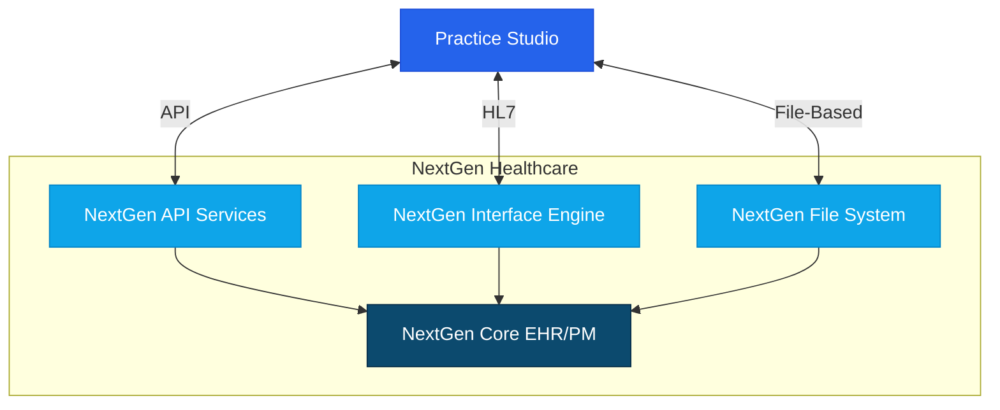

# NextGen Integration Guide

## Overview

This guide provides detailed instructions for integrating Practice Studio with NextGen Healthcare's electronic health record and practice management systems. The integration enables seamless data exchange between Practice Studio and NextGen, supporting efficient clinical and administrative workflows.




## Integration Methods

Practice Studio supports the following integration methods with NextGen:

1. **API-Based Integration** - Using NextGen API services
2. **HL7 Interface** - Standard healthcare data exchange
3. **File-Based Integration** - Batch operations for specific workflows

## Prerequisites

Before implementing NextGen integration, ensure you have:

1. **NextGen Access and Credentials**
   - NextGen API credentials (client ID, client secret)
   - NextGen instance information and version
   - Appropriate API permissions

2. **Technical Requirements**
   - TLS 1.2+ for secure communication
   - IP whitelisting for API calls
   - Required data mapping specifications

3. **Compliance Documentation**
   - Business Associate Agreement (BAA)
   - NextGen interface agreement
   - HIPAA compliance documentation

## API-Based Integration

### API Overview

NextGen provides REST-based API services that enable integration with their EHR and practice management systems:

- JSON-based data exchange
- OAuth 2.0 authentication
- Comprehensive access to patient, appointment, and clinical data
- Support for real-time operations

### Authentication Setup

1. **Register for API Access**
   - Contact NextGen to register as an integration partner
   - Obtain OAuth client ID and client secret
   - Configure application redirect URLs

2. **Configure Authentication in Practice Studio**
   - Navigate to Settings > Integrations > NextGen
   - Enter API endpoint URL
   - Input client ID and client secret
   - Test connection

### API Configuration

1. **Patient Data Integration**
   - Configure patient demographics retrieval
   - Set up patient search functionality
   - Implement patient matching rules

2. **Appointment Management**
   - Configure appointment booking and management
   - Set up provider schedule retrieval
   - Implement appointment synchronization

3. **Clinical Data Exchange**
   - Configure clinical document exchange
   - Set up medication and allergy retrieval
   - Implement lab and diagnostic result access

### Sample API Calls

#### Patient Search

```http
GET https://api.nextgen.com/v1/patients?name=Smith&birthDate=1980-01-01
Authorization: Bearer {access_token}
```

#### Create Appointment

```http
POST https://api.nextgen.com/v1/appointments
Content-Type: application/json
Authorization: Bearer {access_token}

{
  "patientId": "12345",
  "providerId": "54321",
  "locationId": "1",
  "appointmentTypeId": "2",
  "startDateTime": "2023-06-15T09:00:00Z",
  "duration": 30,
  "reason": "Annual physical examination"
}
```

### Common API Endpoints

| Endpoint | Description | Key Parameters |
|----------|-------------|----------------|
| /patients | Patient management | name, birthDate, id |
| /appointments | Appointment scheduling | patientId, providerId, startDateTime |
| /documents | Clinical document management | patientId, documentType |
| /providers | Provider information | providerId, locationId |
| /locations | Location management | locationId, name |
| /medications | Medication management | patientId, status |
| /allergies | Allergy management | patientId |

## HL7 Integration

For clinical data exchange, Practice Studio supports HL7 v2.x integration with NextGen:

### HL7 Interface Setup

1. **Configure NextGen Interface**
   - Work with NextGen interface team to set up HL7 endpoints
   - Define message types to exchange (ADT, SIU, ORU, etc.)
   - Set up transport method (MLLP, TCP/IP, secure file transfer)

2. **Configure Practice Studio HL7 Receiver**
   - Navigate to Settings > Integrations > HL7
   - Configure connection parameters
   - Set up message filtering and transformation rules
   - Define acknowledgment settings

### Supported HL7 Message Types

| Message Type | Description | Direction |
|--------------|-------------|-----------|
| ADT A01, A04 | Patient Registration | NextGen → Practice Studio |
| ADT A08 | Patient Update | NextGen → Practice Studio |
| SIU S12 | Appointment Notification | Bi-directional |
| SIU S14 | Appointment Modification | Bi-directional |
| SIU S15 | Appointment Cancellation | Bi-directional |
| ORU R01 | Observation Result | NextGen → Practice Studio |
| DFT P03 | Financial Transaction | NextGen → Practice Studio |
| MDM T02 | Document Notification | NextGen → Practice Studio |

### Sample HL7 Message

```
MSH|^~\&|NEXTGEN|NEXTGENHOST|PRACTICESTUDIO|PSSERVER|20220315142658||ADT^A04|12345|P|2.3|
EVN|A04|20220315142658|||
PID|1||12345^^^NEXTGEN^MRN||DOE^JOHN^||19800515|M||White|123 MAIN ST^^SPRINGFIELD^IL^62701^USA^^^SANGAMON|SANGAMON|(555)555-1234|(555)555-5678|ENG|M|CHR|100000^^^NEXTGEN^FIN NBR|123-45-6789|||
NK1|1|DOE^JANE^|SPO||(555)555-4321||EC|||||||||||
PV1|1|O|CLINIC^^^FACILITY|||||12345^JOHNSON^JANE^^^^^NEXTGEN^^^^PROVID|||||||||||100000^^^NEXTGEN^FIN NBR|||||||||||||||||||||||||20220315142658|
IN1|1|BC123^BLUE CROSS|BLUEINS|BLUE CROSS|123 INSURANCE WAY^^SPRINGFIELD^IL^62701^USA^^^SANGAMON|||(555)555-9876|100|FAMILY PLAN||||JOHN DOE|SELF|19800515|123 MAIN ST^^SPRINGFIELD^IL^62701^USA^^^SANGAMON|Y|CO|BC123456789|||||||||||||||BC987654321||||||||||
```

## File-Based Integration

For batch processes or specific workflows, Practice Studio supports file-based integration with NextGen:

### File Integration Setup

1. **Configure File Locations**
   - Set up secure file transfer protocol (SFTP/FTPS)
   - Define file locations and naming conventions
   - Configure file processing schedules

2. **Define File Formats**
   - Specify CSV/JSON structure
   - Map fields between systems
   - Define validation rules

### File Processing Workflows

1. **Patient Demographics Import**
   - Daily import of patient updates
   - Field-level reconciliation
   - Duplicate detection and resolution

2. **Appointment Batch Synchronization**
   - Nightly schedule import/export
   - Conflict resolution rules
   - Error handling and reporting

3. **Billing Data Exchange**
   - Claim file generation
   - Remittance processing
   - Payment reconciliation

### Sample File Format (CSV)

```csv
PatientID,FirstName,LastName,DOB,Gender,Address1,Address2,City,State,Zip,Phone,Email,InsuranceProvider,MemberID,GroupNumber
12345,John,Doe,1980-05-15,M,123 Main St,Apt 4B,Springfield,IL,62701,5551234567,john.doe@example.com,Blue Cross,BC987654321,GRP123456
54321,Jane,Smith,1975-08-22,F,456 Oak Ave,,Springfield,IL,62702,5559876543,jane.smith@example.com,Aetna,AET123456789,GRP987654
```

## Special Considerations for NextGen

### Enterprise vs. KBM Integration

NextGen offers different platforms with specific integration considerations:

1. **NextGen Enterprise EHR**
   - Uses NextGen Integration API (NGIÀ)
   - Supports both real-time and batch operations
   - Provides comprehensive patient and clinical data access

2. **NextGen KBM/Office**
   - Uses older NextGen Data Exchange API
   - Limited real-time integration capabilities
   - Focus on file-based and HL7 integration

### Version-Specific Features

Different NextGen versions have varying integration capabilities:

1. **NextGen 5.9.x**
   - Basic API support
   - Limited real-time functionality
   - Focus on HL7 and file-based integration

2. **NextGen 6.x+**
   - Enhanced REST API capabilities
   - Improved real-time integration
   - Better support for clinical data exchange

### Custom Templates and Forms

NextGen's extensive customization requires special handling:

1. **Template Mapping**
   - Configure mappings for NextGen template data
   - Handle custom fields and sections
   - Implement template versioning

2. **Form Data Integration**
   - Map NextGen form data to Practice Studio structure
   - Handle form-specific validation rules
   - Implement bidirectional form data updates

## Implementation Workflow

### Phase 1: Planning and Requirements

1. **Gather Requirements**
   - Identify data elements to exchange
   - Define integration scenarios
   - Document workflow requirements

2. **Solution Design**
   - Select appropriate integration methods
   - Design data flows and mappings
   - Define error handling and recovery procedures

3. **NextGen Coordination**
   - Engage NextGen integration team
   - Request necessary API access
   - Obtain required approvals

### Phase 2: Development and Configuration

1. **Environment Setup**
   - Configure test environments
   - Establish connectivity
   - Set up authentication

2. **Data Mapping Implementation**
   - Configure field mappings
   - Implement transformations
   - Develop validation rules

3. **Integration Development**
   - Build API integration components
   - Develop file processors
   - Create HL7 interface handlers

### Phase 3: Testing and Validation

1. **Unit Testing**
   - Test individual integration components
   - Validate data mappings
   - Verify error handling

2. **Integration Testing**
   - End-to-end workflow testing
   - Bi-directional data exchange validation
   - Performance and load testing

3. **User Acceptance Testing**
   - Validate with end users
   - Confirm workflow functionality
   - Document test results

### Phase 4: Deployment and Monitoring

1. **Production Deployment**
   - Coordinate go-live activities
   - Monitor initial data exchange
   - Provide go-live support

2. **Ongoing Monitoring**
   - Implement integration monitoring
   - Set up alerting for failures
   - Establish support procedures

3. **Maintenance and Updates**
   - Regular interface review
   - Coordinate NextGen version updates
   - Implement feature enhancements

## Troubleshooting

### Common Issues and Solutions

| Issue | Possible Causes | Resolution |
|-------|----------------|------------|
| Authentication failures | Expired tokens, incorrect credentials | Refresh OAuth tokens, verify API credentials |
| Patient matching issues | Inconsistent patient identifiers | Review patient matching rules, implement fuzzy matching |
| Missing custom data | Template or form customizations | Update template mappings, check custom field configurations |
| HL7 message rejection | Message format errors, invalid data | Check message structure, validate required fields |
| Performance degradation | High transaction volume, inefficient queries | Optimize query parameters, implement caching |

### Logging and Debugging

1. **API Logs**
   - Access at Settings > Integrations > Logs > NextGen
   - Filter by endpoint and time range
   - Export logs for analysis

2. **Error Handling**
   - Review error queues at Settings > Integrations > Error Management
   - Reprocess failed transactions
   - Analyze error patterns

3. **Connectivity Testing**
   - Use Settings > Integrations > Connectivity Test
   - Validate network connectivity
   - Check authentication

## Best Practices

1. **Data Synchronization**
   - Implement idempotent operations
   - Use unique identifiers across systems
   - Maintain audit trails of synchronized data

2. **Security and Compliance**
   - Encrypt all data in transit and at rest
   - Implement least privilege access
   - Maintain detailed audit logs for compliance

3. **Performance Optimization**
   - Use incremental synchronization
   - Implement caching strategies
   - Schedule batch operations during off-peak hours

4. **Maintenance and Support**
   - Document all integration components
   - Maintain version compatibility information
   - Establish monitoring and alerting

## NextGen Version Compatibility

| NextGen Version | Compatible Features | Known Limitations |
|-----------------|---------------------|-------------------|
| 5.8.x and older | Basic HL7, file-based | Limited API functionality |
| 5.9.x | Basic API, enhanced HL7 | Some API endpoints unavailable |
| 6.0.x+ | Full API support, FHIR capabilities | None |
| KBM/Office | Limited API, HL7 support | Reduced real-time capabilities |

## Resources and Support

- [NextGen Developer Portal](https://developer.nextgen.com)
- [Practice Studio Integration Support](mailto:integration-support@practicestudio.com)
- [NextGen Integration Guide](https://www.nextgen.com/products-and-services/integration)
- [HL7 Resources](https://hl7.org/implement/standards/)

## Appendix: Field Mappings

### Patient Demographics Mapping

| NextGen Field | Practice Studio Field | Notes |
|---------------|------------------------|-------|
| PatientID | external_id | NextGen patient identifier |
| FirstName | first_name | |
| LastName | last_name | |
| DOB | date_of_birth | Format: YYYY-MM-DD |
| Gender | gender | Mapped M/F/O/U to corresponding codes |
| Address1 | address.line1 | |
| Address2 | address.line2 | |
| City | address.city | |
| State | address.state | |
| Zip | address.postal_code | |
| HomePhone | phone_home | Format standardized to E.164 |
| MobilePhone | phone_mobile | Format standardized to E.164 |
| Email | email | |
| Language | preferred_language | Mapped from NextGen language codes |
| Race | race | Mapped from NextGen race codes |
| Ethnicity | ethnicity | Mapped from NextGen ethnicity codes |

### Appointment Mapping

| NextGen Field | Practice Studio Field | Notes |
|---------------|------------------------|-------|
| AppointmentID | external_id | NextGen appointment identifier |
| PatientID | patient_id | Mapped to Practice Studio patient ID |
| ProviderID | provider_id | Mapped to Practice Studio provider ID |
| AppointmentTypeID | appointment_type | Mapped to corresponding types |
| StartDateTime | start_time | Converted to UTC |
| Duration | end_time | Calculated from start time + duration |
| Status | status | Mapped to corresponding statuses |
| Reason | reason | |
| LocationID | location_id | Mapped to Practice Studio location |
| Notes | notes | |
