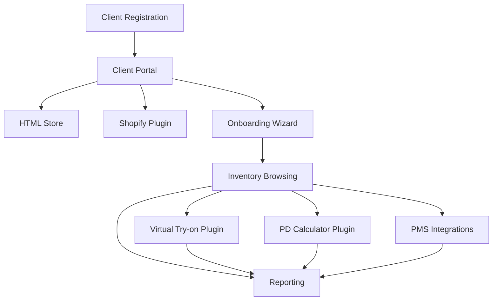

# VARAi Commerce Studio Feature Requirements

## Overview

This document outlines the detailed feature requirements for the first release of VARAi Commerce Studio. It specifies the functionality that must be implemented for each core feature, ensuring alignment with the existing design system, Storybook components, the client portal API, the business services, and the Shopify app. This approach promotes consistency and efficiency in development.

## 1. Client Registration

### Core Requirements

- **Registration Process**
  - Self-service registration form (using design system components)
  - Email verification (using auth module)
  - Account activation workflow (using auth module)
  - Terms of service acceptance
  - Privacy policy consent

- **Profile Management**
  - Business information collection (using design system components)
  - Contact details management
  - Subscription plan selection
  - Billing information collection
  - Profile completion tracking

- **Authentication**
  - Secure password requirements (using auth module)
  - Multi-factor authentication option (using auth module)
  - Password reset functionality (using auth module)
  - Session management (using auth module)
  - Account recovery process (using auth module)

### User Experience

- Streamlined registration process (< 5 minutes to complete)
- Clear progress indicators (using design system components)
- Helpful validation messages
- Mobile-responsive design
- Save and resume capability

### Technical Requirements

- Secure data storage with encryption
- Utilize existing client portal API endpoints for client management, platform account management, report management, scheduled report management, and metrics
- Leverage User Service from Business Services for user data management and profile operations
- Utilize auth module for authentication and account management
- Validation rules for all input fields
- Integration with email service for verification
- Audit logging for security events

## 2. HTML Store

### Core Requirements

- **Store Setup**
  - Domain configuration (subdomain and custom domain)
  - Theme selection and customization (using design system themes)
  - Logo and branding upload
  - Navigation menu configuration (using design system components)
  - Footer content management

- **Product Display**
  - Product listing pages with filtering (using design system components)
  - Product detail pages (using design system components)
  - Product image gallery
  - Product variants support
  - Related products display

- **Customer Experience**
  - Product search functionality
  - Mobile-responsive design
  - Product reservation/request system
  - Contact form integration
  - Store locator (if applicable)

### User Experience

- Intuitive store management interface
- Real-time preview of changes
- Drag-and-drop content arrangement
  - Template-based page creation
  - Guided setup process

### Technical Requirements

- Responsive frontend framework
- SEO-friendly URL structure
- Performance optimization for images
- Browser compatibility (last 2 versions of major browsers)
- Analytics tracking integration
- Leverage Product Service from Business Services for product data

## 3. Shopify Plugin

### Core Requirements

- **Installation**
  - Shopify App Store listing (using existing Shopify app)
  - One-click installation
  - Permission request and approval
  - Initial configuration wizard
  - Connection validation

- **Integration**
  - Product synchronization (bidirectional) (using existing Shopify app)
  - Order data access (using existing Shopify app)
  - Customer data access (with consent) (using existing Shopify app)
  - Theme integration options
  - Shopify admin panel extension

- **Functionality**
  - Embedded app within Shopify admin
  - Widget insertion into store frontend
  - Consistent branding with main platform
  - Offline functionality for critical features
  - Error handling and recovery

### User Experience

- Seamless transition between Shopify and platform
- Consistent UI/UX with main platform
- Clear status indicators for synchronization
- Intuitive configuration options
- Helpful documentation and tooltips

### Technical Requirements

- Shopify API integration (REST and GraphQL) (using existing Shopify app)
- Webhook handling for real-time updates (using existing Shopify app)
- Secure data storage and transmission
- Rate limit management
- Conflict resolution for data synchronization
- Leverage Product Service and Order Service from Business Services
- Utilize auth module for authentication and authorization

## 4. Onboarding Wizard

### Core Requirements

- **Setup Flow**
  - Step-by-step guided process (using design system components)
  - Progress tracking and saving
  - Contextual help and documentation
  - Skippable optional steps
  - Completion verification

- **Data Import**
  - CSV/Excel file upload
  - Template download
  - Column mapping interface (using design system components)
  - Data validation and error reporting
  - Import progress tracking

- **Configuration**
  - Store settings configuration
  - User role assignment
  - Feature activation
  - Integration setup assistance
  - Initial content creation

### User Experience

- Visual progress indicator (using design system components)
  - Clear step descriptions
  - Estimated time for each step
  - Ability to navigate between steps
  - Context-sensitive help

### Technical Requirements

- State management for multi-step process
- File parsing and validation
- Asynchronous processing for large imports
- Error handling and recovery
- Telemetry for identifying friction points
- Leverage Product Service and User Service from Business Services
- Utilize auth module for authentication and authorization

## 5. Inventory Browsing

### Core Requirements

- **Product Catalog**
  - Comprehensive product listing (using design system components)
  - Advanced filtering and sorting (using design system components)
  - Bulk operations support
  - Category and tag management
  - Product status management

- **Search Functionality**
  - Full-text search
  - Faceted search options
  - Search result ranking
  - Recent and saved searches
  - Search analytics

- **Product Management**
  - Product creation and editing
  - Variant management
  - Image management
  - Inventory level tracking
  - Product import/export

### User Experience

- Fast-loading product grid
- Inline editing capabilities
- Batch operations for efficiency
- Customizable view options
- Keyboard shortcuts for power users

### Technical Requirements

- Efficient data loading and pagination
- Search indexing for performance
- Image optimization and caching
- Real-time inventory updates
- Offline capability for basic browsing
- Leverage Product Service and Inventory Service from Business Services
- Utilize auth module for authentication and authorization

## 6. Virtual Try-on Plugin

### Core Requirements

- **Face Analysis**
  - Face detection and measurement
  - Face shape classification
  - Feature point identification
  - Measurement calibration
  - Privacy-compliant processing

- **Frame Visualization**
  - Realistic frame rendering
  - Proper scaling and positioning
  - Color and material representation
  - Multiple angle views
  - Comparison view

- **User Interaction**
  - Photo upload or camera capture (using design system components)
  - Frame selection interface (using design system components)
  - Adjustment controls
  - Saving and sharing options
  - History of previous try-ons

### User Experience

- Intuitive camera/upload interface
- Real-time feedback during processing
- Smooth transitions between states
- Mobile-optimized controls
- Clear privacy notifications

### Technical Requirements

- Computer vision processing
- 3D rendering capabilities
- Efficient image handling
- Cross-device compatibility
- Fallback for unsupported browsers
- Leverage Product Service from Business Services
- Utilize auth module for authentication and authorization

## 7. PD Calculator Plugin

### Core Requirements

- **Measurement Process**
  - Camera calibration
  - Reference object detection
  - Pupillary distance calculation
  - Verification and adjustment
  - Measurement history

- **Data Integration**
  - Prescription form integration (using design system components)
  - Measurement storage
  - Export functionality
  - Integration with frame selection
  - Practitioner review option

- **Guidance**
  - Step-by-step instructions
  - Visual guides and examples
  - Troubleshooting assistance
  - Accuracy verification
  - Educational content

### User Experience

- Clear instructions with visuals
- Real-time feedback during measurement
- Confidence score for measurements
- Easy retake option
- Results explanation

### Technical Requirements

- Camera access and management
- Image processing algorithms
- Measurement accuracy validation
- Secure storage of biometric data
- Offline measurement capability
- Leverage User Service from Business Services
- Utilize auth module for authentication and authorization

## 8. Reporting

### Core Requirements

- **Dashboard**
  - Key performance indicators (using design system components)
  - Customizable widget layout
  - Date range selection
  - Data visualization options (using design system components)
  - Export and sharing capabilities
  - Utilize the Client Portal API for report creation, retrieval, and scheduling

- **Report Types**
  - Product performance reports
  - Customer activity reports
  - Operational reports
  - Financial reports
  - Plugin usage reports

- **Data Analysis**
  - Trend identification
  - Comparative analysis
  - Drill-down capabilities
  - Custom metric creation
  - Anomaly detection

### User Experience

- Interactive data visualizations
- Intuitive filtering controls
- Responsive design for all devices
- Scheduled report delivery
- Saved report configurations

### Technical Requirements

- Efficient data aggregation
- Caching for report performance
- Export in multiple formats (PDF, CSV, Excel)
- Data access controls based on roles
- Historical data retention policy
- Leverage Product Service, User Service, and Order Service from Business Services
- Utilize the Client Portal API for accessing and displaying metrics and reports
- Utilize auth module for authentication and authorization

## 9. PMS Integrations

### Core Requirements

- **Connection Management**
  - PMS system selection
  - Authentication configuration
  - Connection testing
  - Sync frequency settings
  - Error notification preferences

- **Data Synchronization**
  - Patient data mapping
  - Prescription data access
  - Appointment integration
  - Order status updates
  - Billing information exchange

- **Workflow Integration**
  - Order to appointment linking
  - Prescription verification workflow
  - Customer communication coordination
  - Status tracking across systems
  - Task assignment and notification

### User Experience

- Simple connection setup wizard
- Clear sync status indicators
- Detailed error messages and resolution steps
- Activity logs for troubleshooting
- Configuration backup and restore

### Technical Requirements

- Adapter pattern for multiple PMS systems
- Secure credential management
- Efficient delta synchronization
- Conflict resolution strategies
- Comprehensive logging for troubleshooting
- Leverage User Service and Order Service from Business Services
- Utilize auth module for authentication and authorization

## Feature Dependencies

## Feature Prioritization Matrix

| Feature | Business Value | Implementation Complexity | User Impact | Priority |
|---------|----------------|---------------------------|------------|----------|
| Client Registration | High | Medium | High | 1 |
| HTML Store | High | Medium | High | 2 |
| Shopify Plugin | High | High | High | 2 |
| Onboarding Wizard | High | Medium | High | 3 |
| Inventory Browsing | High | Medium | High | 4 |
| Virtual Try-on Plugin | Medium | High | Medium | 5 |
| PD Calculator Plugin | Medium | High | Medium | 5 |
| Reporting | Medium | Medium | High | 6 |
| PMS Integrations | Medium | High | Medium | 7 |

## Minimum Viable Product (MVP) Requirements

For the initial release, the following feature subset represents the minimum viable product:

1. **Client Registration**
   - Basic registration and authentication
   - Profile management
   - Subscription handling

2. **HTML Store**
   - Basic store setup and configuration
   - Product display and browsing
   - Request/reservation system

3. **Shopify Plugin**
   - Basic installation and configuration
   - Product synchronization
   - Platform feature embedding

4. **Onboarding Wizard**
   - Guided setup process
   - Basic data import functionality
   - Configuration assistance

5. **Inventory Browsing**
   - Product catalog viewing
   - Basic search and filtering
   - Simple product management
   - Client Portal integration for account management and reporting

Additional features (Virtual Try-on, PD Calculator, advanced Reporting, and PMS Integrations) can be prioritized for subsequent releases based on client feedback and market demands.

## Feature Acceptance Criteria

Each feature must meet the following acceptance criteria before release:

1. **Functionality**: All specified requirements are implemented and working correctly
2. **Performance**: Feature meets defined performance benchmarks
3. **Usability**: Feature passes usability testing with target users
4. **Compatibility**: Feature works across all supported devices and browsers
5. **Security**: Feature passes security review and penetration testing
6. **Accessibility**: Feature meets WCAG 2.1 AA standards
7. **Localization**: Feature supports all required languages
8. **Documentation**: Feature has complete user and technical documentation

## Conclusion

This feature requirements document provides a comprehensive overview of what must be implemented for the first release of VARAi Commerce Studio. It serves as a guide for development teams and a reference for stakeholders to ensure alignment on the scope and functionality of the platform.

The requirements will be refined through the development process based on technical discoveries, user feedback, and changing market conditions, with all changes properly documented and communicated to the relevant stakeholders.