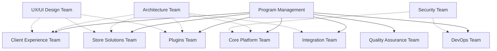

# VARAi Commerce Studio Implementation Team Structure

## Overview

This document outlines the team structure, roles, responsibilities, and collaboration model for the implementation of VARAi Commerce Studio. A well-organized team with clear responsibilities is essential for the successful delivery of this complex platform within the 6-month timeline.

## Team Organization

The implementation team will be organized into cross-functional teams aligned with the major components of the platform. This structure promotes ownership, accountability, and specialized expertise while ensuring integration across the platform.

## Team Roles and Responsibilities

### Program Management

**Responsibilities:**
- Overall program coordination and governance
- Resource allocation and management
- Timeline tracking and adjustment
- Risk and issue management
- Stakeholder communication
- Budget management

**Key Roles:**
- Program Manager
- Project Managers (1 per team)
- Program Coordinator
- Business Analyst

### Architecture Team

**Responsibilities:**
- Technical architecture design and oversight
- Technology selection and standards
- Cross-component integration design
- Performance and scalability planning
- Technical decision-making governance

**Key Roles:**
- Chief Architect
- Solution Architects (1 per major component)
- Data Architect
- Security Architect
- Integration Architect

### Core Platform Team

**Responsibilities:**
- API Gateway implementation
- Authentication and authorization services
- Service infrastructure
- Data management layer
- Observability stack

**Key Roles:**
- Technical Lead
- Backend Developers (4-5)
- DevOps Engineer
- QA Engineer

### Client Experience Team

**Responsibilities:**
- Client registration system
- Client portal development
- RBAC enhancements
- Onboarding wizard
- Client-facing documentation

**Key Roles:**
- Technical Lead
- Frontend Developers (3-4)
- Backend Developers (2-3)
- UX/UI Designer
- QA Engineer

### Store Solutions Team

**Responsibilities:**
- HTML store enhancements
- Shopify plugin development
- Product catalog management
- Order processing
- Store analytics

**Key Roles:**
- Technical Lead
- Frontend Developers (3-4)
- Backend Developers (2-3)
- Shopify Specialist
- QA Engineer

### Plugins Team

**Responsibilities:**
- Virtual try-on integration
- PD calculator development
- Plugin framework
- Plugin analytics
- Mobile optimization

**Key Roles:**
- Technical Lead
- Frontend Developers (2-3)
- Backend Developers (2-3)
- Computer Vision Specialist
- QA Engineer

### Integration Team

**Responsibilities:**
- PMS integration framework
- External system connectors
- Data synchronization
- API documentation
- Integration testing

**Key Roles:**
- Technical Lead
- Backend Developers (3-4)
- Integration Specialists (2)
- API Designer
- QA Engineer

### Quality Assurance Team

**Responsibilities:**
- Test planning and strategy
- Test automation framework
- Performance testing
- Security testing
- User acceptance testing coordination

**Key Roles:**
- QA Lead
- Test Automation Engineers (3-4)
- Performance Test Engineer
- Security Test Engineer
- Manual Test Engineers (2-3)

### DevOps Team

**Responsibilities:**
- CI/CD pipeline setup and maintenance
- Environment management
- Infrastructure as code
- Monitoring and alerting
- Deployment automation

**Key Roles:**
- DevOps Lead
- Cloud Infrastructure Engineers (2-3)
- Site Reliability Engineer
- Monitoring Specialist
- Security Operations Engineer

### UX/UI Design Team

**Responsibilities:**
- User experience design
- User interface design
- Design system development
- Usability testing
- Accessibility compliance

**Key Roles:**
- UX/UI Lead
- UX Designers (2)
- UI Designers (2)
- Interaction Designer
- Accessibility Specialist

### Security Team

**Responsibilities:**
- Security architecture review
- Security controls implementation
- Vulnerability assessment
- Compliance validation
- Security documentation

**Key Roles:**
- Security Lead
- Application Security Engineers (2)
- Compliance Specialist
- Security Analyst

## Team Size and Composition

The total team size for the implementation is estimated at 50-60 members, distributed across the various teams. The exact composition may vary based on availability of resources and specific project needs.

| Team | Size | Senior | Mid-level | Junior |
|------|------|--------|-----------|--------|
| Program Management | 4-5 | 2 | 2 | 1 |
| Architecture | 5-6 | 4 | 2 | 0 |
| Core Platform | 6-8 | 2 | 3 | 3 |
| Client Experience | 7-9 | 2 | 4 | 3 |
| Store Solutions | 7-9 | 2 | 4 | 3 |
| Plugins | 6-8 | 2 | 3 | 3 |
| Integration | 6-8 | 2 | 3 | 3 |
| Quality Assurance | 7-9 | 2 | 4 | 3 |
| DevOps | 5-7 | 2 | 3 | 2 |
| UX/UI Design | 5-7 | 2 | 3 | 2 |
| Security | 4-5 | 2 | 2 | 1 |

## Skills and Expertise Requirements

### Technical Skills

- **Frontend Development**: React, TypeScript, Redux, Material-UI
- **Backend Development**: Node.js, Express, API design, microservices
- **Database**: PostgreSQL, MongoDB, Redis, data modeling
- **DevOps**: Docker, Kubernetes, CI/CD, infrastructure as code
- **Cloud Platforms**: AWS, Azure, or GCP
- **Integration**: API design, webhooks, data synchronization
- **Security**: Authentication, authorization, encryption, secure coding
- **Testing**: Test automation, performance testing, security testing

### Domain Knowledge

- **E-commerce**: Online store operations, product management
- **Eyewear Industry**: Optical products, prescription handling
- **Shopify**: App development, API integration
- **PMS Systems**: Practice management system integration
- **User Experience**: Retail customer journey, merchant operations

### Soft Skills

- **Communication**: Clear and effective communication
- **Collaboration**: Cross-team cooperation
- **Problem-solving**: Creative solutions to complex problems
- **Adaptability**: Flexibility in changing requirements
- **Time Management**: Meeting deadlines and managing priorities

## Team Onboarding and Training

To ensure all team members have the necessary knowledge and skills:

### Onboarding Process

1. **Platform Overview**: Introduction to VARAi Commerce Studio vision and goals
2. **Technical Architecture**: Overview of system architecture and components
3. **Development Environment**: Setup and configuration of development tools
4. **Coding Standards**: Review of coding standards and best practices
5. **Team Processes**: Introduction to Agile methodology and team workflows

### Training Programs

1. **Technical Training**: Specific technologies and frameworks
2. **Domain Training**: Eyewear industry and e-commerce concepts
3. **Security Training**: Security awareness and secure coding practices
4. **Quality Assurance**: Testing methodologies and tools
5. **DevOps**: CI/CD pipeline and deployment processes

## Collaboration Model

The implementation will follow an Agile development methodology with the following characteristics:

### Agile Framework

- **Scrum Methodology**: 2-week sprints with standard ceremonies
- **Feature Teams**: Cross-functional teams focused on specific features
- **Continuous Integration**: Daily code integration and testing
- **Incremental Delivery**: Regular delivery of working software
- **Adaptive Planning**: Sprint planning and backlog refinement

### Ceremonies

- **Sprint Planning**: Biweekly planning sessions
- **Daily Stand-ups**: 15-minute daily team synchronization
- **Sprint Review**: Demonstration of completed work
- **Sprint Retrospective**: Process improvement discussions
- **Backlog Refinement**: Regular backlog prioritization and estimation

### Collaboration Tools

- **Project Management**: Jira for task tracking and sprint management
- **Documentation**: Confluence for documentation and knowledge sharing
- **Code Repository**: GitHub for version control and code review
- **Communication**: Slack for team communication
- **Meetings**: Zoom or Microsoft Teams for virtual meetings

## Cross-Team Coordination

To ensure effective coordination across teams:

### Integration Points

- **Architecture Review Board**: Weekly architecture discussions
- **Tech Lead Sync**: Daily technical lead coordination
- **Integration Testing**: Coordinated integration testing
- **Release Planning**: Coordinated release planning
- **Dependency Management**: Cross-team dependency tracking

### Shared Resources

- **Design System**: Shared UI components and patterns
- **Common Libraries**: Shared utility and helper functions
- **API Contracts**: Clearly defined service interfaces
- **Test Environments**: Shared testing infrastructure
- **Documentation**: Centralized documentation repository

## Decision-Making Framework

Clear decision-making processes are essential for efficient implementation:

### Decision Levels

1. **Strategic Decisions**: Program management and executive team
2. **Architectural Decisions**: Architecture team with input from technical leads
3. **Technical Implementation**: Technical leads with team input
4. **Day-to-day Decisions**: Individual teams

### Decision Documentation

- **Architecture Decision Records (ADRs)**: Document significant architectural decisions
- **Technical Design Documents**: Detailed design for major components
- **Meeting Notes**: Document decisions made in meetings
- **Issue Resolution**: Track and document issue resolution

## Risk Management

The implementation team will proactively manage risks:

### Risk Identification

- Regular risk identification sessions
- Team member input on potential risks
- Lessons learned from similar projects
- Technical spike results

### Risk Mitigation

- Assigned risk owners for each identified risk
- Specific mitigation strategies for high-priority risks
- Regular review of risk status
- Contingency plans for critical risks

## Team Performance Metrics

To monitor team performance and project health:

### Delivery Metrics

- **Velocity**: Story points completed per sprint
- **Cycle Time**: Time from start to completion of work items
- **Defect Rate**: Number of defects per feature
- **Technical Debt**: Accumulated technical debt
- **Test Coverage**: Code and feature test coverage

### Team Health Metrics

- **Team Satisfaction**: Regular team satisfaction surveys
- **Collaboration Quality**: Cross-team collaboration assessment
- **Knowledge Sharing**: Documentation and knowledge transfer effectiveness
- **Innovation**: New ideas and improvements implemented
- **Skill Development**: Team member skill growth

## Implementation Phases and Team Focus

The team focus will shift through the implementation phases:

### Phase 1: Foundation (Months 1-2)

- **Core Platform Team**: Primary focus on infrastructure and core services
- **Architecture Team**: Heavy involvement in design and standards
- **DevOps Team**: CI/CD pipeline and environment setup
- **Security Team**: Security architecture and controls

### Phase 2: Client Management (Months 2-3)

- **Client Experience Team**: Primary focus on client portal and registration
- **Core Platform Team**: Support for authentication and authorization
- **UX/UI Design Team**: Design system and user experience
- **QA Team**: Test automation framework and initial testing

### Phase 3: Store Solutions (Months 3-4)

- **Store Solutions Team**: Primary focus on HTML store and Shopify
- **Client Experience Team**: Onboarding wizard integration
- **Integration Team**: Initial external system integration
- **QA Team**: Expanded testing of user-facing features

### Phase 4: Core Features (Months 4-5)

- **Plugins Team**: Primary focus on virtual try-on and PD calculator
- **Store Solutions Team**: Inventory management integration
- **Integration Team**: PMS integration expansion
- **QA Team**: End-to-end testing of core workflows

### Phase 5: Analytics & Reporting (Month 5)

- **All Teams**: Integration with reporting framework
- **Client Experience Team**: Reporting dashboard implementation
- **QA Team**: Performance and load testing
- **Security Team**: Security assessment and remediation

### Phase 6: Finalization (Month 6)

- **All Teams**: Bug fixing and optimization
- **QA Team**: Final testing and validation
- **DevOps Team**: Production deployment preparation
- **Program Management**: Release planning and coordination

## Conclusion

This team structure provides a comprehensive framework for organizing the implementation effort for VARAi Commerce Studio. By clearly defining roles, responsibilities, and collaboration models, we aim to ensure efficient execution and successful delivery of the platform within the 6-month timeline.

The team structure may be adjusted as needed based on project progress, emerging requirements, and resource availability, with any significant changes being documented and communicated to all stakeholders.