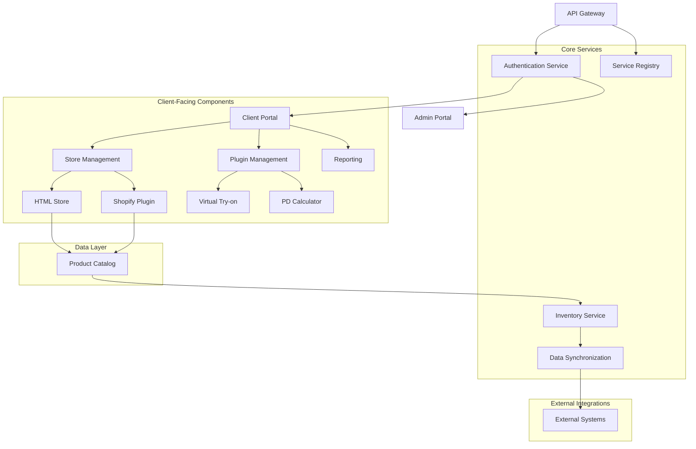

# VARAi Commerce Studio Integration Plan

## Overview

This document outlines the detailed integration plan for VARAi Commerce Studio, focusing on how the various components will work together to create a cohesive platform. The integration plan addresses both internal component integration and external system connectivity.

## Core Integration Architecture



## Integration Patterns

VARAi Commerce Studio will implement the following integration patterns to ensure reliable communication between components:

### 1. API-First Integration

All components will expose and consume RESTful APIs with the following characteristics:

- **OpenAPI Specification**: All APIs will be documented using OpenAPI 3.0
- **Versioning**: APIs will use URL versioning (e.g., `/v1/products`)
- **Authentication**: JWT-based authentication with role-based access control
- **Rate Limiting**: Configurable rate limits to prevent abuse
- **Pagination**: Consistent pagination for list endpoints
- **Error Handling**: Standardized error responses with detailed information

Example API Contract:

```yaml
openapi: 3.0.0
info:
  title: Product Catalog API
  version: 1.0.0
paths:
  /v1/products:
    get:
      summary: List products
      parameters:
        - name: page
          in: query
          schema:
            type: integer
        - name: limit
          in: query
          schema:
            type: integer
      responses:
        '200':
          description: Successful response
          content:
            application/json:
              schema:
                type: object
                properties:
                  items:
                    type: array
                    items:
                      $ref: '#/components/schemas/Product'
                  pagination:
                    $ref: '#/components/schemas/Pagination'
```

### 2. Event-Driven Architecture

For asynchronous communication between components, we will implement an event-driven architecture:

- **Message Broker**: RabbitMQ for reliable message delivery
- **Event Schema**: Standardized event schema with versioning
- **Dead Letter Queues**: For handling failed message processing
- **Event Sourcing**: For critical business processes
- **Idempotent Consumers**: To handle duplicate message delivery

Key Events:

| Event Type | Producer | Consumers | Purpose |
|------------|----------|-----------|---------|
| `product.created` | Inventory Service | HTML Store, Shopify Plugin, Reporting | Notify when new products are added |
| `product.updated` | Inventory Service | HTML Store, Shopify Plugin, Reporting | Notify when product details change |
| `order.placed` | HTML Store, Shopify Plugin | Inventory Service, Reporting | Trigger inventory updates and analytics |
| `client.registered` | Client Portal | All Services | Initialize client-specific resources |
| `tryon.completed` | Virtual Try-on | Reporting | Track try-on usage for analytics |

### 3. Shared Data Access

For components that need direct access to shared data:

- **Database Abstraction**: Repository pattern for data access
- **Read Models**: Specialized read models for reporting and analytics
- **Caching**: Distributed caching for frequently accessed data
- **Data Validation**: Consistent validation rules across components
- **Audit Logging**: Track all data modifications

## Component Integration Details

### Client Registration & Portal Integration

The client registration system will integrate with other components through:

1. **User Provisioning Flow**:
   - Client registration triggers `client.registered` event
   - Authentication service creates client credentials
   - Client portal initializes default settings
   - Store management provisions store resources

2. **Single Sign-On**:
   - JWT-based authentication across all components
   - Role-based access control for feature access
   - Session management with refresh tokens
   - Audit logging for security events

3. **Client Settings Propagation**:
   - Central settings service with API access
   - Component-specific settings with inheritance
   - Real-time settings updates via events
   - Validation rules for setting values

### HTML Store & Shopify Integration

The HTML Store and Shopify Plugin will share core functionality through:

1. **Product Catalog Synchronization**:
   - Bidirectional sync between platforms
   - Conflict resolution strategies
   - Batch processing for large catalogs
   - Delta updates for efficiency

2. **Order Management**:
   - Consistent order processing workflow
   - Status synchronization across platforms
   - Unified order history and reporting
   - Shared fulfillment tracking

3. **Customer Data**:
   - Unified customer profiles
   - Privacy-compliant data sharing
   - Preference synchronization
   - Activity history across platforms

### Plugin Integration

Plugins (Virtual Try-on, PD Calculator) will integrate with the platform through:

1. **Embedding Framework**:
   - JavaScript SDK for frontend integration
   - Responsive design for all devices
   - Theme-aware styling
   - Localization support

2. **Data Exchange**:
   - Secure API access for plugin data
   - User context sharing
   - Result storage and retrieval
   - Analytics event generation

3. **Lifecycle Management**:
   - Version compatibility checking
   - Feature flag control
   - A/B testing support
   - Graceful degradation when unavailable

## External System Integration

### PMS Integration

Integration with Practice Management Systems will be implemented through:

1. **Adapter Pattern**:
   - System-specific adapters for each PMS
   - Common interface for all adapters
   - Configuration-driven connection settings
   - Health monitoring and logging

2. **Data Synchronization**:
   - Scheduled and on-demand sync options
   - Conflict resolution strategies
   - Field mapping configuration
   - Validation and error handling

3. **Authentication Methods**:
   - OAuth 2.0 for modern systems
   - API key authentication for legacy systems
   - Credential encryption and secure storage
   - Token refresh management

### Payment Processing

Payment processing integration will include:

1. **Gateway Abstraction**:
   - Common interface for all payment providers
   - Provider-specific implementations
   - Configuration-driven provider selection
   - Fallback mechanisms for reliability

2. **Security Measures**:
   - PCI-compliant data handling
   - Tokenization for sensitive information
   - Fraud detection integration
   - Secure webhook processing

3. **Transaction Management**:
   - Consistent status tracking
   - Refund and void capabilities
   - Reconciliation reporting
   - Chargeback handling

## Integration Testing Strategy

To ensure reliable integration between all components, we will implement:

### 1. Contract Testing

- Define and validate API contracts between components
- Automated contract verification in CI/CD pipeline
- Consumer-driven contract testing
- Schema validation for all API responses

### 2. Integration Test Suites

- End-to-end test scenarios for key workflows
- Component integration test suites
- Mocked external dependencies
- Realistic test data generation

### 3. Monitoring and Observability

- Distributed tracing across all components
- Correlation IDs for request tracking
- Structured logging with consistent format
- Health check endpoints for all services

## Deployment and Environment Strategy

To support the integration of components across environments:

### 1. Environment Parity

- Consistent configuration across environments
- Infrastructure-as-code for all environments
- Container-based deployment for consistency
- Database migration automation

### 2. Deployment Coordination

- Semantic versioning for all components
- Compatibility matrix maintenance
- Coordinated release planning
- Rollback procedures for failed deployments

### 3. Feature Flags

- Centralized feature flag management
- Environment-specific flag values
- Gradual rollout capabilities
- A/B testing framework integration

## Integration Milestones

| Milestone | Components | Timeline | Dependencies |
|-----------|------------|----------|--------------|
| Core API Framework | API Gateway, Authentication, Service Registry | Month 1 | None |
| Client Portal Integration | Client Portal, Authentication, Settings | Month 2 | Core API Framework |
| Store Platform Integration | HTML Store, Shopify Plugin, Product Catalog | Month 3 | Client Portal Integration |
| Plugin Framework | Virtual Try-on, PD Calculator | Month 4 | Store Platform Integration |
| External System Connectors | PMS Integration, Payment Processing | Month 5 | Plugin Framework |
| Reporting Integration | All Components | Month 6 | All previous milestones |

## Risk Management

| Integration Risk | Impact | Likelihood | Mitigation Strategy |
|------------------|--------|------------|---------------------|
| API compatibility issues | High | Medium | Comprehensive contract testing, versioning strategy |
| Performance bottlenecks | High | Medium | Load testing, performance monitoring, optimization |
| Data synchronization conflicts | Medium | High | Conflict resolution strategies, audit logging |
| External system availability | Medium | Medium | Circuit breakers, fallback mechanisms, retry policies |
| Security vulnerabilities | High | Low | Security testing, code reviews, dependency scanning |

## Conclusion

This integration plan provides a comprehensive framework for ensuring that all components of VARAi Commerce Studio work together seamlessly. By following established integration patterns and implementing robust testing strategies, we will deliver a cohesive platform that provides value to clients while maintaining flexibility for future enhancements.

The plan will be reviewed and updated regularly throughout the development process to address new requirements and challenges as they arise.