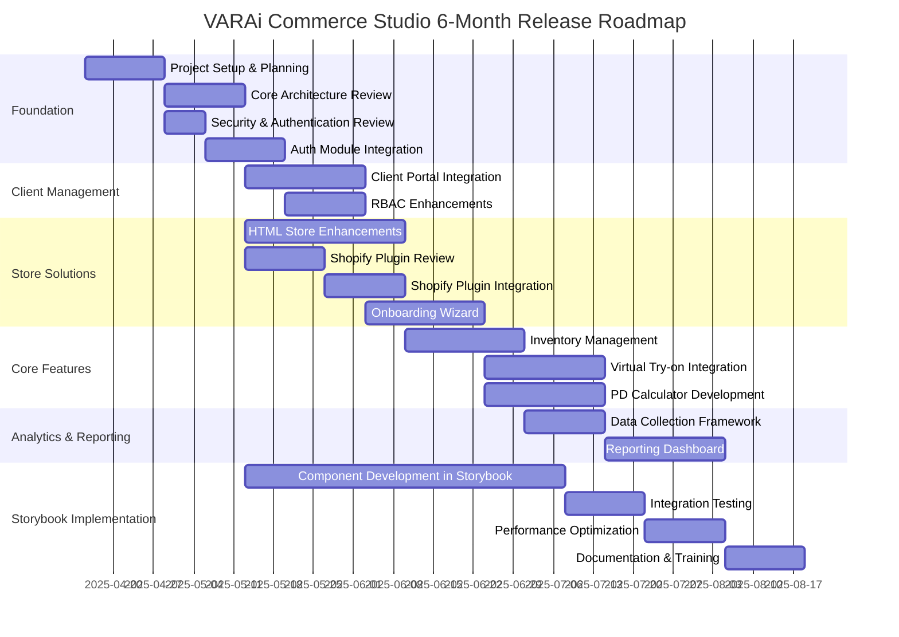
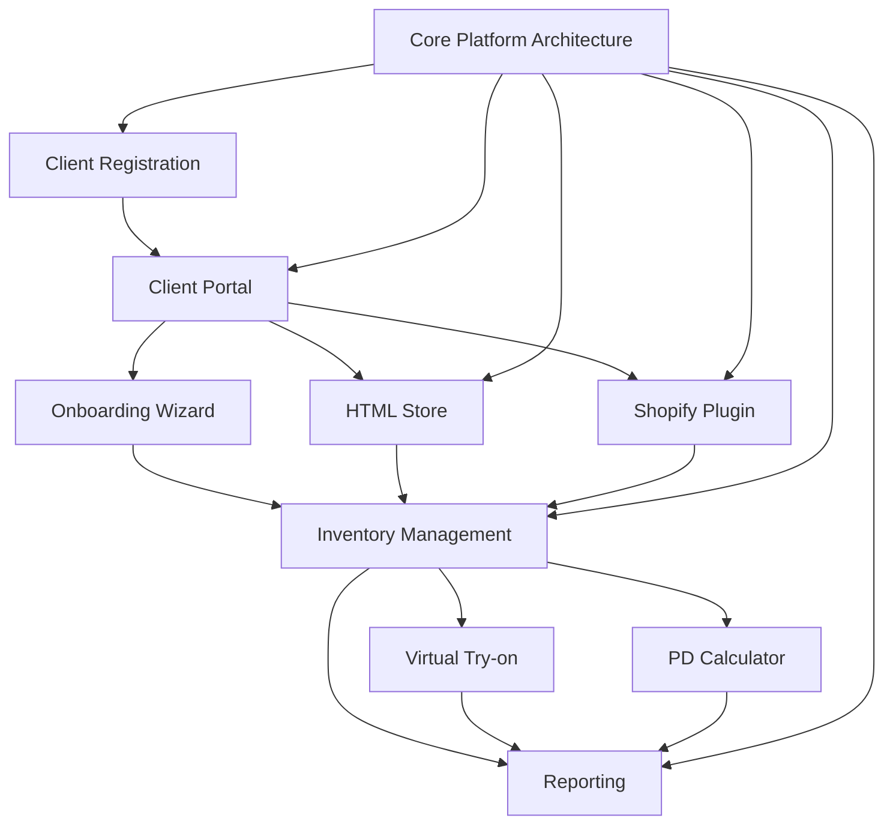

# VARAi Commerce Studio Release Roadmap

## Overview

This roadmap outlines the implementation plan for the first release of VARAi Commerce Studio, a comprehensive platform for eyewear retailers. The platform will enable clients to register, set up HTML stores or use a Shopify plugin, and access core features including an onboarding wizard, inventory browsing, plugins (Virtual try-on, PD-calculator), and reporting capabilities.

This roadmap prioritizes the use of Storybook for component development and design consistency. It also acknowledges the existence of the client portal API, the business services, the auth module, and the Shopify app, and adjusts the plan accordingly.

## Phase 1: Foundation (Months 1-2)

### Project Setup & Planning (2 weeks)
- Define detailed technical specifications
- Establish development environments
- Set up CI/CD pipelines
- Create project management framework
- Define success metrics for the release

### Core Architecture Review (2 weeks)
- Review existing core architecture components
- Identify areas for optimization and improvement
- Plan for integration with business services
- Document architecture decisions

### Security & Authentication Review (1 week)
- Review existing security measures
- Identify potential vulnerabilities
- Plan for integration with auth module

### Auth Module Integration (2 weeks)
- Integrate with existing auth module
- Implement OAuth 2.0 flow
- Implement token management
- Configure authentication for all services

## Phase 2: Client Management (Months 2-3)

### Client Portal Integration (3 weeks)
- Integrate with existing client portal API
- Implement client registration workflow
- Implement client profile management
- Build subscription management
- Build notification system

### RBAC Enhancements (2 weeks)
- Extend existing RBAC system for new client types
- Implement role-based UI adaptations
- Create permission management interface
- Develop audit logging for access control
- Test and validate permission boundaries

## Phase 3: Store Solutions (Months 3-4)

### HTML Store Enhancements (4 weeks)
- Enhance existing HTML store demo
- Implement customization options
- Create mobile-responsive layouts
- Develop theme management system
- Implement SEO optimization features

### Shopify Plugin Review (2 weeks)
- Review existing Shopify app codebase
- Identify areas for improvement and optimization
- Plan for integration with core platform features

### Shopify Plugin Integration (2 weeks)
- Implement product synchronization
- Create customer data integration
- Develop order management
- Build analytics integration

### Onboarding Wizard (3 weeks)
- Design multi-step onboarding flow
- Implement CSV/Excel import functionality
- Create data validation and error handling
- Build progress tracking and resumption
- Develop guided setup experience

## Phase 4: Core Features (Months 4-5)

### Inventory Management (3 weeks)
- Implement inventory browsing interface
- Create search and filtering capabilities
- Develop inventory synchronization
- Build stock level management
- Implement inventory analytics

### Virtual Try-on Integration (3 weeks)
- Integrate existing virtual try-on API
- Implement UI components for try-on experience
- Create mobile-compatible try-on interface
- Develop try-on analytics
- Build try-on result sharing

### PD Calculator Development (3 weeks)
- Design PD measurement interface
- Implement computer vision algorithms
- Create calibration system
- Build result validation
- Develop prescription integration

## Phase 5: Analytics & Reporting (Month 5)

### Data Collection Framework (2 weeks)
- Implement event tracking system
- Create data aggregation pipeline
- Build data storage and retrieval system
- Implement data privacy controls
- Develop data validation and cleaning

### Reporting Dashboard (3 weeks)
- Design interactive reporting interface
- Implement visualization components
- Create export and sharing capabilities
- Build scheduled report generation
- Develop custom report builder

## Phase 6: Storybook Implementation and Finalization (Month 6)

### Component Development in Storybook (8 weeks)
- Implement all UI components in Storybook
- Ensure adherence to design system
- Implement responsive design
- Implement accessibility standards
- Conduct component testing

### Integration Testing (2 weeks)
- Perform end-to-end testing
- Conduct cross-feature integration testing
- Test third-party integrations
- Validate data flow across system
- Perform security penetration testing

### Performance Optimization (2 weeks)
- Conduct load testing
- Optimize database queries
- Implement caching strategies
- Enhance frontend performance
- Optimize API response times

### Documentation & Training (2 weeks)
- Create user documentation
- Develop administrator guides
- Build API documentation
- Create training materials
- Prepare marketing materials

## Key Components and Integration Points

## Technical Architecture

The platform will be built on the existing core architecture, which includes:

1. **API Gateway Layer**: Entry point for all client interactions
2. **Service Infrastructure**: Environment for all platform services
3. **Data Management Layer**: Handles data storage and retrieval
4. **Security Framework**: Ensures protection of platform data
5. **Integration Framework**: Enables connectivity with external systems
6. **Observability Stack**: Provides visibility into platform behavior

The business services, auth module, and Shopify app will be integrated into this architecture.

## Risk Management

| Risk | Mitigation Strategy |
|------|---------------------|
| Integration complexity between components | Implement clear API contracts and comprehensive testing |
| Performance issues with virtual try-on | Implement progressive loading and optimization techniques |
| Data migration challenges during onboarding | Create robust validation and error handling processes |
| Shopify API limitations | Design fallback mechanisms and implement rate limiting handling |
| Security vulnerabilities | Conduct regular security audits and penetration testing |

## Success Criteria

The release will be considered successful when:

1. Clients can register and set up their accounts independently
2. Both HTML store and Shopify plugin options are fully functional
3. The onboarding wizard successfully imports product data
4. Inventory browsing works efficiently with search and filtering
5. Virtual try-on and PD-calculator plugins function correctly
6. Reports provide valuable insights to clients
7. The system meets performance benchmarks under expected load
8. All security requirements are met and validated