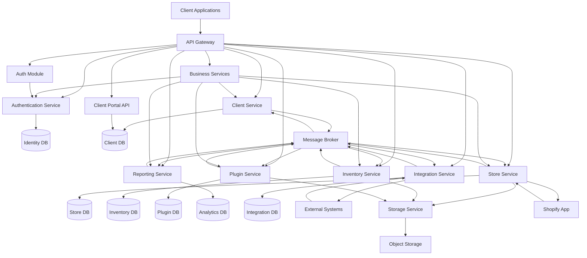
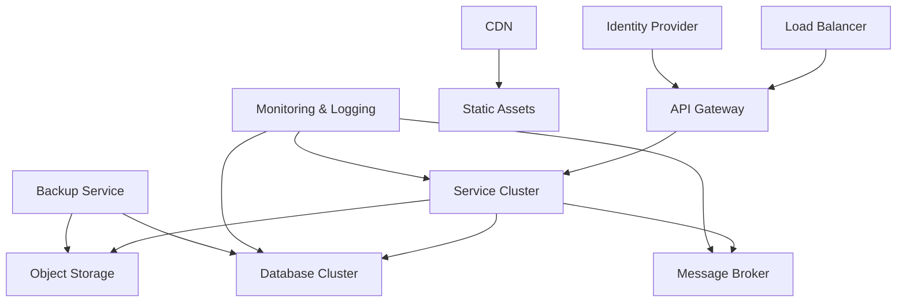
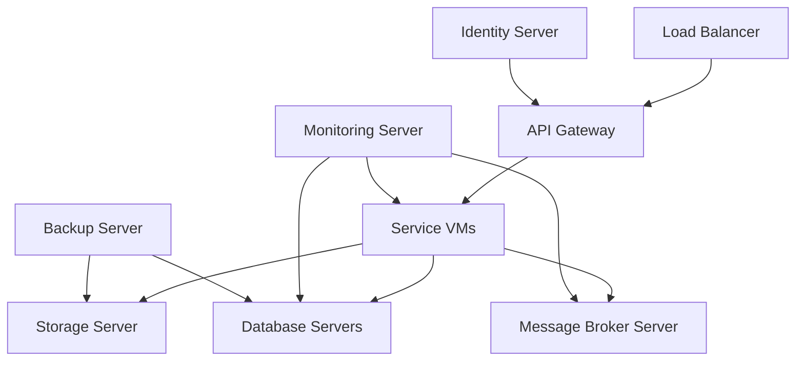

# VARAi Commerce Studio Technical Architecture

## Overview

This document outlines the technical architecture for VARAi Commerce Studio, providing a comprehensive view of the system components, their interactions, and the technologies used to implement them. This architecture is designed to support the platform's requirements for scalability, reliability, security, and extensibility.

## System Architecture

VARAi Commerce Studio follows a microservices architecture pattern, with clear separation of concerns and well-defined interfaces between components. The high-level architecture is illustrated below:

## Component Descriptions

### Client Applications

- **Web Portal**: React-based SPA for client management and administration
- **HTML Store**: Customizable storefront for end customers
- **Shopify App**: Embedded application within Shopify admin
- **Mobile Views**: Responsive interfaces optimized for mobile devices

### Core Services

#### API Gateway

- **Responsibility**: Route requests to appropriate services, handle authentication, rate limiting
- **Technology**: Kong API Gateway
- **Key Features**:
  - Request routing and load balancing
  - Authentication and authorization
  - Rate limiting and throttling
  - Request/response transformation
  - Logging and monitoring

#### Authentication Service

- **Responsibility**: Manage user identity, authentication, and authorization
- **Technology**: Keycloak
- **Key Features**:
  - User registration and management
  - Multi-factor authentication
  - OAuth 2.0 and OpenID Connect
  - Role-based access control
  - Session management

#### Client Service

- **Responsibility**: Manage client accounts, subscriptions, and settings
- **Technology**: Node.js with Express
- **Key Features**:
  - Client profile management
  - Subscription handling
  - Billing integration
  - Notification management
  - Audit logging

#### Store Service

- **Responsibility**: Manage HTML stores and Shopify integration
- **Technology**: Node.js with Express
- **Key Features**:
  - Store configuration
  - Theme management
  - Content management
  - Domain configuration
  - Shopify API integration

#### Inventory Service

- **Responsibility**: Manage product catalog and inventory
- **Technology**: Node.js with Express
- **Key Features**:
  - Product management
  - Inventory tracking
  - Category and tag management
  - Search and filtering
  - Import/export functionality

#### Plugin Service

- **Responsibility**: Manage and serve platform plugins
- **Technology**: Node.js with Express
- **Key Features**:
  - Plugin registration and configuration
  - Virtual try-on processing
  - PD calculator functionality
  - Plugin analytics
  - Version management

#### Reporting Service

- **Responsibility**: Generate and deliver reports and analytics
- **Technology**: Node.js with Express
- **Key Features**:
  - Data aggregation
  - Report generation
  - Dashboard rendering
  - Export functionality
  - Scheduled reporting

#### Integration Service

- **Responsibility**: Manage connections with external systems
- **Technology**: Node.js with Express
- **Key Features**:
  - PMS integration
  - Payment processor integration
  - Shipping provider integration
  - Data synchronization
  - Error handling and recovery

#### Client Portal API

- **Responsibility**: Provide API endpoints for client management and access
- **Technology**: FastAPI
- **Key Features**:
  - Client management endpoints
  - Platform account management endpoints
  - Report management endpoints
  - Scheduled report management endpoints
  - Metrics endpoints

#### Business Services

- **Responsibility**: Provide core business logic and data management
- **Technology**: Node.js with Express
- **Key Features**:
  - Product management
  - User management
  - Order management
  - Inventory management
  - Search functionality

#### Auth Module

- **Responsibility**: Handle authentication and account management
- **Technology**: TypeScript
- **Key Features**:
  - OAuth 2.0 flow
  - Account creation and management
  - Platform-specific integrations
  - Token management and refresh

#### Shopify App

- **Responsibility**: Integrate with Shopify stores for product synchronization
- **Technology**: Node.js
- **Key Features**:
  - OAuth authentication with Shopify
  - Automatic product synchronization
  - Webhook handling for real-time updates
  - Customizable product field mapping

### Data Storage

#### Databases

- **Identity DB**: User accounts and authentication data (PostgreSQL)
- **Client DB**: Client profiles and settings (PostgreSQL)
- **Store DB**: Store configurations and content (PostgreSQL)
- **Inventory DB**: Product and inventory data (MongoDB)
- **Plugin DB**: Plugin configurations and data (MongoDB)
- **Analytics DB**: Reporting and analytics data (TimescaleDB)
- **Integration DB**: Integration configurations and sync state (PostgreSQL)

#### Object Storage

- **Responsibility**: Store binary assets (images, documents, etc.)
- **Technology**: MinIO (on-premise) or AWS S3 (cloud)
- **Key Features**:
  - Secure file storage
  - Content delivery optimization
  - Versioning
  - Access control
  - Lifecycle management

### Communication Infrastructure

#### Message Broker

- **Responsibility**: Enable asynchronous communication between services
- **Technology**: RabbitMQ
- **Key Features**:
  - Reliable message delivery
  - Publish/subscribe patterns
  - Message routing
  - Dead letter handling
  - Priority queues

## Technology Stack

### Frontend Technologies

- **Framework**: React with TypeScript
- **Component Library**: Material-UI
- **Storybook**: For component development, testing, and documentation
- **State Management**: Redux with Redux Toolkit
- **Build Tools**: Webpack, Babel
- **Testing**: Jest, React Testing Library
- **API Communication**: Axios, React Query

### Backend Technologies

- **Runtime**: Node.js
- **Framework**: Express.js, FastAPI (for Client Portal API)
- **API Documentation**: OpenAPI/Swagger
- **Authentication**: Passport.js, JWT
- **Validation**: Joi, Zod
- **Testing**: Mocha, Chai, Supertest

### Database Technologies

- **Relational**: PostgreSQL
- **Document**: MongoDB
- **Time-Series**: TimescaleDB
- **Caching**: Redis
- **Search**: Elasticsearch

### DevOps & Infrastructure

- **Containerization**: Docker
- **Orchestration**: Kubernetes
- **CI/CD**: GitHub Actions
- **Monitoring**: Prometheus, Grafana
- **Logging**: ELK Stack
- **Infrastructure as Code**: Terraform

## Deployment Architecture

VARAi Commerce Studio supports both cloud-based and on-premise deployment models:

### Cloud Deployment

### On-Premise Deployment

## Security Architecture

VARAi Commerce Studio implements a defense-in-depth security strategy:

### Authentication & Authorization

- **Multi-factor Authentication**: Optional for all user accounts
- **Role-Based Access Control**: Granular permissions for all resources
- **JWT-Based Authentication**: Short-lived tokens with refresh capability
- **API Key Management**: For service-to-service communication
- **OAuth 2.0 Integration**: For third-party authentication

### Data Protection

- **Encryption at Rest**: All databases and file storage
- **Encryption in Transit**: TLS 1.3 for all communications
- **PII Protection**: Masking and minimization of sensitive data
- **Data Classification**: Tiered protection based on sensitivity
- **Key Management**: Secure storage and rotation of encryption keys

### Network Security

- **Web Application Firewall**: Protection against common attacks
- **Rate Limiting**: Prevention of abuse and DoS attacks
- **IP Restrictions**: Optional whitelisting for admin functions
- **Network Segmentation**: Isolation of system components
- **Regular Vulnerability Scanning**: Automated and manual testing

## Scalability & Performance

VARAi Commerce Studio is designed for horizontal scalability:

### Scaling Strategies

- **Service Replication**: Multiple instances of stateless services
- **Database Sharding**: For high-volume data stores
- **Read Replicas**: For read-heavy workloads
- **Caching Layers**: Redis for frequent data access
- **CDN Integration**: For static asset delivery

### Performance Optimizations

- **Query Optimization**: Efficient database access patterns
- **Connection Pooling**: Reuse of database connections
- **Asynchronous Processing**: Background handling of non-critical tasks
- **Resource Compression**: Minimized payload sizes
- **Lazy Loading**: On-demand resource fetching

## Resilience & Fault Tolerance

The system is designed to maintain availability during component failures:

### Resilience Patterns

- **Circuit Breakers**: Prevent cascading failures
- **Retry Mechanisms**: Automatic recovery from transient failures
- **Fallback Strategies**: Degraded functionality when dependencies fail
- **Bulkhead Pattern**: Isolation of failure domains
- **Health Monitoring**: Proactive detection of issues

### Data Resilience

- **Database Replication**: Multiple copies of critical data
- **Point-in-Time Recovery**: Regular backups with transaction logs
- **Consistency Checks**: Validation of data integrity
- **Disaster Recovery**: Cross-region backup and restoration
- **Data Versioning**: History of changes for critical entities

## Integration Architecture

VARAi Commerce Studio provides multiple integration methods:

### API Integration

- **RESTful APIs**: Primary integration method
- **GraphQL**: For complex data requirements
- **Webhooks**: For event-driven integration
- **Batch APIs**: For high-volume data exchange
- **API Versioning**: For backward compatibility

### File-Based Integration

- **Secure File Transfer**: SFTP/FTPS for file exchange
- **Standardized Formats**: CSV, JSON, XML
- **Validation Rules**: Schema enforcement
- **Transformation Pipeline**: Data mapping and normalization
- **Error Handling**: Comprehensive validation reporting

### Direct Integration

- **Database Views**: Read-only access to specific data
- **Message Queue Consumers**: Direct event consumption
- **Service Mesh**: For internal service communication
- **Shared Storage**: For large file exchange
- **SDK Libraries**: For embedded functionality

## Monitoring & Observability

Comprehensive monitoring ensures system health and performance:

### Monitoring Components

- **Infrastructure Monitoring**: CPU, memory, disk, network
- **Application Monitoring**: Service health, response times
- **Database Monitoring**: Query performance, connection pools
- **User Experience Monitoring**: Page load times, error rates
- **Business Metrics**: Conversion rates, usage patterns

### Observability Tools

- **Distributed Tracing**: Request flow across services
- **Centralized Logging**: Aggregated logs with search
- **Metrics Dashboard**: Real-time performance visualization
- **Alerting System**: Proactive notification of issues
- **Performance Analytics**: Trend analysis and forecasting

## Development Workflow

The development process follows industry best practices:

### Development Environment

- **Local Development**: Docker Compose for service dependencies
- **Development Tools**: VS Code with standardized extensions
- **API Documentation**: Auto-generated from code annotations
- **Style Guides**: Enforced through linting and formatting
- **Code Reviews**: Required for all changes

### CI/CD Pipeline

- **Automated Testing**: Unit, integration, and end-to-end tests
- **Static Analysis**: Code quality and security scanning
- **Build Automation**: Containerization of all components
- **Deployment Automation**: Infrastructure as code
- **Environment Promotion**: Staged rollout process

## Conclusion

The VARAi Commerce Studio technical architecture provides a robust foundation for building a scalable, reliable, and secure platform for eyewear retailers. By leveraging modern architectural patterns and technologies, the system can meet current requirements while remaining flexible for future enhancements.

This architecture will evolve over time based on operational experience, changing requirements, and emerging technologies, with all changes properly documented and communicated to the development team.