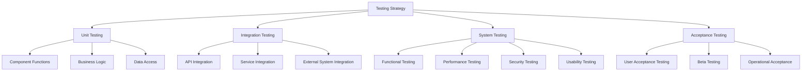
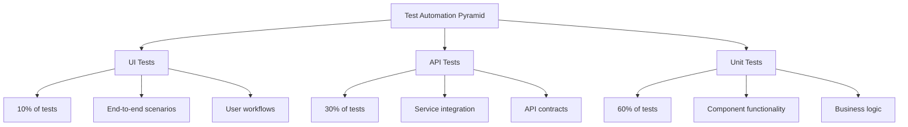
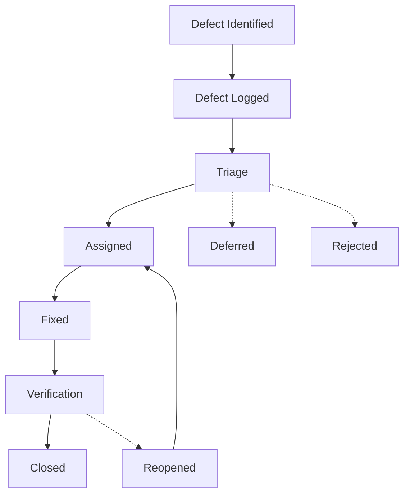

# VARAi Commerce Studio Testing Strategy

## Overview

This document outlines the comprehensive testing strategy for VARAi Commerce Studio. It defines the approach, methodologies, tools, and processes that will be used to ensure the quality, reliability, and performance of the platform before and after release.

## Testing Objectives

The primary objectives of this testing strategy are to:

1. **Ensure Functionality**: Verify that all features work as specified in the requirements
2. **Validate Quality**: Ensure the platform meets quality standards for usability, performance, and reliability
3. **Identify Defects**: Discover and address issues early in the development lifecycle
4. **Verify Integration**: Ensure all components work together seamlessly
5. **Confirm Security**: Validate that security measures protect user data and system integrity
6. **Assess Performance**: Verify the system performs efficiently under expected load
7. **Ensure Compatibility**: Confirm the platform works across supported devices and browsers

## Testing Levels

### 1. Unit Testing

Unit testing focuses on verifying individual components in isolation.

#### Scope

- Individual functions and methods
- Service components
- UI components
- Data access layers
- Business logic

#### Approach

- **Test-Driven Development**: Write tests before implementation where appropriate
- **Mocking**: Use mock objects to isolate units from dependencies
- **Code Coverage**: Aim for at least 80% code coverage
- **Automated Execution**: Run as part of CI/CD pipeline

#### Tools

- **Backend**: Jest, Mocha, Chai
- **Frontend**: Jest, React Testing Library
- **Coverage**: Istanbul
- **Mocking**: Sinon, Jest mock functions

### 2. Integration Testing

Integration testing verifies that different components work together correctly.

#### Scope

- API contracts between services
- Database interactions
- Message broker communication
- External service integration
- Frontend-backend integration

#### Approach

- **API Testing**: Verify API contracts and responses
- **Service Integration**: Test service-to-service communication
- **Database Integration**: Verify data persistence and retrieval
- **Event Processing**: Test message publishing and consumption
- **External Systems**: Test integration with third-party services

#### Tools

- **API Testing**: Supertest, Postman
- **Contract Testing**: Pact
- **Database Testing**: Test containers
- **Mock Services**: Wiremock, MSW

### 3. System Testing

System testing evaluates the complete, integrated system to verify it meets requirements.

#### Scope

- End-to-end functionality
- Performance and load handling
- Security vulnerabilities
- Usability and accessibility
- Error handling and recovery

#### Approach

- **Functional Testing**: Verify all features work as expected
- **Performance Testing**: Assess system under various load conditions
- **Security Testing**: Identify vulnerabilities and verify protections
- **Usability Testing**: Evaluate user experience and interface
- **Resilience Testing**: Verify system behavior during failures

#### Tools

- **E2E Testing**: Cypress, Playwright
- **Performance Testing**: JMeter, k6
- **Security Testing**: OWASP ZAP, SonarQube
- **Accessibility Testing**: Axe, Lighthouse
- **Chaos Testing**: Chaos Monkey

### 4. Acceptance Testing

Acceptance testing validates that the system meets business requirements and is ready for release.

#### Scope

- User acceptance criteria
- Business process validation
- Operational readiness
- Regulatory compliance
- Real-world scenarios

#### Approach

- **User Acceptance Testing**: Stakeholder validation of features
- **Beta Testing**: Limited release to selected users
- **Operational Acceptance**: Verify deployment and support processes
- **Compliance Testing**: Validate regulatory requirements
- **Scenario-Based Testing**: Test real-world use cases

#### Tools

- **UAT Management**: TestRail, Zephyr
- **Beta Distribution**: Firebase App Distribution
- **Feedback Collection**: Forms, in-app feedback

## Testing Types

### Functional Testing

Verifies that each feature works according to requirements.

#### Key Areas

- Client registration and management
- HTML store functionality
- Shopify plugin integration
- Onboarding wizard process
- Inventory management
- Plugin functionality
- Reporting and analytics
- PMS integration

#### Test Cases

- **Positive Testing**: Verify expected behavior with valid inputs
- **Negative Testing**: Verify appropriate handling of invalid inputs
- **Boundary Testing**: Test edge cases and limits
- **Workflow Testing**: Validate end-to-end processes

### Performance Testing

Evaluates system performance under various conditions.

#### Test Types

- **Load Testing**: System behavior under expected load
- **Stress Testing**: System behavior under extreme load
- **Endurance Testing**: System behavior over extended periods
- **Spike Testing**: System response to sudden load increases
- **Volume Testing**: System handling of large data volumes

#### Key Metrics

- Response time
- Throughput
- Resource utilization
- Error rate
- Scalability

### Security Testing

Identifies vulnerabilities and verifies security controls.

#### Test Types

- **Vulnerability Assessment**: Identify security weaknesses
- **Penetration Testing**: Attempt to exploit vulnerabilities
- **Security Scanning**: Automated security checks
- **Authentication Testing**: Verify access control mechanisms
- **Data Protection**: Verify encryption and privacy controls

#### Focus Areas

- Authentication and authorization
- Data encryption
- Input validation
- Session management
- API security
- Dependency vulnerabilities

### Usability Testing

Evaluates the user experience and interface design.

#### Test Types

- **Exploratory Testing**: Unscripted exploration of the interface
- **Cognitive Walkthrough**: Step-by-step analysis of user tasks
- **Heuristic Evaluation**: Expert review against usability principles
- **User Testing**: Observation of actual users performing tasks

#### Key Metrics

- Task completion rate
- Time on task
- Error rate
- User satisfaction
- System Usability Scale (SUS) score

### Compatibility Testing

Verifies the system works across different environments.

#### Test Dimensions

- **Browser Compatibility**: Chrome, Firefox, Safari, Edge
- **Device Compatibility**: Desktop, tablet, mobile
- **OS Compatibility**: Windows, macOS, iOS, Android
- **Resolution Testing**: Various screen sizes and resolutions

#### Approach

- **Cross-browser Testing**: Verify functionality across browsers
- **Responsive Design Testing**: Verify layout across devices
- **Feature Detection**: Verify graceful degradation when features aren't supported

### Accessibility Testing

Ensures the system is usable by people with disabilities.

#### Standards

- Web Content Accessibility Guidelines (WCAG) 2.1 AA
- Section 508 compliance

#### Test Areas

- Keyboard navigation
- Screen reader compatibility
- Color contrast
- Text resizing
- Alternative text for images
- Form accessibility

## Test Environments

### Development Environment

- **Purpose**: Developer testing during implementation
- **Data**: Synthetic test data
- **Deployment**: Automated from feature branches
- **Access**: Development team only

### Testing Environment

- **Purpose**: Formal testing by QA team
- **Data**: Anonymized production-like data
- **Deployment**: Automated from development branch
- **Access**: Development and QA teams

### Staging Environment

- **Purpose**: Pre-production validation
- **Data**: Production-like data volume and variety
- **Infrastructure**: Mirror of production
- **Deployment**: Automated from release branches
- **Access**: Development, QA, and stakeholders

### Production Environment

- **Purpose**: Live system
- **Data**: Real user data
- **Monitoring**: Full production monitoring
- **Deployment**: Controlled release process
- **Access**: End users and support team

## Test Data Management

### Data Requirements

- **Variety**: Cover all possible scenarios and edge cases
- **Volume**: Sufficient to test performance
- **Realism**: Representative of real-world data
- **Consistency**: Reliable across test runs
- **Privacy**: Compliant with data protection regulations

### Data Sources

- **Generated Data**: Programmatically created test data
- **Anonymized Production Data**: Sanitized real data
- **Synthetic Data Sets**: Pre-created comprehensive data sets
- **API Mocks**: Simulated external system data

### Data Management Practices

- **Version Control**: Track changes to test data
- **Refresh Process**: Regular updates to test data
- **Isolation**: Prevent test data contamination
- **Cleanup**: Remove test data after test execution
- **Documentation**: Catalog available test data sets

## Test Automation

### Automation Strategy

- **Scope**: Define what should be automated vs. manual testing
- **Framework**: Establish consistent automation frameworks
- **Maintenance**: Plan for ongoing test maintenance
- **Execution**: Integrate with CI/CD pipeline

### Automation Pyramid

### Automation Framework

- **Architecture**: Page Object Model for UI tests
- **Reusability**: Shared test utilities and helpers
- **Reporting**: Detailed test execution reports
- **Stability**: Reliable test execution
- **Maintainability**: Easy to update and extend

## Continuous Testing

### CI/CD Integration

- **Pull Request Validation**: Run unit and integration tests
- **Nightly Builds**: Run full test suite including performance tests
- **Pre-release Testing**: Complete system and acceptance testing
- **Post-deployment Verification**: Smoke tests in production

### Test Execution Flow

```mermaid
graph LR
    A[Code Commit] --> B[Static Analysis]
    B --> C[Unit Tests]
    C --> D[Build]
    D --> E[Deploy to Test]
    E --> F[Integration Tests]
    F --> G[System Tests]
    G --> H[Deploy to Staging]
    H --> I[Acceptance Tests]
    I --> J[Deploy to Production]
    J --> K[Smoke Tests]
    K --> L[Monitoring]
```

## Defect Management

### Defect Lifecycle

### Defect Prioritization

- **Critical**: System crash, data loss, security breach
- **High**: Major feature broken, significant impact on users
- **Medium**: Feature partially broken, workaround available
- **Low**: Minor issues, cosmetic problems

### Defect Metrics

- **Defect Density**: Defects per feature or code unit
- **Defect Leakage**: Defects found in production
- **Defect Age**: Time from identification to resolution
- **Defect Distribution**: Patterns across components
- **Fix Rate**: Speed of defect resolution

## Reporting and Metrics

### Test Execution Metrics

- **Test Pass Rate**: Percentage of passing tests
- **Test Coverage**: Code and requirement coverage
- **Test Execution Time**: Duration of test runs
- **Test Stability**: Consistency of test results
- **Automation Rate**: Percentage of automated tests

### Quality Metrics

- **Defect Trends**: Pattern of defects over time
- **Defect Density**: Defects per feature or component
- **Technical Debt**: Accumulated code quality issues
- **Customer-Reported Issues**: Problems found by users
- **Mean Time to Recovery**: Time to resolve production issues

### Reporting Tools

- **Test Management**: TestRail, Zephyr
- **Defect Tracking**: Jira
- **Test Automation Reports**: Allure, ExtentReports
- **Code Quality**: SonarQube
- **Dashboards**: Grafana, custom dashboards

## Risk-Based Testing

### Risk Assessment

- **Identify Risks**: Potential areas of failure
- **Assess Impact**: Consequence of failure
- **Evaluate Probability**: Likelihood of occurrence
- **Calculate Risk**: Impact × Probability

### Risk Mitigation

- **Prioritize Testing**: Focus on high-risk areas
- **Increase Coverage**: More thorough testing for critical features
- **Early Testing**: Test high-risk areas earlier
- **Specialized Testing**: Additional security or performance testing

### Risk Matrix

| Probability/Impact | Low | Medium | High |
|-------------------|-----|--------|------|
| **High** | Medium Risk | High Risk | Critical Risk |
| **Medium** | Low Risk | Medium Risk | High Risk |
| **Low** | Very Low Risk | Low Risk | Medium Risk |

## Test Team Organization

### Roles and Responsibilities

- **Test Manager**: Overall testing strategy and coordination
- **Test Analysts**: Test planning and design
- **Test Automation Engineers**: Develop and maintain test automation
- **Performance Testers**: Specialized performance testing
- **Security Testers**: Specialized security testing
- **Accessibility Specialists**: Accessibility testing and compliance

### Collaboration Model

- **Shift-Left Testing**: Early involvement in requirements and design
- **Embedded Testers**: QA members within development teams
- **Testing Community**: Shared practices and knowledge
- **Cross-Functional Testing**: Developers participate in testing

## Training and Knowledge Sharing

- **Test Documentation**: Maintain comprehensive test documentation
- **Knowledge Base**: Capture testing knowledge and lessons learned
- **Training Sessions**: Regular skill development for test team
- **Communities of Practice**: Share expertise across teams
- **External Learning**: Industry conferences and courses

## Conclusion

This testing strategy provides a comprehensive framework for ensuring the quality, reliability, and performance of VARAi Commerce Studio. By implementing this strategy, we aim to deliver a platform that meets user expectations, performs efficiently under load, and maintains the highest standards of security and usability.

The strategy will be reviewed and updated regularly to incorporate lessons learned and adapt to changing requirements and technologies.