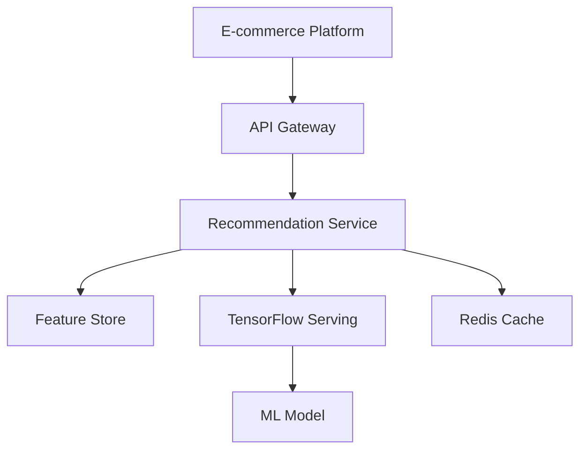

# Example Prompts for EyewearML Development

This document provides EyewearML-specific examples of effective prompts when working with AI agents. These examples demonstrate how to structure prompts for common tasks related to our recommendation system, biometric data processing, and e-commerce integrations.

## Model Enhancement

```
# Task: Improve Face Shape Detection Accuracy

## Context
- Our current face shape detection model has 78% accuracy on the test set
- We're using a CNN-based approach with TensorFlow
- Face shape is critical for accurate frame recommendations
- Training data comes from our biometric profile database
- We see lower accuracy for certain face shapes (heart, diamond)

## Objective
Improve the face shape detection model to achieve at least 85% accuracy across all face shape categories.

## Requirements
- Model should maintain or improve inference speed (currently 120ms)
- Solutions should work with our existing TensorFlow pipeline
- Must handle varied lighting conditions and image qualities
- Must generalize well to diverse facial features and demographics

## Constraints
- We can't collect substantial new training data in the short term
- Model must run on our current infrastructure (GPU: NVIDIA T4)
- Training time should not exceed 24 hours on our hardware
- Model size should not exceed 100MB

## Relevant Code
Current model architecture:
```python
def create_face_shape_model(input_shape=(224, 224, 3), num_classes=7):
    base_model = tf.keras.applications.MobileNetV2(
        input_shape=input_shape,
        include_top=False,
        weights='imagenet'
    )
    
    # Freeze base model
    base_model.trainable = False
    
    model = tf.keras.Sequential([
        base_model,
        tf.keras.layers.GlobalAveragePooling2D(),
        tf.keras.layers.Dense(128, activation='relu'),
        tf.keras.layers.Dropout(0.2),
        tf.keras.layers.Dense(num_classes, activation='softmax')
    ])
    
    return model
```

Current data augmentation pipeline:
```python
data_augmentation = tf.keras.Sequential([
    tf.keras.layers.RandomFlip("horizontal"),
    tf.keras.layers.RandomRotation(0.1),
    tf.keras.layers.RandomZoom(0.1),
])
```

Confusion matrix on test set:
```
[[230  12   8   5   3   2   0]  # Oval
 [ 18 189  15  12   8   6   2]  # Round
 [ 14  21 178  16  10   8   3]  # Square
 [  8  12  15 165  18  12   5]  # Heart
 [  6   9  12  20 152  14   7]  # Diamond
 [  4   7   9  11  16 198   5]  # Oblong
 [  3   5   7   9  11   8 207]] # Triangle
```

## Expected Output
1. Analysis of current model limitations and bottlenecks
2. Proposed architectural improvements (with code samples)
3. Suggested data augmentation enhancements (with code samples)
4. Training strategy recommendations
5. Evaluation approach to validate improvements

## Specific Questions
1. What architectural changes might improve performance on the underperforming classes?
2. How can we enhance data augmentation to address the class imbalance?
3. Should we implement techniques like focal loss or class weighting?
4. Would self-supervised pretraining help with our limited dataset?
5. Are there model ensembling approaches that could improve results?
```

## Data Pipeline Enhancement

```
# Task: Optimize Frame Feature Extraction Pipeline

## Context
- We extract features from frame images for our recommendation system
- Current pipeline processes ~2000 new frames daily from various sources
- Processing includes: image standardization, feature extraction, embedding generation
- Pipeline runs on our Digital Ocean infrastructure using Apache Airflow
- Performance bottlenecks are causing delays in new frame availability

## Objective
Optimize the frame feature extraction pipeline to reduce end-to-end processing time by 50% without reducing feature quality.

## Requirements
- Must maintain current feature quality and dimensionality
- Should scale efficiently with increasing frame catalog size
- Must integrate with existing Airflow DAGs
- Should be resource-efficient on our current infrastructure

## Constraints
- Minimal changes to the existing database schema
- Limited by current infrastructure (no hardware upgrades planned)
- Must handle varied image sources and formats
- Can't significantly increase compute costs

## Current Implementation
```python
# Current DAG structure (simplified)
with DAG(
    'frame_feature_extraction',
    default_args=default_args,
    schedule_interval='@daily',
    catchup=False
) as dag:
    
    # Extract new frame data
    extract_new_frames = PythonOperator(
        task_id='extract_new_frames',
        python_callable=extract_frames_from_sources
    )
    
    # Process images (slow)
    process_frame_images = PythonOperator(
        task_id='process_frame_images',
        python_callable=process_images
    )
    
    # Extract features (very slow)
    extract_features = PythonOperator(
        task_id='extract_features',
        python_callable=extract_frame_features
    )
    
    # Generate embeddings
    generate_embeddings = PythonOperator(
        task_id='generate_embeddings',
        python_callable=generate_frame_embeddings
    )
    
    # Store in feature store
    store_features = PythonOperator(
        task_id='store_features',
        python_callable=store_features_in_db
    )
    
    # Define dependencies
    extract_new_frames >> process_frame_images >> extract_features >> generate_embeddings >> store_features
```

Feature extraction function (bottleneck):
```python
def extract_frame_features(images_list):
    features = []
    model = load_feature_extraction_model()  # Takes ~30 seconds
    
    for image_path in images_list:
        img = load_image(image_path)  # Not optimized
        img = preprocess_image(img)   # Sequential processing
        
        # Extract features (GPU underutilized)
        feature_vector = model.predict(np.expand_dims(img, axis=0))[0]
        features.append({
            'image_path': image_path,
            'features': feature_vector
        })
    
    return features
```

## Expected Output
1. Analysis of current bottlenecks with profiling data
2. Optimized code implementation for the pipeline
3. Expected performance improvements with justification
4. Implementation plan with minimal disruption
5. Monitoring recommendations for the optimized pipeline

## Specific Questions
1. How can we parallelize the feature extraction process?
2. Would batch processing improve GPU utilization?
3. Are there opportunities for caching or memoization?
4. Could we use a more efficient model without sacrificing quality?
5. How can we optimize image loading and preprocessing?
```

## Integration Enhancement

```
# Task: Implement A/B Testing Framework for Recommendation Algorithms

## Context
- We need to compare the performance of different recommendation algorithms
- Our platform is integrated with multiple e-commerce platforms (Shopify, BigCommerce, Magento, WooCommerce)
- We want to measure recommendation effectiveness through CTR, engagement time, and conversion rates
- We currently have a basic recommendation service without A/B testing capabilities

## Objective
Design and implement an A/B testing framework that allows us to:
1. Compare multiple recommendation algorithms simultaneously
2. Collect relevant metrics for each algorithm
3. Analyze performance across different user segments
4. Gradually roll out better-performing algorithms

## Requirements
- Framework must work across all e-commerce platform integrations
- Must be able to test at least 3 algorithms simultaneously
- Should support user segmentation (by demographics, behavior, etc.)
- Must collect and store relevant metrics for statistical analysis
- Should have a dashboard for visualizing results
- Must respect user privacy and data regulations

## Constraints
- Minimal changes to existing recommendation API interfaces
- Must handle traffic spikes during peak shopping periods
- Should not noticeably impact response times (max 50ms overhead)
- Must maintain data consistency across platform integrations

## Relevant Code
Current recommendation service interface:
```python
class RecommendationService:
    """Main service interface for the recommendation system."""
    
    def __init__(
        self,
        db_client,
        cache_client,
        model_config: Optional[Dict] = None
    ):
        # Initialize components
        self.feature_store = FeatureStore(db_client)
        self.event_processor = EventProcessor(cache_client, self.feature_store)
        
        # Initialize model with default or provided config
        if model_config is None:
            model_config = {
                'embedding_dimension': 64,
                'hidden_layers': [128, 64, 32],
                'learning_rate': 0.001,
                'dropout_rate': 0.1
            }
            
        self.model = EnhancedRecommender(**model_config)
        
        # Initialize recommendation engine
        self.engine = RecommendationEngine(
            self.model,
            self.feature_store,
            cache_client
        )
        
    async def get_recommendations(
        self,
        user_id: str,
        session_id: Optional[str] = None,
        limit: int = 10
    ) -> List[Dict]:
        """Get personalized frame recommendations for a user."""
        try:
            recommendations = await self.engine.get_recommendations(
                user_id,
                session_id
            )
            
            # Format response
            return [{
                'frame_id': rec['frame'].frame_id,
                'brand': rec['frame'].brand,
                'style': rec['frame'].style,
                'price': rec['frame'].price,
                'score': rec['score'],
                'reasoning': rec['reasoning']
            } for rec in recommendations[:limit]]
            
        except Exception as e:
            print(f"Error getting recommendations: {str(e)}")
            return []
```

## Expected Output
1. System design document for the A/B testing framework
2. Database schema changes required (if any)
3. Code implementation for the framework components
4. API changes or new endpoints needed
5. Dashboard design for visualizing experiment results
6. Implementation plan with a phased rollout approach

## Specific Questions
1. What's the best way to assign users to experiment groups?
2. How should we handle users across multiple platform integrations?
3. What statistical methods should we use to evaluate results?
4. How can we ensure the A/B testing doesn't impact system performance?
5. What metrics should we prioritize for eyewear recommendations?
```

## MLOps Implementation

```
# Task: Implement Model Performance Monitoring System

## Context
- Our recommendation model is deployed in production on Google Cloud
- We're seeing occasional performance degradation without clear causes
- We need to monitor model performance across all e-commerce integrations
- Current monitoring is limited to basic API metrics (latency, error rates)
- We want to detect and alert on model performance issues proactively

## Objective
Design and implement a comprehensive model monitoring system that tracks recommendation quality metrics, detects performance degradation, and alerts the team to potential issues.

## Requirements
- Monitor key performance metrics (CTR, conversion rate, recommendation diversity)
- Track feature drift for key user and product features
- Set up automated alerts for performance degradation
- Create a dashboard for monitoring model performance
- Support model A/B test result visualization
- Enable performance comparison across different user segments

## Constraints
- Minimal impact on inference latency (<10ms overhead)
- Must work with our existing GCP-based infrastructure
- Data collection must comply with privacy regulations
- Should integrate with our existing alerting system
- Must work across all platform integrations

## Relevant Infrastructure
- Model hosted on Google Cloud Vertex AI
- Application running on Vercel
- Metrics stored in Google BigQuery
- Alerting through PagerDuty
- Logging through Google Cloud Logging

## Expected Output
1. System architecture for the monitoring system
2. Implementation code for metrics collection and storage
3. Dashboard design and implementation
4. Alert configuration and thresholds
5. Documentation for maintaining and extending the system

## Specific Questions
1. What additional metrics should we track beyond CTR and conversion rate?
2. How can we detect feature drift efficiently?
3. What visualization techniques work best for monitoring recommendation quality?
4. How should we set thresholds for alerting?
5. How can we correlate performance issues with system or data changes?
```

## System Optimization

```
# Task: Optimize Recommendation Inference for High-Traffic Periods

## Context
- Our recommendation service experiences 10x normal traffic during promotional events
- Current system sometimes becomes unresponsive during these periods
- We use TensorFlow Serving for model inference on Google Cloud
- Average inference time increases from 90ms to 350ms during high traffic
- Caching is minimally effective due to personalized recommendations

## Objective
Optimize the recommendation inference pipeline to maintain sub-100ms response times during high-traffic promotional events without significantly increasing infrastructure costs.

## Requirements
- Must maintain recommendation quality and personalization
- Should scale efficiently with traffic spikes
- Must handle at least 1000 requests per second
- Should degrade gracefully under extreme load
- Must integrate with existing monitoring systems

## Constraints
- Infrastructure budget cannot increase by more than 30%
- Cannot significantly change the recommendation model architecture
- Must maintain compatibility with existing applications
- Solutions should be deployable within 2 weeks

## Current System Architecture


Current inference code:
```python
async def get_recommendations(self, user_id, session_id=None, limit=10):
    # Check cache (not very effective)
    cache_key = f"recommendations:{user_id}:{session_id}"
    cached_recommendations = await self.cache_client.get(cache_key)
    if cached_recommendations:
        return cached_recommendations[:limit]
    
    # Get user features (slow during high traffic)
    biometric = await self.feature_store.get_biometric_profile(user_id)
    preferences = await self.feature_store.get_user_preferences(user_id)
    
    # Get real-time features if available
    realtime_features = None
    if session_id:
        realtime_features = await self.cache_client.get(
            f"realtime_features:{user_id}"
        )
    
    # Get candidate frames (slow query during high traffic)
    candidates = await self.feature_store.get_candidate_frames(
        biometric.face_shape
    )
    
    # Prepare features for model
    user_features = self.prepare_user_features(
        biometric, preferences, realtime_features
    )
    frame_features = self.prepare_frame_features(candidates)
    
    # Model inference (becomes bottleneck)
    similarity_scores, user_embedding = await self.model_client.predict(
        user_features, frame_features
    )
    
    # Apply business rules (CPU-intensive)
    recommendations = self.apply_business_rules(
        candidates, similarity_scores, biometric, preferences
    )
    
    # Cache results (2-minute TTL)
    await self.cache_client.set(
        cache_key, recommendations, expire=120
    )
    
    return recommendations[:limit]
```

## Expected Output
1. Analysis of current bottlenecks with profiling data
2. Proposed optimizations with implementation code
3. Expected performance improvements with benchmarking results
4. Scaling strategy for high-traffic periods
5. Implementation and deployment plan
6. Monitoring recommendations for the optimized system

## Specific Questions
1. How can we optimize the feature retrieval process?
2. What caching strategies would be effective for personalized recommendations?
3. Could we use approximate nearest neighbor techniques to improve performance?
4. What trade-offs between personalization and performance are acceptable?
5. How can we better utilize cloud resources during traffic spikes?
```

## Additional Tips for EyewearML-Specific Prompts

When creating prompts for EyewearML tasks, consider these additional guidelines:

1. **Include Biometric Context**: When working with face shape detection or measurement features, include details about the biometric data format, processing requirements, and privacy considerations.

2. **Specify E-commerce Integration Requirements**: For features that interact with e-commerce platforms, clearly specify which platforms need to be supported and any platform-specific requirements.

3. **Address Recommendation Explainability**: For recommendation system enhancements, include requirements for explanation generation that helps customers understand why specific frames were recommended.

4. **Consider Performance Across Devices**: Specify performance requirements across different devices, as customers may use the virtual try-on features on mobile devices with varying capabilities.

5. **Include Visual Fidelity Requirements**: For features involving image processing or virtual try-on, specify visual quality requirements and acceptable trade-offs between fidelity and performance.

6. **Define Success Metrics**: Clearly define how the success of ML improvements will be measured (e.g., recommendation click-through rate, conversion improvement, user engagement time).
