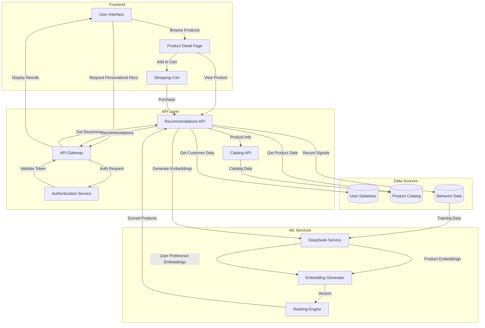
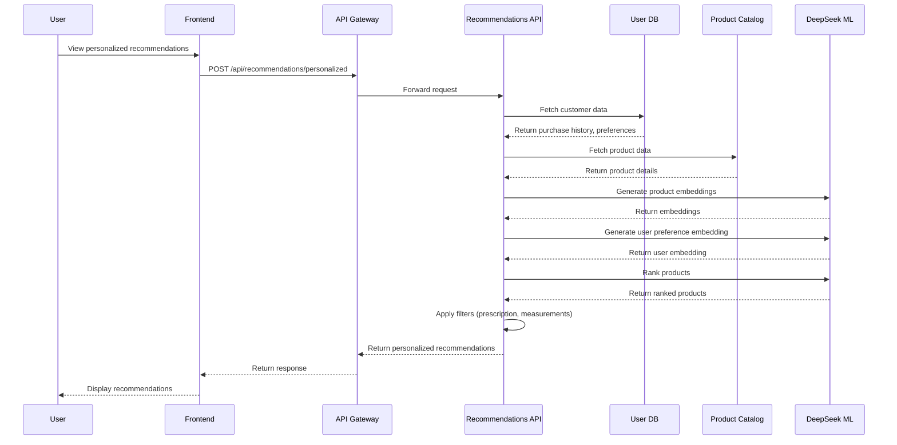

# Personalized Recommendations Flow Diagram

This diagram illustrates how the personalized recommendations system integrates with the overall platform.

## System Architecture



## Data Flow for Personalized Recommendations



## Reinforcement Learning Signal Flow

```mermaid
sequenceDiagram
    participant User
    participant Frontend
    participant API Gateway
    participant Recommendations API
    participant Behavior DB
    participant ML Training Pipeline
    
    User->>Frontend: View product
    Frontend->>API Gateway: POST /api/recommendations/signals
    Note over Frontend,API Gateway: action_type: "view"
    API Gateway->>Recommendations API: Forward request
    Recommendations API->>Behavior DB: Store interaction signal
    Behavior DB-->>Recommendations API: Confirm storage
    Recommendations API-->>API Gateway: Return success response
    API Gateway-->>Frontend: Return response
    
    User->>Frontend: Add to cart
    Frontend->>API Gateway: POST /api/recommendations/signals
    Note over Frontend,API Gateway: action_type: "add_to_cart"
    API Gateway->>Recommendations API: Forward request
    Recommendations API->>Behavior DB: Store interaction signal
    Behavior DB-->>Recommendations API: Confirm storage
    Recommendations API-->>API Gateway: Return success response
    API Gateway-->>Frontend: Return response
    
    User->>Frontend: Purchase product
    Frontend->>API Gateway: POST /api/recommendations/signals
    Note over Frontend,API Gateway: action_type: "purchase"
    API Gateway->>Recommendations API: Forward request
    Recommendations API->>Behavior DB: Store interaction signal
    Behavior DB-->>Recommendations API: Confirm storage
    Recommendations API-->>API Gateway: Return success response
    API Gateway-->>Frontend: Return response
    
    Behavior DB->>ML Training Pipeline: Export interaction data
    ML Training Pipeline->>DeepSeek ML: Update model weights
    Note over ML Training Pipeline,DeepSeek ML: Regular retraining schedule