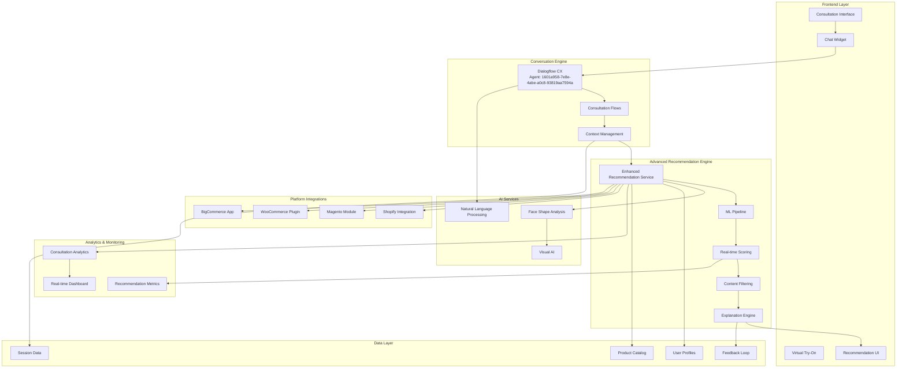
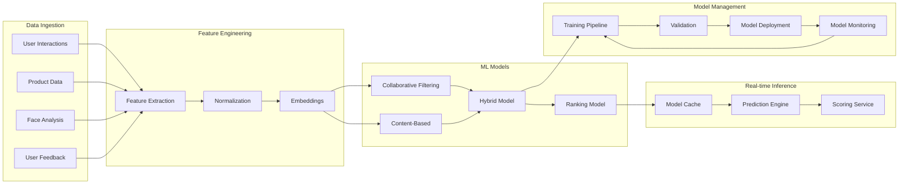

# Advanced Recommendations Engine Integration Architecture
**Commerce Studio Platform - Phase B Design**

## Executive Summary

This document defines the advanced recommendations engine integration architecture for the Commerce Studio platform, extending the existing enhanced recommendation service with real-time ML-powered personalization, multi-platform integration, and comprehensive analytics.

**Production Endpoints:**
- Production API: `https://commerce-studio-api-ddtojwjn7a-uc.a.run.app`
- Demo Store: `https://storage.googleapis.com/eyewear-demo-store-ml-datadriven-recos/index.html`
- VisionCraft Store: `https://visioncraft-store-353252826752.us-central1.run.app` *(Chat widget integration required)*

---

## 🏗️ System Architecture Overview

### Core Integration Architecture



---

## 🔌 API Architecture & Integration Points

### 1. Recommendation Engine API

#### Core Endpoint Structure
```javascript
// Primary recommendation endpoint
POST /api/v1/recommendations/enhanced
{
  "consultationData": {
    "sessionId": "uuid",
    "userId": "string",
    "preferences": {
      "style": "modern|classic|bold|vintage|sporty",
      "lifestyle": "professional|student|active|social|outdoor",
      "budget": "under-100|100-200|200-400|400+",
      "prescription": "boolean",
      "occasion": "work|leisure|sport|special"
    }
  },
  "faceAnalysis": {
    "faceShape": "oval|round|square|heart|diamond|oblong",
    "measurements": {
      "faceWidth": "number",
      "faceHeight": "number",
      "eyeDistance": "number",
      "foreheadWidth": "number",
      "jawWidth": "number"
    },
    "confidence": "number"
  },
  "context": {
    "platform": "web|shopify|magento|woocommerce|bigcommerce",
    "deviceType": "desktop|mobile|tablet",
    "conversationHistory": "array",
    "previousRecommendations": "array"
  }
}
```

#### Response Structure
```javascript
{
  "recommendations": [
    {
      "product": {
        "id": "string",
        "name": "string",
        "brand": "string",
        "style": "string",
        "price": "number",
        "measurements": "object",
        "features": "array",
        "images": "array"
      },
      "scores": {
        "faceShapeMatch": "number",
        "stylePreference": "number",
        "lifestyle": "number",
        "budget": "number",
        "measurements": "number",
        "totalScore": "number"
      },
      "explanation": {
        "primary": "string",
        "detailed": "string",
        "pros": "array",
        "considerations": "array",
        "tags": "array"
      },
      "confidence": "number",
      "rank": "number"
    }
  ],
  "metadata": {
    "totalProducts": "number",
    "filteredProducts": "number",
    "processingTime": "number",
    "recommendationId": "string",
    "generatedAt": "timestamp"
  },
  "insights": {
    "faceShapeInsights": "object",
    "styleInsights": "object",
    "alternativeOptions": "array"
  }
}
```

### 2. Real-time Scoring API

#### Scoring Endpoint
```javascript
POST /api/v1/recommendations/score
{
  "productId": "string",
  "userContext": "object",
  "faceAnalysis": "object",
  "realTimeFactors": {
    "sessionDuration": "number",
    "previousInteractions": "array",
    "currentBehavior": "object"
  }
}
```

### 3. Feedback Loop API

#### Feedback Collection
```javascript
POST /api/v1/recommendations/feedback
{
  "recommendationId": "string",
  "sessionId": "string",
  "feedback": {
    "type": "like|dislike|try_on|purchase|bookmark",
    "productId": "string",
    "rating": "number",
    "comment": "string",
    "timestamp": "timestamp"
  }
}
```

---

## 🧠 Machine Learning Pipeline Architecture

### 1. ML Pipeline Components



### 2. ML Model Specifications

#### Collaborative Filtering Model
```python
# User-Item Matrix Factorization
class CollaborativeFilteringModel:
    def __init__(self, n_factors=50, learning_rate=0.01):
        self.n_factors = n_factors
        self.learning_rate = learning_rate
        self.user_factors = None
        self.item_factors = None
    
    def fit(self, user_item_matrix):
        # Matrix factorization with regularization
        pass
    
    def predict(self, user_id, item_id):
        # Predict user preference for item
        pass
```

#### Content-Based Model
```python
# Face Shape and Style Matching
class ContentBasedModel:
    def __init__(self, feature_weights):
        self.feature_weights = feature_weights
        self.face_shape_embeddings = None
        self.style_embeddings = None
    
    def extract_features(self, product, user_profile):
        # Extract relevant features
        pass
    
    def compute_similarity(self, user_features, item_features):
        # Compute cosine similarity
        pass
```

### 3. Real-time Scoring Architecture

```javascript
// Real-time scoring service
class RealTimeScorer {
    constructor() {
        this.modelCache = new Map();
        this.featureStore = new FeatureStore();
        this.scoringQueue = new PriorityQueue();
    }
    
    async scoreProduct(productId, userContext, faceAnalysis) {
        // Extract features
        const features = await this.extractFeatures(
            productId, userContext, faceAnalysis
        );
        
        // Get cached model
        const model = this.modelCache.get('hybrid_model');
        
        // Generate prediction
        const prediction = await model.predict(features);
        
        // Apply real-time adjustments
        const adjustedScore = this.applyRealTimeFactors(
            prediction, userContext
        );
        
        return {
            productId,
            score: adjustedScore,
            confidence: prediction.confidence,
            factors: prediction.factors,
            timestamp: Date.now()
        };
    }
    
    applyRealTimeFactors(basePrediction, context) {
        // Apply session-based adjustments
        // Account for current behavior
        // Adjust for inventory levels
        // Apply time-based factors
        return adjustedScore;
    }
}
```

---

## 🗄️ Database Schema Design

### 1. User Profiles Schema

```sql
-- User profiles with comprehensive preference tracking
CREATE TABLE user_profiles (
    id UUID PRIMARY KEY,
    user_id VARCHAR(255) UNIQUE NOT NULL,
    platform VARCHAR(50) NOT NULL,
    created_at TIMESTAMP DEFAULT CURRENT_TIMESTAMP,
    updated_at TIMESTAMP DEFAULT CURRENT_TIMESTAMP,
    
    -- Face analysis data
    face_shape VARCHAR(50),
    face_measurements JSONB,
    face_analysis_confidence DECIMAL(3,2),
    
    -- Preferences
    style_preferences JSONB,
    lifestyle_profile JSONB,
    budget_range JSONB,
    
    -- Behavioral data
    session_history JSONB,
    interaction_patterns JSONB,
    feedback_history JSONB,
    
    -- Computed features
    preference_embeddings VECTOR(100),
    style_embeddings VECTOR(50),
    
    INDEX idx_user_id (user_id),
    INDEX idx_platform (platform),
    INDEX idx_face_shape (face_shape)
);
```

### 2. Product Catalog Schema

```sql
-- Enhanced product catalog with ML features
CREATE TABLE products (
    id UUID PRIMARY KEY,
    platform_id VARCHAR(255) NOT NULL,
    platform VARCHAR(50) NOT NULL,
    
    -- Basic product info
    name VARCHAR(255) NOT NULL,
    brand VARCHAR(100),
    category VARCHAR(100),
    style VARCHAR(100),
    material VARCHAR(100),
    color VARCHAR(100),
    price DECIMAL(10,2),
    
    -- Measurements
    measurements JSONB,
    
    -- Features and attributes
    features JSONB,
    suitable_face_shapes JSONB,
    style_match JSONB,
    lifestyle_match JSONB,
    
    -- ML features
    content_embeddings VECTOR(100),
    style_embeddings VECTOR(50),
    visual_features VECTOR(200),
    
    -- Metadata
    popularity_score DECIMAL(3,2),
    rating DECIMAL(3,2),
    review_count INTEGER,
    in_stock BOOLEAN,
    
    created_at TIMESTAMP DEFAULT CURRENT_TIMESTAMP,
    updated_at TIMESTAMP DEFAULT CURRENT_TIMESTAMP,
    
    INDEX idx_platform (platform),
    INDEX idx_style (style),
    INDEX idx_price (price),
    INDEX idx_in_stock (in_stock)
);
```

### 3. Recommendation Sessions Schema

```sql
-- Session and recommendation tracking
CREATE TABLE recommendation_sessions (
    id UUID PRIMARY KEY,
    session_id VARCHAR(255) NOT NULL,
    user_id VARCHAR(255),
    platform VARCHAR(50),
    
    -- Session data
    consultation_data JSONB,
    face_analysis JSONB,
    conversation_context JSONB,
    
    -- Recommendations
    recommendations JSONB,
    recommendation_scores JSONB,
    
    -- Outcomes
    user_interactions JSONB,
    selected_products JSONB,
    conversion_events JSONB,
    
    -- Metadata
    session_duration INTEGER,
    stage_completed VARCHAR(50),
    
    created_at TIMESTAMP DEFAULT CURRENT_TIMESTAMP,
    updated_at TIMESTAMP DEFAULT CURRENT_TIMESTAMP,
    
    INDEX idx_session_id (session_id),
    INDEX idx_user_id (user_id),
    INDEX idx_platform (platform),
    INDEX idx_created_at (created_at)
);
```

### 4. User Feedback Schema

```sql
-- Comprehensive feedback tracking
CREATE TABLE user_feedback (
    id UUID PRIMARY KEY,
    recommendation_id UUID REFERENCES recommendation_sessions(id),
    session_id VARCHAR(255),
    user_id VARCHAR(255),
    product_id UUID REFERENCES products(id),
    
    -- Feedback data
    feedback_type VARCHAR(50), -- like, dislike, try_on, purchase, bookmark
    rating INTEGER CHECK (rating >= 1 AND rating <= 5),
    comment TEXT,
    
    -- Interaction context
    interaction_context JSONB,
    timestamp TIMESTAMP DEFAULT CURRENT_TIMESTAMP,
    
    -- ML features
    implicit_feedback JSONB,
    engagement_metrics JSONB,
    
    INDEX idx_recommendation_id (recommendation_id),
    INDEX idx_user_id (user_id),
    INDEX idx_product_id (product_id),
    INDEX idx_feedback_type (feedback_type)
);
```

---

## 🔄 Real-time Recommendation Flow

### 1. Consultation Integration Flow

```javascript
// Enhanced consultation flow with real-time recommendations
class ConsultationRecommendationFlow {
    constructor() {
        this.dialogflowService = new ConsultationDialogflowService();
        this.recommendationEngine = new EnhancedRecommendationService();
        this.faceAnalyzer = new FaceShapeAnalysisService();
        this.realTimeScorer = new RealTimeScorer();
    }
    
    async handleConsultationMessage(message, sessionId, context) {
        // Process message through Dialogflow
        const dialogflowResponse = await this.dialogflowService
            .processMessage(message, sessionId);
        
        // Extract consultation data
        const consultationData = this.extractConsultationData(
            dialogflowResponse, context
        );
        
        // Check if face analysis is needed
        if (this.shouldPerformFaceAnalysis(consultationData)) {
            await this.requestFaceAnalysis(sessionId);
        }
        
        // Generate recommendations if enough data
        if (this.hasEnoughDataForRecommendations(consultationData)) {
            const recommendations = await this.generateRecommendations(
                consultationData, sessionId
            );
            
            // Apply real-time scoring
            const scoredRecommendations = await this.applyRealTimeScoring(
                recommendations, sessionId
            );
            
            // Send recommendations to user
            await this.sendRecommendations(
                scoredRecommendations, sessionId
            );
        }
        
        return dialogflowResponse;
    }
    
    async applyRealTimeScoring(recommendations, sessionId) {
        const scoredRecommendations = [];
        
        for (const rec of recommendations) {
            const realTimeScore = await this.realTimeScorer.scoreProduct(
                rec.product.id,
                this.getSessionContext(sessionId),
                this.getFaceAnalysis(sessionId)
            );
            
            scoredRecommendations.push({
                ...rec,
                realTimeScore,
                adjustedScore: this.combineScores(
                    rec.totalScore, realTimeScore.score
                )
            });
        }
        
        return scoredRecommendations.sort(
            (a, b) => b.adjustedScore - a.adjustedScore
        );
    }
}
```

### 2. Platform Integration Flow

```javascript
// Multi-platform recommendation integration
class PlatformRecommendationIntegrator {
    constructor() {
        this.platformAdapters = {
            shopify: new ShopifyAdapter(),
            magento: new MagentoAdapter(),
            woocommerce: new WooCommerceAdapter(),
            bigcommerce: new BigCommerceAdapter()
        };
    }
    
    async integrateRecommendations(platform, storeId, userId) {
        const adapter = this.platformAdapters[platform];
        
        // Get user profile from platform
        const userProfile = await adapter.getUserProfile(userId);
        
        // Sync product catalog
        await this.syncProductCatalog(platform, storeId);
        
        // Generate platform-specific recommendations
        const recommendations = await this.generatePlatformRecommendations(
            platform, userProfile
        );
        
        // Deploy recommendations to platform
        await adapter.deployRecommendations(recommendations, storeId);
        
        return recommendations;
    }
}
```

---

## 📊 Analytics & Monitoring Architecture

### 1. Real-time Analytics Pipeline

```javascript
// Comprehensive analytics for recommendation performance
class RecommendationAnalytics {
    constructor() {
        this.metrics = {
            clickThroughRate: new MetricTracker('ctr'),
            conversionRate: new MetricTracker('conversion'),
            recommendationAccuracy: new MetricTracker('accuracy'),
            userEngagement: new MetricTracker('engagement'),
            modelPerformance: new MetricTracker('model_performance')
        };
        
        this.alerting = new AlertingService();
        this.dashboard = new RealTimeDashboard();
    }
    
    trackRecommendationEvent(event) {
        const { type, sessionId, productId, timestamp, metadata } = event;
        
        switch(type) {
            case 'recommendation_shown':
                this.metrics.clickThroughRate.increment('shown');
                break;
            case 'recommendation_clicked':
                this.metrics.clickThroughRate.increment('clicked');
                break;
            case 'product_purchased':
                this.metrics.conversionRate.increment('converted');
                break;
        }
        
        // Update real-time dashboard
        this.dashboard.updateMetrics(this.calculateCurrentMetrics());
        
        // Check for alerts
        this.checkAlerts();
    }
    
    calculateCurrentMetrics() {
        return {
            ctr: this.metrics.clickThroughRate.getRate(),
            conversion: this.metrics.conversionRate.getRate(),
            accuracy: this.metrics.recommendationAccuracy.getRate(),
            engagement: this.metrics.userEngagement.getAverage()
        };
    }
}
```

### 2. Performance Monitoring

```javascript
// Model performance monitoring
class ModelPerformanceMonitor {
    constructor() {
        this.performanceMetrics = new Map();
        this.alertThresholds = {
            accuracyDrop: 0.05,
            latencyIncrease: 500, // ms
            errorRate: 0.01
        };
    }
    
    monitorModelPerformance(modelId, prediction, actualOutcome) {
        const metrics = this.performanceMetrics.get(modelId) || {
            accuracy: new RollingAverage(100),
            latency: new RollingAverage(100),
            errorRate: new RollingAverage(100)
        };
        
        // Update accuracy
        metrics.accuracy.add(prediction.correct ? 1 : 0);
        
        // Update latency
        metrics.latency.add(prediction.latency);
        
        // Check for performance degradation
        this.checkPerformanceAlerts(modelId, metrics);
        
        this.performanceMetrics.set(modelId, metrics);
    }
}
```

---

## 🚀 Implementation Roadmap

### Phase 1: Enhanced ML Pipeline (Weeks 1-2)
- [ ] Implement real-time scoring service
- [ ] Develop hybrid recommendation model
- [ ] Create feature store infrastructure
- [ ] Set up model training pipeline

### Phase 2: Advanced Analytics (Weeks 3-4)
- [ ] Implement comprehensive analytics tracking
- [ ] Create real-time performance monitoring
- [ ] Develop alerting system
- [ ] Build analytics dashboard

### Phase 3: Platform Integration (Weeks 5-6)
- [ ] Enhance Shopify integration
- [ ] Upgrade Magento module
- [ ] Improve WooCommerce plugin
- [ ] Optimize BigCommerce app

### Phase 4: Real-time Optimization (Weeks 7-8)
- [ ] Implement A/B testing framework
- [ ] Create personalization engine
- [ ] Develop recommendation explanations
- [ ] Optimize performance

---

## 🔧 Technical Implementation Details

### 1. Deployment Architecture

```yaml
# Kubernetes deployment for recommendation service
apiVersion: apps/v1
kind: Deployment
metadata:
  name: recommendation-engine
spec:
  replicas: 3
  selector:
    matchLabels:
      app: recommendation-engine
  template:
    metadata:
      labels:
        app: recommendation-engine
    spec:
      containers:
      - name: recommendation-service
        image: gcr.io/PROJECT_ID/recommendation-engine:latest
        ports:
        - containerPort: 8080
        env:
        - name: DATABASE_URL
          valueFrom:
            secretKeyRef:
              name: db-secret
              key: url
        - name: REDIS_URL
          valueFrom:
            secretKeyRef:
              name: redis-secret
              key: url
        resources:
          requests:
            memory: "512Mi"
            cpu: "500m"
          limits:
            memory: "1Gi"
            cpu: "1000m"
```

### 2. API Gateway Configuration

```yaml
# API Gateway routing for recommendations
apiVersion: networking.gke.io/v1
kind: ManagedCertificate
metadata:
  name: recommendation-ssl-cert
spec:
  domains:
    - recommendations.commerce-studio.com
---
apiVersion: networking.k8s.io/v1
kind: Ingress
metadata:
  name: recommendation-ingress
  annotations:
    kubernetes.io/ingress.global-static-ip-name: recommendation-ip
    networking.gke.io/managed-certificates: recommendation-ssl-cert
spec:
  rules:
  - host: recommendations.commerce-studio.com
    http:
      paths:
      - path: /api/v1/recommendations
        pathType: Prefix
        backend:
          service:
            name: recommendation-service
            port:
              number: 8080
```

---

## 🛡️ Security & Compliance

### 1. Data Privacy
- **User Consent**: Explicit consent for face analysis and data collection
- **Data Minimization**: Collect only necessary data for recommendations
- **Anonymization**: Anonymize user data in analytics pipelines
- **Retention Policy**: Automatic data deletion after specified periods

### 2. API Security
- **Authentication**: JWT-based authentication for all API endpoints
- **Rate Limiting**: Prevent abuse with intelligent rate limiting
- **Encryption**: End-to-end encryption for sensitive data
- **Input Validation**: Comprehensive input sanitization

### 3. Model Security
- **Model Versioning**: Secure model deployment with rollback capabilities
- **Bias Detection**: Automated bias detection in recommendations
- **Adversarial Protection**: Protection against model poisoning attacks
- **Audit Logging**: Complete audit trail for all recommendations

---

## 📈 Success Metrics & KPIs

### 1. Business Metrics
- **Conversion Rate**: Target 25% improvement
- **Average Order Value**: Target 15% increase
- **Customer Satisfaction**: Target 90%+ satisfaction
- **Return Rate**: Target 40% reduction

### 2. Technical Metrics
- **Response Time**: < 200ms for recommendations
- **Model Accuracy**: > 85% recommendation accuracy
- **System Uptime**: 99.9% availability
- **API Error Rate**: < 0.1% error rate

### 3. User Experience Metrics
- **Engagement Rate**: > 70% interaction with recommendations
- **Session Duration**: 3-5 minutes average
- **Recommendation Relevance**: > 80% relevance score
- **User Retention**: > 60% return rate

---

## 🔮 Future Enhancements

### 1. Advanced AI Features
- **Computer Vision**: Enhanced face analysis with 3D modeling
- **Natural Language**: Advanced NLP for style description
- **Predictive Analytics**: Predict future style trends
- **Personalization**: Dynamic personalization based on behavior

### 2. Extended Integrations
- **AR/VR**: Augmented reality virtual try-on
- **Voice Commerce**: Voice-enabled consultation
- **Social Integration**: Social media style analysis
- **IoT Integration**: Smart mirror integration

### 3. Advanced Analytics
- **Predictive Modeling**: Predict user preferences
- **Cohort Analysis**: Advanced user segmentation
- **Attribution Modeling**: Multi-touch attribution
- **Real-time Optimization**: Dynamic recommendation tuning

---

## 📝 Conclusion

This advanced recommendations engine architecture provides a comprehensive foundation for delivering personalized eyewear recommendations at scale. The integration with existing Commerce Studio services, combined with advanced ML capabilities and real-time optimization, creates a powerful platform for enhancing customer experience and driving business growth.

The architecture is designed to be:
- **Scalable**: Handle increasing user load and data volume
- **Flexible**: Adapt to different platforms and use cases
- **Maintainable**: Clean architecture with clear separation of concerns
- **Secure**: Comprehensive security and privacy protections
- **Observable**: Full visibility into system performance and user behavior

**Next Steps**: Proceed with Phase 1 implementation focusing on the enhanced ML pipeline and real-time scoring service.

---

*Document Version: 1.0*  
*Last Updated: January 8, 2025*  
*Author: Commerce Studio Architecture Team*