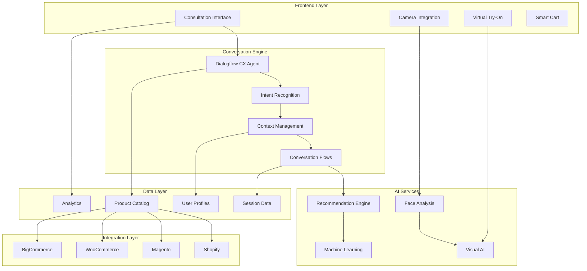
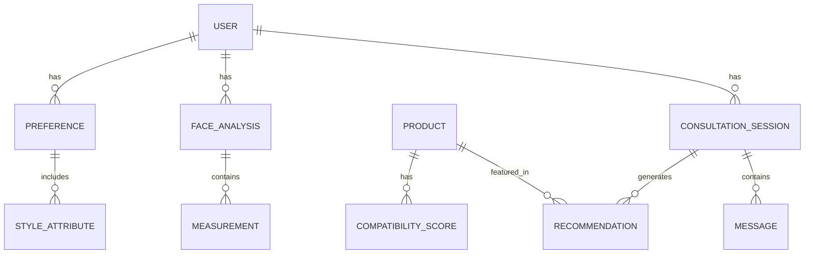
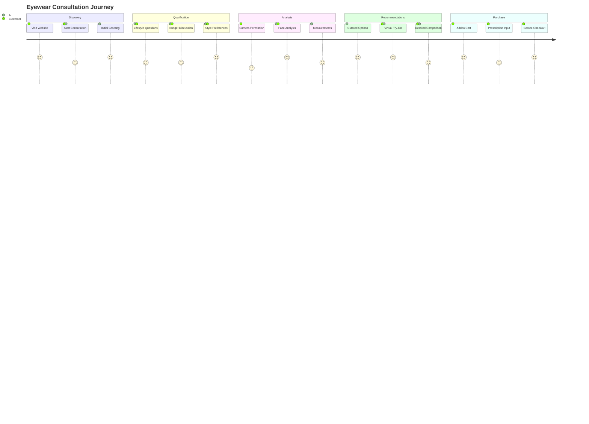
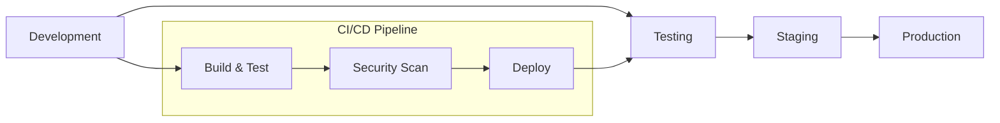

# Commerce Studio Eyewear Consultation Platform - Strategic Roadmap

## Executive Summary

Transform traditional e-commerce into an intelligent eyewear consultation experience that guides consumers through a personalized journey from discovery to purchase. This roadmap outlines the complete transformation from product search to conversational commerce.

**Vision**: Replace traditional product browsing with an AI-powered eyewear consultant that understands individual needs, preferences, and facial characteristics to deliver personalized recommendations.

**Current Status**: Technical foundation complete - Google Cloud services operational, Dialogflow CX connected (Agent ID: 1601a958-7e8e-4abe-a0c8-93819aa7594a), platform running on http://localhost:3001.

---

## 🎯 Strategic Objectives

### Primary Goals
1. **Eliminate Search Friction**: Replace traditional product search with guided conversation
2. **Personalized Experience**: Deliver tailored recommendations based on individual characteristics
3. **Seamless Integration**: Maintain compatibility with existing e-commerce platforms
4. **Conversion Optimization**: Increase purchase confidence through virtual try-on and expert guidance

### Success Metrics
- **Conversion Rate**: Target 25% improvement over traditional search
- **Session Duration**: 3-5 minutes average consultation time
- **Customer Satisfaction**: 90%+ satisfaction with recommendations
- **Return Rate**: 40% reduction through better fit prediction

---

## 🏗️ System Architecture Overview



---

## 🚀 Implementation Phases

### Phase 1: Foundation & Core Consultation (Weeks 1-4)

#### 1.1 Conversation Flow Architecture
**Objective**: Establish the core consultation conversation flows

**Technical Implementation**:
- **Dialogflow CX Flow Design**: Create structured conversation paths
- **Intent Mapping**: Define 15+ core intents for eyewear consultation
- **Context Management**: Implement session-based user context tracking
- **Fallback Handling**: Graceful degradation for unrecognized inputs

**Conversation Flows**:
```
1. Welcome & Qualification Flow
   ├── Greeting & Introduction
   ├── Purpose Discovery (reading, distance, fashion, etc.)
   ├── Lifestyle Assessment
   └── Budget Range Collection

2. Style Preference Flow
   ├── Frame Shape Preferences
   ├── Material Preferences (metal, plastic, etc.)
   ├── Color Preferences
   └── Brand Affinity

3. Fit Requirements Flow
   ├── Prescription Requirements
   ├── Comfort Preferences
   ├── Usage Patterns
   └── Special Needs Assessment
```

**Deliverables**:
- Dialogflow CX agent with 15+ intents
- Conversation flow documentation
- Context management system
- Basic consultation interface

#### 1.2 User Interface Foundation
**Objective**: Create the consultation interface framework

**Technical Implementation**:
- **React/TypeScript Frontend**: Build on existing frontend structure
- **Material-UI Components**: Consistent design system
- **Responsive Design**: Mobile-first approach
- **Accessibility**: WCAG 2.1 AA compliance

**Interface Components**:
```typescript
// Core consultation components
interface ConsultationInterface {
  ChatWindow: React.FC<ChatWindowProps>
  QuickActions: React.FC<QuickActionsProps>
  ProgressIndicator: React.FC<ProgressProps>
  RecommendationCards: React.FC<RecommendationProps>
}
```

**Deliverables**:
- Consultation UI framework
- Chat interface components
- Progress tracking system
- Mobile-responsive design

### Phase 2: Visual Analysis & Camera Integration (Weeks 5-8)

#### 2.1 Face Analysis System
**Objective**: Implement camera-based facial analysis for frame fitting

**Technical Implementation**:
- **Camera Access**: WebRTC integration for device camera
- **Face Detection**: TensorFlow.js or MediaPipe integration
- **Facial Measurements**: Key point detection and measurement
- **Privacy Controls**: Local processing with user consent

**Face Analysis Pipeline**:
```javascript
class FaceAnalysisService {
  async analyzeFace(imageData) {
    const faceDetection = await this.detectFace(imageData);
    const measurements = await this.extractMeasurements(faceDetection);
    const faceShape = await this.classifyFaceShape(measurements);
    
    return {
      faceShape,
      measurements: {
        faceWidth: measurements.width,
        faceHeight: measurements.height,
        interpupillaryDistance: measurements.ipd,
        bridgeWidth: measurements.bridge
      },
      confidence: measurements.confidence
    };
  }
}
```

**Deliverables**:
- Camera integration system
- Face analysis pipeline
- Measurement extraction
- Privacy-compliant processing

#### 2.2 Virtual Try-On Integration
**Objective**: Enable real-time virtual frame try-on

**Technical Implementation**:
- **AR Framework**: WebXR or custom WebGL solution
- **Frame Overlay**: 3D frame positioning and scaling
- **Real-time Rendering**: 60fps performance target
- **Frame Database**: 3D models for popular frames

**Virtual Try-On Architecture**:
```typescript
interface VirtualTryOnSystem {
  initializeCamera(): Promise<MediaStream>
  loadFrameModel(frameId: string): Promise<FrameModel>
  renderFrame(faceData: FaceAnalysis, frame: FrameModel): void
  captureSnapshot(): Promise<Blob>
}
```

**Deliverables**:
- Virtual try-on engine
- Frame 3D model system
- Real-time rendering
- Snapshot capture functionality

### Phase 3: Intelligent Recommendation Engine (Weeks 9-12)

#### 3.1 AI-Powered Recommendations
**Objective**: Develop sophisticated recommendation algorithms

**Technical Implementation**:
- **Multi-Factor Analysis**: Face shape, lifestyle, preferences, budget
- **Machine Learning Models**: Collaborative and content-based filtering
- **Real-time Scoring**: Dynamic recommendation ranking
- **Feedback Loop**: Learning from user interactions

**Recommendation Algorithm**:
```python
class EyewearRecommendationEngine:
    def generate_recommendations(self, user_profile, conversation_context):
        # Face shape compatibility scoring
        face_shape_score = self.calculate_face_shape_compatibility(
            user_profile.face_analysis, 
            product.frame_shape
        )
        
        # Lifestyle compatibility
        lifestyle_score = self.calculate_lifestyle_fit(
            user_profile.lifestyle,
            product.use_cases
        )
        
        # Style preference alignment
        style_score = self.calculate_style_match(
            conversation_context.preferences,
            product.style_attributes
        )
        
        # Budget consideration
        budget_score = self.calculate_budget_fit(
            conversation_context.budget_range,
            product.price
        )
        
        # Composite scoring
        final_score = (
            face_shape_score * 0.35 +
            lifestyle_score * 0.25 +
            style_score * 0.25 +
            budget_score * 0.15
        )
        
        return final_score
```

**Deliverables**:
- Recommendation engine
- Scoring algorithms
- ML model training pipeline
- A/B testing framework

#### 3.2 Product Catalog Integration
**Objective**: Seamless integration with existing product catalogs

**Technical Implementation**:
- **Multi-Platform Support**: Shopify, Magento, WooCommerce, BigCommerce
- **Real-time Sync**: Inventory and pricing updates
- **Metadata Enhancement**: AI-generated product attributes
- **Search Optimization**: Semantic search capabilities

**Catalog Integration Architecture**:
```typescript
interface ProductCatalogService {
  syncProducts(platform: EcommercePlatform): Promise<SyncResult>
  enrichProductData(product: Product): Promise<EnrichedProduct>
  searchProducts(query: SearchQuery): Promise<Product[]>
  updateInventory(updates: InventoryUpdate[]): Promise<void>
}
```

**Deliverables**:
- Multi-platform catalog integration
- Real-time inventory sync
- Product data enrichment
- Search optimization

### Phase 4: Advanced Features & Optimization (Weeks 13-16)

#### 4.1 Voice Interaction
**Objective**: Enable voice-based consultation

**Technical Implementation**:
- **Speech Recognition**: Google Speech-to-Text integration
- **Voice Synthesis**: Natural voice responses
- **Conversation Management**: Voice-optimized dialog flows
- **Accessibility**: Voice navigation support

**Voice Integration**:
```javascript
class VoiceInteractionService {
  async startVoiceSession() {
    const recognition = new webkitSpeechRecognition();
    recognition.continuous = true;
    recognition.interimResults = true;
    
    recognition.onresult = (event) => {
      const transcript = event.results[event.results.length - 1][0].transcript;
      this.processVoiceInput(transcript);
    };
    
    return recognition;
  }
  
  async synthesizeResponse(text) {
    const utterance = new SpeechSynthesisUtterance(text);
    utterance.voice = this.selectOptimalVoice();
    speechSynthesis.speak(utterance);
  }
}
```

**Deliverables**:
- Voice recognition system
- Speech synthesis
- Voice-optimized flows
- Accessibility features

#### 4.2 Smart Cart & Checkout
**Objective**: Intelligent cart management and streamlined checkout

**Technical Implementation**:
- **Smart Recommendations**: Related products and accessories
- **Prescription Integration**: Lens options and upgrades
- **Payment Processing**: Secure, multi-method checkout
- **Order Tracking**: Real-time status updates

**Smart Cart Features**:
```typescript
interface SmartCartService {
  addRecommendedProduct(product: Product, context: ConsultationContext): void
  suggestAccessories(cartItems: CartItem[]): Accessory[]
  calculatePrescriptionOptions(prescription: Prescription): LensOption[]
  optimizeCheckout(cart: Cart): CheckoutOptimization
}
```

**Deliverables**:
- Smart cart system
- Prescription integration
- Checkout optimization
- Order management

---

## 🔧 Technical Architecture Details

### Core Technology Stack

#### Frontend Architecture
```typescript
// React + TypeScript + Material-UI
interface TechStack {
  framework: "React 19.0.0"
  language: "TypeScript 5.7.2"
  ui: "@mui/material 6.4.4"
  state: "React Context + Hooks"
  routing: "react-router-dom 6.30.1"
  testing: "Jest + React Testing Library"
}
```

#### Backend Services
```yaml
# Microservices Architecture
services:
  consultation-api:
    technology: "Node.js + Express"
    database: "MongoDB Foundation Service"
    authentication: "JWT + OAuth2"
    
  dialogflow-service:
    technology: "Google Dialogflow CX"
    integration: "Unified Dialogflow Service"
    session_management: "Redis"
    
  recommendation-engine:
    technology: "Python + TensorFlow"
    ml_platform: "Google AI Platform"
    data_processing: "Apache Beam"
    
  face-analysis-service:
    technology: "TensorFlow.js + MediaPipe"
    processing: "Client-side + Edge Computing"
    privacy: "Local processing only"
```

#### Data Architecture


### Security & Privacy Architecture

#### Privacy-First Design
```typescript
interface PrivacyControls {
  faceAnalysis: {
    processing: "client-side-only"
    storage: "temporary-session-only"
    consent: "explicit-opt-in"
  }
  
  conversationData: {
    encryption: "AES-256"
    retention: "30-days-max"
    anonymization: "automatic"
  }
  
  recommendations: {
    personalization: "session-based"
    tracking: "minimal-necessary"
    deletion: "user-controlled"
  }
}
```

#### Security Measures
- **End-to-End Encryption**: All sensitive data encrypted in transit and at rest
- **GDPR Compliance**: Full data protection regulation compliance
- **SOC 2 Type II**: Security controls and monitoring
- **PCI DSS**: Payment card industry compliance

---

## 📊 User Experience Flow

### Complete Customer Journey



### Conversation Flow Examples

#### Welcome & Qualification
```
AI: "Hi! I'm your personal eyewear consultant. I'm here to help you find the perfect frames that match your style, lifestyle, and face shape. What brings you here today?"

User: "I need new reading glasses"

AI: "Perfect! Reading glasses are so important for comfort and clarity. Tell me, do you primarily read at home, at work, or both? And do you prefer a more professional look or something more casual and comfortable?"

User: "Mostly at home, something comfortable"

AI: "Great choice! For comfortable home reading, we'll want to focus on lightweight materials and relaxed styles. What's your budget range for these glasses? This helps me show you the best options in your price range."
```

#### Style Discovery
```
AI: "Now let's talk style! I'll show you a few different frame shapes. Which of these appeals to you most?"

[Shows visual options: Round, Square, Cat-eye, Aviator]

User: "I like the round ones"

AI: "Excellent taste! Round frames are classic and versatile. They work beautifully for reading and give a sophisticated, intellectual look. Would you like to turn on your camera so I can see how round frames would look with your face shape? This is completely optional and processed privately on your device."
```

#### Camera Integration
```
AI: "I can see you have a lovely oval face shape, which is perfect for round frames! The proportions will be very flattering. Let me show you some options that would work beautifully for you."

[Shows 3-4 curated recommendations with virtual try-on capability]

AI: "Try tapping on any frame to see how it looks on you. You can also ask me questions about materials, lens options, or anything else!"
```

---

## 🎨 Design System & UI Components

### Visual Design Principles
- **Conversational**: Chat-like interface that feels natural
- **Progressive**: Information revealed step-by-step
- **Visual**: Heavy use of product imagery and virtual try-on
- **Accessible**: WCAG 2.1 AA compliant throughout

### Key UI Components

#### Consultation Interface
```typescript
interface ConsultationUI {
  ChatWindow: {
    messages: Message[]
    typing_indicator: boolean
    quick_replies: QuickReply[]
  }
  
  ProductShowcase: {
    recommendations: Product[]
    virtual_tryon: boolean
    comparison_mode: boolean
  }
  
  ProgressTracker: {
    current_step: ConsultationStep
    completion_percentage: number
    estimated_time_remaining: number
  }
}
```

#### Virtual Try-On Interface
```typescript
interface VirtualTryOnUI {
  CameraView: {
    stream: MediaStream
    face_detection: boolean
    frame_overlay: FrameModel
  }
  
  FrameSelector: {
    current_frame: Product
    alternatives: Product[]
    customization_options: FrameOptions
  }
  
  CaptureControls: {
    snapshot: () => Promise<Blob>
    share: (image: Blob) => void
    save_favorite: (product: Product) => void
  }
}
```

---

## 📈 Analytics & Optimization

### Key Performance Indicators

#### Consultation Metrics
- **Completion Rate**: % of users who complete full consultation
- **Recommendation Acceptance**: % of recommendations that lead to cart adds
- **Session Duration**: Average time spent in consultation
- **User Satisfaction**: Post-consultation survey scores

#### Business Metrics
- **Conversion Rate**: Consultation to purchase conversion
- **Average Order Value**: Impact on purchase amounts
- **Return Rate**: Reduction in returns due to better fitting
- **Customer Lifetime Value**: Long-term customer value impact

#### Technical Metrics
- **Response Time**: AI response latency (target: <2 seconds)
- **Camera Success Rate**: % of successful face analyses
- **Virtual Try-On Performance**: Frame rendering performance
- **System Uptime**: Service availability (target: 99.9%)

### A/B Testing Framework

#### Conversation Flow Testing
```typescript
interface ABTestConfig {
  greeting_variations: {
    formal: "Good day! I'm your eyewear consultant..."
    casual: "Hey there! Ready to find your perfect frames?"
    question: "Looking for new glasses? I'm here to help!"
  }
  
  recommendation_count: {
    three_options: 3
    five_options: 5
    seven_options: 7
  }
  
  virtual_tryon_timing: {
    early: "after_face_shape_detection"
    middle: "after_style_preferences"
    late: "with_final_recommendations"
  }
}
```

---

## 🚀 Deployment & Infrastructure

### Cloud Architecture

#### Google Cloud Platform Setup
```yaml
# Infrastructure as Code
infrastructure:
  compute:
    - Cloud Run: Consultation API
    - Cloud Functions: Face Analysis
    - App Engine: Frontend Hosting
    
  ai_services:
    - Dialogflow CX: Conversation Management
    - AI Platform: ML Model Serving
    - Vision API: Image Processing
    
  data:
    - Cloud Firestore: Session Data
    - Cloud Storage: Product Images
    - BigQuery: Analytics Data
    
  networking:
    - Cloud CDN: Global Content Delivery
    - Cloud Load Balancer: Traffic Distribution
    - Cloud Armor: DDoS Protection
```

#### Deployment Pipeline


### Monitoring & Observability

#### Application Monitoring
```typescript
interface MonitoringStack {
  metrics: {
    application: "Google Cloud Monitoring"
    custom: "Prometheus + Grafana"
    business: "Google Analytics 4"
  }
  
  logging: {
    application: "Google Cloud Logging"
    structured: "Winston + JSON"
    correlation: "Trace IDs"
  }
  
  alerting: {
    uptime: "Google Cloud Monitoring"
    performance: "Custom Dashboards"
    business: "Slack + PagerDuty"
  }
}
```

---

## 🔄 Integration Strategy

### E-commerce Platform Integration

#### Multi-Platform Support
```typescript
interface EcommercePlatformAdapter {
  shopify: ShopifyAdapter
  magento: MagentoAdapter
  woocommerce: WooCommerceAdapter
  bigcommerce: BigCommerceAdapter
  
  // Unified interface
  syncProducts(): Promise<Product[]>
  updateInventory(updates: InventoryUpdate[]): Promise<void>
  createOrder(order: Order): Promise<OrderResult>
  trackOrder(orderId: string): Promise<OrderStatus>
}
```

#### API Integration Patterns
```javascript
// Webhook-based real-time sync
class ProductSyncService {
  async handleWebhook(platform, event) {
    switch (event.type) {
      case 'product.created':
        await this.enrichAndIndex(event.product);
        break;
      case 'product.updated':
        await this.updateRecommendations(event.product);
        break;
      case 'inventory.changed':
        await this.updateAvailability(event.inventory);
        break;
    }
  }
}
```

### Third-Party Service Integration

#### Payment Processing
- **Stripe**: Primary payment processor
- **PayPal**: Alternative payment method
- **Apple Pay/Google Pay**: Mobile payments
- **Buy Now, Pay Later**: Klarna, Afterpay integration

#### Prescription Services
- **LensCrafters API**: Prescription verification
- **Warby Parker**: Virtual prescription service
- **Local Optometrists**: Directory integration

---

## 📋 Implementation Timeline

### Detailed Project Schedule

#### Phase 1: Foundation (Weeks 1-4)
```
Week 1: Dialogflow CX Setup & Core Intents
- Day 1-2: Agent configuration and intent mapping
- Day 3-4: Conversation flow design
- Day 5: Testing and refinement

Week 2: Frontend Framework
- Day 1-2: React component architecture
- Day 3-4: Chat interface implementation
- Day 5: Responsive design testing

Week 3: Backend Integration
- Day 1-2: API endpoint development
- Day 3-4: Database schema implementation
- Day 5: Service integration testing

Week 4: Basic Consultation Flow
- Day 1-2: End-to-end flow testing
- Day 3-4: User experience refinement
- Day 5: Performance optimization
```

#### Phase 2: Visual Features (Weeks 5-8)
```
Week 5: Camera Integration
- Day 1-2: WebRTC implementation
- Day 3-4: Face detection setup
- Day 5: Privacy controls implementation

Week 6: Face Analysis
- Day 1-2: TensorFlow.js integration
- Day 3-4: Measurement extraction
- Day 5: Accuracy testing and calibration

Week 7: Virtual Try-On
- Day 1-2: 3D rendering engine
- Day 3-4: Frame overlay system
- Day 5: Performance optimization

Week 8: Integration & Testing
- Day 1-2: End-to-end visual flow
- Day 3-4: Cross-device testing
- Day 5: User acceptance testing
```

#### Phase 3: Intelligence (Weeks 9-12)
```
Week 9: Recommendation Engine
- Day 1-2: Algorithm development
- Day 3-4: ML model training
- Day 5: Scoring system implementation

Week 10: Product Catalog Integration
- Day 1-2: Multi-platform connectors
- Day 3-4: Real-time sync implementation
- Day 5: Data enrichment pipeline

Week 11: Personalization
- Day 1-2: User profiling system
- Day 3-4: Preference learning
- Day 5: Recommendation optimization

Week 12: Testing & Optimization
- Day 1-2: A/B testing setup
- Day 3-4: Performance tuning
- Day 5: Quality assurance
```

#### Phase 4: Advanced Features (Weeks 13-16)
```
Week 13: Voice Integration
- Day 1-2: Speech recognition setup
- Day 3-4: Voice-optimized flows
- Day 5: Accessibility testing

Week 14: Smart Cart
- Day 1-2: Intelligent recommendations
- Day 3-4: Prescription integration
- Day 5: Checkout optimization

Week 15: Analytics & Monitoring
- Day 1-2: Metrics implementation
- Day 3-4: Dashboard creation
- Day 5: Alerting setup

Week 16: Launch Preparation
- Day 1-2: Final testing and bug fixes
- Day 3-4: Documentation and training
- Day 5: Production deployment
```

---

## 🎯 Success Criteria & KPIs

### Launch Readiness Criteria

#### Technical Requirements
- [ ] **Performance**: <2s response time for 95% of interactions
- [ ] **Availability**: 99.9% uptime SLA
- [ ] **Security**: SOC 2 Type II compliance
- [ ] **Scalability**: Support for 10,000 concurrent users
- [ ] **Compatibility**: Works on 95% of modern browsers

#### User Experience Requirements
- [ ] **Accessibility**: WCAG 2.1 AA compliance
- [ ] **Mobile**: Responsive design on all screen sizes
- [ ] **Conversion**: 15% improvement over traditional search
- [ ] **Satisfaction**: 85%+ user satisfaction score
- [ ] **Completion**: 70%+ consultation completion rate

#### Business Requirements
- [ ] **Integration**: Support for 4 major e-commerce platforms
- [ ] **Inventory**: Real-time sync with 99% accuracy
- [ ] **Orders**: Seamless checkout process
- [ ] **Analytics**: Comprehensive reporting dashboard
- [ ] **Support**: 24/7 monitoring and alerting

### Post-Launch Optimization Targets

#### 30-Day Targets
- **User Adoption**: 25% of site visitors engage with consultation
- **Conversion Rate**: 20% improvement over baseline
- **Session Duration**: 4-minute average consultation time
- **Recommendation Accuracy**: 80% user satisfaction with suggestions

#### 90-Day Targets
- **Market Penetration**: 50% of purchases through consultation
- **Customer Retention**: 30% increase in repeat purchases
- **Average Order Value**: 25% increase through recommendations
- **Return Rate**: 35% reduction in returns

#### 180-Day Targets
- **Platform Expansion**: Integration with 10+ e-commerce platforms
- **AI Accuracy**: 90% recommendation satisfaction
- **Voice Adoption**: 15% of consultations use voice interaction
- **Global Reach**: Multi-language support for 5 languages

---

## 🔮 Future Enhancements

### Advanced AI Capabilities

#### Emotional Intelligence
```typescript
interface EmotionalAI {
  sentiment_analysis: {
    detect_frustration: boolean
    adjust_conversation_tone: boolean
    escalate_to_human: boolean
  }
  
  personality_matching: {
    detect_user_personality: boolean
    match_consultant_style: boolean
    personalize_recommendations: boolean
  }
}
```

#### Predictive Analytics
- **Trend Forecasting**: Predict upcoming style trends
- **Inventory Optimization**: Predict demand for specific frames
- **Customer Lifetime Value**: Predict long-term customer value
- **Churn Prevention**: Identify at-risk customers

### Extended Reality (XR) Integration

#### Augmented Reality
- **Advanced Virtual Try-On**: More realistic frame rendering
- **Environment Context**: Try frames in different lighting
- **Social Sharing**: Share try-on experiences with friends
- **Mirror Mode**: Full-body styling with eyewear

#### Virtual Reality
- **Virtual Showroom**: Immersive shopping experience
- **3D Product Exploration**: Detailed frame examination
- **Virtual Optometrist**: VR eye exams and consultations
- **Social Shopping**: Shop with friends in VR

### Omnichannel Integration

#### Physical Store Integration
- **In-Store Kiosks**: Consultation experience in retail
- **Appointment Booking**: Schedule in-person consultations
- **Inventory Bridge**: Online-to-offline inventory management
- **Staff Training**: AI-assisted sales training

#### Mobile App Features
- **Native Mobile App**: Dedicated iOS/Android applications
- **Offline Mode**: Consultation without internet connection
- **Push Notifications**: Personalized recommendations
- **Loyalty Integration**: Rewards and points system

---

## 📚 Documentation & Training

### Technical Documentation

#### API Documentation
- **REST API Reference**: Complete endpoint documentation
- **GraphQL Schema**: Query and mutation specifications
- **Webhook Documentation**: Event handling and payloads
- **SDK Documentation**: Client library usage guides

#### Integration Guides
- **Platform Setup**: Step-by-step integration instructions
- **Customization Guide**: Branding and styling options
- **Testing Guide**: QA and validation procedures
- **Troubleshooting**: Common issues and solutions

### User Training Materials

#### End-User Guides
- **Customer Tutorial**: How to use the consultation
- **Feature Overview**: Available capabilities and benefits
- **Privacy Guide**: Data handling and user rights
- **Accessibility Guide**: Features for users with disabilities

#### Business User Training
- **Admin Dashboard**: Analytics and management interface
- **Content Management**: Updating products and recommendations
- **Customer Support**: Handling consultation-related inquiries
- **Performance Monitoring**: KPI tracking and optimization

---

## 🎉 Conclusion

The Commerce Studio Eyewear Consultation Platform represents a fundamental shift from traditional e-commerce to intelligent, conversational commerce. By combining advanced AI, computer vision, and user experience design, we create a personalized shopping experience that increases conversion rates, reduces returns, and builds stronger customer relationships.

### Key Success Factors

1. **User-Centric Design**: Every feature designed around user needs and preferences
2. **Technical Excellence**: Robust, scalable, and secure architecture
3. **Continuous Optimization**: Data-driven improvements and A/B testing
4. **Privacy First**: Transparent and secure handling of personal data
5. **Seamless Integration**: Works with existing e-commerce infrastructure

### Expected Outcomes

- **25% increase in conversion rates** through personalized recommendations
- **40% reduction in return rates** through better fit prediction
- **30% increase in average order value** through intelligent upselling
- **90% customer satisfaction** with the consultation experience

### Next Steps

1. **Immediate**: Begin Phase 1 implementation with Dialogflow CX setup
2. **Week 2**: Start frontend development and UI component creation
3. **Week 4**: Complete basic consultation flow and begin user testing
4. **Week 8**: Launch beta version with select customers
5. **Week 16**: Full production launch with comprehensive monitoring

This roadmap provides a clear path to transform Commerce Studio into the leading intelligent eyewear consultation platform, setting new standards for personalized e-commerce experiences.

---

**Document Version**: 1.0  
**Last Updated**: January 7, 2025  
**Next Review**: January 21, 2025  
**Status**: Ready for Implementation