# VARAi Connected Apps Architecture & Implementation Plan

## 🎯 Executive Summary

The Connected Apps feature transforms the VARAi customer portal into a comprehensive SaaS marketplace where brands can discover, activate, and manage AI-powered eyewear services with token-based billing. This architecture enables scalable revenue generation while providing transparent usage tracking.

## 🏗️ System Architecture

### High-Level Architecture

```mermaid
graph TB
    subgraph "Frontend Layer"
        CP[Customer Portal]
        AN[Apps Navigation]
        AP[Apps Page]
        AC[App Configuration]
        UD[Usage Dashboard]
    end
    
    subgraph "API Gateway"
        AG[API Gateway]
        AUTH[Authentication]
        RATE[Rate Limiting]
    end
    
    subgraph "Core Services"
        AS[Apps Service]
        TS[Token Service]
        BS[Billing Service]
        US[Usage Service]
        NS[Notification Service]
    end
    
    subgraph "AI Services"
        VTO[Virtual Try-On]
        REC[Recommendations]
        PDC[PD Calculator]
        FSA[Face Shape Analysis]
        SC[Style Consultation]
        FC[Fit Consultation]
    end
    
    subgraph "External Services"
        STRIPE[Stripe Billing]
        EMAIL[Email Service]
        SMS[SMS Service]
    end
    
    subgraph "Data Layer"
        APPS_DB[(Apps Database)]
        USAGE_DB[(Usage Database)]
        BILLING_DB[(Billing Database)]
        CACHE[(Redis Cache)]
    end
    
    CP --> AG
    AN --> AG
    AP --> AG
    AC --> AG
    UD --> AG
    
    AG --> AUTH
    AG --> RATE
    AG --> AS
    AG --> TS
    AG --> BS
    AG --> US
    
    AS --> APPS_DB
    TS --> USAGE_DB
    BS --> BILLING_DB
    US --> USAGE_DB
    
    TS --> VTO
    TS --> REC
    TS --> PDC
    TS --> FSA
    TS --> SC
    TS --> FC
    
    BS --> STRIPE
    NS --> EMAIL
    NS --> SMS
    
    AS --> CACHE
    TS --> CACHE
    US --> CACHE
```



### Component Architecture

#### 1. Frontend Components

```
/customer/apps/
├── index.html              # Main apps marketplace
├── app-detail.html         # Individual app details
├── usage-dashboard.html    # Token usage tracking
├── billing-settings.html   # Billing configuration
└── js/
    ├── apps-manager.js     # App activation/deactivation
    ├── token-tracker.js    # Real-time usage tracking
    ├── billing-manager.js  # Stripe integration
    └── usage-analytics.js  # Usage visualization
```

#### 2. Backend Services

```
src/api/routers/
├── apps.py                 # App management endpoints
├── tokens.py              # Token consumption tracking
├── billing.py             # Stripe billing integration
├── usage.py               # Usage analytics
└── notifications.py       # Alert system
```

#### 3. Database Schema

```sql
-- Apps Configuration
CREATE TABLE apps (
    id UUID PRIMARY KEY,
    name VARCHAR(100) NOT NULL,
    description TEXT,
    category VARCHAR(50),
    token_cost INTEGER NOT NULL,
    status VARCHAR(20) DEFAULT 'available',
    created_at TIMESTAMP DEFAULT NOW()
);

-- Customer App Subscriptions
CREATE TABLE customer_apps (
    id UUID PRIMARY KEY,
    customer_id UUID NOT NULL,
    app_id UUID NOT NULL,
    status VARCHAR(20) DEFAULT 'active',
    configuration JSONB,
    activated_at TIMESTAMP DEFAULT NOW(),
    FOREIGN KEY (customer_id) REFERENCES customers(id),
    FOREIGN KEY (app_id) REFERENCES apps(id)
);

-- Token Usage Tracking
CREATE TABLE token_usage (
    id UUID PRIMARY KEY,
    customer_id UUID NOT NULL,
    app_id UUID NOT NULL,
    tokens_consumed INTEGER NOT NULL,
    session_id VARCHAR(100),
    metadata JSONB,
    created_at TIMESTAMP DEFAULT NOW(),
    FOREIGN KEY (customer_id) REFERENCES customers(id),
    FOREIGN KEY (app_id) REFERENCES apps(id)
);

-- Billing Plans
CREATE TABLE billing_plans (
    id UUID PRIMARY KEY,
    name VARCHAR(100) NOT NULL,
    token_limit INTEGER NOT NULL,
    price_cents INTEGER NOT NULL,
    billing_cycle VARCHAR(20) DEFAULT 'monthly',
    stripe_price_id VARCHAR(100),
    created_at TIMESTAMP DEFAULT NOW()
);

-- Customer Billing
CREATE TABLE customer_billing (
    id UUID PRIMARY KEY,
    customer_id UUID NOT NULL,
    plan_id UUID NOT NULL,
    stripe_subscription_id VARCHAR(100),
    tokens_used INTEGER DEFAULT 0,
    tokens_remaining INTEGER,
    billing_cycle_start TIMESTAMP,
    billing_cycle_end TIMESTAMP,
    status VARCHAR(20) DEFAULT 'active',
    FOREIGN KEY (customer_id) REFERENCES customers(id),
    FOREIGN KEY (plan_id) REFERENCES billing_plans(id)
);
```

## 💰 Token-Based Billing System

### Token Pricing Structure

| App Service | Token Cost | Complexity | Rationale |
|-------------|------------|------------|-----------|
| Virtual Try-On | 5 tokens | High | Complex 3D rendering + AI processing |
| Face Shape Analysis | 3 tokens | Medium | Computer vision + ML inference |
| Style Consultation | 4 tokens | High | Multi-factor AI analysis |
| Fit Consultation | 4 tokens | High | Measurement analysis + recommendations |
| Eyewear Recommendations | 2 tokens | Medium | Preference matching + filtering |
| PD Calculator | 1 token | Low | Simple measurement calculation |
| Frame Finder | 2 tokens | Medium | Search + filtering algorithms |
| Contact Lens Try-On | 3 tokens | Medium | Image processing + overlay |
| Conversational AI | 3 tokens | Medium | NLP processing + context management |
| Advanced Analytics | 10 tokens | High | Complex data processing + reporting |

### Billing Tiers

```yaml
billing_tiers:
  starter:
    name: "Starter"
    tokens_per_month: 1000
    price_usd: 29
    stripe_price_id: "price_starter_monthly"
    features:
      - "Basic apps access"
      - "Email support"
      - "Usage analytics"
    
  professional:
    name: "Professional"
    tokens_per_month: 10000
    price_usd: 199
    stripe_price_id: "price_pro_monthly"
    features:
      - "All apps access"
      - "Priority support"
      - "Advanced analytics"
      - "Custom integrations"
    
  enterprise:
    name: "Enterprise"
    tokens_per_month: -1  # Unlimited
    price_usd: 999
    stripe_price_id: "price_enterprise_monthly"
    features:
      - "Unlimited tokens"
      - "Dedicated support"
      - "Custom development"
      - "SLA guarantees"

pay_as_you_go:
  token_packs:
    - tokens: 1000
      price_usd: 39
      stripe_price_id: "price_tokens_1k"
    - tokens: 5000
      price_usd: 179
      stripe_price_id: "price_tokens_5k"
    - tokens: 10000
      price_usd: 299
      stripe_price_id: "price_tokens_10k"
```

## 🔧 Implementation Plan

### Phase 1: Foundation (Weeks 1-2)

#### Week 1: Core Infrastructure
- [ ] Database schema implementation
- [ ] Basic API endpoints for apps management
- [ ] Token tracking service foundation
- [ ] Frontend navigation integration

**Deliverables:**
- `src/api/routers/apps.py` - Basic CRUD operations
- `src/api/routers/tokens.py` - Token consumption tracking
- Database migrations for core tables
- Updated customer portal navigation

#### Week 2: Apps Marketplace UI
- [ ] Apps page with discovery interface
- [ ] App card components with status indicators
- [ ] Basic app activation/deactivation
- [ ] Configuration modal framework

**Deliverables:**
- `/customer/apps/index.html` - Main marketplace page
- `js/apps-manager.js` - Frontend app management
- CSS components for app cards and modals
- Basic app configuration system

### Phase 2: Billing Integration (Weeks 3-4)

#### Week 3: Stripe Integration
- [ ] Stripe webhook handling
- [ ] Subscription management
- [ ] Payment processing
- [ ] Invoice generation

**Deliverables:**
- `src/api/routers/billing.py` - Stripe integration
- Webhook endpoints for subscription events
- Customer billing dashboard
- Payment method management

#### Week 4: Token Management
- [ ] Real-time token consumption tracking
- [ ] Usage alerts and notifications
- [ ] Overage protection
- [ ] Token purchase flow

**Deliverables:**
- Real-time usage dashboard
- Automated billing alerts
- Token purchase interface
- Usage analytics visualization

### Phase 3: Advanced Features (Weeks 5-6)

#### Week 5: Analytics & Monitoring
- [ ] Usage analytics dashboard
- [ ] Performance metrics
- [ ] Revenue tracking
- [ ] Customer insights

**Deliverables:**
- Advanced analytics dashboard
- Revenue reporting system
- Customer usage insights
- Performance monitoring

#### Week 6: App Configuration
- [ ] Advanced app settings
- [ ] Widget customization
- [ ] Integration testing
- [ ] Performance optimization

**Deliverables:**
- Comprehensive app configuration
- Widget placement controls
- Integration testing suite
- Performance optimizations

### Phase 4: Launch Preparation (Weeks 7-8)

#### Week 7: Testing & Security
- [ ] Comprehensive testing suite
- [ ] Security audit
- [ ] Load testing
- [ ] Documentation completion

**Deliverables:**
- Complete test coverage
- Security audit report
- Load testing results
- User documentation

#### Week 8: Launch & Monitoring
- [ ] Production deployment
- [ ] Monitoring setup
- [ ] Customer onboarding
- [ ] Support documentation

**Deliverables:**
- Production deployment
- Monitoring dashboards
- Customer onboarding flow
- Support documentation

## 🔐 Security & Compliance

### Data Protection
- **Encryption**: All sensitive data encrypted at rest and in transit
- **PCI Compliance**: Stripe handles all payment data
- **GDPR Compliance**: Data retention and deletion policies
- **SOC 2**: Security controls and audit trails

### Access Control
- **Role-Based Access**: Admin, manager, viewer roles
- **API Security**: OAuth 2.0, rate limiting, audit logging
- **Token Security**: Secure token generation and validation
- **Session Management**: Secure authentication, automatic logout

### Monitoring & Alerting
- **Usage Monitoring**: Real-time token consumption tracking
- **Fraud Detection**: Unusual usage pattern detection
- **Performance Monitoring**: API response times and error rates
- **Security Monitoring**: Failed authentication attempts and suspicious activity

## 📊 Success Metrics

### Technical Metrics
- **API Response Time**: < 200ms for 95th percentile
- **System Uptime**: 99.9% availability
- **Token Accuracy**: 100% accurate consumption tracking
- **Billing Accuracy**: Zero billing discrepancies

### Business Metrics
- **App Adoption Rate**: > 80% of customers activate at least one app
- **Revenue Growth**: 25% month-over-month growth
- **Customer Satisfaction**: > 4.5/5 rating
- **Support Ticket Reduction**: 30% reduction in billing-related tickets

### User Experience Metrics
- **Time to First App**: < 5 minutes from signup
- **Configuration Completion**: > 90% of activated apps fully configured
- **Usage Engagement**: > 70% monthly active app users
- **Retention Rate**: > 85% monthly retention

## 🚀 Deployment Strategy

### Infrastructure Requirements
- **Compute**: Auto-scaling container groups
- **Database**: PostgreSQL with read replicas
- **Cache**: Redis cluster for session and usage data
- **CDN**: Global content delivery for static assets
- **Monitoring**: Comprehensive logging and metrics

### Rollout Plan
1. **Beta Release**: Limited customer group (Week 8)
2. **Gradual Rollout**: 25% of customers (Week 9)
3. **Full Release**: All customers (Week 10)
4. **Post-Launch**: Monitoring and optimization (Ongoing)

### Risk Mitigation
- **Feature Flags**: Gradual feature rollout
- **Circuit Breakers**: Automatic failover for critical services
- **Rollback Plan**: Quick rollback capability
- **Load Testing**: Pre-launch capacity validation

## 📚 Documentation Requirements

### Technical Documentation
- [ ] API documentation with examples
- [ ] Database schema documentation
- [ ] Deployment guides
- [ ] Troubleshooting guides

### User Documentation
- [ ] Customer onboarding guide
- [ ] App configuration tutorials
- [ ] Billing and usage guides
- [ ] FAQ and support articles

### Business Documentation
- [ ] Pricing strategy documentation
- [ ] Revenue projections
- [ ] Competitive analysis
- [ ] Go-to-market strategy

## 🔄 Maintenance & Support

### Ongoing Maintenance
- **Regular Updates**: Monthly feature releases
- **Security Patches**: Immediate security updates
- **Performance Optimization**: Quarterly performance reviews
- **Capacity Planning**: Proactive scaling based on usage trends

### Support Structure
- **Tier 1**: General customer support
- **Tier 2**: Technical billing support
- **Tier 3**: Engineering escalation
- **Documentation**: Self-service knowledge base

This architecture provides a comprehensive foundation for implementing the Connected Apps feature with token-based billing, ensuring scalability, security, and excellent user experience while generating sustainable revenue for VARAi.