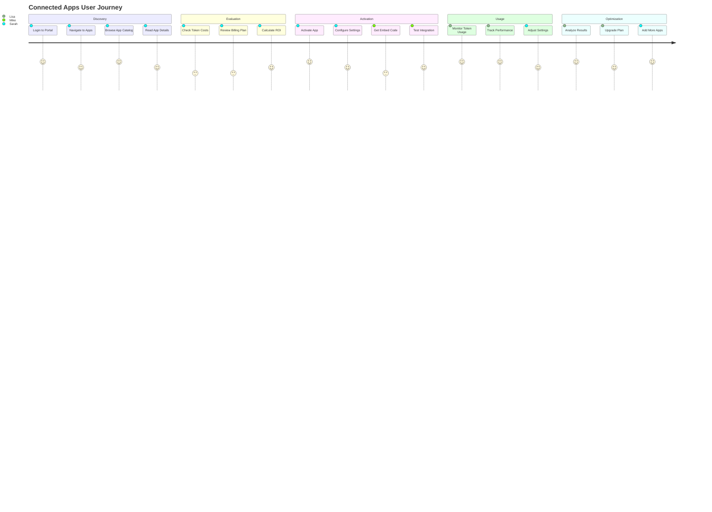

# VARAi Connected Apps User Experience Specifications

## 🎨 Design Philosophy

**Core Principles:**
- **Simplicity First**: Minimize cognitive load with clear, intuitive interfaces
- **Progressive Disclosure**: Show relevant information at the right time
- **Transparency**: Clear token usage and billing information
- **Consistency**: Align with existing VARAi design system
- **Accessibility**: WCAG 2.1 AA compliance throughout

## 🗺️ User Journey Mapping

### Primary User Personas

#### 1. Brand Manager (Sarah)
- **Goal**: Increase customer engagement and sales
- **Pain Points**: Complex setup processes, unclear ROI
- **Needs**: Easy activation, clear analytics, cost control

#### 2. E-commerce Developer (Mike)
- **Goal**: Integrate AI features quickly and reliably
- **Pain Points**: Poor documentation, integration complexity
- **Needs**: Clear APIs, embed codes, technical support

#### 3. Business Owner (Lisa)
- **Goal**: Maximize revenue while controlling costs
- **Pain Points**: Unexpected charges, unclear usage patterns
- **Needs**: Transparent billing, usage alerts, ROI tracking

### User Journey Flow



## 📱 Interface Specifications

### 1. Apps Marketplace Page

#### Layout Structure
```
┌─────────────────────────────────────────────────────────┐
│ Header: Connected Apps                                   │
├─────────────────────────────────────────────────────────┤
│ Search Bar + Filters                                    │
├─────────────────────────────────────────────────────────┤
│ ┌─────────┐ ┌─────────┐ ┌─────────┐ ┌─────────┐        │
│ │ App     │ │ App     │ │ App     │ │ App     │        │
│ │ Card 1  │ │ Card 2  │ │ Card 3  │ │ Card 4  │        │
│ └─────────┘ └─────────┘ └─────────┘ └─────────┘        │
│ ┌─────────┐ ┌─────────┐ ┌─────────┐ ┌─────────┐        │
│ │ App     │ │ App     │ │ App     │ │ App     │        │
│ │ Card 5  │ │ Card 6  │ │ Card 7  │ │ Card 8  │        │
│ └─────────┘ └─────────┘ └─────────┘ └─────────┘        │
├─────────────────────────────────────────────────────────┤
│ Pagination                                              │
└─────────────────────────────────────────────────────────┘
```

#### App Card Design
```html
<div class="app-card">
  <div class="app-icon">
    
  </div>
  <div class="app-info">
    <h3 class="app-name">Virtual Try-On</h3>
    <p class="app-description">AI-powered virtual eyewear fitting</p>
    <div class="app-metrics">
      <span class="token-cost">5 tokens per use</span>
      <span class="popularity">★★★★☆ (4.8)</span>
    </div>
    <div class="app-tags">
      <span class="tag">AI Vision</span>
      <span class="tag">Customer Engagement</span>
    </div>
  </div>
  <div class="app-actions">
    <button class="btn-primary" data-app-id="vto-001">
      Activate App
    </button>
    <button class="btn-secondary">
      Learn More
    </button>
  </div>
  <div class="app-status">
    <span class="status-badge active">Active</span>
  </div>
</div>
```

#### Filter System
```
Categories:
- All Apps
- AI Vision (Virtual Try-On, Face Analysis)
- Recommendations (Product Matching, Style Consultation)
- Analytics (Usage Tracking, Performance Metrics)
- Customer Engagement (Chat, Notifications)

Pricing:
- Free (0 tokens)
- Low Cost (1-2 tokens)
- Medium Cost (3-5 tokens)
- High Cost (6+ tokens)

Status:
- Available
- Beta
- Coming Soon

Plan Compatibility:
- Starter
- Professional
- Enterprise
```

### 2. App Detail Page

#### Information Architecture
```
┌─────────────────────────────────────────────────────────┐
│ ← Back to Apps                                          │
├─────────────────────────────────────────────────────────┤
│ App Header (Icon, Name, Status, Actions)               │
├─────────────────────────────────────────────────────────┤
│ ┌─────────────────┐ ┌─────────────────────────────────┐ │
│ │ App Preview     │ │ Key Information                 │ │
│ │ (Screenshots,   │ │ • Token Cost: 5 per use        │ │
│ │  Demo Video)    │ │ • Category: AI Vision           │ │
│ │                 │ │ • Compatibility: All Plans     │ │
│ │                 │ │ • Setup Time: < 5 minutes      │ │
│ └─────────────────┘ └─────────────────────────────────┘ │
├─────────────────────────────────────────────────────────┤
│ Tabs: Overview | Features | Pricing | Reviews | Setup  │
├─────────────────────────────────────────────────────────┤
│ Tab Content Area                                        │
├─────────────────────────────────────────────────────────┤
│ Related Apps                                            │
└─────────────────────────────────────────────────────────┘
```

#### Configuration Modal
```html
<div class="app-config-modal">
  <div class="modal-header">
    <h2>Configure Virtual Try-On</h2>
    <button class="close-btn">×</button>
  </div>
  <div class="modal-body">
    <form class="config-form">
      <div class="form-section">
        <h3>Widget Placement</h3>
        <select name="placement">
          <option value="product_page">Product Page</option>
          <option value="collection_page">Collection Page</option>
          <option value="cart_page">Cart Page</option>
        </select>
      </div>
      <div class="form-section">
        <h3>Appearance</h3>
        <label>Button Color</label>
        <input type="color" name="button_color" value="#007bff" />
        <label>Button Text</label>
        <input type="text" name="button_text" value="Try On" />
      </div>
      <div class="form-section">
        <h3>Advanced Settings</h3>
        <label>
          <input type="checkbox" name="auto_capture" />
          Enable automatic photo capture
        </label>
        <label>
          <input type="checkbox" name="analytics" />
          Track usage analytics
        </label>
      </div>
    </form>
  </div>
  <div class="modal-footer">
    <button class="btn-secondary">Cancel</button>
    <button class="btn-primary">Activate App</button>
  </div>
</div>
```

### 3. Usage Dashboard

#### Dashboard Layout
```
┌─────────────────────────────────────────────────────────┐
│ Usage Overview                                          │
├─────────────────────────────────────────────────────────┤
│ ┌─────────────┐ ┌─────────────┐ ┌─────────────────────┐ │
│ │ Tokens Used │ │ Tokens Left │ │ Current Plan        │ │
│ │ 2,847       │ │ 7,153       │ │ Professional        │ │
│ │ this month  │ │ remaining   │ │ $199/month          │ │
│ └─────────────┘ └─────────────┘ └─────────────────────┘ │
├─────────────────────────────────────────────────────────┤
│ Usage Chart (Daily/Weekly/Monthly)                      │
├─────────────────────────────────────────────────────────┤
│ App Usage Breakdown                                     │
│ ┌─────────────────────────────────────────────────────┐ │
│ │ Virtual Try-On    ████████████░░░░  1,250 tokens   │ │
│ │ Recommendations   ████████░░░░░░░░    896 tokens   │ │
│ │ Face Analysis     ████░░░░░░░░░░░░    456 tokens   │ │
│ │ PD Calculator     ██░░░░░░░░░░░░░░    245 tokens   │ │
│ └─────────────────────────────────────────────────────┘ │
├─────────────────────────────────────────────────────────┤
│ Recent Activity                                         │
└─────────────────────────────────────────────────────────┘
```

#### Usage Alerts
```html
<div class="usage-alerts">
  <div class="alert warning">
    <i class="icon-warning"></i>
    <div class="alert-content">
      <h4>High Usage Alert</h4>
      <p>You've used 80% of your monthly tokens. Consider upgrading your plan.</p>
    </div>
    <div class="alert-actions">
      <button class="btn-primary">Upgrade Plan</button>
      <button class="btn-secondary">Dismiss</button>
    </div>
  </div>
</div>
```

### 4. Billing Management

#### Billing Dashboard
```
┌─────────────────────────────────────────────────────────┐
│ Current Plan: Professional                              │
│ ┌─────────────────────────────────────────────────────┐ │
│ │ $199/month • 10,000 tokens • Next billing: Jan 15  │ │
│ │ [Change Plan] [Cancel Subscription]                 │ │
│ └─────────────────────────────────────────────────────┘ │
├─────────────────────────────────────────────────────────┤
│ Payment Method                                          │
│ ┌─────────────────────────────────────────────────────┐ │
│ │ •••• •••• •••• 4242  Expires 12/25                 │ │
│ │ [Update Payment Method]                             │ │
│ └─────────────────────────────────────────────────────┘ │
├─────────────────────────────────────────────────────────┤
│ Billing History                                         │
│ ┌─────────────────────────────────────────────────────┐ │
│ │ Dec 15, 2024  Professional Plan    $199.00  [PDF]  │ │
│ │ Nov 15, 2024  Professional Plan    $199.00  [PDF]  │ │
│ │ Oct 15, 2024  Token Pack (5,000)    $179.00  [PDF] │ │
│ └─────────────────────────────────────────────────────┘ │
├─────────────────────────────────────────────────────────┤
│ Available Plans                                         │
└─────────────────────────────────────────────────────────┘
```

#### Plan Comparison
```html
<div class="plan-comparison">
  <div class="plan-card starter">
    <h3>Starter</h3>
    <div class="price">$29<span>/month</span></div>
    <div class="tokens">1,000 tokens</div>
    <ul class="features">
      <li>✓ Basic apps access</li>
      <li>✓ Email support</li>
      <li>✓ Usage analytics</li>
    </ul>
    <button class="btn-outline">Current Plan</button>
  </div>
  <div class="plan-card professional recommended">
    <div class="badge">Recommended</div>
    <h3>Professional</h3>
    <div class="price">$199<span>/month</span></div>
    <div class="tokens">10,000 tokens</div>
    <ul class="features">
      <li>✓ All apps access</li>
      <li>✓ Priority support</li>
      <li>✓ Advanced analytics</li>
      <li>✓ Custom integrations</li>
    </ul>
    <button class="btn-primary">Upgrade</button>
  </div>
  <div class="plan-card enterprise">
    <h3>Enterprise</h3>
    <div class="price">$999<span>/month</span></div>
    <div class="tokens">Unlimited tokens</div>
    <ul class="features">
      <li>✓ Unlimited tokens</li>
      <li>✓ Dedicated support</li>
      <li>✓ Custom development</li>
      <li>✓ SLA guarantees</li>
    </ul>
    <button class="btn-outline">Contact Sales</button>
  </div>
</div>
```

## 🎯 Interaction Patterns

### 1. App Activation Flow

```
User clicks "Activate App"
↓
Modal opens with configuration options
↓
User configures app settings
↓
System validates configuration
↓
App is activated and embed code generated
↓
Success message with next steps
↓
User is redirected to app management
```

### 2. Token Consumption Flow

```
Customer uses app feature
↓
System validates token availability
↓
If sufficient tokens: Process request
↓
Deduct tokens from balance
↓
Log usage for analytics
↓
If low balance: Show upgrade prompt
```

### 3. Billing Upgrade Flow

```
User clicks "Upgrade Plan"
↓
Plan comparison modal opens
↓
User selects new plan
↓
Stripe checkout opens
↓
Payment processed
↓
Plan upgraded immediately
↓
Confirmation email sent
```

## 📊 Visual Design System

### Color Palette
```css
:root {
  /* Primary Colors */
  --primary-blue: #007bff;
  --primary-blue-dark: #0056b3;
  --primary-blue-light: #66b3ff;
  
  /* Secondary Colors */
  --secondary-gray: #6c757d;
  --secondary-gray-light: #f8f9fa;
  --secondary-gray-dark: #343a40;
  
  /* Status Colors */
  --success-green: #28a745;
  --warning-orange: #ffc107;
  --danger-red: #dc3545;
  --info-cyan: #17a2b8;
  
  /* Token Usage Colors */
  --token-low: #28a745;
  --token-medium: #ffc107;
  --token-high: #fd7e14;
  --token-critical: #dc3545;
}
```

### Typography
```css
/* Headings */
.h1 { font-size: 2.5rem; font-weight: 600; }
.h2 { font-size: 2rem; font-weight: 600; }
.h3 { font-size: 1.75rem; font-weight: 500; }
.h4 { font-size: 1.5rem; font-weight: 500; }

/* Body Text */
.body-large { font-size: 1.125rem; line-height: 1.6; }
.body-regular { font-size: 1rem; line-height: 1.5; }
.body-small { font-size: 0.875rem; line-height: 1.4; }

/* Special Text */
.caption { font-size: 0.75rem; color: var(--secondary-gray); }
.label { font-size: 0.875rem; font-weight: 500; }
```

### Component Styles
```css
/* Buttons */
.btn-primary {
  background: var(--primary-blue);
  color: white;
  border: none;
  padding: 12px 24px;
  border-radius: 6px;
  font-weight: 500;
  transition: all 0.2s ease;
}

.btn-primary:hover {
  background: var(--primary-blue-dark);
  transform: translateY(-1px);
}

/* Cards */
.app-card {
  background: white;
  border: 1px solid #e9ecef;
  border-radius: 8px;
  padding: 24px;
  box-shadow: 0 2px 4px rgba(0,0,0,0.1);
  transition: all 0.2s ease;
}

.app-card:hover {
  box-shadow: 0 4px 12px rgba(0,0,0,0.15);
  transform: translateY(-2px);
}

/* Status Badges */
.status-badge {
  padding: 4px 12px;
  border-radius: 12px;
  font-size: 0.75rem;
  font-weight: 500;
  text-transform: uppercase;
}

.status-badge.active {
  background: #d4edda;
  color: #155724;
}

.status-badge.inactive {
  background: #f8d7da;
  color: #721c24;
}
```

## 📱 Responsive Design

### Breakpoints
```css
/* Mobile First Approach */
.container {
  padding: 16px;
}

/* Tablet */
@media (min-width: 768px) {
  .container {
    padding: 24px;
  }
  
  .app-grid {
    grid-template-columns: repeat(2, 1fr);
  }
}

/* Desktop */
@media (min-width: 1024px) {
  .container {
    padding: 32px;
  }
  
  .app-grid {
    grid-template-columns: repeat(3, 1fr);
  }
}

/* Large Desktop */
@media (min-width: 1200px) {
  .app-grid {
    grid-template-columns: repeat(4, 1fr);
  }
}
```

### Mobile Optimizations
- Touch-friendly button sizes (minimum 44px)
- Simplified navigation with hamburger menu
- Swipe gestures for app cards
- Optimized modal sizes for mobile screens
- Progressive disclosure of information

## ♿ Accessibility Features

### WCAG 2.1 AA Compliance
- **Color Contrast**: Minimum 4.5:1 ratio for normal text
- **Keyboard Navigation**: Full keyboard accessibility
- **Screen Reader Support**: Proper ARIA labels and roles
- **Focus Management**: Clear focus indicators
- **Alternative Text**: Descriptive alt text for images

### Implementation Examples
```html
<!-- Accessible App Card -->
<div class="app-card" role="article" aria-labelledby="app-vto-title">
  <h3 id="app-vto-title">Virtual Try-On</h3>
  <p aria-describedby="app-vto-desc">AI-powered virtual eyewear fitting</p>
  <button 
    class="btn-primary" 
    aria-describedby="app-vto-cost"
    onclick="activateApp('vto-001')"
  >
    Activate App
  </button>
  <span id="app-vto-cost" class="sr-only">
    Costs 5 tokens per use
  </span>
</div>

<!-- Accessible Usage Chart -->
<div class="usage-chart" role="img" aria-labelledby="usage-title">
  <h3 id="usage-title">Token Usage This Month</h3>
  <div class="chart-data" aria-label="2,847 tokens used out of 10,000 total">
    <!-- Chart visualization -->
  </div>
</div>
```

## 🔄 Loading States & Feedback

### Loading Patterns
```html
<!-- App Card Loading -->
<div class="app-card loading">
  <div class="skeleton skeleton-icon"></div>
  <div class="skeleton skeleton-title"></div>
  <div class="skeleton skeleton-text"></div>
  <div class="skeleton skeleton-button"></div>
</div>

<!-- Usage Chart Loading -->
<div class="chart-loading">
  <div class="loading-spinner"></div>
  <p>Loading usage data...</p>
</div>
```

### Success/Error States
```html
<!-- Success Message -->
<div class="alert success" role="alert">
  <i class="icon-check" aria-hidden="true"></i>
  <div class="alert-content">
    <h4>App Activated Successfully!</h4>
    <p>Virtual Try-On is now active on your store.</p>
  </div>
</div>

<!-- Error Message -->
<div class="alert error" role="alert">
  <i class="icon-error" aria-hidden="true"></i>
  <div class="alert-content">
    <h4>Activation Failed</h4>
    <p>Insufficient tokens. Please upgrade your plan or purchase more tokens.</p>
  </div>
  <button class="btn-primary">Upgrade Plan</button>
</div>
```

This comprehensive UX specification ensures the Connected Apps feature provides an intuitive, accessible, and engaging experience for all users while maintaining consistency with VARAi's design system and business objectives.