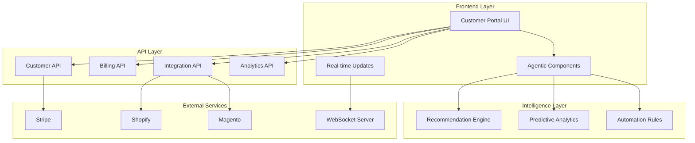

# Customer Portal Architecture Summary
## VARAi Commerce Studio - Complete SPARC/Agentic Framework

### 🎯 Executive Summary

This document provides a comprehensive overview of the Customer Portal architecture, user stories, and implementation framework designed to transform the VARAi Commerce Studio customer experience from basic functionality to an intelligent, agentic platform that anticipates user needs and automates business optimization.

## 📋 Framework Documents Overview

### 1. [SPARC Framework](./CUSTOMER_PORTAL_SPARC_FRAMEWORK.md)
**Purpose:** Comprehensive architectural foundation with agentic principles
**Key Components:**
- **Specification:** Customer journey analysis and gap identification
- **Pseudocode:** Intelligent interaction patterns and autonomous handlers
- **Architecture:** Component design with real-time synchronization
- **Refinement:** 4-phase implementation strategy
- **Completion:** Success metrics and continuous learning integration

### 2. [Implementation Plan](./CUSTOMER_PORTAL_IMPLEMENTATION_PLAN.md)
**Purpose:** Practical roadmap for immediate issue resolution
**Key Focus Areas:**
- **Week 1:** Critical button functionality (Plan Change, Payment Methods)
- **Week 2:** Real-time data integration and API connections
- **Week 3:** User experience enhancements and mobile optimization
- **Week 4:** Advanced features and intelligent recommendations

### 3. [User Stories Backlog](./CUSTOMER_PORTAL_USER_STORIES_BACKLOG.md)
**Purpose:** Detailed user requirements with acceptance criteria
**Story Categories:**
- **Critical Priority:** 3 stories (functional buttons, validation)
- **High Priority:** 2 stories (real-time data, integration monitoring)
- **Medium Priority:** 3 stories (UX enhancements, accessibility)
- **Advanced Priority:** 3 stories (AI features, automation)
- **Technical Debt:** 3 stories (reliability, performance, security)
- **Analytics:** 2 stories (business intelligence, custom reporting)
- **Integration:** 2 stories (workflow automation, API management)
- **Mobile:** 2 stories (PWA, cross-platform sync)

## 🔍 Current State Analysis

### Identified Issues
1. **Non-Functional Buttons**
   - "Change Plan" button shows no response
   - Payment method management buttons inactive
   - Form submissions lack proper validation

2. **Static Data Display**
   - Dashboard metrics not connected to live APIs
   - Integration status shows hardcoded values
   - Usage limits display mock data

3. **Missing User Flows**
   - No onboarding process for new customers
   - Incomplete error handling and recovery
   - Limited mobile responsiveness

4. **Lack of Intelligence**
   - No personalized recommendations
   - Missing predictive analytics
   - No automated optimization suggestions

## 🏗️ Proposed Architecture

### Component Hierarchy
```
Customer Portal
├── Authentication Layer
│   ├── Login/Logout
│   ├── Session Management
│   └── Security Controls
├── Dashboard Hub
│   ├── Real-time Metrics
│   ├── Integration Status
│   └── Quick Actions
├── Settings Management
│   ├── Profile Configuration
│   ├── Billing & Subscription
│   ├── Integration Setup
│   └── Notification Preferences
├── Agentic Intelligence Layer
│   ├── Smart Recommendations
│   ├── Predictive Analytics
│   ├── Automated Optimization
│   └── Contextual Assistance
└── API Integration Layer
    ├── Customer APIs
    ├── Billing Services (Stripe)
    ├── Platform Integrations
    └── Real-time Communication
```

### Data Flow Architecture


## 🚀 Implementation Roadmap

### Phase 1: Foundation (Weeks 1-2)
**Objective:** Fix critical functionality and establish reliable foundation

**Week 1 Deliverables:**
- ✅ Functional "Change Plan" modal with Stripe integration
- ✅ Payment method CRUD operations
- ✅ Comprehensive form validation
- ✅ Error handling and user feedback

**Week 2 Deliverables:**
- ✅ Real-time dashboard metrics
- ✅ Live integration status monitoring
- ✅ WebSocket connection for updates
- ✅ API client architecture

### Phase 2: Enhancement (Weeks 3-4)
**Objective:** Improve user experience and add intelligent features

**Week 3 Deliverables:**
- ✅ Progressive disclosure patterns
- ✅ Mobile-responsive design
- ✅ Accessibility compliance (WCAG 2.1 AA)
- ✅ Contextual help system

**Week 4 Deliverables:**
- ✅ AI-powered recommendations
- ✅ Predictive analytics dashboard
- ✅ Automated workflow suggestions
- ✅ Performance optimization

### Phase 3: Intelligence (Weeks 5-6)
**Objective:** Deploy advanced agentic features

**Deliverables:**
- Machine learning recommendation engine
- Autonomous business optimization
- Predictive trend analysis
- Intelligent cost optimization

### Phase 4: Scale (Weeks 7-8)
**Objective:** Enterprise-grade features and optimization

**Deliverables:**
- Advanced security features
- Multi-user management
- Enterprise integrations
- Comprehensive testing and monitoring

## 🎯 Success Metrics

### User Experience KPIs
| Metric | Current | Target | Timeline |
|--------|---------|--------|----------|
| Task Completion Rate | ~60% | >95% | Week 2 |
| Time to Complete Plan Change | N/A | <2 min | Week 1 |
| User Satisfaction Score | Unknown | >4.5/5 | Week 4 |
| Support Ticket Reduction | Baseline | >50% | Week 8 |
| Mobile Usage Growth | ~20% | >40% | Week 6 |

### Technical Performance KPIs
| Metric | Current | Target | Timeline |
|--------|---------|--------|----------|
| Page Load Time | ~4s | <2s | Week 2 |
| API Response Time | ~1s | <500ms | Week 3 |
| Uptime | ~99% | >99.9% | Week 4 |
| Error Rate | ~5% | <1% | Week 2 |
| Accessibility Score | ~70% | 100% | Week 3 |

### Business Impact KPIs
| Metric | Current | Target | Timeline |
|--------|---------|--------|----------|
| Customer Retention | ~90% | >95% | Week 8 |
| Plan Upgrade Rate | ~10% | >25% | Week 6 |
| Feature Adoption | ~40% | >80% | Week 8 |
| Time to Value | ~1 week | <24 hours | Week 4 |

## 🔧 Technical Implementation

### Core Technologies
- **Frontend:** HTML5, CSS3, JavaScript (ES6+)
- **Styling:** VARAi Design System, CSS Grid/Flexbox
- **API Integration:** Fetch API, WebSocket
- **Payment Processing:** Stripe Elements
- **Real-time Updates:** WebSocket, Server-Sent Events
- **Analytics:** Chart.js, Custom visualization
- **Testing:** Jest, Cypress, Lighthouse

### Development Standards
- **Code Quality:** ESLint, Prettier, JSDoc
- **Accessibility:** WCAG 2.1 AA compliance
- **Performance:** Core Web Vitals optimization
- **Security:** CSP headers, input validation, HTTPS
- **Browser Support:** Modern browsers (Chrome, Firefox, Safari, Edge)

### Deployment Strategy
- **Environment:** Google Cloud Run
- **CI/CD:** Automated testing and deployment
- **Monitoring:** Real-time performance tracking
- **Rollback:** Immediate rollback capability
- **Feature Flags:** Gradual feature rollout

## 🤖 Agentic Features

### Intelligent Automation
1. **Smart Recommendations**
   - Usage-based plan suggestions
   - Integration optimization tips
   - Performance improvement recommendations

2. **Predictive Analytics**
   - Sales trend forecasting
   - Seasonal pattern recognition
   - Risk assessment alerts

3. **Autonomous Optimization**
   - Auto-scaling based on usage
   - Intelligent cache management
   - Cost optimization suggestions

4. **Contextual Assistance**
   - Smart help system
   - Guided workflows
   - Proactive notifications

### Machine Learning Integration
- **User Behavior Analysis:** Track patterns for UX optimization
- **Recommendation Engine:** Personalized suggestions
- **Anomaly Detection:** Identify unusual patterns
- **Predictive Modeling:** Forecast business trends

## 🔒 Security & Compliance

### Security Measures
- **Authentication:** Multi-factor authentication support
- **Authorization:** Role-based access control
- **Data Protection:** End-to-end encryption
- **Payment Security:** PCI DSS compliance
- **Session Management:** Secure session handling
- **Input Validation:** Comprehensive sanitization

### Compliance Standards
- **SOC2 Type II:** Security and availability controls
- **PCI DSS:** Payment card industry standards
- **GDPR:** Data protection and privacy
- **WCAG 2.1 AA:** Accessibility compliance

## 📊 Monitoring & Analytics

### Performance Monitoring
- **Real-time Metrics:** Response times, error rates
- **User Analytics:** Behavior tracking, conversion funnels
- **Business Metrics:** Revenue, retention, growth
- **Technical Health:** System performance, uptime

### Continuous Improvement
- **A/B Testing:** Feature optimization
- **User Feedback:** Continuous feedback collection
- **Performance Optimization:** Regular performance reviews
- **Feature Usage:** Track adoption and engagement

## 🎉 Expected Outcomes

### Immediate Benefits (Weeks 1-2)
- ✅ Functional customer portal with working buttons
- ✅ Improved user satisfaction and reduced frustration
- ✅ Decreased support ticket volume
- ✅ Enhanced mobile experience

### Short-term Benefits (Weeks 3-4)
- ✅ Intelligent recommendations and insights
- ✅ Streamlined user workflows
- ✅ Improved accessibility and inclusivity
- ✅ Enhanced performance and reliability

### Long-term Benefits (Weeks 5-8)
- ✅ AI-powered business optimization
- ✅ Predictive analytics and forecasting
- ✅ Autonomous system management
- ✅ Enterprise-grade scalability

## 📚 Documentation Structure

```
docs/architecture/
├── CUSTOMER_PORTAL_SPARC_FRAMEWORK.md
├── CUSTOMER_PORTAL_IMPLEMENTATION_PLAN.md
├── CUSTOMER_PORTAL_USER_STORIES_BACKLOG.md
├── CUSTOMER_PORTAL_ARCHITECTURE_SUMMARY.md (this file)
└── implementation/
    ├── api-specifications.md
    ├── component-library.md
    ├── testing-strategy.md
    └── deployment-guide.md
```

## 🚀 Next Steps

### Immediate Actions (Next 48 Hours)
1. **Review and Approve Architecture** - Stakeholder sign-off on framework
2. **Set Up Development Environment** - Configure tools and repositories
3. **Create Development Backlog** - Prioritize user stories for Sprint 1
4. **Assign Development Team** - Allocate resources for implementation

### Week 1 Sprint Planning
1. **Sprint Goal:** Fix critical button functionality
2. **User Stories:** US-001, US-002, US-003
3. **Definition of Done:** All buttons functional, forms validated, errors handled
4. **Success Criteria:** >90% task completion rate

### Ongoing Activities
- **Daily Standups:** Track progress and blockers
- **Weekly Reviews:** Assess metrics and adjust priorities
- **Stakeholder Updates:** Regular communication on progress
- **User Testing:** Continuous feedback collection and iteration

---

## 📞 Contact & Support

**Architecture Team:**
- Lead Architect: [Contact Information]
- Technical Lead: [Contact Information]
- UX Designer: [Contact Information]
- Product Manager: [Contact Information]

**Resources:**
- [Development Guidelines](../development/guidelines.md)
- [Design System](../design/varai-design-system.md)
- [API Documentation](../api/customer-portal-api.md)
- [Testing Framework](../testing/customer-portal-tests.md)

---

*This architecture summary provides a complete foundation for transforming the VARAi Commerce Studio customer portal into an intelligent, user-centric platform that anticipates needs, automates optimization, and delivers exceptional business value.*