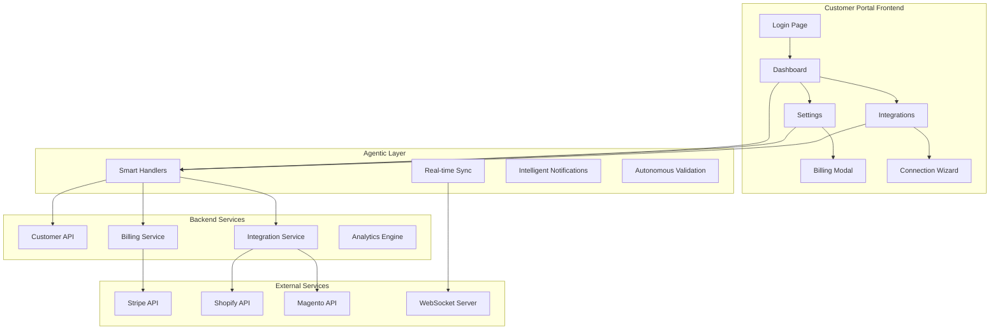
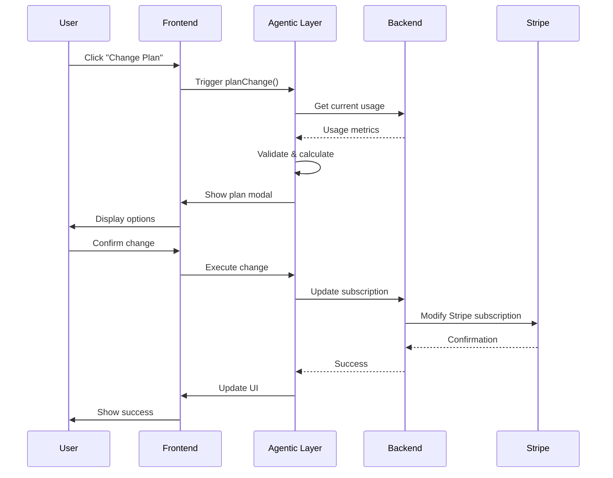
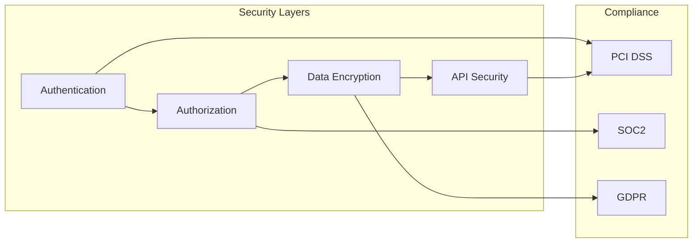

# Customer Portal SPARC/Agentic Framework
## VARAi Commerce Studio - Customer Journey Architecture

### Executive Summary

This document defines a comprehensive SPARC (Specification, Pseudocode, Architecture, Refinement, Completion) framework for the VARAi Commerce Studio customer portal, incorporating agentic development principles to create autonomous, intelligent user experiences.

## 1. SPECIFICATION - Customer Journey Analysis

### 1.1 Current State Assessment

**Existing Customer Portal Pages:**
- [`/customer/login.html`](../website/customer/login.html) - Authentication entry point
- [`/customer/index.html`](../website/customer/index.html) - Portal overview/landing
- [`/customer/dashboard.html`](../website/customer/dashboard.html) - Analytics and insights
- [`/customer/settings.html`](../website/customer/settings.html) - Account management

**Identified Gaps:**
- Non-functional buttons (Change Plan, payment methods)
- Missing modal dialogs and interactive flows
- Incomplete API integration
- Lack of real-time data updates
- Missing onboarding flow
- No progressive disclosure patterns

### 1.2 User Personas & Journey Mapping

#### Primary Persona: E-commerce Store Owner
- **Name:** Sarah Chen, VisionCraft Eyewear
- **Goals:** Streamline operations, increase sales, reduce manual work
- **Pain Points:** Complex integrations, billing confusion, feature discovery
- **Technical Level:** Intermediate business user

#### Secondary Persona: IT Administrator
- **Name:** Marcus Rodriguez, Technical Lead
- **Goals:** Secure integrations, API management, system monitoring
- **Pain Points:** Security compliance, integration debugging, user management
- **Technical Level:** Advanced technical user

### 1.3 User Stories Framework

## 2. USER STORIES - Organized by SPARC Phases

### 2.1 AUTHENTICATION & ONBOARDING

#### Epic: Secure Access Management
```
As a store owner,
I want to securely access my customer portal,
So that I can manage my commerce integrations safely.
```

**User Stories:**

**US-001: Login Authentication**
- **As a** store owner
- **I want to** log in with my email and password
- **So that** I can access my personalized dashboard
- **Acceptance Criteria:**
  - Email validation with proper error messages
  - Password strength requirements
  - Remember me functionality
  - Forgot password flow
  - 2FA support (future)

**US-002: First-Time Onboarding**
- **As a** new customer
- **I want to** complete a guided setup process
- **So that** I can quickly connect my first store
- **Acceptance Criteria:**
  - Welcome tour with key features
  - Store connection wizard
  - Basic settings configuration
  - Success confirmation with next steps

### 2.2 DASHBOARD & ANALYTICS

#### Epic: Business Intelligence Hub
```
As a store owner,
I want to see real-time insights about my business,
So that I can make data-driven decisions.
```

**User Stories:**

**US-003: Real-Time Dashboard**
- **As a** store owner
- **I want to** see live metrics on my dashboard
- **So that** I can monitor business performance
- **Acceptance Criteria:**
  - Sales metrics with trend indicators
  - Inventory status alerts
  - Customer behavior insights
  - Integration health status
  - Customizable widget layout

**US-004: Advanced Analytics**
- **As a** store owner
- **I want to** drill down into detailed analytics
- **So that** I can understand customer patterns
- **Acceptance Criteria:**
  - Interactive charts and graphs
  - Date range filtering
  - Export functionality
  - Comparative analysis tools
  - Predictive insights

### 2.3 STORE INTEGRATIONS

#### Epic: Seamless Platform Connectivity
```
As a store owner,
I want to easily connect my e-commerce platforms,
So that I can centralize my operations.
```

**User Stories:**

**US-005: Shopify Integration**
- **As a** Shopify store owner
- **I want to** connect my store with guided setup
- **So that** I can sync products and orders
- **Acceptance Criteria:**
  - OAuth authentication flow
  - Store validation and testing
  - Sync configuration options
  - Real-time status monitoring
  - Disconnect/reconnect functionality

**US-006: Multi-Platform Support**
- **As a** multi-channel retailer
- **I want to** connect multiple store platforms
- **So that** I can manage all channels centrally
- **Acceptance Criteria:**
  - Support for Magento, WooCommerce, BigCommerce
  - Platform-specific configuration
  - Unified data synchronization
  - Conflict resolution handling
  - Performance optimization

### 2.4 BILLING & SUBSCRIPTION MANAGEMENT

#### Epic: Transparent Financial Management
```
As a store owner,
I want to easily manage my subscription and billing,
So that I can control costs and upgrade when needed.
```

**User Stories:**

**US-007: Plan Management**
- **As a** customer
- **I want to** view and change my subscription plan
- **So that** I can scale with my business needs
- **Acceptance Criteria:**
  - Current plan display with features
  - Plan comparison modal
  - Upgrade/downgrade flows
  - Prorated billing calculations
  - Confirmation and receipt

**US-008: Payment Method Management**
- **As a** customer
- **I want to** manage my payment methods securely
- **So that** I can ensure uninterrupted service
- **Acceptance Criteria:**
  - Add/remove payment methods
  - Set default payment method
  - Secure card storage (Stripe)
  - Payment failure notifications
  - Billing address management

**US-009: Usage Monitoring**
- **As a** customer
- **I want to** monitor my API usage and limits
- **So that** I can optimize costs and avoid overages
- **Acceptance Criteria:**
  - Real-time usage displays
  - Usage trend analysis
  - Limit notifications (80%, 90%, 100%)
  - Historical usage reports
  - Upgrade recommendations

### 2.5 SETTINGS & CONFIGURATION

#### Epic: Personalized Experience Control
```
As a store owner,
I want to customize my portal experience,
So that it fits my business workflow.
```

**User Stories:**

**US-010: Profile Management**
- **As a** customer
- **I want to** update my business information
- **So that** my account reflects current details
- **Acceptance Criteria:**
  - Company information editing
  - Contact details management
  - Timezone and locale settings
  - Profile picture upload
  - Change validation and confirmation

**US-011: Notification Preferences**
- **As a** customer
- **I want to** control how and when I receive notifications
- **So that** I stay informed without being overwhelmed
- **Acceptance Criteria:**
  - Email notification toggles
  - SMS notification setup
  - Notification frequency settings
  - Channel-specific preferences
  - Test notification functionality

**US-012: Security Settings**
- **As a** security-conscious user
- **I want to** manage my account security
- **So that** my business data stays protected
- **Acceptance Criteria:**
  - Password change functionality
  - 2FA setup and management
  - Session timeout configuration
  - Access log viewing
  - Security alert preferences

## 3. PSEUDOCODE - Agentic Interaction Patterns

### 3.1 Intelligent Button Handlers

```pseudocode
// Agentic Plan Change Handler
FUNCTION handlePlanChange(targetPlan):
    // Autonomous validation
    currentUsage = await getUsageMetrics()
    planLimits = await getPlanLimits(targetPlan)
    
    // Intelligent recommendations
    IF currentUsage > planLimits.apiCalls:
        showUpgradeRecommendation(targetPlan, currentUsage)
    ELSE:
        showPlanChangeModal(targetPlan)
    
    // Autonomous billing calculation
    proratedAmount = calculateProration(currentPlan, targetPlan)
    displayBillingPreview(proratedAmount)
    
    // Confirmation with context
    IF userConfirms():
        await executeplanChange(targetPlan)
        triggerSuccessFlow()
        updateDashboardMetrics()
END FUNCTION

// Agentic Payment Method Handler
FUNCTION handlePaymentMethodUpdate():
    // Security validation
    validateSecurityContext()
    
    // Stripe integration
    stripeModal = createStripeModal()
    paymentMethod = await stripeModal.collectPaymentMethod()
    
    // Autonomous validation
    IF validatePaymentMethod(paymentMethod):
        await savePaymentMethod(paymentMethod)
        updateBillingInterface()
        showSuccessNotification()
    ELSE:
        showErrorWithSuggestions()
END FUNCTION
```

### 3.2 Real-Time Data Synchronization

```pseudocode
// Agentic Dashboard Updates
CLASS DashboardAgent:
    FUNCTION initialize():
        setupWebSocketConnection()
        startMetricsPolling()
        enableSmartRefresh()
    
    FUNCTION handleRealtimeUpdate(data):
        // Intelligent update prioritization
        priority = calculateUpdatePriority(data)
        
        IF priority == HIGH:
            updateImmediately(data)
            showNotification(data)
        ELSE:
            queueUpdate(data)
            batchProcess()
    
    FUNCTION smartRefresh():
        // Autonomous refresh based on user activity
        IF userActive AND dataStale:
            refreshCriticalMetrics()
        ELSE IF userIdle:
            pauseUpdates()
END CLASS
```

## 4. ARCHITECTURE - System Design

### 4.1 Component Architecture



### 4.2 Data Flow Architecture



### 4.3 Security Architecture



## 5. REFINEMENT - Implementation Strategy

### 5.1 Development Phases

#### Phase 1: Foundation (Week 1-2)
- **Priority:** Critical functionality
- **Scope:** Login, basic dashboard, settings forms
- **Deliverables:**
  - Functional authentication
  - Basic settings CRUD operations
  - Payment method display

#### Phase 2: Interactivity (Week 3-4)
- **Priority:** User experience
- **Scope:** Modal dialogs, form validation, real-time updates
- **Deliverables:**
  - Plan change modal
  - Payment method management
  - Integration connection flows

#### Phase 3: Intelligence (Week 5-6)
- **Priority:** Agentic features
- **Scope:** Smart recommendations, autonomous validation, predictive insights
- **Deliverables:**
  - Intelligent plan recommendations
  - Usage-based notifications
  - Predictive analytics

#### Phase 4: Optimization (Week 7-8)
- **Priority:** Performance and polish
- **Scope:** Performance optimization, advanced features, testing
- **Deliverables:**
  - Performance monitoring
  - Advanced analytics
  - Comprehensive testing

### 5.2 Technical Implementation

#### Frontend Components
```typescript
// Agentic Button Component
interface AgenticButtonProps {
  action: string;
  context: any;
  onSuccess?: (result: any) => void;
  onError?: (error: any) => void;
}

class AgenticButton extends React.Component<AgenticButtonProps> {
  async handleClick() {
    const agent = new ActionAgent(this.props.action);
    const result = await agent.execute(this.props.context);
    
    if (result.success) {
      this.props.onSuccess?.(result);
    } else {
      this.props.onError?.(result.error);
    }
  }
}
```

#### Backend Integration
```python
# Agentic Service Layer
class CustomerPortalAgent:
    def __init__(self, customer_id: str):
        self.customer_id = customer_id
        self.billing_service = BillingService()
        self.analytics_service = AnalyticsService()
    
    async def handle_plan_change(self, target_plan: str):
        # Autonomous validation
        current_usage = await self.analytics_service.get_usage(self.customer_id)
        plan_limits = await self.billing_service.get_plan_limits(target_plan)
        
        # Intelligent recommendations
        if current_usage.api_calls > plan_limits.api_calls:
            return self.recommend_upgrade(target_plan, current_usage)
        
        # Execute change
        return await self.billing_service.change_plan(self.customer_id, target_plan)
```

## 6. COMPLETION - Success Metrics

### 6.1 Key Performance Indicators

#### User Experience Metrics
- **Task Completion Rate:** >95% for core workflows
- **Time to Complete:** <2 minutes for plan changes
- **Error Rate:** <2% for form submissions
- **User Satisfaction:** >4.5/5 rating

#### Technical Performance
- **Page Load Time:** <2 seconds
- **API Response Time:** <500ms
- **Uptime:** >99.9%
- **Real-time Update Latency:** <100ms

#### Business Metrics
- **Feature Adoption:** >80% for new features
- **Support Ticket Reduction:** >50%
- **Customer Retention:** >95%
- **Upgrade Conversion:** >25%

### 6.2 Testing Strategy

#### Automated Testing
- Unit tests for all agentic components
- Integration tests for API workflows
- E2E tests for critical user journeys
- Performance tests for load scenarios

#### User Testing
- Usability testing with target personas
- A/B testing for key interactions
- Accessibility testing (WCAG 2.1 AA)
- Cross-browser compatibility testing

## 7. AGENTIC FRAMEWORK INTEGRATION

### 7.1 Autonomous Decision Making

The customer portal incorporates autonomous agents that:
- **Predict user needs** based on usage patterns
- **Recommend optimal actions** for business growth
- **Automatically handle** routine maintenance tasks
- **Proactively notify** about important events

### 7.2 Continuous Learning

The system continuously improves through:
- **User behavior analysis** for UX optimization
- **Performance monitoring** for technical improvements
- **Feedback collection** for feature prioritization
- **A/B testing** for conversion optimization

### 7.3 Intelligent Assistance

Built-in intelligence provides:
- **Contextual help** based on current task
- **Smart defaults** for configuration
- **Predictive text** for form completion
- **Automated troubleshooting** for common issues

## Implementation Roadmap

### Immediate Actions (Next 2 Weeks)
1. **Fix Critical Buttons** - Implement plan change and payment method modals
2. **Add Form Validation** - Enhance all forms with proper validation
3. **Integrate Real-time Data** - Connect dashboard to live metrics
4. **Implement Modal System** - Create reusable modal components

### Short-term Goals (1-2 Months)
1. **Complete Agentic Features** - Add intelligent recommendations
2. **Enhance Security** - Implement 2FA and advanced security
3. **Optimize Performance** - Improve load times and responsiveness
4. **Add Advanced Analytics** - Implement predictive insights

### Long-term Vision (3-6 Months)
1. **AI-Powered Insights** - Machine learning recommendations
2. **Advanced Automation** - Autonomous business optimization
3. **Ecosystem Integration** - Connect with more platforms
4. **Enterprise Features** - Multi-user management and advanced controls

---

*This framework provides a comprehensive foundation for building an intelligent, user-centric customer portal that grows with the business and anticipates user needs through agentic design principles.*