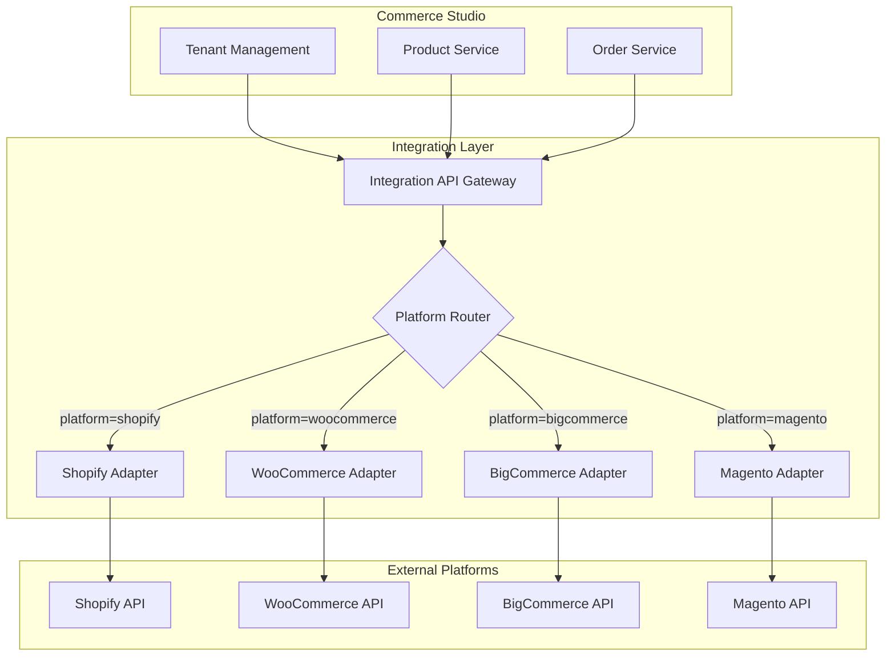

# E-commerce Integration Layer Architecture

## 1. Executive Summary

This document outlines the architecture for the **E-commerce Integration Layer**, a crucial component of the Commerce Studio platform. This layer will provide a standardized interface for connecting to various e-commerce platforms (e.g., Shopify, WooCommerce, BigCommerce), enabling seamless product catalog synchronization, order management, and inventory updates. The design is based on an adapter pattern to ensure extensibility and maintainability.

## 2. Core Concepts & Workflow

The integration layer will act as a bridge between the Commerce Studio platform and external e-commerce systems.



## 3. Service Responsibilities

- **Standardized Interface**: Provides a single, consistent API for all e-commerce operations, regardless of the underlying platform.
- **Platform Adapters**: Implements platform-specific logic for authentication, API calls, and data transformation.
- **Data Synchronization**: Manages the two-way synchronization of product catalogs, inventory levels, and order data.
- **Webhook Handling**: Processes incoming webhooks from e-commerce platforms for real-time updates.
- **Secure Credential Management**: Securely stores and manages API keys and access tokens for each tenant's e-commerce store.

## 4. Technical Architecture

### 4.1. Components

1.  **API Gateway**: A dedicated gateway for all incoming and outgoing e-commerce traffic.
2.  **Platform Router**: A middleware that inspects each request and routes it to the appropriate platform adapter based on the tenant's configuration.
3.  **Adapter Interface**: A common interface that all platform adapters must implement.
4.  **Platform Adapters**: Individual modules for each supported e-commerce platform.
5.  **Data Mapper**: A utility for transforming data between the Commerce Studio and platform-specific formats.
6.  **Sync Engine**: A background service that periodically synchronizes data between platforms.

### 4.2. Directory Structure

```
services/
└── ecommerce-integration/
    ├── src/
    │   ├── api/
    │   │   └── routes.js
    │   ├── adapters/
    │   │   ├── base-adapter.js  # Interface definition
    │   │   ├── shopify/
    │   │   │   ├── index.js
    │   │   │   └── client.js
    │   │   └── woocommerce/
    │   │       ├── index.js
    │   │       └── client.js
    │   ├── services/
    │   │   ├── router.js
    │   │   ├── sync-engine.js
    │   │   └── credential-manager.js
    │   ├── utils/
    │   │   └── data-mapper.js
    │   └── server.js
    ├── Dockerfile
    └── package.json
```

## 5. API Specification

The Integration Layer will expose a set of standardized endpoints for managing e-commerce data.

**Product Sync**: `POST /api/v1/sync/products`
- **Description**: Initiates a product synchronization job for a tenant.
- **Request Body**: `{ "tenantId": "uuid", "platform": "shopify" }`

**Order Management**: `GET /api/v1/orders`
- **Description**: Retrieves a list of orders for a tenant.
- **Query Params**: `tenantId=uuid`, `platform=shopify`, `status=shipped`

**Webhook Handler**: `POST /api/v1/webhooks/{platform}`
- **Description**: A generic endpoint for receiving webhooks from all supported platforms.

## 6. Adapter Design

Each adapter will be a class that extends a `BaseAdapter` and implements a standard set of methods.

**`BaseAdapter.js`**
```javascript
class BaseAdapter {
  constructor(credentials) {
    this.credentials = credentials;
  }
  async getProducts() { throw new Error("Not implemented"); }
  async getOrder(orderId) { throw new Error("Not implemented"); }
  async createWebhook(topic, url) { throw new Error("Not implemented"); }
}
```

**`ShopifyAdapter.js`**
```javascript
const Shopify = require('shopify-api-node');

class ShopifyAdapter extends BaseAdapter {
  constructor(credentials) {
    super(credentials);
    this.client = new Shopify({
      shopName: credentials.shopName,
      accessToken: credentials.accessToken
    });
  }

  async getProducts() {
    const products = await this.client.product.list();
    return products.map(this.mapToStandardFormat);
  }
  // ... other implemented methods
}
```

## 7. Security Considerations

-   All API credentials for external platforms must be encrypted at rest and in transit.
-   The Integration Layer must validate all incoming webhook signatures to prevent spoofing.
-   The service should have its own authentication and authorization layer to ensure that only authorized services can access it.

## 8. Next Steps

1.  **Implement Base Adapter**: Define the common interface for all platform adapters.
2.  **Develop Shopify Adapter**: Build the first adapter for Shopify as a proof-of-concept.
3.  **Build API Gateway & Router**: Create the core routing logic for the service.
4.  **Implement Credential Manager**: Develop a secure way to store and retrieve platform credentials.
5.  **Develop Sync Engine**: Build the background service for data synchronization.