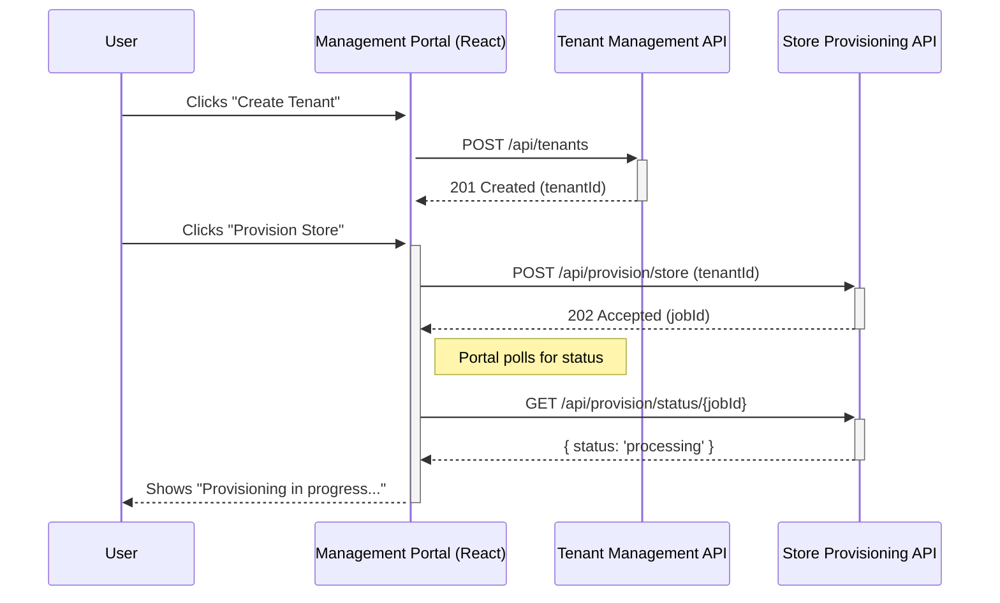

# Management Portal Architecture

## 1. Executive Summary

This document outlines the architecture for the **Management Portal**, the central administrative interface for the Commerce Studio platform. This portal will provide a user-friendly application for managing tenants, provisioning stores, configuring e-commerce integrations, and monitoring analytics. The architecture is designed to be a modern, responsive, and scalable single-page application (SPA).

## 2. Core Features & User Journeys

-   **Tenant Management**:
    -   Create, view, update, and deactivate tenant accounts.
    -   Generate and manage API keys for each tenant.
-   **Store Provisioning**:
    -   Trigger the creation of new online catalogs with a single click.
    -   Monitor the status of provisioning jobs in real-time.
-   **E-commerce Integration**:
    -   Configure and manage connections to external e-commerce platforms (Shopify, WooCommerce, etc.).
    -   Initiate and monitor product and order synchronization.
-   **Analytics Dashboard**:
    -   View key performance metrics for each tenant's storefront.
    -   Track sales, conversions, and customer engagement.

## 3. Technical Architecture

### 3.1. Frontend Technology Stack

-   **Framework**: React (with Vite for fast development and bundling).
-   **UI Component Library**: Material-UI (MUI) for a professional and consistent look and feel.
-   **State Management**: Redux Toolkit for predictable and scalable state management.
-   **Routing**: React Router for client-side navigation.
-   **API Communication**: Axios for making requests to the backend microservices.
-   **Styling**: Styled-components or Emotion for CSS-in-JS.

### 3.2. Component-Based Structure

The portal will be built using a modular, component-based architecture.

```
apps/
└── management-portal/
    ├── src/
    │   ├── components/         # Reusable UI components (buttons, inputs, etc.)
    │   ├── features/           # Feature-based modules
    │   │   ├── tenants/
    │   │   │   ├── TenantList.jsx
    │   │   │   └── TenantForm.jsx
    │   │   ├── provisioning/
    │   │   │   ├── ProvisioningStatus.jsx
    │   │   │   └── ProvisioningTrigger.jsx
    │   │   └── analytics/
    │   │       ├── Dashboard.jsx
    │   │       └── Chart.jsx
    │   ├── hooks/              # Custom React hooks
    │   ├── layouts/            # Main application layouts (e.g., DashboardLayout)
    │   ├── pages/              # Top-level page components
    │   ├── services/           # API client services
    │   │   ├── tenant-api.js
    │   │   └── provisioning-api.js
    │   ├── store/              # Redux store configuration
    │   └── App.jsx
    ├── public/
    ├── Dockerfile
    └── package.json
```

## 4. API Integration

The Management Portal will communicate with the backend microservices via their respective REST APIs.



## 5. Deployment & Hosting

-   **Hosting**: The portal will be a static single-page application hosted on Google Cloud Storage.
-   **CDN**: A Google Cloud CDN will be used to ensure fast delivery of the application's assets.
-   **CI/CD**: A GitHub Actions workflow will automatically build and deploy the portal whenever changes are pushed to the `main` branch.

## 6. Security Considerations

-   **Authentication**: The portal will use a secure authentication method (e.g., JWT-based) to protect all administrative routes.
-   **Authorization**: Role-based access control (RBAC) will be implemented to ensure that users can only access the features and data they are authorized to see.
-   **API Security**: All API requests will be made over HTTPS, and all sensitive data will be handled securely.

## 7. Next Steps

1.  **Project Setup**: Create the `management-portal` directory and initialize a new React project using Vite.
2.  **Install Dependencies**: Add Material-UI, Redux Toolkit, React Router, and Axios to the project.
3.  **Implement Layout**: Build the main application layout, including the navigation and header.
4.  **Develop Tenant Management**: Create the components and API services for managing tenants.
5.  **Implement Store Provisioning**: Build the UI for triggering and monitoring store provisioning jobs.