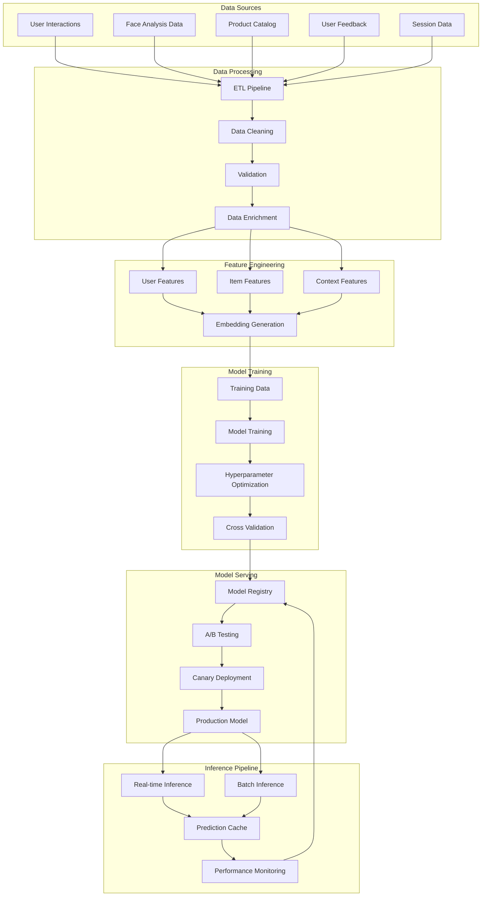

# ML Pipeline Specifications
**Advanced Recommendations Engine - Technical Implementation**

## Machine Learning Pipeline Architecture

### 1. Data Flow Architecture



### 2. Model Architecture Specifications

#### Hybrid Recommendation Model

```python
import torch
import torch.nn as nn
import torch.nn.functional as F
from transformers import AutoModel

class HybridRecommendationModel(nn.Module):
    def __init__(self, config):
        super().__init__()
        self.config = config
        
        # User embedding layers
        self.user_embedding = nn.Embedding(
            config.num_users, config.user_embedding_dim
        )
        self.face_shape_embedding = nn.Embedding(
            config.num_face_shapes, config.face_embedding_dim
        )
        
        # Item embedding layers
        self.item_embedding = nn.Embedding(
            config.num_items, config.item_embedding_dim
        )
        self.style_embedding = nn.Embedding(
            config.num_styles, config.style_embedding_dim
        )
        
        # Feature encoders
        self.user_feature_encoder = nn.Sequential(
            nn.Linear(config.user_feature_dim, 128),
            nn.ReLU(),
            nn.Dropout(0.2),
            nn.Linear(128, 64)
        )
        
        self.item_feature_encoder = nn.Sequential(
            nn.Linear(config.item_feature_dim, 128),
            nn.ReLU(),
            nn.Dropout(0.2),
            nn.Linear(128, 64)
        )
        
        # Context encoder
        self.context_encoder = nn.Sequential(
            nn.Linear(config.context_dim, 64),
            nn.ReLU(),
            nn.Dropout(0.2),
            nn.Linear(64, 32)
        )
        
        # Attention mechanisms
        self.user_attention = nn.MultiheadAttention(
            embed_dim=64, num_heads=8
        )
        self.item_attention = nn.MultiheadAttention(
            embed_dim=64, num_heads=8
        )
        
        # Fusion layers
        self.fusion_layer = nn.Sequential(
            nn.Linear(64 + 64 + 32, 128),
            nn.ReLU(),
            nn.Dropout(0.3),
            nn.Linear(128, 64),
            nn.ReLU(),
            nn.Linear(64, 1)
        )
        
    def forward(self, user_ids, item_ids, user_features, item_features, context):
        # User representations
        user_emb = self.user_embedding(user_ids)
        face_emb = self.face_shape_embedding(user_features['face_shape'])
        user_feat = self.user_feature_encoder(user_features['features'])
        
        # Item representations
        item_emb = self.item_embedding(item_ids)
        style_emb = self.style_embedding(item_features['style'])
        item_feat = self.item_feature_encoder(item_features['features'])
        
        # Context encoding
        context_feat = self.context_encoder(context)
        
        # Attention-based fusion
        user_combined = torch.cat([user_emb, face_emb, user_feat], dim=-1)
        item_combined = torch.cat([item_emb, style_emb, item_feat], dim=-1)
        
        user_attended, _ = self.user_attention(
            user_combined, user_combined, user_combined
        )
        item_attended, _ = self.item_attention(
            item_combined, item_combined, item_combined
        )
        
        # Final fusion and prediction
        combined = torch.cat([
            user_attended, item_attended, context_feat
        ], dim=-1)
        
        score = self.fusion_layer(combined)
        return torch.sigmoid(score)
```

#### Face Shape Analysis Model

```python
class FaceShapeAnalysisModel(nn.Module):
    def __init__(self, config):
        super().__init__()
        
        # Pre-trained vision backbone
        self.backbone = AutoModel.from_pretrained(
            'google/vit-base-patch16-224'
        )
        
        # Face shape classifier
        self.face_shape_classifier = nn.Sequential(
            nn.Linear(768, 256),
            nn.ReLU(),
            nn.Dropout(0.3),
            nn.Linear(256, 128),
            nn.ReLU(),
            nn.Dropout(0.2),
            nn.Linear(128, config.num_face_shapes)
        )
        
        # Measurement regression
        self.measurement_regressor = nn.Sequential(
            nn.Linear(768, 256),
            nn.ReLU(),
            nn.Dropout(0.3),
            nn.Linear(256, 128),
            nn.ReLU(),
            nn.Dropout(0.2),
            nn.Linear(128, 5)  # 5 key measurements
        )
        
        # Confidence estimator
        self.confidence_estimator = nn.Sequential(
            nn.Linear(768, 128),
            nn.ReLU(),
            nn.Dropout(0.2),
            nn.Linear(128, 64),
            nn.ReLU(),
            nn.Linear(64, 1)
        )
        
    def forward(self, images):
        # Extract features
        features = self.backbone(images).last_hidden_state[:, 0]  # CLS token
        
        # Predictions
        face_shape_logits = self.face_shape_classifier(features)
        measurements = self.measurement_regressor(features)
        confidence = torch.sigmoid(self.confidence_estimator(features))
        
        return {
            'face_shape': face_shape_logits,
            'measurements': measurements,
            'confidence': confidence
        }
```

### 3. Training Pipeline Implementation

```python
class TrainingPipeline:
    def __init__(self, config):
        self.config = config
        self.model = HybridRecommendationModel(config)
        self.optimizer = torch.optim.AdamW(
            self.model.parameters(),
            lr=config.learning_rate,
            weight_decay=config.weight_decay
        )
        self.scheduler = torch.optim.lr_scheduler.CosineAnnealingLR(
            self.optimizer, T_max=config.num_epochs
        )
        
    def train_epoch(self, train_loader):
        self.model.train()
        total_loss = 0
        
        for batch in train_loader:
            self.optimizer.zero_grad()
            
            # Forward pass
            predictions = self.model(
                batch['user_ids'],
                batch['item_ids'],
                batch['user_features'],
                batch['item_features'],
                batch['context']
            )
            
            # Loss calculation
            loss = self.compute_loss(predictions, batch['labels'])
            
            # Backward pass
            loss.backward()
            self.optimizer.step()
            
            total_loss += loss.item()
            
        return total_loss / len(train_loader)
    
    def compute_loss(self, predictions, labels):
        # Binary cross-entropy for click prediction
        bce_loss = F.binary_cross_entropy(predictions, labels)
        
        # Ranking loss for better ordering
        ranking_loss = self.compute_ranking_loss(predictions, labels)
        
        # Diversity loss to encourage diverse recommendations
        diversity_loss = self.compute_diversity_loss(predictions)
        
        return bce_loss + 0.1 * ranking_loss + 0.05 * diversity_loss
    
    def compute_ranking_loss(self, predictions, labels):
        # Pairwise ranking loss
        positive_mask = labels > 0.5
        negative_mask = labels <= 0.5
        
        if positive_mask.sum() == 0 or negative_mask.sum() == 0:
            return torch.tensor(0.0)
        
        pos_scores = predictions[positive_mask]
        neg_scores = predictions[negative_mask]
        
        # Create all pairs
        pos_expanded = pos_scores.unsqueeze(1)
        neg_expanded = neg_scores.unsqueeze(0)
        
        margins = 1.0 - (pos_expanded - neg_expanded)
        hinge_loss = F.relu(margins)
        
        return hinge_loss.mean()
    
    def compute_diversity_loss(self, predictions):
        # Encourage diversity in top recommendations
        top_k = min(10, len(predictions))
        top_predictions = torch.topk(predictions.squeeze(), top_k).values
        
        # Compute pairwise similarities
        similarities = torch.mm(
            top_predictions.unsqueeze(1),
            top_predictions.unsqueeze(0)
        )
        
        # Penalize high similarities
        diversity_loss = similarities.sum() - similarities.trace()
        return diversity_loss / (top_k * (top_k - 1))
```

### 4. Real-time Inference Service

```python
class RealTimeInferenceService:
    def __init__(self, model_path, config):
        self.model = HybridRecommendationModel(config)
        self.model.load_state_dict(torch.load(model_path))
        self.model.eval()
        
        self.feature_store = FeatureStore()
        self.cache = Redis(host='localhost', port=6379)
        
    async def get_recommendations(self, user_id, context, num_recommendations=10):
        # Check cache first
        cache_key = f"recs:{user_id}:{hash(str(context))}"
        cached_recs = await self.cache.get(cache_key)
        
        if cached_recs:
            return json.loads(cached_recs)
        
        # Get user features
        user_features = await self.feature_store.get_user_features(user_id)
        
        # Get candidate items
        candidate_items = await self.get_candidate_items(user_id, context)
        
        # Score all candidates
        scores = []
        for item in candidate_items:
            item_features = await self.feature_store.get_item_features(item['id'])
            
            with torch.no_grad():
                score = self.model(
                    torch.tensor([user_id]),
                    torch.tensor([item['id']]),
                    user_features,
                    item_features,
                    context
                )
            
            scores.append({
                'item_id': item['id'],
                'score': score.item(),
                'features': item_features
            })
        
        # Sort and select top recommendations
        recommendations = sorted(scores, key=lambda x: x['score'], reverse=True)[:num_recommendations]
        
        # Cache results
        await self.cache.setex(
            cache_key,
            3600,  # 1 hour TTL
            json.dumps(recommendations)
        )
        
        return recommendations
    
    async def get_candidate_items(self, user_id, context):
        # Implement candidate generation logic
        # This could include:
        # - Popular items
        # - Items similar to user's history
        # - Items matching user's face shape
        # - Items in user's budget range
        pass
```

### 5. Model Evaluation Framework

```python
class ModelEvaluator:
    def __init__(self, model, test_loader):
        self.model = model
        self.test_loader = test_loader
        
    def evaluate(self):
        self.model.eval()
        
        all_predictions = []
        all_labels = []
        
        with torch.no_grad():
            for batch in self.test_loader:
                predictions = self.model(
                    batch['user_ids'],
                    batch['item_ids'],
                    batch['user_features'],
                    batch['item_features'],
                    batch['context']
                )
                
                all_predictions.extend(predictions.cpu().numpy())
                all_labels.extend(batch['labels'].cpu().numpy())
        
        # Calculate metrics
        metrics = {
            'auc': self.calculate_auc(all_predictions, all_labels),
            'precision_at_k': self.calculate_precision_at_k(all_predictions, all_labels),
            'recall_at_k': self.calculate_recall_at_k(all_predictions, all_labels),
            'ndcg': self.calculate_ndcg(all_predictions, all_labels),
            'diversity': self.calculate_diversity(all_predictions),
            'coverage': self.calculate_coverage(all_predictions)
        }
        
        return metrics
    
    def calculate_auc(self, predictions, labels):
        from sklearn.metrics import roc_auc_score
        return roc_auc_score(labels, predictions)
    
    def calculate_precision_at_k(self, predictions, labels, k=10):
        # Sort by prediction score
        sorted_indices = np.argsort(predictions)[::-1]
        top_k_labels = np.array(labels)[sorted_indices[:k]]
        return np.mean(top_k_labels)
    
    def calculate_recall_at_k(self, predictions, labels, k=10):
        # Sort by prediction score
        sorted_indices = np.argsort(predictions)[::-1]
        top_k_labels = np.array(labels)[sorted_indices[:k]]
        total_relevant = np.sum(labels)
        
        if total_relevant == 0:
            return 0.0
        
        return np.sum(top_k_labels) / total_relevant
    
    def calculate_ndcg(self, predictions, labels, k=10):
        from sklearn.metrics import ndcg_score
        return ndcg_score([labels], [predictions], k=k)
    
    def calculate_diversity(self, predictions):
        # Measure diversity of top recommendations
        # This is a simplified version
        top_k = min(10, len(predictions))
        top_indices = np.argsort(predictions)[::-1][:top_k]
        
        # Calculate pairwise distances
        distances = []
        for i in range(len(top_indices)):
            for j in range(i + 1, len(top_indices)):
                # Use feature similarity as proxy for diversity
                distances.append(abs(predictions[top_indices[i]] - predictions[top_indices[j]]))
        
        return np.mean(distances)
    
    def calculate_coverage(self, predictions):
        # Measure how many items are recommended
        # This is a simplified version
        threshold = 0.5
        recommended_items = np.sum(np.array(predictions) > threshold)
        total_items = len(predictions)
        
        return recommended_items / total_items
```

### 6. Deployment Configuration

```yaml
# ML Pipeline Deployment
apiVersion: v1
kind: ConfigMap
metadata:
  name: ml-pipeline-config
data:
  model_config.yaml: |
    model:
      user_embedding_dim: 128
      item_embedding_dim: 128
      face_embedding_dim: 64
      style_embedding_dim: 64
      user_feature_dim: 256
      item_feature_dim: 256
      context_dim: 128
      num_users: 1000000
      num_items: 50000
      num_face_shapes: 6
      num_styles: 20
    
    training:
      batch_size: 512
      learning_rate: 0.001
      weight_decay: 0.01
      num_epochs: 100
      early_stopping_patience: 10
    
    inference:
      batch_size: 64
      cache_ttl: 3600
      num_recommendations: 10
      candidate_pool_size: 1000

---
apiVersion: apps/v1
kind: Deployment
metadata:
  name: ml-inference-service
spec:
  replicas: 3
  selector:
    matchLabels:
      app: ml-inference
  template:
    metadata:
      labels:
        app: ml-inference
    spec:
      containers:
      - name: inference-service
        image: gcr.io/PROJECT_ID/ml-inference:latest
        ports:
        - containerPort: 8080
        env:
        - name: MODEL_PATH
          value: "/models/hybrid_model.pth"
        - name: REDIS_URL
          valueFrom:
            secretKeyRef:
              name: redis-secret
              key: url
        volumeMounts:
        - name: model-storage
          mountPath: /models
        resources:
          requests:
            memory: "2Gi"
            cpu: "1000m"
            nvidia.com/gpu: 1
          limits:
            memory: "4Gi"
            cpu: "2000m"
            nvidia.com/gpu: 1
      volumes:
      - name: model-storage
        persistentVolumeClaim:
          claimName: model-storage-pvc
```

### 7. Monitoring and Alerting

```python
class ModelMonitor:
    def __init__(self, model_id):
        self.model_id = model_id
        self.metrics_collector = MetricsCollector()
        self.alerting_service = AlertingService()
        
    def monitor_prediction(self, prediction, actual_outcome=None):
        # Log prediction
        self.metrics_collector.log_prediction(
            model_id=self.model_id,
            prediction=prediction,
            timestamp=datetime.now()
        )
        
        # Monitor prediction distribution
        self.check_prediction_distribution(prediction)
        
        # Monitor latency
        self.check_prediction_latency(prediction.get('latency', 0))
        
        # Monitor accuracy if actual outcome is available
        if actual_outcome is not None:
            self.check_prediction_accuracy(prediction, actual_outcome)
    
    def check_prediction_distribution(self, prediction):
        # Check for prediction drift
        recent_predictions = self.metrics_collector.get_recent_predictions(
            model_id=self.model_id,
            hours=24
        )
        
        if len(recent_predictions) < 100:
            return
        
        # Statistical tests for distribution drift
        from scipy import stats
        
        baseline_scores = [p['score'] for p in recent_predictions[-1000:]]
        current_scores = [p['score'] for p in recent_predictions[-100:]]
        
        # KS test for distribution change
        ks_stat, p_value = stats.ks_2samp(baseline_scores, current_scores)
        
        if p_value < 0.05:
            self.alerting_service.send_alert(
                "Prediction distribution drift detected",
                {
                    'model_id': self.model_id,
                    'ks_statistic': ks_stat,
                    'p_value': p_value
                }
            )
    
    def check_prediction_latency(self, latency):
        # Check for latency spikes
        if latency > 1000:  # 1 second threshold
            self.alerting_service.send_alert(
                "High prediction latency detected",
                {
                    'model_id': self.model_id,
                    'latency': latency,
                    'timestamp': datetime.now()
                }
            )
    
    def check_prediction_accuracy(self, prediction, actual_outcome):
        # Calculate accuracy metrics
        accuracy = self.calculate_accuracy(prediction, actual_outcome)
        
        # Log accuracy
        self.metrics_collector.log_accuracy(
            model_id=self.model_id,
            accuracy=accuracy,
            timestamp=datetime.now()
        )
        
        # Check for accuracy degradation
        recent_accuracy = self.metrics_collector.get_recent_accuracy(
            model_id=self.model_id,
            hours=24
        )
        
        if recent_accuracy < 0.7:  # 70% threshold
            self.alerting_service.send_alert(
                "Model accuracy degradation detected",
                {
                    'model_id': self.model_id,
                    'recent_accuracy': recent_accuracy,
                    'timestamp': datetime.now()
                }
            )
```

This ML pipeline specification provides a comprehensive framework for implementing the advanced recommendation engine with proper model architecture, training pipeline, evaluation, and monitoring components.