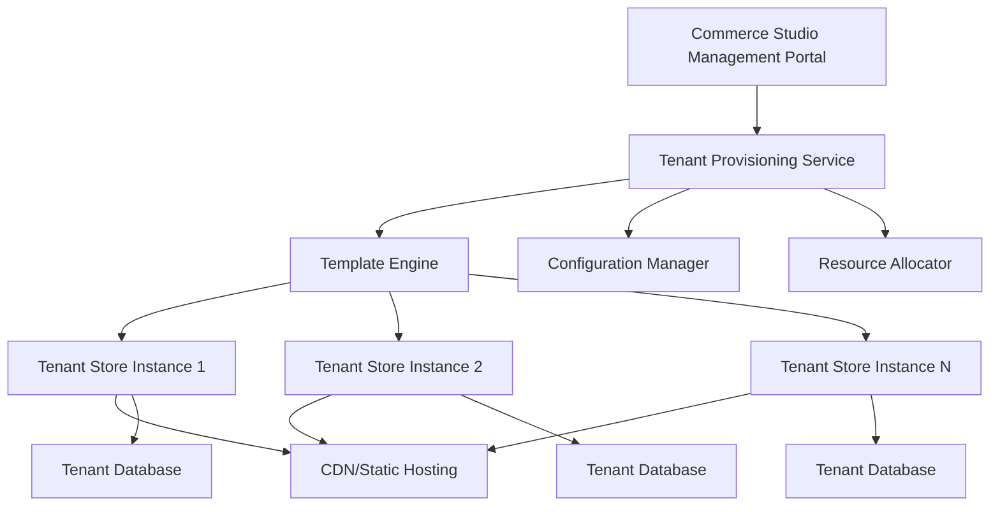

# Multi-Tenant Store Architecture
## Commerce Studio Templated Catalog Platform

### Executive Summary

This architecture transforms the single demo store into a robust, multi-tenant SaaS platform capable of rapidly provisioning customized online catalogs for 40+ customers. Each tenant receives a fully-featured, branded storefront with integrated Commerce Studio AI capabilities.

### Current State Analysis

**Problems with Current Demo Store:**
- Single static HTML store
- Hardcoded configuration
- No tenant isolation
- Manual deployment process
- Single API key usage
- No customization capabilities

**Business Requirements:**
- 40+ customers need individual catalogs
- Rapid store provisioning
- Tenant-specific branding
- Unique API key per tenant
- Scalable infrastructure
- Centralized management

### Multi-Tenant Architecture Design

#### 1. Tenant Isolation Model



#### 2. System Components

**A. Tenant Management Service**
- Tenant registration and configuration
- API key management per tenant
- Billing and subscription management
- Resource allocation and limits

**B. Template Engine**
- Base store templates
- Theme customization system
- Component library
- Asset management

**C. Provisioning Service**
- Automated store deployment
- DNS configuration
- SSL certificate management
- Environment variable injection

**D. Multi-Tenant Database Layer**
- Tenant-specific schemas
- Shared configuration tables
- Analytics aggregation
- Data isolation enforcement

#### 3. Technical Architecture

**Frontend Architecture:**
```
apps/
├── store-template/           # Base template system
│   ├── templates/
│   │   ├── default/         # Default store template
│   │   ├── premium/         # Premium template
│   │   └── custom/          # Custom templates
│   ├── components/          # Reusable UI components
│   │   ├── consultation-chat/
│   │   ├── face-analyzer/
│   │   ├── vto-widget/
│   │   └── product-catalog/
│   └── themes/              # Visual themes
│       ├── colors/
│       ├── fonts/
│       └── layouts/
├── tenant-stores/           # Generated tenant stores
│   ├── {tenant-id-1}/
│   ├── {tenant-id-2}/
│   └── {tenant-id-n}/
└── management-portal/       # Admin interface
    ├── tenant-management/
    ├── analytics-dashboard/
    └── billing-system/
```

**Backend Architecture:**
```
services/
├── tenant-service/          # Tenant CRUD operations
├── provisioning-service/    # Store generation & deployment
├── template-service/        # Template management
├── configuration-service/   # Per-tenant configuration
├── analytics-service/       # Multi-tenant analytics
└── billing-service/         # Subscription management
```

#### 4. Deployment Strategy

**Container-Based Multi-Tenancy:**
```yaml
# Per-tenant deployment
apiVersion: apps/v1
kind: Deployment
metadata:
  name: store-{tenant-id}
spec:
  replicas: 1
  selector:
    matchLabels:
      app: commerce-store
      tenant: {tenant-id}
  template:
    spec:
      containers:
      - name: store
        image: gcr.io/{project}/commerce-store-template:latest
        env:
        - name: TENANT_ID
          value: {tenant-id}
        - name: COMMERCE_STUDIO_API_KEY
          valueFrom:
            secretKeyRef:
              name: tenant-{tenant-id}-secrets
              key: api-key
        - name: TENANT_CONFIG
          valueFrom:
            configMapKeyRef:
              name: tenant-{tenant-id}-config
              key: config.json
```

#### 5. Data Architecture

**Tenant Configuration Schema:**
```json
{
  "tenantId": "unique-tenant-id",
  "apiKey": "tenant-specific-api-key",
  "branding": {
    "companyName": "Customer Company",
    "logo": "https://cdn.example.com/logo.png",
    "colors": {
      "primary": "#007bff",
      "secondary": "#6c757d"
    },
    "fonts": {
      "heading": "Arial",
      "body": "Helvetica"
    }
  },
  "features": {
    "consultation": true,
    "vto": true,
    "faceAnalysis": true,
    "recommendations": true
  },
  "domain": {
    "subdomain": "customer-store",
    "customDomain": "catalog.customer.com"
  },
  "products": {
    "catalogId": "tenant-catalog-id",
    "categories": ["glasses", "sunglasses"],
    "filters": ["brand", "price", "color"]
  }
}
```

#### 6. Security Architecture

**Tenant Isolation:**
- Separate databases per tenant
- API key-based authentication
- Resource quotas and limits
- Network-level isolation

**Access Control:**
- Role-based permissions
- Tenant-scoped API access
- Audit logging
- Data encryption at rest

#### 7. Implementation Phases

**Phase 1: Foundation (Weeks 1-2)**
- Create tenant management service
- Design database schema
- Build basic template system
- Implement provisioning pipeline

**Phase 2: Core Platform (Weeks 3-4)**
- Template engine development
- Multi-tenant configuration system
- Basic store generation
- Management portal MVP

**Phase 3: Advanced Features (Weeks 5-6)**
- Custom theming system
- Advanced analytics
- Billing integration
- Performance optimization

**Phase 4: Production Ready (Weeks 7-8)**
- Security hardening
- Load testing
- Monitoring setup
- Documentation

### 8. Technology Stack

**Frontend:**
- React/Vue.js for management portal
- Vanilla JS for store templates (performance)
- Tailwind CSS for styling system
- Webpack for build optimization

**Backend:**
- Node.js/Express for services
- PostgreSQL for tenant data
- Redis for caching
- Google Cloud Run for deployment

**Infrastructure:**
- Google Cloud Platform
- Cloud CDN for static assets
- Cloud Load Balancer
- Cloud SQL for databases

### 9. Scalability Considerations

**Horizontal Scaling:**
- Container orchestration with Kubernetes
- Auto-scaling based on tenant usage
- Database sharding strategies
- CDN for global distribution

**Performance Optimization:**
- Lazy loading of components
- Template caching
- Asset optimization
- Database query optimization

### 10. Migration Strategy

**From Current Demo Store:**
1. Extract reusable components
2. Create base template structure
3. Implement tenant management
4. Migrate existing customers
5. Sunset single demo store

**Customer Onboarding:**
1. Tenant registration
2. API key generation
3. Store configuration
4. Domain setup
5. Go-live support

### 11. Success Metrics

**Technical Metrics:**
- Store provisioning time < 5 minutes
- 99.9% uptime per tenant
- Page load time < 3 seconds
- API response time < 500ms

**Business Metrics:**
- Customer onboarding time reduction
- Support ticket reduction
- Revenue per tenant
- Platform adoption rate

### 12. Risk Mitigation

**Technical Risks:**
- Database performance at scale
- Template complexity management
- Security vulnerabilities
- Deployment failures

**Business Risks:**
- Customer migration resistance
- Feature parity concerns
- Pricing model validation
- Support scalability

### Next Steps

1. **Immediate:** Design tenant management database schema
2. **Week 1:** Implement basic provisioning service
3. **Week 2:** Create template engine MVP
4. **Week 3:** Build management portal
5. **Week 4:** Pilot with 3-5 existing customers

This architecture provides a solid foundation for scaling your Commerce Studio platform to serve hundreds of customers with individualized, AI-powered catalogs.