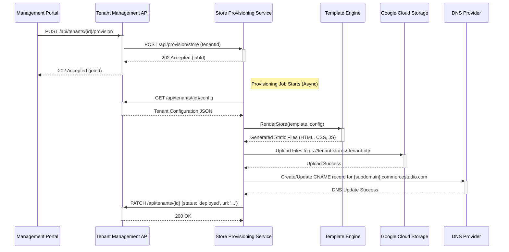

# Store Provisioning Service Architecture

## 1. Executive Summary

This document outlines the architecture for the **Store Provisioning Service**, a core component of the Commerce Studio multi-tenant platform. This service is responsible for the automated creation, customization, and deployment of individual online catalogs for each tenant. Its primary goal is to enable rapid, scalable, and consistent onboarding of new customers.

## 2. Core Concepts & Workflow

The provisioning process is designed as an asynchronous workflow triggered by an API call.



## 3. Service Responsibilities

- **Consume Tenant Data**: Fetches configuration data for a specific tenant from the Tenant Management Service.
- **Template Rendering**: Uses a template engine to inject tenant-specific data (branding, product info, API keys) into a base store template.
- **Asset Generation**: Compiles and prepares all static assets (HTML, CSS, JavaScript, images) for the new storefront.
- **Deployment**: Pushes the generated static site to a hosting provider (Google Cloud Storage).
- **DNS Management**: Configures DNS records to point a tenant's subdomain to their newly deployed store.
- **Status Updates**: Reports the status of the provisioning job back to the Tenant Management Service.

## 4. Technical Architecture

### 4.1. Components

1.  **API Layer (Express.js)**: Exposes endpoints to trigger and monitor provisioning jobs.
2.  **Job Queue (Redis/BullMQ)**: Manages asynchronous provisioning tasks to handle high load and ensure reliability.
3.  **Provisioning Engine**: The core logic that orchestrates the entire workflow.
4.  **Template Engine (EJS/Handlebars)**: Renders dynamic content into the static templates.
5.  **Deployment Adapters**: Pluggable modules for deploying to different targets (e.g., GCS, Vercel, Netlify).
6.  **Configuration Manager**: Securely handles environment variables and service credentials.

### 4.2. Directory Structure

```
services/
└── store-provisioning/
    ├── src/
    │   ├── api/
    │   │   └── routes.js         # Express routes
    │   ├── jobs/
    │   │   └── provisioning-job.js # BullMQ job processor
    │   ├── services/
    │   │   ├── engine.js         # Core provisioning logic
    │   │   ├── template-service.js # Template rendering
    │   │   └── deploy-service.js   # Deployment adapter for GCS
    │   ├── templates/              # Base store templates
    │   │   ├── default/
    │   │   │   ├── index.html
    │   │   │   ├── styles.css
    │   │   │   └── main.js
    │   │   └── premium/
    │   ├── utils/
    │   │   └── logger.js
    │   ├── config.js
    │   └── server.js
    ├── Dockerfile
    └── package.json
```

## 5. API Specification

**Endpoint**: `POST /api/provision/store`
- **Description**: Initiates a new store provisioning job.
- **Request Body**:
  ```json
  {
    "tenantId": "uuid-of-the-tenant"
  }
  ```
- **Success Response (202 Accepted)**:
  ```json
  {
    "jobId": "uuid-of-the-provisioning-job",
    "status": "queued",
    "message": "Store provisioning has been queued."
  }
  ```

**Endpoint**: `GET /api/provision/status/{jobId}`
- **Description**: Retrieves the status of a provisioning job.
- **Success Response (200 OK)**:
  ```json
  {
    "jobId": "uuid-of-the-provisioning-job",
    "status": "deployed", // queued, processing, deployed, failed
    "storeUrl": "https://tenant-subdomain.commercestudio.com",
    "logs": [
      "Job started at ...",
      "Fetched tenant configuration.",
      "Rendered store template.",
      "Deployed assets to GCS.",
      "Updated DNS records.",
      "Job completed successfully."
    ]
  }
  ```

## 6. Data Flow & Templating

The service will use a base template located in `src/templates/default`. Placeholders in the template will be denoted by a specific syntax (e.g., `<%= tenant.branding.companyName %>` for EJS).

**Example `index.html` Template:**
```html
<!DOCTYPE html>
<html lang="en">
<head>
    <meta charset="UTF-8">
    <title><%= tenant.branding.companyName %></title>
    <style>
        :root {
            --primary-color: <%= tenant.branding.colors.primary %>;
        }
    </style>
    <script>
        window.COMMERCE_STUDIO_CONFIG = {
            apiKey: "<%= tenant.apiKey %>",
            tenantId: "<%= tenant.id %>"
        };
    </script>
</head>
<body>
    <h1>Welcome to <%= tenant.branding.companyName %></h1>
</body>
</html>
```

The provisioning engine will read this template, inject the values from the tenant's configuration JSON, and output a final, static `index.html` file.

## 7. Deployment & Hosting

-   **Hosting**: Each tenant's generated static site will be hosted in a dedicated folder within a Google Cloud Storage bucket (`gs://tenant-stores/{tenant-id}`).
-   **CDN**: A Google Cloud CDN will be placed in front of the GCS bucket to ensure fast load times globally.
-   **DNS**: A CNAME record for each tenant's subdomain (`{subdomain}.commercestudio.com`) will point to the Google Cloud Load Balancer fronting the CDN.

## 8. Security Considerations

-   The service must use secure, short-lived credentials to access GCP services (GCS, DNS).
-   The API endpoints must be protected and only accessible by the Tenant Management Service.
-   Input validation is critical to prevent injection attacks into the templates or deployment scripts.
-   The generated stores must be properly configured to prevent cross-site scripting (XSS) and other web vulnerabilities.

## 9. Next Steps

1.  **Implementation**: Create the `store-provisioning` service directory and `package.json`.
2.  **Develop API**: Build the Express.js API layer with the defined endpoints.
3.  **Implement Engine**: Write the core provisioning logic.
4.  **Integrate GCS**: Develop the deployment adapter for Google Cloud Storage.
5.  **Testing**: Create unit and integration tests for the provisioning workflow.