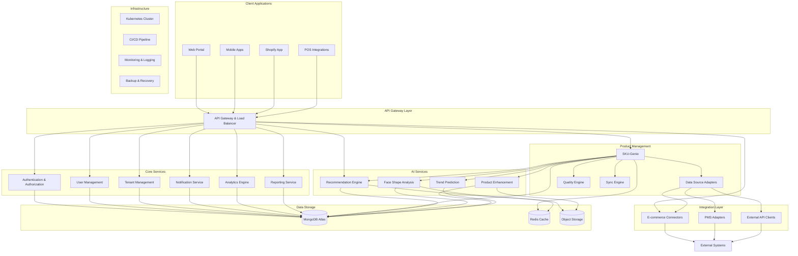

# VARAi Commerce Studio Technical Architecture

## System Overview

VARAi Commerce Studio (also known as EyewearML) is a comprehensive AI-powered platform for eyewear product management, recommendation, and enhancement. The platform integrates multiple components to provide a seamless experience for eyewear retailers, brands, and customers.

## Component Details

### 1. Client Applications

These are the various interfaces through which users interact with the Commerce Studio platform:

- **Web Portal**: Primary interface for retailers, brands, and administrators
- **Mobile Apps**: iOS and Android applications for on-the-go management
- **Shopify App**: Dedicated integration for Shopify merchants
- **POS Integrations**: Interfaces for physical retail point-of-sale systems

### 2. API Gateway Layer

- **API Gateway & Load Balancer**: Manages all incoming requests, handles authentication, rate limiting, and routes requests to appropriate services

### 3. Core Services

- **Authentication & Authorization**: Manages user identity, authentication, and authorization
- **User Management**: Handles user profiles, preferences, and settings
- **Tenant Management**: Multi-tenant architecture management for different brands/retailers
- **Notification Service**: Manages email, SMS, and in-app notifications
- **Analytics Engine**: Processes and analyzes user behavior and business metrics
- **Reporting Service**: Generates reports and dashboards

### 4. Product Management (SKU-Genie)

- **SKU-Genie Core**: Central component for product data management
- **Data Source Adapters**: Connectors for various data sources (Apify, CSV, Shopify, API)
- **Quality Engine**: Validates and fixes product data issues
- **Sync Engine**: Manages data synchronization between systems

### 5. AI Services

- **Recommendation Engine**: Provides personalized product recommendations
- **Face Shape Analysis**: Analyzes face shapes and matches with compatible frames
- **Product Enhancement**: Enriches product data with AI-generated content
- **Trend Prediction**: Forecasts upcoming trends based on market data

### 6. Integration Layer

- **E-commerce Connectors**: Integrations with Shopify, WooCommerce, etc.
- **PMS Adapters**: Connections to Practice Management Systems (Epic, Apollo/Oogwereld)
- **External API Clients**: Interfaces with third-party services and APIs

### 7. Data Storage

- **MongoDB Atlas**: Primary database for product and user data
- **Redis Cache**: In-memory cache for performance optimization
- **Object Storage**: Stores images, videos, and other binary assets

### 8. Infrastructure

- **Kubernetes Cluster**: Container orchestration for scalability and reliability
- **CI/CD Pipeline**: Automated testing and deployment
- **Monitoring & Logging**: System health monitoring and log aggregation
- **Backup & Recovery**: Data protection and disaster recovery systems

## Data Flow

1. **Product Data Ingestion**:
   - External data sources → Data Source Adapters → SKU-Genie → Quality Engine → MongoDB
   - SKU-Genie periodically syncs with external systems to keep data up-to-date

2. **AI Enhancement Flow**:
   - MongoDB → Product Enhancement → Face Shape Analysis → MongoDB
   - Enhanced data is stored back in MongoDB with AI-generated attributes

3. **Recommendation Flow**:
   - User interaction → Analytics Engine → Recommendation Engine → API Gateway → Client Applications
   - Recommendations are personalized based on user behavior and preferences

4. **E-commerce Integration Flow**:
   - MongoDB → Sync Engine → E-commerce Connectors → External E-commerce Platforms
   - Changes in either system are synchronized bidirectionally

## User Roles and RBAC System

The Commerce Studio platform implements a comprehensive Role-Based Access Control (RBAC) system with the following user roles:

### 1. System Administrator

**Description**: Has complete access to all platform features and settings.

**Permissions**:
- Manage tenants and organizations
- Configure system-wide settings
- Access all administrative functions
- View system health and performance metrics
- Manage user roles and permissions
- Access audit logs and security features

### 2. Organization Administrator

**Description**: Manages a specific organization (brand or retail chain) within the platform.

**Permissions**:
- Manage users within their organization
- Configure organization-specific settings
- Access all data related to their organization
- Manage integrations and connections
- View organization-level analytics and reports
- Configure AI settings for their organization

### 3. Store Manager

**Description**: Manages a specific retail location within an organization.

**Permissions**:
- View and manage products for their store
- Access store-level analytics and reports
- Manage store-specific settings
- View customer data related to their store
- Process orders and manage inventory
- Limited access to AI configuration

### 4. Product Manager

**Description**: Focuses on product data management and quality.

**Permissions**:
- Full access to product data management
- Configure product import settings
- Manage product categories and attributes
- View product-related analytics
- Access quality reports and fix issues
- Configure product enhancement settings

### 5. Marketing Manager

**Description**: Focuses on customer-facing aspects and promotions.

**Permissions**:
- Access recommendation engine settings
- View customer behavior analytics
- Manage promotional content
- Configure A/B testing
- Access marketing performance reports
- Limited access to product data management

### 6. Customer Service Representative

**Description**: Handles customer inquiries and support.

**Permissions**:
- View customer profiles and history
- Access order information
- Limited access to product data
- Create support tickets
- View basic reports
- No access to system configuration

### 7. API User

**Description**: Technical integration account for automated systems.

**Permissions**:
- Programmatic access to specific API endpoints
- Limited to specific operations based on configuration
- No UI access
- Rate-limited based on tier
- Access restricted to specific IP ranges

### 8. Customer/End User

**Description**: Consumers who interact with the platform through client-facing applications.

**Permissions**:
- View product recommendations
- Access virtual try-on features
- Manage their own profile and preferences
- View order history (if applicable)
- No access to administrative functions

## Permission Matrix

| Feature/Function | System Admin | Org Admin | Store Manager | Product Manager | Marketing Manager | CSR | API User | Customer |
|------------------|--------------|-----------|---------------|-----------------|-------------------|-----|----------|----------|
| User Management  | Full         | Org Only  | Store Only    | No              | No                | No  | No       | Self Only|
| Product Data     | Full         | Full      | View/Edit     | Full            | View              | View| Limited  | View     |
| AI Configuration | Full         | Full      | Limited       | Product Only    | Recommendation    | No  | No       | No       |
| Analytics        | Full         | Org Only  | Store Only    | Product Only    | Marketing Only    | Limited| No    | Personal |
| System Config    | Full         | Limited   | No            | No              | No                | No  | No       | No       |
| Integrations     | Full         | Manage    | No            | Limited         | No                | No  | Limited  | No       |
| Reports          | Full         | Org Only  | Store Only    | Product Only    | Marketing Only    | Limited| Limited| Personal|

## Integration Capabilities

### 1. Shopify Integration

The Commerce Studio platform provides deep integration with Shopify through:

- **Shopify App**: A dedicated app in the Shopify App Store
- **Bidirectional Sync**: Changes in either system are reflected in the other
- **Product Enhancement**: AI-enhanced product data is pushed to Shopify
- **Order Management**: Orders from Shopify are synchronized with Commerce Studio
- **Customer Data**: Customer profiles and purchase history are synchronized
- **Analytics**: Shopify sales data is incorporated into Commerce Studio analytics

**Technical Implementation**:
- Uses Shopify Admin API for data synchronization
- Implements webhooks for real-time updates
- Follows Shopify's OAuth 2.0 authentication flow
- Respects Shopify's API rate limits with intelligent throttling
- Handles conflict resolution when data changes in both systems

### 2. Other E-commerce Platforms

The platform also supports integration with other e-commerce systems:

- **WooCommerce**: WordPress plugin for WooCommerce integration
- **Magento**: Extension for Magento 2.x
- **BigCommerce**: App in the BigCommerce App Marketplace
- **Custom E-commerce**: REST API for custom integration

### 3. PMS (Practice Management System) Integration

For optical retailers, the platform integrates with practice management systems:

- **Epic**: Integration with healthcare systems using Epic
- **Apollo/Oogwereld**: European optical retail system integration
- **Generic PMS Adapter**: Flexible integration framework for other systems

**Key Features**:
- Prescription data transformation and standardization
- Patient record synchronization (with appropriate privacy controls)
- Appointment scheduling integration
- Inventory management across systems

### 4. External API Integration

The platform provides a comprehensive API for external integrations:

- **REST API**: Primary API for most integrations
- **GraphQL API**: For more complex data requirements
- **Webhook System**: For event-driven integrations
- **OAuth 2.0**: For secure authentication
- **API Rate Limiting**: To ensure system stability
- **Comprehensive Documentation**: Including SDKs for common languages

## Security Architecture

### 1. Authentication & Authorization

- **OAuth 2.0/OpenID Connect**: Industry-standard authentication
- **Multi-factor Authentication**: Additional security layer
- **Role-Based Access Control**: Granular permission system
- **JWT Tokens**: Secure, stateless authentication
- **Session Management**: Secure session handling
- **Password Policies**: Enforced password complexity and rotation

### 2. Data Protection

- **Encryption at Rest**: All sensitive data encrypted in the database
- **Encryption in Transit**: TLS 1.3 for all communications
- **Field-level Encryption**: Extra protection for sensitive fields
- **Data Masking**: For sensitive information in logs and reports
- **Key Management**: Secure storage and rotation of encryption keys

### 3. Compliance

- **GDPR Compliance**: For European data protection requirements
- **HIPAA Compliance**: For healthcare-related data (when applicable)
- **SOC 2 Type II**: For security, availability, and confidentiality
- **Privacy by Design**: Built-in privacy controls
- **Data Retention Policies**: Configurable data lifecycle management

## Deployment Options

The Commerce Studio platform offers flexible deployment options:

### 1. SaaS (Software as a Service)

- Fully managed by VARAi
- Regular automatic updates
- Scalable resources based on usage
- Shared infrastructure with tenant isolation
- Subscription-based pricing

### 2. Dedicated Cloud

- Single-tenant deployment
- Dedicated resources
- Customer-specific customizations
- Enhanced security isolation
- Premium support options

### 3. On-Premises / Private Cloud

- Deployment in customer's data center or private cloud
- Full control over infrastructure
- Compliance with specific security requirements
- Integration with internal systems
- License-based pricing model

## Performance Considerations

### 1. Scalability

- **Horizontal Scaling**: Add more instances to handle increased load
- **Vertical Scaling**: Increase resources for specific components
- **Auto-scaling**: Automatically adjust resources based on demand
- **Microservices Architecture**: Independent scaling of components
- **Database Sharding**: For large data volumes

### 2. Caching Strategy

- **Redis Cache**: For frequently accessed data
- **CDN Integration**: For static assets and content
- **Application-level Caching**: For computed results
- **Cache Invalidation**: Smart invalidation to maintain consistency
- **Tiered Caching**: Multiple cache levels for different data types

### 3. Performance Optimization

- **Query Optimization**: Efficient database queries
- **Indexing Strategy**: Strategic indexes for common queries
- **Asynchronous Processing**: Background processing for non-critical tasks
- **Batch Processing**: Efficient handling of bulk operations
- **Rate Limiting**: Protect system from excessive requests

## Monitoring and Observability

### 1. System Monitoring

- **Infrastructure Metrics**: CPU, memory, disk, network
- **Application Metrics**: Response times, error rates, throughput
- **Database Metrics**: Query performance, connection pools, replication lag
- **Custom Business Metrics**: KPIs specific to the platform
- **Alerting**: Proactive notification of issues

### 2. Logging

- **Centralized Logging**: Aggregation of logs from all components
- **Structured Logging**: JSON-formatted logs for easier analysis
- **Log Levels**: Different verbosity levels for different environments
- **Log Retention**: Configurable retention periods
- **Log Analysis**: Tools for searching and analyzing logs

### 3. Tracing

- **Distributed Tracing**: End-to-end request tracking
- **Performance Profiling**: Identify bottlenecks
- **Error Tracking**: Detailed error information
- **User Journey Tracking**: Follow user interactions through the system
- **Dependency Mapping**: Visualize system dependencies

## Disaster Recovery

### 1. Backup Strategy

- **Database Backups**: Daily full backups with hourly incrementals
- **Object Storage Backups**: Regular synchronization to secondary storage
- **Configuration Backups**: After each change and daily snapshots
- **Backup Verification**: Regular testing of backup integrity
- **Geo-redundant Storage**: Backups stored in multiple geographic locations

### 2. Recovery Procedures

- **Recovery Point Objective (RPO)**: < 1 hour for critical data
- **Recovery Time Objective (RTO)**: < 4 hours for critical systems
- **Automated Recovery**: Scripts and procedures for common scenarios
- **Manual Recovery**: Documented procedures for complex scenarios
- **Regular Drills**: Scheduled testing of recovery procedures

## Development and Deployment

### 1. Development Workflow

- **Git-based Version Control**: All code and configuration in Git
- **Feature Branching**: Development of features in isolated branches
- **Code Review**: Mandatory review process for all changes
- **Automated Testing**: Unit, integration, and end-to-end tests
- **Static Analysis**: Automated code quality and security checks

### 2. CI/CD Pipeline

- **Continuous Integration**: Automated building and testing
- **Continuous Deployment**: Automated deployment to staging environments
- **Deployment Approval**: Manual approval for production deployments
- **Canary Deployments**: Gradual rollout to detect issues early
- **Rollback Capability**: Quick reversion to previous versions if needed

### 3. Environment Management

- **Development**: For active development work
- **Testing**: For automated and manual testing
- **Staging**: Production-like environment for final validation
- **Production**: Live environment for end users
- **Environment Parity**: Consistency across environments

## Future Technical Roadmap

### 1. AI and Machine Learning Enhancements

- **Advanced Recommendation Algorithms**: Hybrid models with contextual awareness
- **Computer Vision Improvements**: Enhanced face shape detection accuracy
- **Natural Language Processing**: Better understanding of product descriptions
- **Predictive Analytics**: Forecasting for inventory and trends
- **Personalization Engine**: Deeper personalization across the platform

### 2. Integration Expansions

- **Additional E-commerce Platforms**: Expand supported platforms
- **Social Media Integration**: Direct integration with social commerce
- **Payment Processor Integration**: More payment options
- **Supply Chain Integration**: Connect with manufacturers and suppliers
- **Marketplace Integration**: Connect with eyewear marketplaces

### 3. Technical Improvements

- **GraphQL API Expansion**: More comprehensive GraphQL coverage
- **Real-time Capabilities**: Enhanced WebSocket and event-driven architecture
- **Edge Computing**: Move certain processing closer to users
- **Progressive Web App**: Enhanced mobile web experience
- **Blockchain Integration**: For product authenticity verification