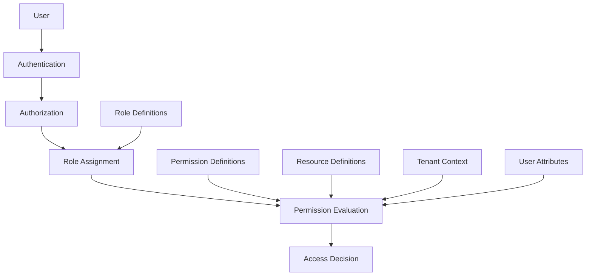
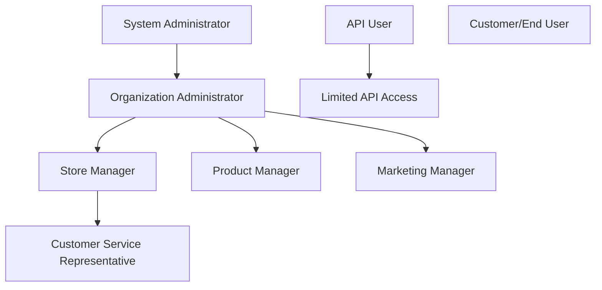

# VARAi Commerce Studio User Roles and RBAC System

## Overview

The VARAi Commerce Studio platform implements a comprehensive Role-Based Access Control (RBAC) system that provides granular control over user permissions. This document details the user roles, permission structure, and implementation guidelines for the RBAC system.

## RBAC Architecture

## Core Concepts

### 1. Users

Individual accounts that authenticate to the system. Each user has:
- Unique identifier
- Authentication credentials
- Profile information
- Role assignments
- Tenant associations

### 2. Roles

Named collections of permissions that can be assigned to users. Roles are hierarchical and can inherit permissions from parent roles.

### 3. Permissions

Specific actions that can be performed on resources. Permissions are defined as:
- Action (view, create, edit, delete, etc.)
- Resource type (product, user, report, etc.)
- Scope (all, owned, organization, etc.)

### 4. Resources

Objects or entities in the system that can be accessed or manipulated. Resources include:
- Data entities (products, customers, orders, etc.)
- System components (settings, integrations, etc.)
- Functional areas (reports, dashboards, etc.)

### 5. Tenants

Isolated instances within the multi-tenant architecture. Each tenant represents:
- An organization (brand, retailer, etc.)
- A separate data domain
- A distinct user base
- Custom configuration settings

## User Role Definitions

### 1. System Administrator

**Description**: Has complete access to all platform features and settings across all tenants.

**Responsibilities**:
- Platform configuration and maintenance
- Tenant provisioning and management
- System monitoring and troubleshooting
- Security administration
- User management across all tenants

**Permissions**:
- Full access to all system functions
- Manage tenants and organizations
- Configure system-wide settings
- Access all administrative functions
- View system health and performance metrics
- Manage user roles and permissions
- Access audit logs and security features

**Typical Users**:
- VARAi platform administrators
- Managed service providers
- IT operations staff

### 2. Organization Administrator

**Description**: Manages a specific organization (brand or retail chain) within the platform.

**Responsibilities**:
- Organization setup and configuration
- User management within the organization
- Integration management
- Reporting and analytics review
- Feature configuration

**Permissions**:
- Manage users within their organization
- Configure organization-specific settings
- Access all data related to their organization
- Manage integrations and connections
- View organization-level analytics and reports
- Configure AI settings for their organization

**Typical Users**:
- IT managers at customer organizations
- Operations directors
- Business owners

### 3. Store Manager

**Description**: Manages a specific retail location within an organization.

**Responsibilities**:
- Store-level product management
- Local inventory oversight
- Staff supervision
- Customer service management
- Store performance monitoring

**Permissions**:
- View and manage products for their store
- Access store-level analytics and reports
- Manage store-specific settings
- View customer data related to their store
- Process orders and manage inventory
- Limited access to AI configuration

**Typical Users**:
- Retail store managers
- Optical shop supervisors
- Location managers

### 4. Product Manager

**Description**: Focuses on product data management and quality.

**Responsibilities**:
- Product catalog management
- Data quality oversight
- Product categorization
- Attribute management
- Product import/export

**Permissions**:
- Full access to product data management
- Configure product import settings
- Manage product categories and attributes
- View product-related analytics
- Access quality reports and fix issues
- Configure product enhancement settings

**Typical Users**:
- Catalog managers
- Product data specialists
- Merchandising managers

### 5. Marketing Manager

**Description**: Focuses on customer-facing aspects and promotions.

**Responsibilities**:
- Marketing campaign management
- Customer segmentation
- Recommendation configuration
- Promotion setup
- Performance analysis

**Permissions**:
- Access recommendation engine settings
- View customer behavior analytics
- Manage promotional content
- Configure A/B testing
- Access marketing performance reports
- Limited access to product data management

**Typical Users**:
- Marketing directors
- Digital marketing specialists
- E-commerce managers

### 6. Customer Service Representative

**Description**: Handles customer inquiries and support.

**Responsibilities**:
- Customer inquiry handling
- Order status checking
- Issue resolution
- Customer profile management
- Support ticket management

**Permissions**:
- View customer profiles and history
- Access order information
- Limited access to product data
- Create support tickets
- View basic reports
- No access to system configuration

**Typical Users**:
- Customer service agents
- Help desk staff
- In-store assistants

### 7. API User

**Description**: Technical integration account for automated systems.

**Responsibilities**:
- System integration
- Automated data exchange
- Scheduled operations
- External service connectivity

**Permissions**:
- Programmatic access to specific API endpoints
- Limited to specific operations based on configuration
- No UI access
- Rate-limited based on tier
- Access restricted to specific IP ranges

**Typical Users**:
- Integration services
- External systems
- Automated processes

### 8. Customer/End User

**Description**: Consumers who interact with the platform through client-facing applications.

**Responsibilities**:
- Personal profile management
- Product browsing and selection
- Order placement and tracking
- Preference setting

**Permissions**:
- View product recommendations
- Access virtual try-on features
- Manage their own profile and preferences
- View order history (if applicable)
- No access to administrative functions

**Typical Users**:
- Retail customers
- Online shoppers
- Mobile app users

## Detailed Permission Matrix

| Feature/Function | System Admin | Org Admin | Store Manager | Product Manager | Marketing Manager | CSR | API User | Customer |
|------------------|--------------|-----------|---------------|-----------------|-------------------|-----|----------|----------|
| **User Management** |
| View Users       | All          | Org Only  | Store Only    | No              | No                | No  | No       | Self Only|
| Create Users     | All          | Org Only  | No            | No              | No                | No  | No       | No       |
| Edit Users       | All          | Org Only  | Store Only    | No              | No                | No  | No       | Self Only|
| Delete Users     | All          | Org Only  | No            | No              | No                | No  | No       | No       |
| Assign Roles     | All          | Org Only  | No            | No              | No                | No  | No       | No       |
| **Product Data** |
| View Products    | All          | All       | Store Only    | All             | All               | All | Limited  | Public   |
| Create Products  | All          | All       | No            | All             | No                | No  | Limited  | No       |
| Edit Products    | All          | All       | Store Only    | All             | No                | No  | Limited  | No       |
| Delete Products  | All          | All       | No            | All             | No                | No  | No       | No       |
| Import Products  | All          | All       | No            | All             | No                | No  | Limited  | No       |
| Export Products  | All          | All       | Store Only    | All             | Limited           | Limited| Limited| No       |
| **AI Configuration** |
| View AI Settings | All          | All       | Limited       | Product Only    | Recommendation    | No  | No       | No       |
| Edit AI Settings | All          | All       | No            | Product Only    | Recommendation    | No  | No       | No       |
| Run AI Processing| All          | All       | No            | Product Only    | No                | No  | Limited  | No       |
| View AI Results  | All          | All       | Limited       | Product Only    | Recommendation    | Limited| Limited| Limited  |
| **Analytics** |
| View Dashboards  | All          | Org Only  | Store Only    | Product Only    | Marketing Only    | Limited| No    | Personal |
| Create Reports   | All          | Org Only  | Store Only    | Product Only    | Marketing Only    | No  | No       | No       |
| Export Data      | All          | Org Only  | Store Only    | Product Only    | Marketing Only    | Limited| Limited| Personal |
| Configure Alerts | All          | Org Only  | Store Only    | Product Only    | Marketing Only    | No  | No       | Personal |
| **System Configuration** |
| General Settings | All          | Limited   | No            | No              | No                | No  | No       | No       |
| Security Settings| All          | No        | No            | No              | No                | No  | No       | No       |
| Backup/Restore   | All          | No        | No            | No              | No                | No  | No       | No       |
| Monitoring       | All          | Limited   | No            | No              | No                | No  | No       | No       |
| **Integrations** |
| View Integrations| All          | All       | Limited       | Limited         | Limited           | No  | Limited  | No       |
| Configure Integrations| All     | Limited   | No            | Limited         | No                | No  | No       | No       |
| Test Integrations| All          | All       | No            | Limited         | No                | No  | No       | No       |
| **Reports** |
| System Reports   | All          | No        | No            | No              | No                | No  | No       | No       |
| Organization Reports| All       | All       | No            | Limited         | Limited           | No  | Limited  | No       |
| Store Reports    | All          | All       | Store Only    | Limited         | Limited           | Limited| Limited| No       |
| Product Reports  | All          | All       | Store Only    | All             | Limited           | Limited| Limited| No       |
| Customer Reports | All          | All       | Store Only    | No              | All               | Limited| Limited| Personal |
| **Order Management** |
| View Orders      | All          | All       | Store Only    | No              | Limited           | All | Limited  | Own Only |
| Create Orders    | All          | All       | Store Only    | No              | No                | All | Limited  | Yes      |
| Edit Orders      | All          | All       | Store Only    | No              | No                | Limited| Limited| Limited  |
| Cancel Orders    | All          | All       | Store Only    | No              | No                | Limited| Limited| Limited  |
| Process Payments | All          | All       | Store Only    | No              | No                | Limited| Limited| Own Only |
| **Customer Data** |
| View Customers   | All          | All       | Store Only    | No              | All               | All | Limited  | Self Only|
| Create Customers | All          | All       | Store Only    | No              | No                | All | Limited  | Self Only|
| Edit Customers   | All          | All       | Store Only    | No              | Limited           | All | Limited  | Self Only|
| Delete Customers | All          | Limited   | No            | No              | No                | No  | No       | Self Only|

## Permission Inheritance

The RBAC system implements a hierarchical permission model where roles can inherit permissions from parent roles:

This inheritance structure means that:
- Organization Administrators inherit a subset of System Administrator permissions
- Store Managers, Product Managers, and Marketing Managers inherit a subset of Organization Administrator permissions
- Customer Service Representatives inherit a subset of Store Manager permissions
- API Users and Customers have separate permission trees

## Contextual Permissions

The RBAC system supports contextual permissions based on:

### 1. Tenant Context

Permissions are evaluated within the context of the current tenant:
- System Administrators have cross-tenant access
- All other roles are restricted to their assigned tenant
- Resources are isolated between tenants

### 2. Organizational Hierarchy

Permissions respect the organizational hierarchy:
- Organization-level roles can access all stores within the organization
- Store-level roles are restricted to their assigned store
- Resource visibility follows the organizational structure

### 3. Data Ownership

Certain permissions are based on data ownership:
- Users can always access their own data
- Managers can access data created by their subordinates
- Ownership can be transferred with appropriate permissions

### 4. Time-based Restrictions

Some permissions can be time-limited:
- Temporary access grants
- Scheduled permission changes
- Time-of-day restrictions for sensitive operations

## Implementation Guidelines

### 1. User Onboarding

When onboarding new users to the platform:

1. **Determine Role**: Identify the appropriate role based on job responsibilities
2. **Assign Tenant**: Associate the user with the correct tenant
3. **Set Context**: Configure organizational context (stores, departments, etc.)
4. **Additional Permissions**: Add any specific permissions beyond the standard role
5. **Review Access**: Verify the resulting permission set is appropriate

### 2. Role Customization

For organizations requiring customized roles:

1. **Clone Base Role**: Start with the closest standard role
2. **Modify Permissions**: Add or remove specific permissions
3. **Document Changes**: Record the customizations for future reference
4. **Test Access**: Verify the custom role works as expected
5. **Periodic Review**: Regularly review custom roles for continued relevance

### 3. Permission Auditing

Regular auditing of permissions should include:

1. **User Access Reviews**: Periodic review of all user access rights
2. **Orphaned Accounts**: Identification of accounts without active users
3. **Excessive Permissions**: Detection of users with unnecessary permissions
4. **Usage Patterns**: Analysis of permission usage patterns
5. **Compliance Verification**: Ensuring permissions align with compliance requirements

## User Interface for RBAC Management

The Commerce Studio platform provides a comprehensive interface for managing the RBAC system:

### 1. User Management Console

- User listing with filtering and sorting
- Detailed user profile view
- Role assignment interface
- Permission override capabilities
- User activity history

### 2. Role Management Console

- Role definition and editing
- Permission assignment
- Role hierarchy visualization
- Role comparison tool
- Role usage statistics

### 3. Permission Analysis Tools

- Permission matrix visualization
- Access path analysis
- Permission impact assessment
- Conflict detection
- Compliance reporting

## Best Practices

### 1. Role Design

- **Principle of Least Privilege**: Assign the minimum permissions necessary
- **Role Consolidation**: Avoid role proliferation by consolidating similar roles
- **Functional Alignment**: Design roles around job functions, not individuals
- **Clear Naming**: Use descriptive, consistent role names
- **Documentation**: Maintain clear documentation of role purposes and permissions

### 2. Permission Management

- **Regular Reviews**: Conduct periodic permission reviews
- **Change Control**: Implement approval process for permission changes
- **Audit Logging**: Maintain comprehensive logs of permission changes
- **Temporary Access**: Use time-limited permissions for temporary needs
- **Emergency Access**: Define procedures for emergency access grants

### 3. User Management

- **Onboarding/Offboarding**: Define clear processes for user lifecycle
- **Access Certification**: Require periodic certification of user access
- **Self-Service**: Enable self-service for non-critical permission requests
- **Delegation**: Allow controlled delegation of administrative functions
- **Training**: Provide role-specific training for users

## Case Studies

### 1. Multi-brand Optical Retailer

A large optical retail group with multiple brands and 100+ locations implemented the RBAC system to manage access across their complex organization.

**Challenge**: Each brand had different processes and needed separate access controls while maintaining centralized management.

**Solution**:
- Created organization-level roles for each brand
- Implemented store-level roles with brand-specific permissions
- Configured cross-brand access for corporate functions
- Established automated provisioning based on HR system

**Results**:
- 60% reduction in access management overhead
- Improved security with proper access segregation
- Streamlined onboarding process for new locations

### 2. Independent Eyewear Manufacturer

An eyewear manufacturer with both wholesale and direct-to-consumer channels needed to manage access for various stakeholders.

**Challenge**: Different external partners needed limited access to specific parts of the system.

**Solution**:
- Created custom API User roles for each partner integration
- Implemented contextual permissions based on product lines
- Developed specialized roles for wholesale partners
- Established granular data access controls

**Results**:
- Secure partner integration without compromising data
- Simplified management of external access
- Improved partner satisfaction with self-service capabilities

## Future Enhancements

### 1. Advanced Access Controls

- **Attribute-Based Access Control (ABAC)**: More dynamic permission evaluation
- **Just-In-Time Access**: Temporary elevation of privileges with approval
- **Risk-Based Authentication**: Adaptive authentication based on risk factors
- **Delegated Administration**: More granular delegation of administrative functions

### 2. Integration Enhancements

- **Identity Provider Integration**: Deeper integration with external IdPs
- **HR System Synchronization**: Automated role assignment based on HR data
- **Certification Automation**: Streamlined access review processes
- **Cross-Platform Consistency**: Unified access control across all platforms

### 3. Compliance Features

- **Role Segregation Enforcement**: Prevention of toxic combinations
- **Compliance Reporting**: Enhanced reporting for regulatory requirements
- **Privacy Controls**: Granular data privacy management
- **Consent Management**: User consent tracking and enforcement