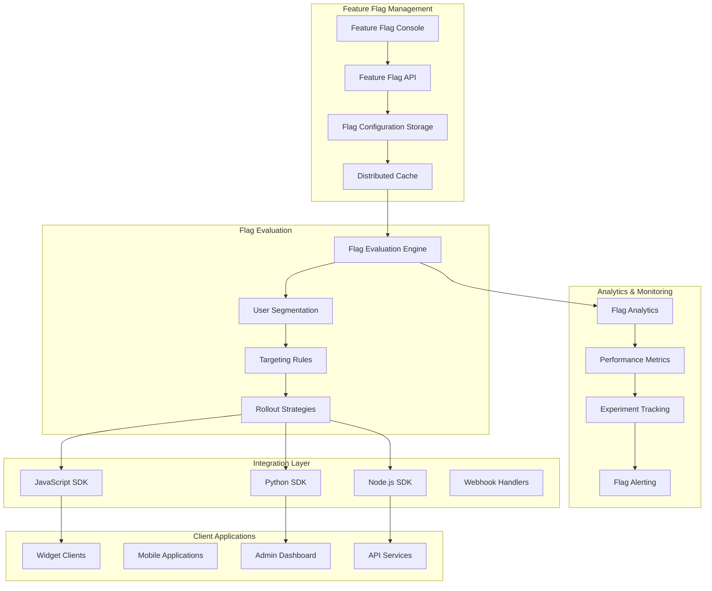
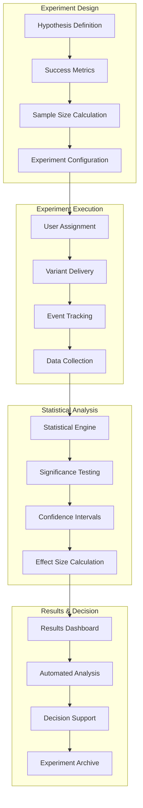

# A/B Testing and Feature Flags Architecture
## Agent 6: Deployment Architecture Agent - Part 4

## Document Information
- **Document Type**: A/B Testing and Feature Flags Architecture
- **System**: EyewearML Varai AI Discovery E-commerce Integration
- **Version**: 1.0
- **Date**: January 2025
- **Author**: Agent 6 - Deployment Architecture Agent
- **Parent Document**: [Deployment and DevOps Architecture](deployment-devops-architecture.md)

## Executive Summary

This document defines the comprehensive A/B testing and feature flags architecture for the AI discovery e-commerce integration. It covers experimentation frameworks, feature flag management, gradual rollouts, and data-driven decision making to support continuous improvement and risk mitigation.

## 1. Feature Flags Architecture

### 1.1 Feature Flag Management System



### 1.2 Feature Flag Configuration Schema

```typescript
interface FeatureFlagConfiguration {
  // Flag Definition
  flagDefinition: {
    key: string;
    name: string;
    description: string;
    type: 'boolean' | 'string' | 'number' | 'json';
    category: 'experiment' | 'operational' | 'permission' | 'configuration';
    
    environments: {
      development: FlagEnvironmentConfig;
      staging: FlagEnvironmentConfig;
      production: FlagEnvironmentConfig;
    };
    
    metadata: {
      owner: string;
      team: string;
      created_at: string;
      updated_at: string;
      tags: string[];
    };
  };
  
  // Environment-specific Configuration
  environmentConfig: {
    enabled: boolean;
    default_value: any;
    
    targeting: {
      rules: TargetingRule[];
      fallback_value: any;
    };
    
    rollout: {
      strategy: 'percentage' | 'user_list' | 'attribute_based' | 'gradual';
      percentage?: number;
      user_list?: string[];
      attributes?: AttributeFilter[];
      gradual_config?: GradualRolloutConfig;
    };
    
    variations: {
      [key: string]: {
        value: any;
        name: string;
        description: string;
        weight?: number;
      };
    };
  };
  
  // Targeting Rules
  targetingRules: {
    conditions: {
      attribute: string;
      operator: 'equals' | 'not_equals' | 'contains' | 'greater_than' | 'less_than' | 'in' | 'not_in';
      value: any;
    }[];
    
    logical_operator: 'and' | 'or';
    variation: string;
    percentage?: number;
  };
  
  // Gradual Rollout Configuration
  gradualRollout: {
    initial_percentage: number;
    increment_percentage: number;
    increment_interval: string; // e.g., "1h", "1d"
    max_percentage: number;
    
    success_criteria: {
      error_rate_threshold: number;
      performance_threshold: number;
      user_satisfaction_threshold: number;
    };
    
    rollback_triggers: {
      error_rate_spike: boolean;
      performance_degradation: boolean;
      negative_feedback_spike: boolean;
    };
  };
}

// Example Feature Flag Configurations
const featureFlags: FeatureFlagConfiguration[] = [
  {
    flagDefinition: {
      key: "ai_face_analysis_v2",
      name: "AI Face Analysis V2",
      description: "Enable new face analysis algorithm with improved accuracy",
      type: "boolean",
      category: "experiment",
      
      environments: {
        development: {
          enabled: true,
          default_value: true
        },
        staging: {
          enabled: true,
          default_value: false
        },
        production: {
          enabled: true,
          default_value: false
        }
      },
      
      metadata: {
        owner: "ai-team@varai.ai",
        team: "AI Engineering",
        created_at: "2025-01-01T00:00:00Z",
        updated_at: "2025-01-15T00:00:00Z",
        tags: ["ai", "face-analysis", "experiment"]
      }
    },
    
    environmentConfig: {
      enabled: true,
      default_value: false,
      
      targeting: {
        rules: [
          {
            conditions: [
              {
                attribute: "user_segment",
                operator: "equals",
                value: "beta_testers"
              }
            ],
            logical_operator: "and",
            variation: "enabled",
            percentage: 100
          },
          {
            conditions: [
              {
                attribute: "platform",
                operator: "in",
                value: ["shopify", "magento"]
              }
            ],
            logical_operator: "and",
            variation: "enabled",
            percentage: 10
          }
        ],
        fallback_value: false
      },
      
      rollout: {
        strategy: "gradual",
        gradual_config: {
          initial_percentage: 5,
          increment_percentage: 5,
          increment_interval: "1d",
          max_percentage: 100,
          
          success_criteria: {
            error_rate_threshold: 0.01,
            performance_threshold: 2000, // ms
            user_satisfaction_threshold: 0.95
          },
          
          rollback_triggers: {
            error_rate_spike: true,
            performance_degradation: true,
            negative_feedback_spike: true
          }
        }
      },
      
      variations: {
        enabled: {
          value: true,
          name: "V2 Algorithm Enabled",
          description: "Use the new face analysis algorithm"
        },
        disabled: {
          value: false,
          name: "V2 Algorithm Disabled",
          description: "Use the current face analysis algorithm"
        }
      }
    }
  },
  
  {
    flagDefinition: {
      key: "recommendation_engine_config",
      name: "Recommendation Engine Configuration",
      description: "Configuration parameters for the recommendation engine",
      type: "json",
      category: "configuration",
      
      environments: {
        production: {
          enabled: true,
          default_value: {
            algorithm: "collaborative_filtering",
            max_recommendations: 8,
            diversity_factor: 0.3,
            freshness_weight: 0.2
          }
        }
      }
    },
    
    environmentConfig: {
      enabled: true,
      default_value: {
        algorithm: "collaborative_filtering",
        max_recommendations: 8,
        diversity_factor: 0.3,
        freshness_weight: 0.2
      },
      
      targeting: {
        rules: [
          {
            conditions: [
              {
                attribute: "store_tier",
                operator: "equals",
                value: "enterprise"
              }
            ],
            logical_operator: "and",
            variation: "enterprise_config"
          }
        ],
        fallback_value: {
          algorithm: "collaborative_filtering",
          max_recommendations: 8,
          diversity_factor: 0.3,
          freshness_weight: 0.2
        }
      },
      
      variations: {
        enterprise_config: {
          value: {
            algorithm: "hybrid_deep_learning",
            max_recommendations: 12,
            diversity_factor: 0.4,
            freshness_weight: 0.3,
            personalization_strength: 0.8
          },
          name: "Enterprise Configuration",
          description: "Advanced configuration for enterprise customers"
        }
      }
    }
  }
];
```

### 1.3 Feature Flag SDK Implementation

```typescript
// Feature Flag SDK for JavaScript/TypeScript
class VaraiFeatureFlags {
  private apiKey: string;
  private environment: string;
  private userId?: string;
  private userAttributes: Record<string, any>;
  private cache: Map<string, any>;
  private cacheExpiry: Map<string, number>;
  private eventEmitter: EventEmitter;

  constructor(config: {
    apiKey: string;
    environment: string;
    userId?: string;
    userAttributes?: Record<string, any>;
    cacheTimeout?: number;
  }) {
    this.apiKey = config.apiKey;
    this.environment = config.environment;
    this.userId = config.userId;
    this.userAttributes = config.userAttributes || {};
    this.cache = new Map();
    this.cacheExpiry = new Map();
    this.eventEmitter = new EventEmitter();
    
    // Initialize with cached flags
    this.initializeFlags();
  }

  // Get flag value with fallback
  async getFlag<T>(
    flagKey: string, 
    defaultValue: T, 
    userContext?: Record<string, any>
  ): Promise<T> {
    try {
      // Check cache first
      const cachedValue = this.getCachedFlag(flagKey);
      if (cachedValue !== null) {
        this.trackFlagEvaluation(flagKey, cachedValue, 'cache');
        return cachedValue;
      }

      // Fetch from API
      const context = {
        user_id: this.userId,
        ...this.userAttributes,
        ...userContext
      };

      const response = await fetch(`/api/v1/flags/${flagKey}/evaluate`, {
        method: 'POST',
        headers: {
          'Authorization': `Bearer ${this.apiKey}`,
          'Content-Type': 'application/json'
        },
        body: JSON.stringify({
          environment: this.environment,
          context
        })
      });

      if (!response.ok) {
        throw new Error(`Flag evaluation failed: ${response.statusText}`);
      }

      const result = await response.json();
      const value = result.value ?? defaultValue;

      // Cache the result
      this.setCachedFlag(flagKey, value);
      this.trackFlagEvaluation(flagKey, value, 'api');

      return value;
    } catch (error) {
      console.warn(`Feature flag evaluation failed for ${flagKey}:`, error);
      this.trackFlagEvaluation(flagKey, defaultValue, 'fallback');
      return defaultValue;
    }
  }

  // Boolean flag helper
  async isEnabled(flagKey: string, userContext?: Record<string, any>): Promise<boolean> {
    return this.getFlag(flagKey, false, userContext);
  }

  // String flag helper
  async getString(flagKey: string, defaultValue: string, userContext?: Record<string, any>): Promise<string> {
    return this.getFlag(flagKey, defaultValue, userContext);
  }

  // Number flag helper
  async getNumber(flagKey: string, defaultValue: number, userContext?: Record<string, any>): Promise<number> {
    return this.getFlag(flagKey, defaultValue, userContext);
  }

  // JSON flag helper
  async getJSON<T>(flagKey: string, defaultValue: T, userContext?: Record<string, any>): Promise<T> {
    return this.getFlag(flagKey, defaultValue, userContext);
  }

  // Update user context
  updateUserContext(userId: string, attributes: Record<string, any>): void {
    this.userId = userId;
    this.userAttributes = { ...this.userAttributes, ...attributes };
    
    // Clear cache to force re-evaluation
    this.cache.clear();
    this.cacheExpiry.clear();
    
    this.eventEmitter.emit('userContextUpdated', { userId, attributes });
  }

  // Track flag evaluation for analytics
  private trackFlagEvaluation(flagKey: string, value: any, source: 'cache' | 'api' | 'fallback'): void {
    const event = {
      flag_key: flagKey,
      value,
      source,
      user_id: this.userId,
      timestamp: new Date().toISOString(),
      environment: this.environment
    };

    // Send to analytics (async, non-blocking)
    this.sendAnalyticsEvent('flag_evaluation', event).catch(error => {
      console.warn('Failed to send flag analytics:', error);
    });

    this.eventEmitter.emit('flagEvaluated', event);
  }

  // Cache management
  private getCachedFlag(flagKey: string): any {
    const expiry = this.cacheExpiry.get(flagKey);
    if (expiry && Date.now() > expiry) {
      this.cache.delete(flagKey);
      this.cacheExpiry.delete(flagKey);
      return null;
    }
    return this.cache.get(flagKey) ?? null;
  }

  private setCachedFlag(flagKey: string, value: any, ttl: number = 300000): void { // 5 minutes default
    this.cache.set(flagKey, value);
    this.cacheExpiry.set(flagKey, Date.now() + ttl);
  }

  // Initialize flags from server
  private async initializeFlags(): Promise<void> {
    try {
      const response = await fetch(`/api/v1/flags/bulk-evaluate`, {
        method: 'POST',
        headers: {
          'Authorization': `Bearer ${this.apiKey}`,
          'Content-Type': 'application/json'
        },
        body: JSON.stringify({
          environment: this.environment,
          context: {
            user_id: this.userId,
            ...this.userAttributes
          }
        })
      });

      if (response.ok) {
        const flags = await response.json();
        Object.entries(flags).forEach(([key, value]) => {
          this.setCachedFlag(key, value);
        });
      }
    } catch (error) {
      console.warn('Failed to initialize flags:', error);
    }
  }

  // Send analytics event
  private async sendAnalyticsEvent(eventType: string, data: any): Promise<void> {
    await fetch('/api/v1/analytics/events', {
      method: 'POST',
      headers: {
        'Authorization': `Bearer ${this.apiKey}`,
        'Content-Type': 'application/json'
      },
      body: JSON.stringify({
        event_type: eventType,
        data,
        timestamp: new Date().toISOString()
      })
    });
  }

  // Event listeners
  on(event: string, listener: Function): void {
    this.eventEmitter.on(event, listener);
  }

  off(event: string, listener: Function): void {
    this.eventEmitter.off(event, listener);
  }
}

// Usage Examples
const featureFlags = new VaraiFeatureFlags({
  apiKey: 'your-api-key',
  environment: 'production',
  userId: 'user-123',
  userAttributes: {
    platform: 'shopify',
    store_tier: 'enterprise',
    user_segment: 'beta_testers'
  }
});

// Boolean flag
const useNewFaceAnalysis = await featureFlags.isEnabled('ai_face_analysis_v2');

// Configuration flag
const recommendationConfig = await featureFlags.getJSON('recommendation_engine_config', {
  algorithm: 'collaborative_filtering',
  max_recommendations: 8
});

// String flag with user context
const chatbotPersonality = await featureFlags.getString('chatbot_personality', 'friendly', {
  user_preference: 'professional'
});
```

## 2. A/B Testing Framework

### 2.1 Experiment Management Architecture



### 2.2 Experiment Configuration Schema

```typescript
interface ExperimentConfiguration {
  // Experiment Metadata
  experiment: {
    id: string;
    name: string;
    description: string;
    hypothesis: string;
    owner: string;
    team: string;
    
    status: 'draft' | 'running' | 'paused' | 'completed' | 'archived';
    
    timeline: {
      created_at: string;
      start_date: string;
      end_date: string;
      duration_days: number;
    };
    
    tags: string[];
    priority: 'low' | 'medium' | 'high' | 'critical';
  };
  
  // Target Audience
  targeting: {
    inclusion_criteria: {
      platform?: string[];
      user_segment?: string[];
      geographic_region?: string[];
      device_type?: string[];
      custom_attributes?: Record<string, any>;
    };
    
    exclusion_criteria: {
      existing_experiments?: string[];
      user_blacklist?: string[];
      bot_traffic?: boolean;
    };
    
    traffic_allocation: {
      percentage: number; // Percentage of eligible users
      assignment_method: 'random' | 'deterministic' | 'stratified';
    };
  };
  
  // Experiment Variants
  variants: {
    [variantId: string]: {
      name: string;
      description: string;
      traffic_weight: number; // Percentage within experiment
      
      feature_flags: {
        [flagKey: string]: any;
      };
      
      configuration_overrides: {
        [configKey: string]: any;
      };
    };
  };
  
  // Success Metrics
  metrics: {
    primary_metric: {
      name: string;
      type: 'conversion_rate' | 'average_value' | 'count' | 'duration';
      event_name: string;
      aggregation: 'sum' | 'average' | 'count' | 'unique_count';
      
      statistical_config: {
        minimum_detectable_effect: number;
        statistical_power: number;
        significance_level: number;
        expected_baseline: number;
      };
    };
    
    secondary_metrics: {
      name: string;
      type: string;
      event_name: string;
      aggregation: string;
    }[];
    
    guardrail_metrics: {
      name: string;
      type: string;
      event_name: string;
      threshold: number;
      direction: 'increase' | 'decrease';
    }[];
  };
  
  // Sample Size and Duration
  sample_size: {
    required_sample_size: number;
    current_sample_size: number;
    daily_traffic_estimate: number;
    estimated_duration_days: number;
  };
  
  // Analysis Configuration
  analysis: {
    analysis_method: 'frequentist' | 'bayesian';
    multiple_testing_correction: 'bonferroni' | 'benjamini_hochberg' | 'none';
    
    sequential_testing: {
      enabled: boolean;
      look_frequency: 'daily' | 'weekly';
      alpha_spending_function: 'obrien_fleming' | 'pocock';
    };
    
    segmentation: {
      enabled: boolean;
      segments: string[];
    };
  };
}

// Example A/B Test Configuration
const faceAnalysisExperiment: ExperimentConfiguration = {
  experiment: {
    id: "face_analysis_v2_test",
    name: "Face Analysis Algorithm V2 Test",
    description: "Test the impact of the new face analysis algorithm on user engagement and conversion",
    hypothesis: "The new face analysis algorithm will improve recommendation accuracy, leading to higher user engagement and conversion rates",
    owner: "ai-team@varai.ai",
    team: "AI Engineering",
    
    status: "running",
    
    timeline: {
      created_at: "2025-01-01T00:00:00Z",
      start_date: "2025-01-15T00:00:00Z",
      end_date: "2025-02-15T00:00:00Z",
      duration_days: 31
    },
    
    tags: ["ai", "face-analysis", "conversion", "engagement"],
    priority: "high"
  },
  
  targeting: {
    inclusion_criteria: {
      platform: ["shopify", "magento", "woocommerce"],
      user_segment: ["active_users"],
      device_type: ["desktop", "mobile"]
    },
    
    exclusion_criteria: {
      existing_experiments: ["recommendation_algorithm_test"],
      bot_traffic: true
    },
    
    traffic_allocation: {
      percentage: 20, // 20% of eligible users
      assignment_method: "deterministic"
    }
  },
  
  variants: {
    control: {
      name: "Current Algorithm",
      description: "Existing face analysis algorithm",
      traffic_weight: 50,
      
      feature_flags: {
        "ai_face_analysis_v2": false
      },
      
      configuration_overrides: {}
    },
    
    treatment: {
      name: "New Algorithm V2",
      description: "New face analysis algorithm with improved accuracy",
      traffic_weight: 50,
      
      feature_flags: {
        "ai_face_analysis_v2": true
      },
      
      configuration_overrides: {
        "face_analysis_confidence_threshold": 0.85,
        "face_analysis_timeout_ms": 5000
      }
    }
  },
  
  metrics: {
    primary_metric: {
      name: "Recommendation Click Rate",
      type: "conversion_rate",
      event_name: "recommendation_clicked",
      aggregation: "conversion_rate",
      
      statistical_config: {
        minimum_detectable_effect: 0.05, // 5% relative improvement
        statistical_power: 0.8,
        significance_level: 0.05,
        expected_baseline: 0.15 // 15% baseline click rate
      }
    },
    
    secondary_metrics: [
      {
        name: "Session Duration",
        type: "duration",
        event_name: "session_end",
        aggregation: "average"
      },
      {
        name: "Face Analysis Success Rate",
        type: "conversion_rate",
        event_name: "face_analysis_completed",
        aggregation: "conversion_rate"
      }
    ],
    
    guardrail_metrics: [
      {
        name: "Error Rate",
        type: "conversion_rate",
        event_name: "error_occurred",
        threshold: 0.02, // Don't exceed 2% error rate
        direction: "increase"
      },
      {
        name: "Page Load Time",
        type: "duration",
        event_name: "page_loaded",
        threshold: 3000, // Don't exceed 3 seconds
        direction: "increase"
      }
    ]
  },
  
  sample_size: {
    required_sample_size: 10000,
    current_sample_size: 0,
    daily_traffic_estimate: 500,
    estimated_duration_days: 20
  },
  
  analysis: {
    analysis_method: "frequentist",
    multiple_testing_correction: "benjamini_hochberg",
    
    sequential_testing: {
      enabled: true,
      look_frequency: "daily",
      alpha_spending_function: "obrien_fleming"
    },
    
    segmentation: {
      enabled: true,
      segments: ["platform", "user_segment", "device_type"]
    }
  }
};
```

### 2.3 Statistical Analysis Engine

```python
# Statistical Analysis Engine for A/B Testing
import numpy as np
import pandas as pd
from scipy import stats
from typing import Dict, List, Tuple, Optional
import json
from dataclasses import dataclass
from datetime import datetime, timedelta

@dataclass
class ExperimentResult:
    variant: str
    sample_size: int
    conversion_rate: float
    confidence_interval: Tuple[float, float]
    p_value: float
    effect_size: float
    statistical_significance: bool

class ABTestAnalyzer:
    def __init__(self, significance_level: float = 0.05):
        self.significance_level = significance_level
    
    def analyze_experiment(
        self, 
        experiment_data: Dict[str, Dict], 
        metric_config: Dict
    ) -> Dict[str, ExperimentResult]:
        """
        Analyze A/B test results for statistical significance
        """
        results = {}
        
        # Extract data for each variant
        variants = list(experiment_data.keys())
        
        if len(variants) != 2:
            raise ValueError("Currently supports only two-variant tests")
        
        control_data = experiment_data[variants[0]]
        treatment_data = experiment_data[variants[1]]
        
        # Perform statistical test based on metric type
        if metric_config['type'] == 'conversion_rate':
            results = self._analyze_conversion_rate(
                control_data, treatment_data, variants
            )
        elif metric_config['type'] == 'average_value':
            results = self._analyze_continuous_metric(
                control_data, treatment_data, variants
            )
        
        return results
    
    def _analyze_conversion_rate(
        self, 
        control_data: Dict, 
        treatment_data: Dict, 
        variants: List[str]
    ) -> Dict[str, ExperimentResult]:
        """
        Analyze conversion rate using two-proportion z-test
        """
        # Extract conversion data
        control_conversions = control_data['conversions']
        control_total = control_data['total_users']
        treatment_conversions = treatment_data['conversions']
        treatment_total = treatment_data['total_users']
        
        # Calculate conversion rates
        control_rate = control_conversions / control_total
        treatment_rate = treatment_conversions / treatment_total
        
        # Perform two-proportion z-test
        z_stat, p_value = self._two_proportion_z_test(
            control_conversions, control_total,
            treatment_conversions, treatment_total
        )
        
        # Calculate confidence intervals
        control_ci = self._proportion_confidence_interval(
            control_conversions, control_total
        )
        treatment_ci = self._proportion_confidence_interval(
            treatment_conversions, treatment_total
        )
        
        # Calculate effect size (relative improvement)
        effect_size = (treatment_rate - control_rate) / control_rate
        
        # Determine statistical significance
        is_significant = p_value < self.significance_level
        
        return {
            variants[0]: ExperimentResult(
                variant=variants[0],
                sample_size=control_total,
                conversion_rate=control_rate,
                confidence_interval=control_ci,
                p_value=p_value,
                effect_size=0.0,  # Control is baseline
                statistical_significance=is_significant
            ),
            variants[1]: ExperimentResult(
                variant=variants[1],
                sample_size=treatment_total,
                conversion_rate=treatment_rate,
                confidence_interval=treatment_ci,
                p_value=p_value,
                effect_size=effect_size,
                statistical_significance=is_significant
            )
        }
    
    def _two_proportion_z_test(
        self, 
        x1: int, n1: int, 
        x2: int, n2: int
    ) -> Tuple[float, float]:
        """
        Perform two-proportion z-test
        """
        p1 = x1 / n1
        p2 = x2 / n2
        
        # Pooled proportion
        p_pool = (x1 + x2) / (n1 + n2)
        
        # Standard error
        se = np.sqrt(p_pool * (1 - p_pool) * (1/n1 + 1/n2))
        
        # Z-statistic
        z = (p2 - p1) / se
        
        # Two-tailed p-value
        p_value = 2 * (1 - stats.norm.cdf(abs(z)))
        
        return z, p_value
    
    def _proportion_confidence_interval(
        self, 
        successes: int, 
        total: int, 
        confidence_level: float = 0.95
    ) -> Tuple[float, float]:
        """
        Calculate confidence interval for proportion using Wilson score interval
        """
        if total == 0:
            return (0.0, 0.0)
        
        p = successes / total
        z = stats.norm.ppf((1 + confidence_level) / 2)
        
        # Wilson score interval
        center = (p + z**2 / (2 * total)) / (1 + z**2 / total)
        margin = z * np.sqrt((p * (1 - p) + z**2 / (4 * total)) / total) / (1 + z**2 / total)
        
        return (max(0, center - margin), min(1, center + margin))
    
    def calculate_sample_size(
        self,
        baseline_rate: float,
        minimum_detectable_effect: float,
        power: float = 0.8,
        significance_level: float = 0.05
    ) -> int:
        """
        Calculate required sample size for A/B test
        """
        # Effect size
        treatment_rate = baseline_rate * (1 + minimum_detectable_effect)
        
        # Z-scores
        z_alpha = stats.norm.ppf(1 - significance_level / 2)
        z_beta = stats.norm.ppf(power)
        
        # Pooled variance
        p_avg = (baseline_rate + treatment_rate) / 2
        variance = 2 * p_avg * (1 - p_avg)
        
        # Sample size per group
        n = ((z_alpha + z_beta) ** 2 * variance) / ((treatment_rate - baseline_rate) ** 2)
        
        return int(np.ceil(n))
```

## Summary

This document provides comprehensive A/B testing and feature flags architecture for the AI discovery e-commerce integration. Key components include:

1. **Feature Flags Architecture** - Comprehensive flag management system with targeting, rollout strategies, and SDK integration
2. **A/B Testing Framework** - Statistical analysis engine with experiment management and automated decision support
3. **Integration with Deployment Pipeline** - Seamless integration with CI/CD workflows and widget deployment

### Related Documents

- **Parent Document**: [Deployment and DevOps Architecture](deployment-devops-architecture.md)
- **Previous Document**: [Disaster Recovery and Rollback Procedures](disaster-recovery-rollback-procedures.md)
- **Related**: [Environment Management Architecture](environment-management-architecture.md)

### Key Features

- **Dynamic Feature Control**: Real-time feature flag management with user targeting and segmentation
- **Statistical Rigor**: Proper A/B testing with statistical significance testing and confidence intervals
- **Risk Mitigation**: Gradual rollouts with automated rollback triggers and success criteria monitoring
- **Data-Driven Decisions**: Comprehensive analytics and experiment tracking for informed decision making

This architecture enables safe, data-driven feature releases while supporting continuous experimentation and optimization of the AI discovery system.