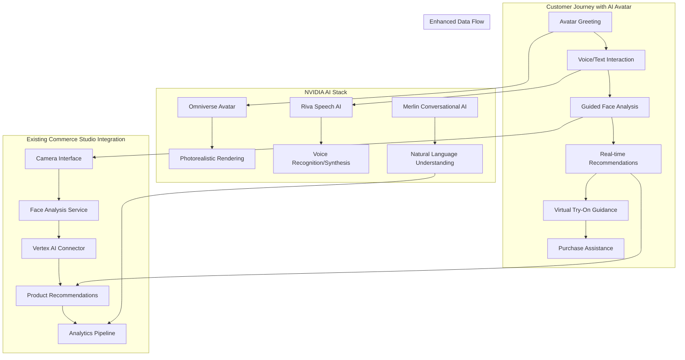
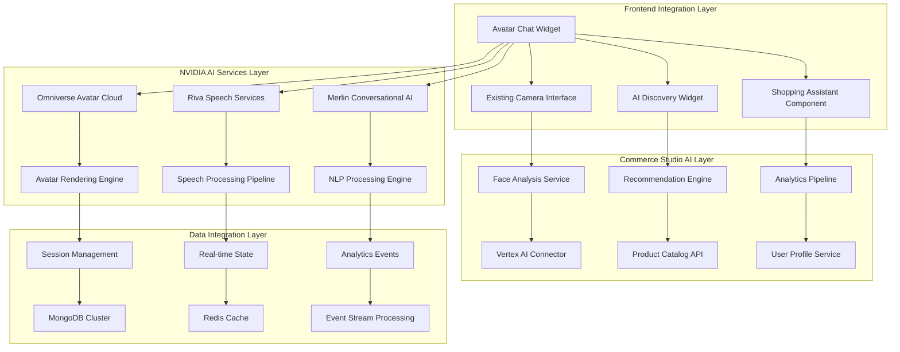

# AI Avatar Chat System Architecture
## NVIDIA-Powered Conversational Shopping Assistant

## Executive Summary

This document defines the comprehensive architecture for an AI Avatar Chat System that integrates NVIDIA's Omniverse Avatar, Riva speech AI, and Merlin conversational AI with Commerce Studio's existing camera-enabled AI search replacement system. The system creates an immersive in-store experience with a photorealistic conversational AI avatar that greets users, guides them through face analysis, and provides personalized eyewear recommendations.

## System Overview

The AI Avatar Chat System transforms the traditional e-commerce experience into an interactive, conversational journey powered by cutting-edge NVIDIA technologies, creating a virtual shopping assistant that rivals in-person customer service.



## Core Architecture Components

### 1. NVIDIA Omniverse Avatar Integration

**Purpose**: Photorealistic 3D avatar rendering with real-time animation and expression

```typescript
interface OmniverseAvatarConfig {
  // Avatar Appearance
  avatarModel: {
    gender: 'female' | 'male' | 'neutral';
    ethnicity: 'diverse' | 'caucasian' | 'asian' | 'african' | 'hispanic';
    age: 'young' | 'middle' | 'mature';
    style: 'professional' | 'casual' | 'trendy';
    clothing: 'business' | 'retail' | 'tech';
  };
  
  // Rendering Configuration
  rendering: {
    quality: 'ultra' | 'high' | 'medium' | 'low';
    frameRate: 30 | 60;
    resolution: '1920x1080' | '1280x720' | '854x480';
    enableRayTracing: boolean;
    enableDLSS: boolean;
  };
  
  // Animation Settings
  animation: {
    facialExpressions: boolean;
    lipSync: boolean;
    gestureRecognition: boolean;
    eyeTracking: boolean;
    emotionalResponses: boolean;
  };
  
  // Performance Optimization
  optimization: {
    levelOfDetail: 'adaptive' | 'high' | 'medium' | 'low';
    cullingDistance: number;
    batchRendering: boolean;
    memoryManagement: 'aggressive' | 'balanced' | 'conservative';
  };
}

interface AvatarController {
  // Core Avatar Management
  initializeAvatar(config: OmniverseAvatarConfig): Promise<Avatar>;
  updateAvatarExpression(emotion: EmotionType, intensity: number): Promise<void>;
  playAvatarAnimation(animation: AnimationType, duration: number): Promise<void>;
  
  // Speech Integration
  synchronizeLipSync(audioData: AudioBuffer): Promise<void>;
  updateFacialExpression(speechEmotions: EmotionAnalysis): Promise<void>;
  
  // Interaction Management
  handleUserGaze(gazeData: GazeTrackingData): Promise<void>;
  respondToUserAction(action: UserAction): Promise<AvatarResponse>;
  
  // Performance Management
  optimizeForDevice(deviceCapabilities: DeviceSpecs): Promise<void>;
  adjustQualitySettings(performanceMetrics: PerformanceData): Promise<void>;
}
```

### 2. NVIDIA Riva Speech AI Integration

**Purpose**: Advanced speech recognition, synthesis, and natural language processing

```typescript
interface RivaSpeechConfig {
  // Speech Recognition
  speechToText: {
    language: 'en-US' | 'en-GB' | 'es-ES' | 'fr-FR' | 'de-DE';
    model: 'conformer' | 'jasper' | 'quartznet';
    enablePunctuation: boolean;
    enableNumberFormatting: boolean;
    enableProfanityFilter: boolean;
    confidenceThreshold: number;
  };
  
  // Speech Synthesis
  textToSpeech: {
    voice: 'female_warm' | 'female_professional' | 'male_friendly' | 'male_authoritative';
    speed: number; // 0.5 to 2.0
    pitch: number; // -20 to 20
    volume: number; // 0 to 100
    enableSSML: boolean;
    emotionalTone: 'neutral' | 'happy' | 'excited' | 'calm' | 'professional';
  };
  
  // Audio Processing
  audioProcessing: {
    noiseReduction: boolean;
    echoCancellation: boolean;
    automaticGainControl: boolean;
    voiceActivityDetection: boolean;
    beamforming: boolean;
  };
  
  // Real-time Processing
  realTime: {
    streamingRecognition: boolean;
    lowLatencyMode: boolean;
    bufferSize: number;
    processingTimeout: number;
  };
}

interface RivaSpeechService {
  // Speech Recognition
  startSpeechRecognition(config: SpeechRecognitionConfig): Promise<SpeechStream>;
  processSpeechStream(audioStream: MediaStream): Promise<TranscriptionResult>;
  stopSpeechRecognition(): Promise<FinalTranscription>;
  
  // Speech Synthesis
  synthesizeSpeech(text: string, config: SpeechSynthesisConfig): Promise<AudioBuffer>;
  streamSpeechSynthesis(textStream: string[]): Promise<AudioStream>;
  
  // Natural Language Processing
  analyzeIntent(transcript: string): Promise<IntentAnalysis>;
  extractEntities(transcript: string): Promise<EntityExtraction>;
  analyzeSentiment(transcript: string): Promise<SentimentAnalysis>;
  
  // Voice Biometrics
  createVoiceProfile(audioSamples: AudioBuffer[]): Promise<VoiceProfile>;
  authenticateVoice(audioSample: AudioBuffer, profile: VoiceProfile): Promise<AuthResult>;
}
```

### 3. NVIDIA Merlin Conversational AI Integration

**Purpose**: Advanced conversational AI for personalized shopping assistance

```typescript
interface MerlinConversationalConfig {
  // Model Configuration
  model: {
    architecture: 'transformer' | 'gpt' | 'bert' | 'custom';
    size: 'small' | 'medium' | 'large' | 'xl';
    domain: 'eyewear' | 'fashion' | 'retail' | 'general';
    specialization: 'product_recommendation' | 'customer_service' | 'sales_assistant';
  };
  
  // Conversation Management
  conversation: {
    contextWindow: number; // Number of previous exchanges to remember
    personalityType: 'helpful' | 'enthusiastic' | 'professional' | 'friendly';
    responseStyle: 'concise' | 'detailed' | 'conversational' | 'technical';
    multiTurnCapability: boolean;
    contextPersistence: boolean;
  };
  
  // Knowledge Integration
  knowledge: {
    productCatalog: boolean;
    faceShapeExpertise: boolean;
    styleRecommendations: boolean;
    brandKnowledge: boolean;
    trendAwareness: boolean;
    technicalSpecs: boolean;
  };
  
  // Learning and Adaptation
  learning: {
    userPreferenceLearning: boolean;
    conversationImprovement: boolean;
    feedbackIntegration: boolean;
    performanceOptimization: boolean;
  };
}

interface MerlinConversationalService {
  // Conversation Management
  initializeConversation(userId: string, context: ConversationContext): Promise<ConversationSession>;
  processUserMessage(message: UserMessage, session: ConversationSession): Promise<AIResponse>;
  updateConversationContext(context: ContextUpdate, session: ConversationSession): Promise<void>;
  
  // Intent and Entity Processing
  classifyIntent(message: string): Promise<IntentClassification>;
  extractProductEntities(message: string): Promise<ProductEntity[]>;
  identifyUserPreferences(conversationHistory: Message[]): Promise<UserPreferences>;
  
  // Recommendation Generation
  generateProductRecommendations(
    userProfile: UserProfile,
    faceAnalysis: FaceAnalysisResult,
    conversationContext: ConversationContext
  ): Promise<PersonalizedRecommendations>;
  
  // Response Generation
  generateNaturalResponse(
    intent: IntentClassification,
    context: ConversationContext,
    recommendations?: PersonalizedRecommendations
  ): Promise<NaturalLanguageResponse>;
  
  // Learning and Optimization
  recordConversationOutcome(session: ConversationSession, outcome: ConversationOutcome): Promise<void>;
  updateUserModel(userId: string, interactions: UserInteraction[]): Promise<void>;
}
```

### 4. Integrated Avatar Chat Interface

**Purpose**: Unified interface combining all NVIDIA technologies with existing Commerce Studio features

```typescript
interface AvatarChatInterface {
  // Core Components
  avatar: OmniverseAvatarController;
  speech: RivaSpeechService;
  conversation: MerlinConversationalService;
  faceAnalysis: FaceAnalysisService; // Existing Commerce Studio service
  recommendations: RecommendationEngine; // Existing Commerce Studio service
  
  // Chat Session Management
  initializeChatSession(config: ChatSessionConfig): Promise<ChatSession>;
  handleUserInteraction(interaction: UserInteraction): Promise<AvatarResponse>;
  updateSessionContext(context: SessionContextUpdate): Promise<void>;
  endChatSession(sessionId: string): Promise<SessionSummary>;
  
  // Multi-modal Interaction
  processVoiceInput(audioStream: MediaStream): Promise<ProcessedInput>;
  processTextInput(text: string): Promise<ProcessedInput>;
  processCameraInput(videoStream: MediaStream): Promise<FaceAnalysisResult>;
  
  // Avatar Response Generation
  generateAvatarResponse(
    userInput: ProcessedInput,
    sessionContext: SessionContext
  ): Promise<AvatarResponse>;
  
  // Integration with Existing Systems
  triggerFaceAnalysis(): Promise<FaceAnalysisResult>;
  fetchPersonalizedRecommendations(criteria: RecommendationCriteria): Promise<ProductRecommendation[]>;
  initiateVirtualTryOn(productId: string): Promise<VTOSession>;
  
  // Analytics and Learning
  trackInteraction(interaction: InteractionEvent): Promise<void>;
  updateUserProfile(userId: string, sessionData: SessionData): Promise<void>;
  generateInsights(sessionId: string): Promise<SessionInsights>;
}

interface ChatSession {
  sessionId: string;
  userId: string;
  startTime: Date;
  currentContext: SessionContext;
  conversationHistory: ConversationMessage[];
  userProfile: UserProfile;
  faceAnalysisResults?: FaceAnalysisResult;
  recommendedProducts: ProductRecommendation[];
  sessionState: 'greeting' | 'face_analysis' | 'recommendations' | 'try_on' | 'purchase' | 'completed';
}

interface AvatarResponse {
  // Visual Response
  avatarAnimation: AnimationSequence;
  facialExpression: EmotionType;
  gestureSequence: GestureType[];
  
  // Audio Response
  speechAudio: AudioBuffer;
  speechText: string;
  speechEmotions: EmotionAnalysis;
  
  // Interactive Elements
  uiElements?: UIElement[];
  productDisplays?: ProductDisplay[];
  actionButtons?: ActionButton[];
  
  // System Actions
  systemActions: SystemAction[];
  nextExpectedInput: InputType[];
  contextUpdates: ContextUpdate[];
}
```

## System Integration Architecture

### 1. Enhanced Customer Journey Flow

```typescript
const avatarChatJourney = {
  // Phase 1: Avatar Introduction
  greeting: {
    step1: "Photorealistic avatar appears with welcoming animation",
    step2: "Voice greeting: 'Hi! I'm your personal eyewear consultant. I'm here to help you find the perfect frames!'",
    step3: "Avatar gestures toward camera interface",
    step4: "Natural conversation about user's needs and preferences"
  },
  
  // Phase 2: Guided Face Analysis
  faceAnalysis: {
    step1: "Avatar explains: 'Let me analyze your face shape to find frames that complement your features'",
    step2: "Animated guidance for optimal camera positioning",
    step3: "Real-time feedback during face capture",
    step4: "Avatar presents analysis results with visual explanations"
  },
  
  // Phase 3: Personalized Recommendations
  recommendations: {
    step1: "Avatar presents curated frame selection with reasoning",
    step2: "Interactive discussion about style preferences",
    step3: "Dynamic filtering based on conversation",
    step4: "Detailed explanations of why each frame suits the user"
  },
  
  // Phase 4: Virtual Try-On Assistance
  virtualTryOn: {
    step1: "Avatar guides user through virtual try-on process",
    step2: "Real-time commentary on how frames look",
    step3: "Comparison assistance between different frames",
    step4: "Style advice and fit recommendations"
  },
  
  // Phase 5: Purchase Guidance
  purchaseAssistance: {
    step1: "Avatar helps finalize frame selection",
    step2: "Assistance with prescription requirements",
    step3: "Guidance through checkout process",
    step4: "Follow-up care and styling tips"
  }
};
```

### 2. Technical Integration Points



### 3. API Gateway Enhancement for NVIDIA Services

```yaml
# Enhanced API Gateway Configuration for NVIDIA Integration
apiVersion: v1
kind: ConfigMap
metadata:
  name: nvidia-ai-gateway-config
data:
  endpoints.yaml: |
    paths:
      /v1/avatar/initialize:
        post:
          summary: "Initialize Omniverse Avatar session"
          security:
            - api_key: []
          parameters:
            - name: "avatar_config"
              in: "body"
              required: true
              schema:
                $ref: "#/definitions/AvatarConfig"
          x-google-backend:
            address: "https://omniverse-avatar-service.nvidia.com"
            
      /v1/speech/recognize:
        post:
          summary: "Riva speech recognition"
          security:
            - api_key: []
          parameters:
            - name: "audio_stream"
              in: "body"
              required: true
              schema:
                $ref: "#/definitions/AudioStream"
          x-google-backend:
            address: "https://riva-speech-service.nvidia.com"
            
      /v1/conversation/process:
        post:
          summary: "Merlin conversational AI processing"
          security:
            - api_key: []
          parameters:
            - name: "conversation_input"
              in: "body"
              required: true
              schema:
                $ref: "#/definitions/ConversationInput"
          x-google-backend:
            address: "https://merlin-conversation-service.nvidia.com"
            
      /v1/avatar-chat/session:
        post:
          summary: "Create integrated avatar chat session"
          security:
            - api_key: []
          parameters:
            - name: "session_config"
              in: "body"
              required: true
              schema:
                $ref: "#/definitions/ChatSessionConfig"
          x-google-backend:
            address: "https://avatar-chat-service-dot-commerce-studio.uc.r.appspot.com"
```

### 4. Enhanced Data Flow Architecture

```typescript
interface EnhancedDataFlow {
  // Real-time Avatar State Management
  avatarStateSync: {
    avatarPosition: Vector3D;
    currentAnimation: AnimationState;
    facialExpression: EmotionState;
    speechState: SpeechSynthesisState;
    interactionMode: 'listening' | 'speaking' | 'thinking' | 'demonstrating';
  };
  
  // Conversation Context Management
  conversationContext: {
    currentTopic: ConversationTopic;
    userIntent: IntentClassification;
    productFocus: ProductEntity[];
    sessionProgress: JourneyStage;
    userEmotionalState: EmotionAnalysis;
  };
  
  // Integrated Analytics Pipeline
  analyticsEvents: {
    avatarInteractions: AvatarInteractionEvent[];
    speechAnalytics: SpeechAnalyticsEvent[];
    conversationMetrics: ConversationMetricsEvent[];
    faceAnalysisEvents: FaceAnalysisEvent[];
    recommendationEvents: RecommendationEvent[];
    conversionEvents: ConversionEvent[];
  };
  
  // Performance Monitoring
  performanceMetrics: {
    avatarRenderingFPS: number;
    speechLatency: number;
    conversationResponseTime: number;
    systemResourceUsage: ResourceUsage;
    userExperienceScore: number;
  };
}
```

## Implementation Strategy

### Phase 1: Foundation Setup (Weeks 1-3)

#### Week 1: NVIDIA Services Integration
- Set up NVIDIA Omniverse Avatar Cloud account and API access
- Configure Riva Speech AI services and models
- Initialize Merlin Conversational AI with eyewear domain knowledge
- Create basic avatar rendering pipeline

#### Week 2: Core Avatar Chat Service
- Develop avatar chat session management service
- Implement speech-to-text and text-to-speech pipelines
- Create conversational AI integration layer
- Build avatar animation and expression control system

#### Week 3: Commerce Studio Integration
- Integrate with existing [`FaceAnalysisService.ts`](apps/shopify/frontend/services/FaceAnalysisService.ts:1)
- Connect to existing [`CameraInterface.js`](shared/components/CameraInterface.js:1)
- Enhance [`vertex-ai-connector.ts`](apps/shopify/connectors/vertex-ai-connector.ts:1) for avatar chat
- Update API gateway configuration

### Phase 2: Core Features Development (Weeks 4-6)

#### Week 4: Avatar Interaction System
- Implement multi-modal input processing (voice, text, camera)
- Develop avatar response generation system
- Create real-time lip sync and facial expression mapping
- Build gesture and animation sequencing

#### Week 5: Conversational Shopping Flow
- Develop guided face analysis conversation flow
- Implement personalized recommendation dialogue
- Create virtual try-on assistance conversations
- Build purchase guidance and support flows

#### Week 6: Enhanced User Experience
- Implement emotional intelligence and sentiment analysis
- Develop adaptive conversation styles
- Create personalized avatar appearance options
- Build advanced gesture and interaction recognition

### Phase 3: Advanced Features (Weeks 7-9)

#### Week 7: AI Learning and Optimization
- Implement conversation learning algorithms
- Develop user preference adaptation system
- Create performance optimization algorithms
- Build A/B testing framework for avatar interactions

#### Week 8: Multi-Platform Deployment
- Create Shopify app integration with avatar chat
- Develop WooCommerce plugin with avatar features
- Build Magento extension with conversational AI
- Create HTML widget with embedded avatar

#### Week 9: Analytics and Insights
- Implement comprehensive avatar interaction analytics
- Develop conversation quality metrics
- Create business intelligence dashboards
- Build ROI tracking and reporting

### Phase 4: Production Optimization (Weeks 10-12)

#### Week 10: Performance Optimization
- Optimize avatar rendering for various devices
- Implement adaptive quality settings
- Create efficient caching strategies
- Build load balancing for NVIDIA services

#### Week 11: Security and Compliance
- Implement voice biometrics and authentication
- Ensure GDPR compliance for conversation data
- Create secure avatar session management
- Build privacy-compliant data handling

#### Week 12: Launch Preparation
- Conduct comprehensive testing across platforms
- Implement monitoring and alerting systems
- Create user onboarding and training materials
- Prepare customer support documentation

## Technical Specifications

### 1. Hardware Requirements

```typescript
interface HardwareRequirements {
  // Client-Side Requirements
  clientDevice: {
    cpu: 'Intel i5 8th gen or AMD Ryzen 5 3600 minimum';
    gpu: 'NVIDIA GTX 1060 or AMD RX 580 minimum for avatar rendering';
    ram: '8GB minimum, 16GB recommended';
    storage: '2GB available space for avatar assets';
    network: '10 Mbps minimum for real-time avatar streaming';
  };
  
  // Server-Side Requirements
  serverInfrastructure: {
    avatarRendering: 'NVIDIA A100 or V100 GPUs for cloud avatar rendering';
    speechProcessing: 'NVIDIA T4 GPUs for Riva speech services';
    conversationalAI: 'NVIDIA A100 GPUs for Merlin model inference';
    storage: 'High-speed SSD storage for avatar assets and models';
    network: '100 Gbps network for real-time streaming';
  };
  
  // Scalability Requirements
  scalability: {
    concurrentUsers: '1000+ simultaneous avatar chat sessions';
    responseTime: '<200ms for avatar responses';
    availability: '99.9% uptime SLA';
    globalDistribution: 'Multi-region deployment for low latency';
  };
}
```

### 2. Security Architecture

```typescript
interface SecurityArchitecture {
  // Authentication and Authorization
  authentication: {
    userAuthentication: 'OAuth 2.0 with JWT tokens';
    serviceAuthentication: 'mTLS for service-to-service communication';
    apiKeyManagement: 'Rotating API keys for NVIDIA services';
    sessionSecurity: 'Encrypted session tokens with expiration';
  };
  
  // Data Protection
  dataProtection: {
    conversationEncryption: 'End-to-end encryption for voice and text';
    avatarDataSecurity: 'Encrypted avatar state and animation data';
    biometricProtection: 'Secure voice profile storage and processing';
    gdprCompliance: 'Right to deletion and data portability';
  };
  
  // Network Security
  networkSecurity: {
    apiGatewaySecurity: 'Rate limiting and DDoS protection';
    serviceIsolation: 'Network segmentation for NVIDIA services';
    certificateManagement: 'Automated SSL/TLS certificate rotation';
    firewallRules: 'Strict ingress and egress controls';
  };
  
  // Monitoring and Compliance
  monitoring: {
    securityAuditing: 'Comprehensive audit logs for all interactions';
    anomalyDetection: 'AI-powered security threat detection';
    complianceReporting: 'Automated compliance reporting and alerts';
    incidentResponse: 'Automated incident detection and response';
  };
}
```

### 3. Performance Optimization

```typescript
interface PerformanceOptimization {
  // Avatar Rendering Optimization
  avatarOptimization: {
    levelOfDetail: 'Adaptive LOD based on device capabilities';
    cullingStrategies: 'Frustum and occlusion culling for efficiency';
    batchRendering: 'Instanced rendering for multiple avatar elements';
    memoryManagement: 'Efficient texture and model streaming';
  };
  
  // Speech Processing Optimization
  speechOptimization: {
    streamingRecognition: 'Real-time speech processing with minimal latency';
    modelOptimization: 'Quantized models for faster inference';
    caching: 'Intelligent caching of common speech patterns';
    compression: 'Audio compression for efficient transmission';
  };
  
  // Conversation AI Optimization
  conversationOptimization: {
    modelCaching: 'Pre-loaded conversation models for instant responses';
    contextOptimization: 'Efficient context window management';
    responseGeneration: 'Parallel processing for faster response generation';
    knowledgeBase: 'Optimized knowledge retrieval and indexing';
  };
  
  // System-wide Optimization
  systemOptimization: {
    loadBalancing: 'Intelligent load distribution across services';
    caching: 'Multi-layer caching strategy for all components';
    cdnIntegration: 'Global CDN for avatar assets and static content';
    monitoring: 'Real-time performance monitoring and auto-scaling';
  };
}
```

## Success Metrics and KPIs

### 1. Customer Experience Metrics

```typescript
interface CustomerExperienceMetrics {
  // Engagement Metrics
  engagement: {
    sessionDuration: 'Average time spent with avatar (target: >5 minutes)';
    interactionRate: 'Messages per session (target: >15 interactions)';
    completionRate: 'Sessions completing full journey (target: >80%)';
    returnRate: 'Users returning for additional sessions (target: >40%)';
  };
  
  // Satisfaction Metrics
  satisfaction: {
    npsScore: 'Net Promoter Score for avatar experience (target: >70)';
    satisfactionRating: 'Average session rating (target: >4.5/5)';
    recommendationAccuracy: 'User rating of recommendations (target: >85%)';
    avatarLikeability: 'Avatar personality rating (target: >4.0/5)';
  };
  
  // Conversion Metrics
  conversion: {
    conversionRate: 'Purchase rate from avatar sessions (target: >25%)';
    averageOrderValue: 'AOV increase vs. traditional flow (target: +30%)';
    timeToDecision: 'Time from start to purchase (target: <15 minutes)';
    cartAbandonmentReduction: 'Reduction in cart abandonment (target: -40%)';
  };
}
```

### 2. Technical Performance Metrics

```typescript
interface TechnicalPerformanceMetrics {
  // Avatar Performance
  avatarPerformance: {
    renderingFPS: 'Avatar rendering frame rate (target: >30 FPS)';
    animationLatency: 'Time from trigger to animation (target: <100ms)';
    expressionAccuracy: 'Facial expression matching accuracy (target: >95%)';
    lipSyncQuality: 'Lip sync accuracy score (target: >90%)';
  };
  
  // Speech Performance
  speechPerformance: {
    recognitionAccuracy: 'Speech-to-text accuracy (target: >95%)';
    synthesisQuality: 'Text-to-speech naturalness score (target: >4.5/5)';
    speechLatency: 'End-to-end speech processing time (target: <200ms)';
    voiceClarity: 'Audio quality score (target: >4.0/5)';
  };
  
  // Conversation Performance
  conversationPerformance: {
    intentAccuracy: 'Intent classification accuracy (target: >90%)';
    responseRelevance: 'Response relevance score (target: >85%)';
    contextRetention: 'Context understanding across turns (target: >90%)';
    responseTime: 'Conversation response generation time (target: <500ms)';
  };
  
  // System Performance
  systemPerformance: {
    availability: 'System uptime (target: >99.9%)';
    scalability: 'Concurrent user capacity (target: >1000 users)';
    errorRate: 'System error rate (target: <0.1%)';
    resourceUtilization: 'Efficient resource usage (target: <80% peak)';
  };
}
```

### 3. Business Impact Metrics

```typescript
interface BusinessImpactMetrics {
  // Revenue Metrics
  revenue: {
    revenueIncrease: 'Revenue increase from avatar chat (target: +40%)';
    customerLifetimeValue: 'CLV increase (target: +25%)';
    repeatPurchaseRate: 'Repeat purchase rate (target: +35%)';
    premiumProductSales: 'Higher-value product sales (target: +20%)';
  };
  
  // Operational Metrics
  operational: {
    customerServiceReduction: 'Reduction in support tickets (target: -50%)';
    salesEfficiency: 'Sales process efficiency improvement (target: +60%)';
    inventoryTurnover: 'Improved inventory turnover (target: +15%)';
    marketingROI: 'Marketing campaign effectiveness (target: +30%)';
  };
  
  // Competitive Metrics
  competitive: {
    marketDifferentiation: 'Unique value proposition strength';
    customerAcquisition: 'New customer acquisition rate (target: +25%)';
    brandPerception: 'Brand innovation perception score (target: >4.5/5)';
    competitiveAdvantage: 'Technology leadership position';
  };
}
```

## Risk Assessment and Mitigation

### 1. Technical Risks

```typescript
interface TechnicalRisks {
  // NVIDIA Service Dependencies
  nvidiaServiceRisks: {
    risk: 'NVIDIA service availability and performance';
    impact: 'High - Core functionality dependent on NVIDIA services';
    mitigation: [
      'Implement fallback avatar rendering using local resources',
      'Create offline speech processing capabilities',
      'Develop backup conversation AI using existing Vertex AI',
      'Implement graceful degradation for service outages'
    ];
  };
  
  // Performance and Scalability
  performanceRisks: {
    risk: 'Avatar rendering performance on diverse devices';
    impact: 'Medium - User experience degradation on lower-end devices';
    mitigation: [
      'Implement adaptive quality settings based on device capabilities',
      'Create lightweight avatar alternatives for mobile devices',
      'Develop progressive enhancement approach',
      'Implement comprehensive device testing program'
    ];
  };
  
  // Integration Complexity
  integrationRisks: {
    risk: 'Complex integration with existing Commerce Studio systems';
    impact: 'High - Potential disruption to existing functionality';
    mitigation: [
      'Implement feature flags for gradual rollout',
      'Create comprehensive testing suite for all integrations',
      'Develop rollback procedures for each integration point',
      'Maintain backward compatibility with existing systems'
    ];
  };
}
```

### 2. Business Risks

```typescript
interface BusinessRisks {
  // User Adoption
  adoptionRisks: {
    risk: 'User resistance to AI