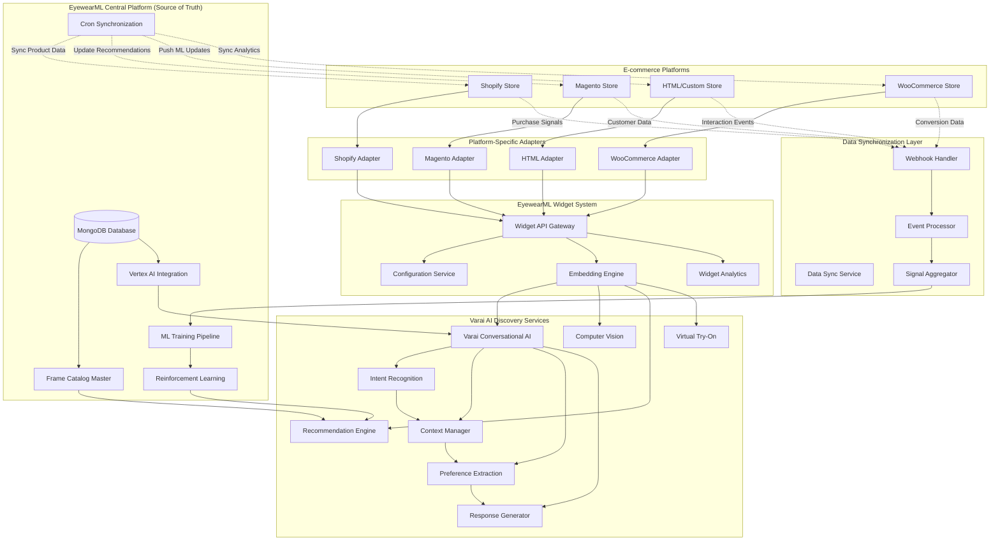
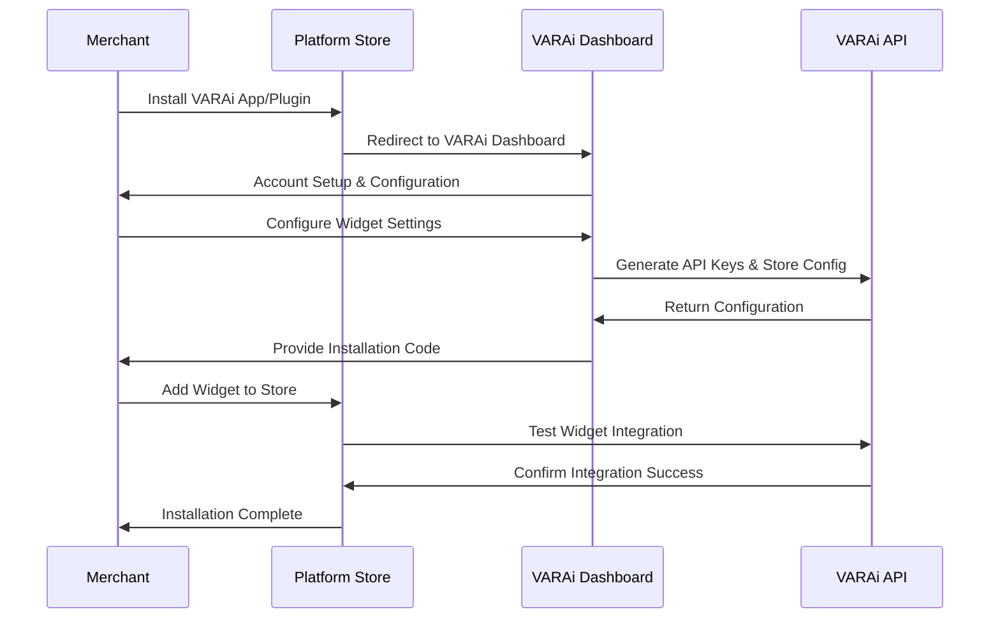
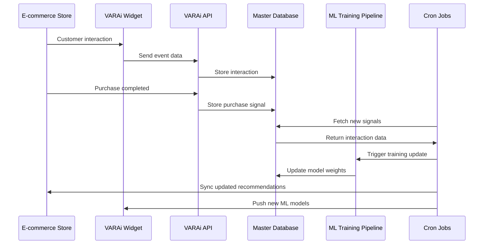

# AI Eyewear Discovery - E-commerce Platform Integration

## Executive Summary

This document outlines the integration architecture for deploying EyewearML's Varai AI-powered eyewear discovery system across Shopify, Magento, WooCommerce, and HTML stores as embeddable widgets. Building on the established EyewearML platform architecture and Varai conversational AI engine, this integration enables the "end of traditional search" philosophy by replacing keyword-based product discovery with AI-driven curated shopping experiences.

The system leverages the existing MongoDB-based product catalog, Vertex AI integration, and conversational AI infrastructure to provide seamless installation and configuration while maintaining privacy compliance and performance optimization across all major e-commerce platforms.

## Integration Architecture Overview



## Platform-Specific Integration

### 1. Shopify App Integration

**Installation Method**: Shopify App Store + Theme Integration

```typescript
// Shopify App Configuration
interface ShopifyAIDiscoveryApp {
  // App installation
  installation: {
    appStoreUrl: "https://apps.shopify.com/varai-ai-discovery";
    permissions: [
      "read_products",
      "read_customers", 
      "read_orders",
      "write_script_tags"
    ];
    webhooks: [
      "orders/create",
      "customers/create",
      "products/update"
    ];
  };
  
  // Theme integration
  themeIntegration: {
    liquidTemplates: {
      productPage: "sections/varai-ai-discovery.liquid";
      collectionPage: "sections/varai-frame-finder.liquid";
      cartPage: "sections/varai-recommendations.liquid";
    };
    
    scriptTags: [
      "https://cdn.varai.ai/shopify/ai-discovery-widget.js",
      "https://cdn.varai.ai/shopify/mediapipe-integration.js"
    ];
    
    stylesheets: [
      "https://cdn.varai.ai/shopify/ai-discovery-styles.css"
    ];
  };
  
  // Configuration options
  configuration: {
    widgetPlacement: "product_page" | "collection_page" | "custom";
    aiFeatures: {
      faceAnalysis: boolean;
      virtualTryOn: boolean;
      personalizedRecommendations: boolean;
      conversationalAI: boolean;
    };
    
    branding: {
      primaryColor: string;
      logoUrl: string;
      customCSS: string;
    };
    
    privacy: {
      gdprCompliant: boolean;
      consentRequired: boolean;
      dataRetentionDays: number;
    };
  };
}

// Shopify Liquid Template Integration
const shopifyLiquidTemplate = `
<!-- VARAi AI Discovery Widget -->
<div id="varai-ai-discovery" 
     data-shop="{{ shop.permanent_domain }}"
     data-product-id="{{ product.id }}"
     data-customer-id="{{ customer.id }}"
     data-currency="{{ shop.currency }}"
     data-locale="{{ request.locale.iso_code }}">
  
  <!-- Widget will be injected here -->
  <div class="varai-loading">
    <p>Loading AI-powered frame finder...</p>
  </div>
</div>

<script>
  window.varaiConfig = {
    shopDomain: "{{ shop.permanent_domain }}",
    productId: {{ product.id | json }},
    customerId: {{ customer.id | json }},
    currency: "{{ shop.currency }}",
    locale: "{{ request.locale.iso_code }}",
    
    // Privacy settings
    gdprRequired: {{ shop.customer_privacy.analytics_tracking_consent_required | json }},
    
    // Product data
    product: {
      id: {{ product.id | json }},
      title: {{ product.title | json }},
      vendor: {{ product.vendor | json }},
      type: {{ product.type | json }},
      tags: {{ product.tags | json }},
      variants: {{ product.variants | json }}
    }
  };
</script>

<script src="https://cdn.varai.ai/shopify/ai-discovery-widget.js" defer></script>
`;
```

### 2. Magento Extension Integration

**Installation Method**: Magento Marketplace Extension

```php
<?php
// Magento Module Configuration
namespace VARAi\AIDiscovery\Model;

class ConfigProvider implements \Magento\Checkout\Model\ConfigProviderInterface
{
    public function getConfig()
    {
        return [
            'varai_ai_discovery' => [
                'enabled' => $this->scopeConfig->getValue('varai/general/enabled'),
                'widget_placement' => $this->scopeConfig->getValue('varai/widget/placement'),
                'api_endpoint' => 'https://api.varai.ai/v1/discovery',
                'cdn_url' => 'https://cdn.varai.ai/magento',
                
                // Privacy configuration
                'gdpr_enabled' => $this->scopeConfig->getValue('varai/privacy/gdpr_enabled'),
                'consent_required' => $this->scopeConfig->getValue('varai/privacy/consent_required'),
                
                // Feature configuration
                'features' => [
                    'face_analysis' => $this->scopeConfig->getValue('varai/features/face_analysis'),
                    'virtual_try_on' => $this->scopeConfig->getValue('varai/features/virtual_try_on'),
                    'ai_recommendations' => $this->scopeConfig->getValue('varai/features/ai_recommendations'),
                    'conversational_ai' => $this->scopeConfig->getValue('varai/features/conversational_ai')
                ],
                
                // Styling configuration
                'theme' => [
                    'primary_color' => $this->scopeConfig->getValue('varai/theme/primary_color'),
                    'widget_position' => $this->scopeConfig->getValue('varai/theme/widget_position'),
                    'custom_css' => $this->scopeConfig->getValue('varai/theme/custom_css')
                ]
            ]
        ];
    }
}

// Block for rendering widget
class AIDiscoveryWidget extends \Magento\Framework\View\Element\Template
{
    public function getWidgetConfig()
    {
        $product = $this->registry->registry('current_product');
        $customer = $this->customerSession->getCustomer();
        
        return [
            'store_id' => $this->storeManager->getStore()->getId(),
            'product_id' => $product ? $product->getId() : null,
            'customer_id' => $customer->getId(),
            'currency' => $this->storeManager->getStore()->getCurrentCurrency()->getCode(),
            'locale' => $this->resolver->getLocale(),
            
            // Product data for AI analysis
            'product_data' => $product ? [
                'id' => $product->getId(),
                'name' => $product->getName(),
                'sku' => $product->getSku(),
                'category_ids' => $product->getCategoryIds(),
                'attributes' => $this->getProductAttributes($product)
            ] : null
        ];
    }
}
?>

<!-- Magento Template (varai_ai_discovery.phtml) -->
<div id="varai-ai-discovery-magento" 
     data-config='<?= $this->escapeHtml(json_encode($block->getWidgetConfig())) ?>'>
    
    <div class="varai-loading">
        <div class="varai-spinner"></div>
        <p><?= __('Loading AI-powered frame finder...') ?></p>
    </div>
</div>

<script>
require(['jquery', 'varai/ai-discovery'], function($, varaiAI) {
    $(document).ready(function() {
        const config = $('#varai-ai-discovery-magento').data('config');
        varaiAI.initialize(config);
    });
});
</script>
```

### 3. HTML/Custom Store Integration

**Installation Method**: JavaScript Widget Embed

```html
<!-- Simple HTML Integration -->
<!DOCTYPE html>
<html>
<head>
    <title>Eyewear Store</title>
    <!-- VARAi AI Discovery Styles -->
    <link rel="stylesheet" href="https://cdn.varai.ai/html/ai-discovery-widget.css">
</head>
<body>
    <!-- Product page content -->
    <div class="product-details">
        <h1>Ray-Ban Aviator Classic</h1>
        <div class="product-images">
            <!-- Product images -->
        </div>
        
        <!-- VARAi AI Discovery Widget -->
        <div id="varai-ai-discovery" 
             data-store-id="your-store-id"
             data-product-id="rayban-aviator-classic"
             data-api-key="your-api-key">
            
            <!-- Fallback content -->
            <div class="varai-fallback">
                <h3>Find Your Perfect Fit</h3>
                <p>Use our AI-powered tool to find frames that suit your face shape.</p>
                <button onclick="varaiAI.start()">Start AI Discovery</button>
            </div>
        </div>
    </div>
    
    <!-- VARAi AI Discovery Script -->
    <script src="https://cdn.varai.ai/html/ai-discovery-widget.js"></script>
    <script>
        // Initialize VARAi AI Discovery
        window.varaiAI.init({
            storeId: 'your-store-id',
            apiKey: 'your-api-key',
            
            // Product configuration
            product: {
                id: 'rayban-aviator-classic',
                name: 'Ray-Ban Aviator Classic',
                category: 'sunglasses',
                brand: 'Ray-Ban',
                price: 150.00,
                currency: 'USD',
                images: [
                    'https://example.com/rayban-aviator-1.jpg',
                    'https://example.com/rayban-aviator-2.jpg'
                ]
            },
            
            // Widget configuration
            widget: {
                placement: 'product-page',
                theme: 'light',
                primaryColor: '#007bff',
                position: 'right-sidebar'
            },
            
            // Privacy configuration
            privacy: {
                gdprCompliant: true,
                consentRequired: true,
                dataRetentionDays: 30
            },
            
            // Feature configuration
            features: {
                faceAnalysis: true,
                virtualTryOn: true,
                aiRecommendations: true,
                conversationalAI: true
            },
            
            // Callbacks
            onRecommendation: function(recommendations) {
                console.log('AI Recommendations:', recommendations);
                // Handle recommendations display
            },
            
            onPurchaseIntent: function(product) {
                console.log('Purchase Intent:', product);
                // Handle add to cart or purchase flow
            },
            
            onAnalyticsEvent: function(event) {
                console.log('Analytics Event:', event);
                // Send to your analytics platform
            }
        });
    </script>
</body>
</html>
```

### 4. WooCommerce Plugin Integration (Enhanced)

**Installation Method**: WordPress Plugin (Building on existing VARAi WooCommerce plugin)

Based on the existing [`apps/woocommerce/varai.php`](apps/woocommerce/varai.php:1) implementation, we enhance it with AI Discovery features:

```php
<?php
/**
 * Enhanced VARAi AI Discovery Integration
 * Building on existing VARAi WooCommerce Plugin
 */

class VARAi_AI_Discovery_Enhancement {
    
    private $api;
    private $analytics;
    
    public function __construct() {
        // Initialize existing components
        $this->api = new VARAi_API();
        $this->analytics = new VARAi_Analytics();
        
        // Add AI Discovery enhancements
        add_action('wp_enqueue_scripts', array($this, 'enqueue_ai_discovery_scripts'));
        add_action('woocommerce_single_product_summary', array($this, 'add_ai_chatbot_widget'), 15);
        add_action('woocommerce_after_single_product', array($this, 'add_face_analysis_widget'), 5);
        
        // Enhanced AJAX handlers for AI features
        add_action('wp_ajax_varai_ai_chat', array($this, 'ajax_ai_chat'));
        add_action('wp_ajax_nopriv_varai_ai_chat', array($this, 'ajax_ai_chat'));
        add_action('wp_ajax_varai_face_analysis', array($this, 'ajax_face_analysis'));
        add_action('wp_ajax_nopriv_varai_face_analysis', array($this, 'ajax_face_analysis'));
        
        // Data synchronization hooks
        add_action('woocommerce_order_status_completed', array($this, 'sync_purchase_signal'));
        add_action('woocommerce_add_to_cart', array($this, 'sync_cart_event'));
        add_action('wp_head', array($this, 'track_product_view'));
    }
    
    public function enqueue_ai_discovery_scripts() {
        if (is_product()) {
            // Enhanced AI Discovery scripts
            wp_enqueue_script(
                'varai-ai-discovery',
                VARAI_PLUGIN_URL . 'assets/js/ai-discovery.js',
                array('jquery', 'varai-frontend'),
                VARAI_VERSION,
                true
            );
            
            wp_enqueue_script(
                'varai-mediapipe',
                'https://cdn.varai.ai/mediapipe/face-landmarker.js',
                array(),
                VARAI_VERSION,
                true
            );
            
            wp_enqueue_style(
                'varai-ai-discovery',
                VARAI_PLUGIN_URL . 'assets/css/ai-discovery.css',
                array('varai-frontend'),
                VARAI_VERSION
            );
            
            // Enhanced configuration
            wp_localize_script('varai-ai-discovery', 'varaiAI', array(
                'ajax_url' => admin_url('admin-ajax.php'),
                'nonce' => wp_create_nonce('varai-ai-discovery'),
                'product_id' => get_the_ID(),
                'api_endpoint' => 'https://api.varai.ai/v1',
                'features' => array(
                    'aiChatbot' => true,
                    'faceAnalysis' => true,
                    'virtualTryOn' => true,
                    'personalizedRecommendations' => true,
                    'noSearchDiscovery' => true
                ),
                'privacy' => array(
                    'gdprCompliant' => true,
                    'consentRequired' => true,
                    'dataRetentionDays' => 30
                )
            ));
        }
    }
    
    public function add_ai_chatbot_widget() {
        $settings = get_option('varai_settings');
        if (empty($settings['enable_ai_chatbot'])) {
            return;
        }
        
        echo '<div id="varai-ai-chatbot" class="varai-ai-widget">';
        echo '<button class="varai-chat-trigger" data-product-id="' . get_the_ID() . '">';
        echo '<span class="varai-chat-icon">💬</span>';
        echo '<span class="varai-chat-text">' . __('Find Your Perfect Frames', 'varai') . '</span>';
        echo '</button>';
        echo '</div>';
    }
    
    public function add_face_analysis_widget() {
        $settings = get_option('varai_settings');
        if (empty($settings['enable_face_analysis'])) {
            return;
        }
        
        echo '<div id="varai-face-analysis" class="varai-ai-widget">';
        echo '<div class="varai-face-analysis-container">';
        echo '<h3>' . __('AI-Powered Face Shape Analysis', 'varai') . '</h3>';
        echo '<p>' . __('Let our AI analyze your face shape to recommend the perfect frames', 'varai') . '</p>';
        echo '<button class="varai-start-analysis" data-product-id="' . get_the_ID() . '">';
        echo __('Start Face Analysis', 'varai');
        echo '</button>';
        echo '<div id="varai-camera-container" style="display:none;"></div>';
        echo '</div>';
        echo '</div>';
    }
    
    /**
     * AJAX handler for AI chatbot
     */
    public function ajax_ai_chat() {
        check_ajax_referer('varai-ai-discovery', 'nonce');
        
        $message = sanitize_text_field($_POST['message']);
        $product_id = intval($_POST['product_id']);
        $session_id = sanitize_text_field($_POST['session_id']);
        
        if (empty($message) || !$product_id) {
            wp_send_json_error('Invalid parameters');
        }
        
        // Get product context
        $product = wc_get_product($product_id);
        $product_data = $this->api->get_product_data($product);
        
        // Call AI chatbot API
        $response = $this->api->make_api_request(
            '/ai/chat',
            'POST',
            array(
                'message' => $message,
                'product_context' => $product_data,
                'session_id' => $session_id,
                'discovery_mode' => true // No-search discovery mode
            )
        );
        
        if (is_wp_error($response)) {
            wp_send_json_error('AI service unavailable');
        }
        
        $data = json_decode(wp_remote_retrieve_body($response), true);
        
        // Track interaction
        $this->analytics->track_event('ai_chat_interaction', $product_id, array(
            'message' => $message,
            'session_id' => $session_id
        ));
        
        wp_send_json_success($data);
    }
    
    /**
     * AJAX handler for face analysis
     */
    public function ajax_face_analysis() {
        check_ajax_referer('varai-ai-discovery', 'nonce');
        
        $image_data = $_POST['image_data'];
        $product_id = intval($_POST['product_id']);
        
        if (empty($image_data) || !$product_id) {
            wp_send_json_error('Invalid parameters');
        }
        
        // Call face analysis API
        $response = $this->api->make_api_request(
            '/ai/face-analysis',
            'POST',
            array(
                'image_data' => $image_data,
                'product_id' => $product_id,
                'privacy_mode' => true // GDPR compliant processing
            )
        );
        
        if (is_wp_error($response)) {
            wp_send_json_error('Face analysis service unavailable');
        }
        
        $data = json_decode(wp_remote_retrieve_body($response), true);
        
        // Track face analysis event
        $this->analytics->track_event('face_analysis_completed', $product_id, array(
            'face_shape' => $data['face_shape'] ?? 'unknown',
            'confidence' => $data['confidence'] ?? 0
        ));
        
        wp_send_json_success($data);
    }
    
    /**
     * Sync purchase signal to VARAi platform
     */
    public function sync_purchase_signal($order_id) {
        $order = wc_get_order($order_id);
        if (!$order) {
            return;
        }
        
        foreach ($order->get_items() as $item) {
            $product_id = $item->get_product_id();
            
            // Send purchase signal to VARAi for ML training
            $this->api->make_api_request(
                '/signals/purchase',
                'POST',
                array(
                    'product_id' => $product_id,
                    'customer_id' => $order->get_customer_id(),
                    'order_id' => $order_id,
                    'quantity' => $item->get_quantity(),
                    'price' => $item->get_total(),
                    'timestamp' => current_time('mysql')
                )
            );
        }
    }
    
    /**
     * Sync cart events for ML training
     */
    public function sync_cart_event($cart_item_key) {
        $cart = WC()->cart;
        $cart_item = $cart->get_cart_item($cart_item_key);
        
        if (!$cart_item) {
            return;
        }
        
        $product_id = $cart_item['product_id'];
        
        // Send add-to-cart signal
        $this->api->make_api_request(
            '/signals/add-to-cart',
            'POST',
            array(
                'product_id' => $product_id,
                'customer_id' => get_current_user_id(),
                'quantity' => $cart_item['quantity'],
                'timestamp' => current_time('mysql')
            )
        );
    }
    
    /**
     * Track product views for ML training
     */
    public function track_product_view() {
        if (!is_product()) {
            return;
        }
        
        $product_id = get_the_ID();
        
        // Send product view signal
        $this->api->make_api_request(
            '/signals/product-view',
            'POST',
            array(
                'product_id' => $product_id,
                'customer_id' => get_current_user_id(),
                'timestamp' => current_time('mysql'),
                'referrer' => wp_get_referer()
            )
        );
    }
}

// Initialize AI Discovery Enhancement
new VARAi_AI_Discovery_Enhancement();
?>
```

## Widget Configuration System

### Universal Widget Configuration

```typescript
interface WidgetConfiguration {
  // Platform identification
  platform: 'shopify' | 'magento' | 'html' | 'woocommerce';
  storeId: string;
  apiKey: string;
  
  // Product context
  product: {
    id: string;
    name: string;
    category: string;
    brand?: string;
    price: number;
    currency: string;
    images: string[];
    attributes?: Record<string, any>;
  };
  
  // Customer context
  customer?: {
    id: string;
    email?: string;
    preferences?: UserPreferences;
    region: 'EU' | 'NA' | 'OTHER';
  };
  
  // Widget appearance
  widget: {
    placement: 'product-page' | 'collection-page' | 'cart-page' | 'custom';
    position: 'left-sidebar' | 'right-sidebar' | 'below-product' | 'modal' | 'inline';
    theme: 'light' | 'dark' | 'auto';
    primaryColor: string;
    customCSS?: string;
    responsive: boolean;
  };
  
  // Feature configuration
  features: {
    faceAnalysis: boolean;
    virtualTryOn: boolean;
    aiRecommendations: boolean;
    conversationalAI: boolean;
    pdCalculator: boolean;
    genderDetection: boolean;
  };
  
  // Privacy configuration
  privacy: {
    gdprCompliant: boolean;
    ccpaCompliant: boolean;
    consentRequired: boolean;
    dataRetentionDays: number;
    anonymousMode: boolean;
  };
  
  // Analytics configuration
  analytics: {
    trackingEnabled: boolean;
    customEvents: boolean;
    platformIntegration: boolean;
    googleAnalytics?: string;
    facebookPixel?: string;
  };
  
  // Callbacks
  callbacks: {
    onInitialized?: () => void;
    onConsentGiven?: (consent: ConsentData) => void;
    onFaceAnalysisComplete?: (analysis: FaceAnalysisResult) => void;
    onRecommendationGenerated?: (recommendations: Recommendation[]) => void;
    onVirtualTryOnStart?: (productId: string) => void;
    onPurchaseIntent?: (product: Product) => void;
    onError?: (error: Error) => void;
  };
}
```

## Installation & Onboarding Flow

### 1. Merchant Onboarding Process



### 2. Configuration Dashboard

```typescript
interface MerchantDashboard {
  // Store configuration
  storeSetup: {
    platform: 'shopify' | 'magento' | 'html' | 'woocommerce';
    storeUrl: string;
    storeName: string;
    primaryCategory: 'eyeglasses' | 'sunglasses' | 'both';
    targetMarket: 'B2C' | 'B2B' | 'both';
  };
  
  // Widget configuration
  widgetConfig: {
    placement: WidgetPlacement[];
    appearance: WidgetAppearance;
    features: FeatureConfiguration;
    privacy: PrivacyConfiguration;
  };
  
  // Analytics setup
  analyticsConfig: {
    platformIntegration: boolean;
    customTracking: boolean;
    reportingFrequency: 'daily' | 'weekly' | 'monthly';
    kpiTargets: KPITargets;
  };
  
  // Testing & validation
  testing: {
    testMode: boolean;
    previewUrl: string;
    validationResults: ValidationResult[];
    performanceMetrics: PerformanceMetrics;
  };
}
```

## Performance Optimization

### 1. CDN Distribution

```typescript
interface CDNConfiguration {
  // Global CDN endpoints
  endpoints: {
    primary: 'https://cdn.varai.ai';
    europe: 'https://eu.cdn.varai.ai';
    americas: 'https://na.cdn.varai.ai';
    asia: 'https://asia.cdn.varai.ai';
  };
  
  // Asset optimization
  assets: {
    javascript: {
      minified: true;
      gzipped: true;
      cacheControl: '31536000'; // 1 year
      integrity: string; // SRI hash
    };
    
    css: {
      minified: true;
      gzipped: true;
      cacheControl: '31536000';
      integrity: string;
    };
    
    models: {
      mediaPipe: {
        url: 'https://cdn.varai.ai/models/face_landmarker.task';
        size: '2.8MB';
        cacheControl: '604800'; // 1 week
      };
      
      aiModels: {
        recommendation: 'https://cdn.varai.ai/models/recommendation.onnx';
        faceShape: 'https://cdn.varai.ai/models/face_shape.onnx';
      };
    };
  };
  
  // Performance optimization
  optimization: {
    lazyLoading: boolean;
    preloading: boolean;
    caching: boolean;
    compression: boolean;
  };
}
```

### 2. Widget Loading Strategy

```typescript
interface WidgetLoadingStrategy {
  // Progressive loading
  loadingStages: {
    stage1: 'core-widget'; // Basic UI and configuration
    stage2: 'ai-models';   // MediaPipe and ML models
    stage3: 'features';    // Advanced features (VTO, etc.)
  };
  
  // Conditional loading
  conditionalLoading: {
    faceAnalysis: 'on-demand'; // Load when user clicks "Analyze Face"
    virtualTryOn: 'on-demand';  // Load when user starts VTO
    aiModels: 'background';     // Load in background after core widget
  };
  
  // Performance budgets
  performanceBudgets: {
    initialLoad: '50KB';     // Core widget only
    fullFeatures: '500KB';   // All features loaded
    timeToInteractive: '2s'; // Maximum time to interactive
  };
}
```

## Analytics & Reporting

### Platform-Specific Analytics Integration

```typescript
interface PlatformAnalytics {
  // Shopify Analytics
  shopify: {
    customerEvents: boolean;
    orderTracking: boolean;
    productViews: boolean;
    conversionTracking: boolean;
    customPixels: boolean;
  };
  
  // Magento Analytics
  magento: {
    googleAnalytics: boolean;
    adobeAnalytics: boolean;
    customReporting: boolean;
    realTimeTracking: boolean;
  };
  
  // WooCommerce Analytics
  woocommerce: {
    wooCommerceAnalytics: boolean;
    googleAnalytics: boolean;
    facebookPixel: boolean;
    customTracking: boolean;
  };
  
  // HTML/Custom Analytics
  html: {
    googleAnalytics: boolean;
    customEvents: boolean;
    serverSideTracking: boolean;
    realTimeMetrics: boolean;
  };
}
```

## Security & Compliance

### Cross-Platform Security

```typescript
interface CrossPlatformSecurity {
  // Content Security Policy
  csp: {
    scriptSrc: ["'self'", "https://cdn.varai.ai"];
    styleSrc: ["'self'", "https://cdn.varai.ai"];
    imgSrc: ["'self'", "https://cdn.varai.ai", "data:"];
    connectSrc: ["'self'", "https://api.varai.ai"];
  };
  
  // API Security
  apiSecurity: {
    authentication: 'api-key' | 'oauth' | 'jwt';
    rateLimiting: boolean;
    requestSigning: boolean;
    encryptionInTransit: boolean;
  };
  
  // Privacy compliance
  privacyCompliance: {
    gdprCompliant: boolean;
    ccpaCompliant: boolean;
    cookieConsent: boolean;
    dataMinimization: boolean;
  };
}
```

## Data Synchronization & ML Training Architecture

### VARAi as Source of Truth

VARAi platform serves as the central source of truth for all eyewear data, customer interactions, and ML models. The system uses cron jobs to synchronize data and train reinforcement learning models based on real customer behavior.



### Cron Job Architecture

```typescript
interface CronJobSchedule {
  // Data synchronization jobs
  dataSync: {
    productSync: '0 */6 * * *';        // Every 6 hours
    customerSync: '0 2 * * *';         // Daily at 2 AM
    orderSync: '*/15 * * * *';         // Every 15 minutes
    interactionSync: '*/5 * * * *';    // Every 5 minutes
  };
  
  // ML training jobs
  mlTraining: {
    recommendationUpdate: '0 4 * * *';     // Daily at 4 AM
    faceShapeModel: '0 6 * * 0';           // Weekly on Sunday
    reinforcementLearning: '0 */2 * * *';  // Every 2 hours
    modelValidation: '0 8 * * *';          // Daily at 8 AM
  };
  
  // Analytics and reporting
  analytics: {
    performanceMetrics: '0 1 * * *';   // Daily at 1 AM
    conversionAnalysis: '0 3 * * *';   // Daily at 3 AM
    abTestResults: '0 5 * * 0';        // Weekly on Sunday
  };
}
```

### Data Flow for ML Training

```typescript
interface MLTrainingDataFlow {
  // Input signals from e-commerce platforms
  inputSignals: {
    productViews: {
      productId: string;
      customerId: string;
      timestamp: Date;
      duration: number;
      source: 'shopify' | 'magento' | 'woocommerce' | 'html';
    };
    
    addToCart: {
      productId: string;
      customerId: string;
      quantity: number;
      timestamp: Date;
      fromRecommendation: boolean;
    };
    
    purchases: {
      orderId: string;
      customerId: string;
      products: Array<{
        productId: string;
        quantity: number;
        price: number;
      }>;
      timestamp: Date;
      conversionPath: string[];
    };
    
    faceAnalysis: {
      sessionId: string;
      faceShape: string;
      confidence: number;
      selectedProducts: string[];
      timestamp: Date;
    };
    
    aiInteractions: {
      sessionId: string;
      messages: Array<{
        role: 'user' | 'assistant';
        content: string;
        timestamp: Date;
      }>;
      recommendedProducts: string[];
      selectedProducts: string[];
    };
  };
  
  // Processing pipeline
  processing: {
    dataValidation: boolean;
    featureExtraction: boolean;
    anomalyDetection: boolean;
    privacyFiltering: boolean;
  };
  
  // Output models
  outputModels: {
    recommendationEngine: ModelWeights;
    faceShapeClassifier: ModelWeights;
    conversationalAI: ModelWeights;
    styleCompatibility: ModelWeights;
  };
}
```

### Reinforcement Learning Integration

```typescript
interface ReinforcementLearningSystem {
  // Reward signals
  rewards: {
    productView: 0.1;
    addToCart: 0.5;
    purchase: 1.0;
    returnPurchase: -0.3;
    positiveReview: 0.8;
    negativeReview: -0.4;
  };
  
  // State representation
  state: {
    customerProfile: {
      faceShape: string;
      stylePreferences: string[];
      priceRange: [number, number];
      brandPreferences: string[];
      purchaseHistory: string[];
    };
    
    productContext: {
      currentProduct: string;
      category: string;
      pricePoint: string;
      availability: boolean;
      styleScore: number;
    };
    
    sessionContext: {
      timeOnSite: number;
      pagesViewed: number;
      searchQueries: string[];
      interactionHistory: string[];
    };
  };
  
  // Action space
  actions: {
    recommendProducts: string[];
    adjustPricing: number;
    highlightFeatures: string[];
    suggestAlternatives: string[];
    triggerPromotion: boolean;
  };
  
  // Learning parameters
  hyperparameters: {
    learningRate: 0.001;
    discountFactor: 0.95;
    explorationRate: 0.1;
    batchSize: 32;
    updateFrequency: 'hourly';
  };
}
```

### Platform-Specific Synchronization

#### Shopify Synchronization
```javascript
// Shopify webhook handler for purchase signals
app.post('/webhooks/shopify/orders/paid', async (req, res) => {
  const order = req.body;
  
  // Extract purchase signals
  const purchaseSignals = order.line_items.map(item => ({
    productId: item.product_id,
    customerId: order.customer?.id,
    quantity: item.quantity,
    price: parseFloat(item.price),
    timestamp: new Date(order.created_at),
    platform: 'shopify',
    storeId: req.headers['x-shopify-shop-domain']
  }));
  
  // Send to VARAi ML training pipeline
  await varaiAPI.sendPurchaseSignals(purchaseSignals);
  
  res.status(200).send('OK');
});

// Cron job to sync Shopify data
cron.schedule('0 */6 * * *', async () => {
  const stores = await getActiveShopifyStores();
  
  for (const store of stores) {
    // Sync product updates
    const products = await shopify.product.list({ limit: 250 });
    await varaiAPI.syncProducts(products, store.id);
    
    // Sync customer data (privacy compliant)
    const customers = await shopify.customer.list({
      limit: 250,
      fields: 'id,email,created_at,updated_at,orders_count,total_spent'
    });
    await varaiAPI.syncCustomers(customers, store.id);
  }
});
```

#### WooCommerce Synchronization
```php
// Enhanced webhook handler in existing VARAi plugin
public function enhanced_webhook_handler($request) {
    $payload = $request->get_json_params();
    
    switch ($payload['event']) {
        case 'ml_model_update':
            // Update local recommendation cache
            $this->update_recommendation_cache($payload['data']);
            break;
            
        case 'product_score_update':
            // Update product style scores
            $this->update_product_scores($payload['data']);
            break;
            
        case 'customer_profile_update':
            // Update customer preferences
            $this->update_customer_profile($payload['data']);
            break;
    }
    
    return rest_ensure_response(array('success' => true));
}

// Cron job for WooCommerce data sync
wp_schedule_event(time(), 'hourly', 'varai_sync_data');

add_action('varai_sync_data', function() {
    $api = new VARAi_API();
    
    // Sync recent orders
    $orders = wc_get_orders(array(
        'status' => 'completed',
        'date_created' => '>' . (time() - 3600) // Last hour
    ));
    
    foreach ($orders as $order) {
        $api->sync_order_data($order);
    }
    
    // Sync product interactions
    $interactions = get_transient('varai_pending_interactions') ?: array();
    if (!empty($interactions)) {
        $api->sync_interactions($interactions);
        delete_transient('varai_pending_interactions');
    }
});
```

### Privacy-Compliant Data Processing

```typescript
interface PrivacyCompliantProcessing {
  // Data minimization
  dataMinimization: {
    collectOnlyNecessary: boolean;
    automaticDeletion: boolean;
    retentionPeriod: number; // days
    anonymizationThreshold: number;
  };
  
  // Consent management
  consentManagement: {
    explicitConsent: boolean;
    granularControls: boolean;
    withdrawalMechanism: boolean;
    consentLogging: boolean;
  };
  
  // Data processing
  processing: {
    onDeviceProcessing: boolean; // MediaPipe on-device
    encryptionInTransit: boolean;
    encryptionAtRest: boolean;
    accessControls: boolean;
  };
  
  // Compliance features
  compliance: {
    gdprCompliant: boolean;
    ccpaCompliant: boolean;
    rightToErasure: boolean;
    dataPortability: boolean;
    auditLogging: boolean;
  };
}
```

### Performance Optimization

```typescript
interface PerformanceOptimization {
  // Caching strategy
  caching: {
    recommendationCache: {
      ttl: 3600; // 1 hour
      strategy: 'lru';
      maxSize: 10000;
    };
    
    productDataCache: {
      ttl: 21600; // 6 hours
      strategy: 'lfu';
      maxSize: 50000;
    };
    
    mlModelCache: {
      ttl: 86400; // 24 hours
      strategy: 'fifo';
      maxSize: 100;
    };
  };
  
  // Batch processing
  batchProcessing: {
    signalBatchSize: 1000;
    processingInterval: 300; // 5 minutes
    maxBatchWaitTime: 600; // 10 minutes
  };
  
  // Load balancing
  loadBalancing: {
    apiGateway: boolean;
    rateLimiting: boolean;
    circuitBreaker: boolean;
    retryMechanism: boolean;
  };
}
```

## Alignment with EyewearML Roadmap

This e-commerce integration architecture builds directly on the established EyewearML Full MVP implementation roadmap and conversational AI development timeline:

### Integration with Existing Phases

**Phase 1: Data Validation (Weeks 1-2)**
- Leverages existing MongoDB setup and data validation agents
- Builds on established product catalog structure from [`docs/FullMVP/architecture/database_schema.md`](docs/FullMVP/architecture/database_schema.md)
- Utilizes validated product data for e-commerce synchronization

**Phase 2: Store Generation (Weeks 3-5)**
- Extends existing HTML store generator to include Varai widgets
- Enhances Shopify integration with conversational AI capabilities
- Adds WooCommerce and Magento platform support

**Phase 3: AI Integration (Weeks 6-8)**
- Integrates with established Varai conversational AI engine
- Leverages existing Vertex AI setup and Hybrid Assistant Agent
- Implements cross-platform AI discovery widgets

**Phase 4: Testing & Optimization (Weeks 9-10)**
- Extends existing testing framework to cover all e-commerce platforms
- Optimizes performance across widget deployments
- Validates end-to-end customer journey across platforms

### Varai Conversational AI Integration

The e-commerce widgets directly integrate with the established Varai conversational AI architecture:

```typescript
interface VaraiEcommerceIntegration {
  // Leverages existing conversational AI components
  conversationalEngine: {
    intentRecognition: 'Existing Intent Recognition Module';
    contextualMemory: 'Existing Context Manager';
    preferenceExtraction: 'Existing Preference Extraction';
    responseGeneration: 'Existing Response Generator';
  };
  
  // Extends with e-commerce specific capabilities
  ecommerceExtensions: {
    platformAdapters: ['Shopify', 'Magento', 'WooCommerce', 'HTML'];
    purchaseSignalTracking: boolean;
    crossPlatformSync: boolean;
    widgetCustomization: boolean;
  };
  
  // Maintains existing infrastructure
  infrastructure: {
    mongodbIntegration: 'Existing MongoDB setup';
    vertexAiIntegration: 'Existing Vertex AI configuration';
    gcpDeployment: 'Existing Cloud Run deployment';
    firebaseContext: 'Existing Firebase Firestore context storage';
  };
}
```

### Implementation Timeline Alignment

| Week | EyewearML MVP Phase | E-commerce Integration Activities |
|------|-------------------|----------------------------------|
| 1-2  | Data Validation | Extend validation for e-commerce metadata |
| 3-4  | HTML Store Generation | Add Varai widgets to HTML store |
| 4-5  | Shopify Integration | Enhance with conversational AI |
| 6-7  | Hybrid Assistant Core | Deploy across all platforms |
| 7-8  | Platform Integration | Complete WooCommerce & Magento |
| 9-10 | Testing & Optimization | Cross-platform testing & optimization |

This comprehensive integration architecture ensures that EyewearML's Varai AI eyewear discovery system can be seamlessly deployed across all major e-commerce platforms while maintaining performance, security, and compliance standards. The system leverages EyewearML as the central source of truth with sophisticated cron job synchronization for continuous ML model improvement based on real customer behavior and purchase signals, fully aligned with the established platform architecture and development roadmap.