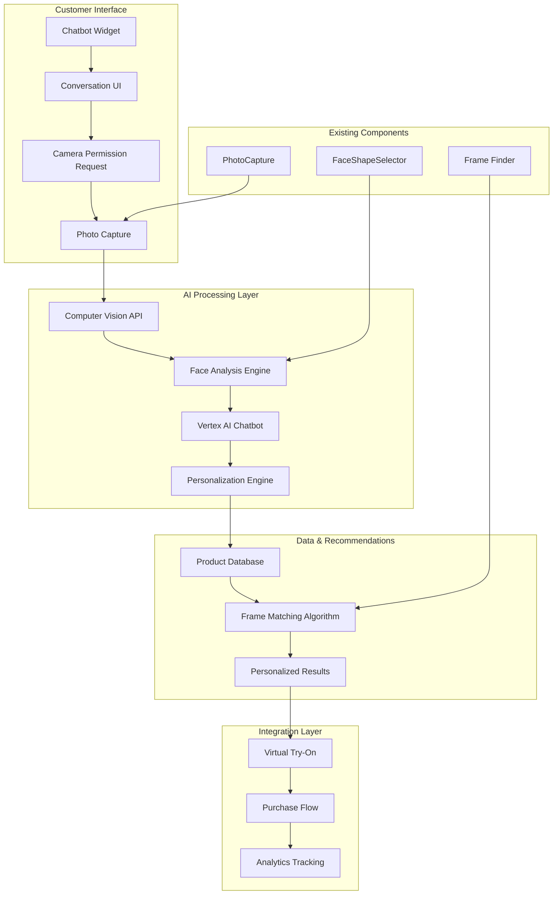

# AI-Powered Eyewear Discovery Chatbot Architecture

## Executive Summary

This document outlines the architecture for an AI-powered chatbot that revolutionizes eyewear shopping by using computer vision to analyze face shape, gender, and pupillary distance (PD) to provide personalized frame recommendations. The system integrates existing components with new AI capabilities to create a seamless, conversational shopping experience.

## System Overview

### Current Assets
- **FaceShapeSelector Component**: Manual and photo-based face shape detection
- **PhotoCapture Component**: Camera access and image capture functionality
- **Virtual Try-On System**: AR-based frame visualization
- **Frame Recommendation Engine**: Existing product matching logic

### New Components to Build
- **AI Conversation Engine**: Vertex AI-powered chatbot
- **Computer Vision Pipeline**: Enhanced face analysis (shape, gender, PD)
- **Personalization Engine**: Advanced recommendation algorithm
- **Embeddable Widget**: Deployable chatbot for e-commerce sites

## Architecture Diagram



## Component Architecture

### 1. AI Conversation Engine

**Technology Stack:**
- Google Vertex AI Conversational AI
- Natural Language Processing
- Intent Recognition
- Context Management

**Core Capabilities:**
```typescript
interface ConversationEngine {
  // Initialize conversation
