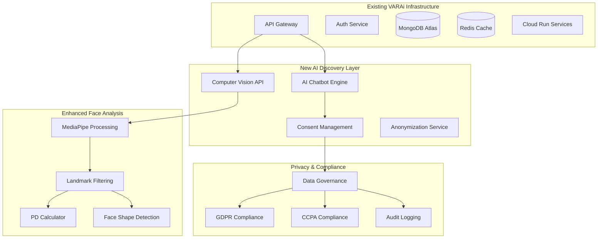

# AI Eyewear Discovery System - Privacy Integration with Existing GCP Architecture

## Executive Summary

This document extends the existing VARAi Commerce Studio GCP architecture to support the new AI-powered eyewear discovery system with privacy-compliant, multi-zone deployment. The system leverages existing infrastructure while adding MediaPipe optimization, consent management, and data governance for EU/NA compliance.

## Integration with Existing Architecture

### Current Infrastructure (Building Upon)

Based on existing documentation, VARAi Commerce Studio already has:

- **Multi-zone deployment**: EU and NA regions with data residency compliance
- **GCP Cloud Run**: Container orchestration and auto-scaling
- **MongoDB Atlas**: Primary database with regional configurations
- **Redis Cache**: Performance optimization layer
- **API Gateway**: Request routing and authentication
- **Kubernetes**: Container orchestration
- **Role-Based Access Control**: Comprehensive RBAC system

### New AI Discovery Components (Adding)



## MediaPipe Integration & Data Minimization

### Optimized Facial Landmark Processing

**Building on existing Face Shape Analysis service, enhanced with MediaPipe:**

```typescript
// Extends existing FaceShapeSelector component
interface EnhancedFaceAnalysis extends ExistingFaceShapeAnalysis {
  // MediaPipe processing with data minimization
  processMediaPipeOutput(
    fullLandmarks: MediaPipeLandmarks, // 468 points
    consentLevel: ConsentLevel
  ): Promise<EyewearSpecificData>;
  
  // Only retain eyewear-relevant points
  extractEyewearLandmarks(
    landmarks: MediaPipeLandmarks
  ): Promise<MinimalLandmarkSet>;
}

interface MinimalLandmarkSet {
  // Essential measurements only (12-15 points vs 468)
  pupillaryDistance: {
    leftPupil: Point3D;    // Landmark 468 (left)
    rightPupil: Point3D;   // Landmark 473 (right)
    distance: number;      // Calculated PD in mm
  };
  
  faceWidth: {
    leftTemple: Point3D;   // Landmark 234
    rightTemple: Point3D;  // Landmark 454
    width: number;         // Temple-to-temple width
  };
  
  bridgeWidth: {
    nasalBridge: Point3D;  // Landmark 6
    bridgeWidth: number;   // Nose bridge width
  };
  
  frameHeight: {
    eyebrowTop: Point3D;   // Landmark 70
    cheekBottom: Point3D;  // Landmark 18
    height: number;        // Recommended frame height
  };
  
  // Computed values (not stored raw landmarks)
  faceShape: FaceShapeCategory;
  confidence: number;
  
  // Privacy metadata
  processingRegion: 'EU' | 'NA';
  consentLevel: ConsentLevel;
  retentionPolicy: RetentionPolicy;
}

// Immediate disposal of sensitive data
interface DataMinimizationProcess {
  // Process full MediaPipe output
  processFullLandmarks(landmarks: MediaPipeLandmarks): Promise<MinimalLandmarkSet>;
  
  // Immediately discard sensitive points
  discardSensitiveData(landmarks: MediaPipeLandmarks): Promise<void>;
  
  // Verify data minimization compliance
  auditDataRetention(processedData: MinimalLandmarkSet): Promise<ComplianceReport>;
}
```

## Enhanced Regional Architecture

### Building on Existing Region Configuration

**Extending `docs/architecture/region_specific_data_storage.md`:**

```typescript
// Extends existing region configuration
interface EnhancedRegionConfig extends ExistingRegionConfig {
  // AI-specific regional settings
  aiProcessingRegion: {
    vertexAIEndpoint: string;
    mediaPipeProcessing: boolean;
    dataRetentionDays: number;
    anonymizationLevel: 'basic' | 'advanced' | 'differential_privacy';
  };
  
  // Privacy compliance settings
  privacyCompliance: {
    gdprEnabled: boolean;
    ccpaEnabled: boolean;
    consentRequired: boolean;
    dataMinimization: boolean;
    rightToForgotten: boolean;
  };
}

// Enhanced database configuration for AI data
interface AIDataStorageConfig {
  // Extends existing MongoDB configuration
  faceAnalysisCollection: {
    region: 'EU' | 'NA';
    encryption: 'field-level';
    retention: RetentionPolicy;
    indexing: 'privacy-aware';
  };
  
  // Separate collections for different data types
  anonymizedTrainingData: {
    region: 'GLOBAL' | 'EU' | 'NA';
    poolingEnabled: boolean;
    differentialPrivacy: boolean;
  };
  
  consentRecords: {
    region: 'SAME_AS_USER';
    immutable: true;
    auditTrail: true;
  };
}
```

## Consent Management Integration

### Building on Existing RBAC System

**Extends existing User Management and Auth Service:**

```typescript
// Extends existing user roles with consent management
interface EnhancedUserProfile extends ExistingUserProfile {
  // Privacy preferences
  privacyConsent: {
    faceAnalysisConsent: ConsentRecord;
    dataRetentionConsent: ConsentRecord;
    anonymousPoolingConsent: ConsentRecord;
    marketingConsent: ConsentRecord;
  };
  
  // Regional compliance
  dataResidencyRegion: 'EU' | 'NA' | 'AUTO';
  gdprSubject: boolean;
  ccpaSubject: boolean;
}

interface ConsentRecord {
  granted: boolean;
  timestamp: Date;
  ipAddress: string;
  userAgent: string;
  consentVersion: string;
  withdrawalDate?: Date;
  legalBasis: 'consent' | 'legitimate_interest' | 'contract';
}

// Brand-level data governance
interface BrandDataGovernance extends ExistingTenantManagement {
  // Extends existing tenant management
  dataGovernancePolicy: {
    participateInGlobalPool: boolean;
    dataRetentionPeriod: number;
    anonymizationRequired: boolean;
    auditFrequency: 'monthly' | 'quarterly' | 'annually';
  };
  
  // Compliance settings
  complianceRequirements: {
    gdprCompliant: boolean;
    ccpaCompliant: boolean;
    hipaaCompliant: boolean;
    customRequirements: string[];
  };
}
```

## AI Chatbot Integration with Existing Services

### Vertex AI Integration with Current Architecture

**Builds on existing AI Services and integrates with API Gateway:**

```typescript
// Extends existing Recommendation Engine
interface AIEyewearDiscoveryEngine extends ExistingRecommendationEngine {
  // Conversation management
  conversationEngine: {
    vertexAIEndpoint: string;
    contextManagement: boolean;
    multiLanguageSupport: string[];
    personalizedResponses: boolean;
  };
  
  // Integration with existing face analysis
  faceAnalysisIntegration: {
    useExistingFaceShapeSelector: boolean;
    enhanceWithMediaPipe: boolean;
    pdCalculationEnabled: boolean;
    genderDetectionEnabled: boolean;
  };
  
  // Frame recommendation enhancement
  enhancedRecommendations: {
    useExistingRecommendationEngine: boolean;
    aiPersonalization: boolean;
    realTimeOptimization: boolean;
    conversionOptimization: boolean;
  };
}

// Conversation flow integration
interface ConversationFlow {
  // Greeting and consent
  initiateConversation(): Promise<ConversationSession>;
  requestConsent(consentType: ConsentType[]): Promise<ConsentResponse>;
  
  // Face analysis (using existing + enhanced)
  guideFaceCapture(): Promise<FaceAnalysisResult>;
  processWithMediaPipe(image: ImageData): Promise<EnhancedFaceData>;
  
  // Recommendation (using existing engine)
  generateRecommendations(
    faceData: EnhancedFaceData,
    preferences: UserPreferences
  ): Promise<PersonalizedFrames>;
  
  // VTO integration (using existing VTO system)
  facilitateVirtualTryOn(frameId: string): Promise<VTOSession>;
}
```

## Analytics Enhancement

### Building on Existing Analytics Engine

**Extends existing Analytics Service with AI-specific tracking:**

```typescript
// Extends existing analytics with AI discovery metrics
interface EnhancedAnalyticsEngine extends ExistingAnalyticsEngine {
  // AI discovery specific events
  trackAIDiscoverySession(event: AIDiscoveryEvent): Promise<void>;
  trackConsentDecisions(event: ConsentEvent): Promise<void>;
  trackFaceAnalysisAccuracy(event: FaceAnalysisEvent): Promise<void>;
  trackRecommendationPerformance(event: RecommendationEvent): Promise<void>;
  
  // Privacy-compliant aggregation
  generatePrivacyCompliantReports(
    timeRange: DateRange,
    region: Region
  ): Promise<PrivacyCompliantReport>;
  
  // ML model performance tracking
  trackModelPerformance(
    modelType: 'face_analysis' | 'recommendation' | 'conversation',
    metrics: ModelMetrics
  ): Promise<void>;
}

interface AIDiscoveryEvent {
  sessionId: string;
  userId?: string; // Optional for anonymous users
  timestamp: Date;
  region: 'EU' | 'NA';
  
  // Journey tracking
  discoveryStage: 'greeting' | 'consent' | 'face_analysis' | 'recommendations' | 'vto' | 'purchase';
  interactionType: 'click' | 'view' | 'capture' | 'try_on' | 'purchase';
  
  // Privacy-compliant data
  faceShapeCategory?: string; // Generalized, not specific measurements
  recommendationCount?: number;
  conversionOutcome?: 'purchased' | 'saved' | 'abandoned';
  
  // Exclude sensitive data
  // NO: specific facial measurements, raw images, personal identifiers
}
```

## Deployment Integration

### Cloud Run Enhancement

**Builds on existing Cloud Run deployment with AI services:**

```yaml
# Extends existing Cloud Run configuration
apiVersion: serving.knative.dev/v1
kind: Service
metadata:
  name: ai-eyewear-discovery
  annotations:
    run.googleapis.com/ingress: all
spec:
  template:
    metadata:
      annotations:
        autoscaling.knative.dev/maxScale: "100"
        run.googleapis.com/memory: "4Gi"
        run.googleapis.com/cpu: "2"
    spec:
      containers:
      - image: gcr.io/varai-ai-dev/ai-eyewear-discovery:latest
        env:
        # Existing environment variables
        - name: MONGODB_URL
          valueFrom:
            secretKeyRef:
              name: mongodb-credentials
              key: url
        
        # New AI-specific variables
        - name: VERTEX_AI_PROJECT_ID
          value: "varai-ai-dev"
        - name: MEDIAPIPE_MODEL_PATH
          value: "/models/face_landmarker.task"
        - name: CONSENT_MANAGEMENT_ENABLED
          value: "true"
        - name: DATA_MINIMIZATION_ENABLED
          value: "true"
        
        # Regional configuration
        - name: PROCESSING_REGION
          value: "AUTO_DETECT"
        - name: GDPR_COMPLIANCE_ENABLED
          value: "true"
        - name: CCPA_COMPLIANCE_ENABLED
          value: "true"
```

## Implementation Roadmap

### Phase 1: Foundation Integration (Week 1-2)
1. **Extend existing Face Shape Selector** with MediaPipe processing
2. **Enhance consent management** in existing Auth Service
3. **Add AI discovery endpoints** to existing API Gateway
4. **Implement data minimization** in existing data pipeline

### Phase 2: AI Enhancement (Week 3-4)
1. **Deploy Vertex AI chatbot** integration
2. **Enhance recommendation engine** with conversation context
3. **Add privacy-compliant analytics** to existing Analytics Service
4. **Implement regional data governance**

### Phase 3: Advanced Features (Week 5-6)
1. **Deploy advanced MediaPipe processing**
2. **Implement differential privacy** for pooled data
3. **Add real-time consent management**
4. **Enhance existing VTO integration**

### Phase 4: Optimization (Week 7-8)
1. **Optimize performance** across regions
2. **Implement advanced analytics** dashboards
3. **Add A/B testing** for AI recommendations
4. **Deploy merchant onboarding** for AI features

## Compliance Integration

### Building on Existing Security Architecture

**Extends existing security with AI-specific privacy controls:**

```typescript
// Extends existing security architecture
interface EnhancedSecurityArchitecture extends ExistingSecurityArchitecture {
  // AI-specific privacy controls
  privacyControls: {
    dataMinimization: boolean;
    consentManagement: boolean;
    rightToForgotten: boolean;
    dataPortability: boolean;
    auditLogging: boolean;
  };
  
  // Regional compliance
  regionalCompliance: {
    gdprCompliance: GDPRComplianceConfig;
    ccpaCompliance: CCPAComplianceConfig;
    dataResidency: DataResidencyConfig;
  };
  
  // AI model governance
  modelGovernance: {
    modelVersioning: boolean;
    biasDetection: boolean;
    explainability: boolean;
    performanceMonitoring: boolean;
  };
}
```

## Success Metrics Integration

### Enhanced KPIs Building on Existing Analytics

**Extends existing business metrics with AI discovery metrics:**

- **Discovery Completion Rate**: % of users completing AI-guided face analysis
- **Recommendation Accuracy**: Improvement over existing recommendation engine
- **Consent Opt-in Rate**: % of users consenting to enhanced features
- **Privacy Compliance Score**: Automated compliance monitoring
- **Cross-region Performance**: Latency and accuracy across EU/NA zones
- **Data Minimization Efficiency**: Reduction in stored data points vs. functionality
- **Model Performance**: Face analysis accuracy and recommendation relevance
- **Business Impact**: Revenue lift from AI-guided vs. traditional discovery

This architecture seamlessly integrates the new AI eyewear discovery system with VARAi's existing GCP infrastructure while ensuring privacy compliance and optimal performance across EU and NA regions.