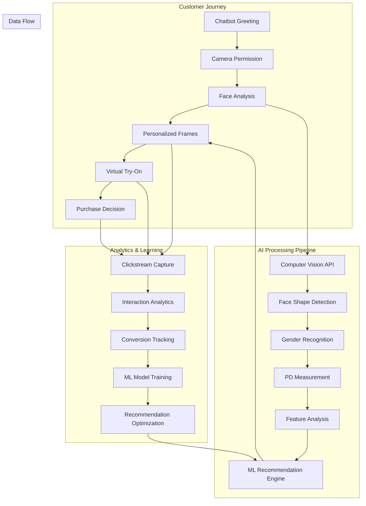

# AI-Powered Eyewear Discovery System Architecture

## Executive Summary

This system revolutionizes eyewear shopping by replacing traditional search with AI-driven personalized frame presentation. Using computer vision for face analysis and machine learning for recommendations, customers see only frames that suit their unique features. Complete clickstream analytics capture every interaction to continuously improve the recommendation engine.

## Core Philosophy: No Search, Only Discovery

**Traditional Approach**: Customer searches → Filters results → Browses hundreds of frames
**Our Approach**: AI analyzes face → Presents 5-10 perfect matches → Customer tries on → Purchases

## System Architecture



## Component Architecture

### 1. AI Conversation Engine

**Purpose**: Guide customers through discovery without overwhelming choices

```typescript
interface ConversationFlow {
  // Initial engagement
  greetCustomer(): Promise<void>;
  requestCameraPermission(): Promise<boolean>;
  
  // Face analysis guidance
  guideFaceCapture(): Promise<FaceAnalysisResult>;
  explainAnalysis(results: FaceAnalysisResult): Promise<void>;
  
  // Frame presentation
  presentFrames(recommendations: Frame[]): Promise<void>;
  handleFrameInteraction(frameId: string, action: InteractionType): Promise<void>;
  
  // Purchase guidance
  facilitateTryOn(frameId: string): Promise<void>;
  guideToPurchase(frameId: string): Promise<void>;
}

interface FaceAnalysisResult {
  faceShape: 'oval' | 'round' | 'square' | 'heart' | 'diamond' | 'oblong';
  gender: 'male' | 'female' | 'unisex';
  pupillaryDistance: number; // in mm
  faceWidth: number;
  faceLength: number;
  confidence: number;
  features: {
    eyeSize: 'small' | 'medium' | 'large';
    noseShape: 'narrow' | 'medium' | 'wide';
    cheekbones: 'prominent' | 'subtle';
    jawline: 'sharp' | 'soft' | 'rounded';
  };
}
```

### 2. Enhanced Computer Vision Pipeline

**Integrates with existing FaceShapeSelector but adds advanced analysis**

```typescript
interface EnhancedFaceAnalysis {
  // Core analysis (extends existing)
  analyzeFaceShape(image: ImageData): Promise<FaceShapeResult>;
  
  // New capabilities
  detectGender(image: ImageData): Promise<GenderResult>;
  measurePD(image: ImageData): Promise<PDResult>;
  analyzeFeatures(image: ImageData): Promise<FeatureAnalysis>;
  
  // Combined analysis
  performCompleteAnalysis(image: ImageData): Promise<FaceAnalysisResult>;
}

interface FrameRecommendationEngine {
  // Primary recommendation logic
  getPersonalizedFrames(
    analysis: FaceAnalysisResult,
    preferences?: UserPreferences,
    context?: ShoppingContext
  ): Promise<Frame[]>;
  
  // Learning from interactions
  recordInteraction(
    userId: string,
    frameId: string,
    interaction: InteractionType,
    context: InteractionContext
  ): Promise<void>;
  
  // Continuous improvement
  updateRecommendations(
    userId: string,
    feedback: UserFeedback[]
  ): Promise<Frame[]>;
}
```

### 3. Personalized Frame Presentation System

**No browsing - only curated selections**

```typescript
interface FramePresentationEngine {
  // Core presentation logic
  selectOptimalFrames(
    analysis: FaceAnalysisResult,
    inventory: Frame[],
    maxFrames: number = 8
  ): Promise<CuratedSelection>;
  
  // Presentation strategies
  presentByCategory(frames: Frame[]): FrameCategory[];
  presentByStyle(frames: Frame[]): StyleGroup[];
  presentByOccasion(frames: Frame[]): OccasionGroup[];
  
  // Dynamic reordering based on interactions
  reorderBasedOnEngagement(
    frames: Frame[],
    interactions: Interaction[]
  ): Promise<Frame[]>;
}

interface CuratedSelection {
  primaryRecommendations: Frame[]; // Top 3-5 matches
  alternativeOptions: Frame[];     // 3-5 backup options
  reasoning: RecommendationReason[];
  confidence: number;
}

interface RecommendationReason {
  frameId: string;
  reasons: string[];
  faceFeatureMatch: FeatureMatchScore;
  styleAlignment: StyleScore;
}
```

### 4. Comprehensive Analytics Pipeline

**Captures every interaction for ML improvement**

```typescript
interface AnalyticsEngine {
  // Clickstream tracking
  trackFrameView(event: FrameViewEvent): Promise<void>;
  trackFrameInteraction(event: FrameInteractionEvent): Promise<void>;
  trackVTOSession(event: VTOSessionEvent): Promise<void>;
  trackPurchaseJourney(event: PurchaseEvent): Promise<void>;
  
  // Aggregation and insights
  generateUserProfile(userId: string): Promise<UserProfile>;
  analyzeConversionPatterns(): Promise<ConversionInsights>;
  identifyRecommendationGaps(): Promise<RecommendationGaps>;
  
  // ML training data preparation
  prepareTrainingData(): Promise<MLTrainingDataset>;
  updateMLModels(dataset: MLTrainingDataset): Promise<ModelUpdateResult>;
}

interface FrameViewEvent {
  userId: string;
  sessionId: string;
  frameId: string;
  position: number; // Position in recommendation list
  viewDuration: number; // Time spent viewing
  faceAnalysis: FaceAnalysisResult;
  timestamp: Date;
  context: {
    recommendationReason: string[];
    presentationStyle: 'grid' | 'carousel' | 'single';
    deviceType: 'mobile' | 'desktop' | 'tablet';
  };
}

interface VTOSessionEvent {
  userId: string;
  sessionId: string;
  frameId: string;
  sessionDuration: number;
  interactions: VTOInteraction[];
  outcome: 'purchased' | 'saved' | 'dismissed' | 'abandoned';
  qualityRating?: number; // User feedback on VTO quality
}

interface PurchaseEvent {
  userId: string;
  sessionId: string;
  frameId: string;
  purchaseValue: number;
  timeFromFirstView: number;
  timeFromFirstVTO: number;
  totalFramesViewed: number;
  totalVTOSessions: number;
  conversionPath: ConversionStep[];
}
```

### 5. Machine Learning Recommendation Engine

**Continuously learns from user behavior**

```typescript
interface MLRecommendationEngine {
  // Model types
  faceFrameMatchingModel: TensorFlowModel;
  userPreferenceModel: CollaborativeFilteringModel;
  conversionPredictionModel: XGBoostModel;
  
  // Prediction methods
  predictFrameMatch(
    faceAnalysis: FaceAnalysisResult,
    frame: Frame
  ): Promise<MatchProbability>;
  
  predictUserPreference(
    userId: string,
    frame: Frame,
    context: ShoppingContext
  ): Promise<PreferenceProbability>;
  
  predictConversionLikelihood(
    userId: string,
    frame: Frame,
    sessionContext: SessionContext
  ): Promise<ConversionProbability>;
  
  // Learning and optimization
  trainFromInteractions(
    interactions: Interaction[],
    outcomes: Outcome[]
  ): Promise<ModelUpdateResult>;
  
  optimizeRecommendations(
    userId: string,
    currentRecommendations: Frame[],
    realTimeContext: RealTimeContext
  ): Promise<OptimizedRecommendations>;
}
```

## User Journey Flow

### Phase 1: Discovery Initiation
```typescript
const discoveryFlow = {
  step1: "Chatbot greets: 'Let's find your perfect frames!'",
  step2: "Request camera permission with clear value proposition",
  step3: "Guide face capture with real-time feedback",
  step4: "Analyze face while showing progress and explaining process"
};
```

### Phase 2: Personalized Presentation
```typescript
const presentationFlow = {
  step1: "Show analysis results: 'You have an oval face shape'",
  step2: "Present 5-8 curated frames with reasoning",
  step3: "Enable one-click VTO for each frame",
  step4: "Track every interaction (hover, click, time spent)"
};
```

### Phase 3: Virtual Try-On & Decision
```typescript
const vtoFlow = {
  step1: "Seamless VTO integration with existing PhotoCapture",
  step2: "Track VTO session quality and duration",
  step3: "Offer comparison between multiple frames",
  step4: "Guide to purchase with personalized messaging"
};
```

### Phase 4: Continuous Learning
```typescript
const learningFlow = {
  step1: "Capture all interaction data",
  step2: "Update user profile and preferences",
  step3: "Retrain recommendation models",
  step4: "Improve future recommendations"
};
```

## Analytics Dashboard for Merchants

### Real-Time Metrics
- **Discovery Success Rate**: % of users who complete face analysis
- **Recommendation Accuracy**: % of presented frames that get tried on
- **VTO Conversion Rate**: % of VTO sessions that lead to purchase
- **Time to Purchase**: Average journey from discovery to purchase

### Behavioral Insights
- **Frame Performance**: Which frames get the most engagement by face type
- **Presentation Optimization**: Which presentation styles drive conversions
- **User Journey Analysis**: Where users drop off and why
- **Recommendation Quality**: Feedback scores and improvement trends

### Business Intelligence
- **Revenue Attribution**: Revenue generated by AI recommendations vs. traditional search
- **Customer Satisfaction**: NPS scores for AI-guided vs. self-service journeys
- **Inventory Optimization**: Which frames to stock based on face type demographics
- **Personalization ROI**: Revenue lift from personalized vs. generic recommendations

## Technical Implementation Plan

### Phase 1: Foundation (Weeks 1-2)
1. **Enhance existing FaceShapeSelector** with gender and PD detection
2. **Create conversation engine** using Vertex AI
3. **Build analytics tracking** infrastructure
4. **Integrate with existing PhotoCapture** component

### Phase 2: Core Features (Weeks 3-4)
1. **Implement recommendation engine** with basic ML models
2. **Create frame presentation** interface
3. **Build analytics dashboard** for merchants
4. **Integrate with existing VTO** system

### Phase 3: Optimization (Weeks 5-6)
1. **Deploy ML models** for real-time recommendations
2. **Implement A/B testing** framework
3. **Add advanced analytics** and insights
4. **Optimize for mobile** experience

### Phase 4: Scale (Weeks 7-8)
1. **Create embeddable widget** for e-commerce platforms
2. **Build Shopify/Magento** integrations
3. **Implement advanced personalization**
4. **Launch merchant onboarding** flow

## Success Metrics

### Customer Experience
- **Discovery Completion Rate**: >85%
- **Recommendation Satisfaction**: >4.5/5 stars
- **Time to Find Perfect Frame**: <3 minutes
- **VTO Engagement Rate**: >60%

### Business Impact
- **Conversion Rate Improvement**: +40% vs. traditional search
- **Average Order Value**: +25% through better matching
- **Customer Retention**: +30% through personalization
- **Support Ticket Reduction**: -50% through guided experience

### Technical Performance
- **Face Analysis Accuracy**: >95%
- **Recommendation Relevance**: >80%
- **System Response Time**: <2 seconds
- **Mobile Performance**: 90+ Lighthouse score

This architecture transforms eyewear shopping from a search-based experience to an AI-guided discovery journey, maximizing both customer satisfaction and business outcomes through intelligent personalization and comprehensive analytics.