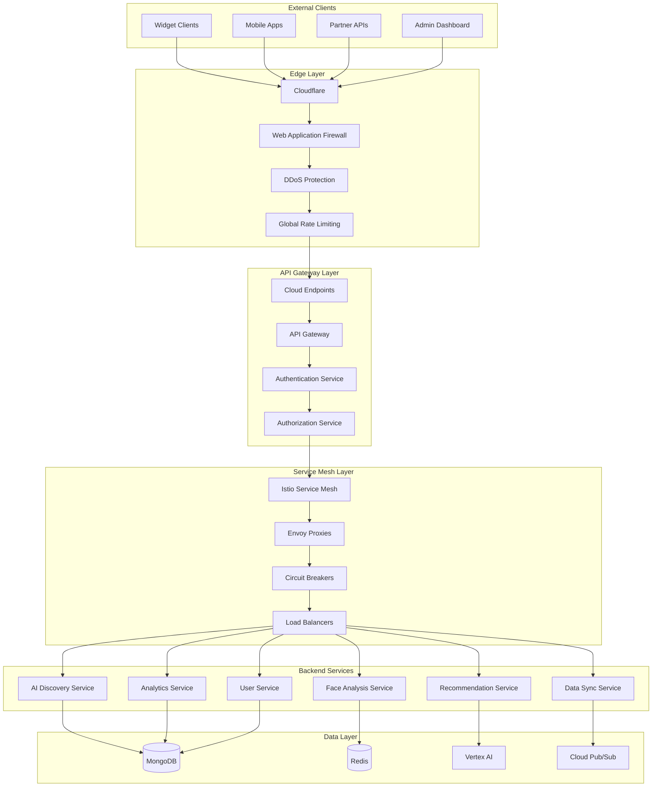

# API Gateway and Service Mesh Architecture
## AI Discovery E-commerce Integration

## Document Information
- **Document Type**: API Gateway and Service Mesh Architecture
- **System**: EyewearML Varai AI Discovery
- **Version**: 1.0
- **Date**: January 2025
- **Author**: Agent 5 - Technical Architecture Agent

## Executive Summary

This document defines the comprehensive API Gateway and Service Mesh architecture for the AI discovery e-commerce integration, providing scalable, secure, and observable communication between widgets, microservices, and backend systems.

## 1. API Gateway Architecture

### 1.1 Multi-Layer Gateway Design



### 1.2 Cloud Endpoints Configuration

```yaml
# Cloud Endpoints API Configuration
swagger: "2.0"
info:
  title: "EyewearML AI Discovery API"
  version: "1.0.0"
  description: "Comprehensive API for AI-powered eyewear discovery and recommendations"
  contact:
    name: "EyewearML API Support"
    email: "api-support@eyewearml.com"
  license:
    name: "Proprietary"

host: "api.varai.ai"
basePath: "/v1"
schemes:
  - "https"

securityDefinitions:
  api_key:
    type: "apiKey"
    name: "X-API-Key"
    in: "header"
    description: "API key for client authentication"
  
  oauth2:
    type: "oauth2"
    flow: "application"
    tokenUrl: "https://auth.varai.ai/oauth/token"
    scopes:
      read:products: "Read product information"
      write:analytics: "Write analytics data"
      access:ai_services: "Access AI services"
      manage:users: "Manage user accounts"
  
  bearer_token:
    type: "apiKey"
    name: "Authorization"
    in: "header"
    description: "Bearer token authentication"

# Global parameters
parameters:
  SessionId:
    name: "X-Session-ID"
    in: "header"
    type: "string"
    description: "Unique session identifier"
    required: false
  
  ClientVersion:
    name: "X-Client-Version"
    in: "header"
    type: "string"
    description: "Client application version"
    required: false
  
  Platform:
    name: "X-Platform"
    in: "header"
    type: "string"
    enum: ["shopify", "magento", "woocommerce", "html"]
    description: "E-commerce platform identifier"
    required: false

paths:
  # AI Conversation Endpoints
  /ai/chat:
    post:
      summary: "Process conversational AI request"
      description: "Send user message to AI engine and receive intelligent response"
      security:
        - api_key: []
        - bearer_token: []
      parameters:
        - $ref: "#/parameters/SessionId"
        - $ref: "#/parameters/Platform"
        - name: "message"
          in: "body"
          required: true
          schema:
            $ref: "#/definitions/ChatMessage"
      responses:
        200:
          description: "AI response with actions and context"
          schema:
            $ref: "#/definitions/AIResponse"
        400:
          description: "Invalid request format"
          schema:
            $ref: "#/definitions/ErrorResponse"
        429:
          description: "Rate limit exceeded"
          schema:
            $ref: "#/definitions/ErrorResponse"
        500:
          description: "Internal server error"
          schema:
            $ref: "#/definitions/ErrorResponse"
      x-google-backend:
        address: "https://ai-service-dot-eyewearml-ai.uc.r.appspot.com"
        path_translation: "APPEND_PATH_TO_ADDRESS"
        deadline: 30.0
  
  /ai/context:
    get:
      summary: "Get conversation context"
      description: "Retrieve current conversation context for session"
      security:
        - api_key: []
      parameters:
        - $ref: "#/parameters/SessionId"
        - name: "session_id"
          in: "query"
          type: "string"
          required: true
      responses:
        200:
          description: "Conversation context"
          schema:
            $ref: "#/definitions/ConversationContext"
      x-google-backend:
        address: "https://ai-service-dot-eyewearml-ai.uc.r.appspot.com"
    
    put:
      summary: "Update conversation context"
      description: "Update conversation context with new information"
      security:
        - api_key: []
      parameters:
        - $ref: "#/parameters/SessionId"
        - name: "context"
          in: "body"
          required: true
          schema:
            $ref: "#/definitions/ContextUpdate"
      responses:
        200:
          description: "Context updated successfully"
          schema:
            $ref: "#/definitions/SuccessResponse"
      x-google-backend:
        address: "https://ai-service-dot-eyewearml-ai.uc.r.appspot.com"

  # Face Analysis Endpoints
  /face/analyze:
    post:
      summary: "Analyze face image for measurements"
      description: "Process face image to extract measurements and determine face shape"
      security:
        - api_key: []
      parameters:
        - $ref: "#/parameters/SessionId"
        - name: "image"
          in: "body"
          required: true
          schema:
            $ref: "#/definitions/FaceImage"
      responses:
        200:
          description: "Face analysis results"
          schema:
            $ref: "#/definitions/FaceAnalysisResult"
        400:
          description: "Invalid image format or quality"
          schema:
            $ref: "#/definitions/ErrorResponse"
        413:
          description: "Image too large"
          schema:
            $ref: "#/definitions/ErrorResponse"
      x-google-backend:
        address: "https://face-service-dot-eyewearml-ai.uc.r.appspot.com"
        deadline: 15.0

  /face/validate:
    post:
      summary: "Validate face image quality"
      description: "Check if image meets quality requirements for analysis"
      security:
        - api_key: []
      parameters:
        - name: "image"
          in: "body"
          required: true
          schema:
            $ref: "#/definitions/ImageValidation"
      responses:
        200:
          description: "Image validation result"
          schema:
            $ref: "#/definitions/ValidationResult"
      x-google-backend:
        address: "https://face-service-dot-eyewearml-ai.uc.r.appspot.com"

  # Recommendation Endpoints
  /recommendations:
    get:
      summary: "Get personalized recommendations"
      description: "Retrieve AI-generated product recommendations based on user profile"
      security:
        - api_key: []
      parameters:
        - $ref: "#/parameters/SessionId"
        - $ref: "#/parameters/Platform"
        - name: "session_id"
          in: "query"
          type: "string"
          required: true
        - name: "face_shape"
          in: "query"
          type: "string"
          enum: ["oval", "round", "square", "heart", "diamond", "oblong"]
        - name: "preferences"
          in: "query"
          type: "string"
          description: "JSON-encoded user preferences"
        - name: "limit"
          in: "query"
          type: "integer"
          minimum: 1
          maximum: 50
          default: 8
        - name: "include_reasoning"
          in: "query"
          type: "boolean"
          default: true
      responses:
        200:
          description: "Product recommendations"
          schema:
            $ref: "#/definitions/RecommendationList"
      x-google-backend:
        address: "https://recommendation-service-dot-eyewearml-ai.uc.r.appspot.com"
        deadline: 10.0

    post:
      summary: "Generate recommendations with custom criteria"
      description: "Generate recommendations with detailed criteria and filters"
      security:
        - api_key: []
      parameters:
        - $ref: "#/parameters/SessionId"
        - name: "criteria"
          in: "body"
          required: true
          schema:
            $ref: "#/definitions/RecommendationCriteria"
      responses:
        200:
          description: "Generated recommendations"
          schema:
            $ref: "#/definitions/RecommendationList"
      x-google-backend:
        address: "https://recommendation-service-dot-eyewearml-ai.uc.r.appspot.com"

  /recommendations/feedback:
    post:
      summary: "Submit recommendation feedback"
      description: "Provide feedback on recommendation quality for ML improvement"
      security:
        - api_key: []
      parameters:
        - $ref: "#/parameters/SessionId"
        - name: "feedback"
          in: "body"
          required: true
          schema:
            $ref: "#/definitions/RecommendationFeedback"
      responses:
        200:
          description: "Feedback recorded successfully"
          schema:
            $ref: "#/definitions/SuccessResponse"
      x-google-backend:
        address: "https://recommendation-service-dot-eyewearml-ai.uc.r.appspot.com"

  # Analytics Endpoints
  /analytics/events:
    post:
      summary: "Track analytics events"
      description: "Record user interaction and business events for analytics"
      security:
        - api_key: []
      parameters:
        - $ref: "#/parameters/SessionId"
        - $ref: "#/parameters/Platform"
        - name: "events"
          in: "body"
          required: true
          schema:
            $ref: "#/definitions/AnalyticsEvents"
      responses:
        200:
          description: "Events recorded successfully"
          schema:
            $ref: "#/definitions/SuccessResponse"
        202:
          description: "Events queued for processing"
          schema:
            $ref: "#/definitions/SuccessResponse"
      x-google-backend:
        address: "https://analytics-service-dot-eyewearml-ai.uc.r.appspot.com"

  /analytics/metrics:
    get:
      summary: "Get analytics metrics"
      description: "Retrieve aggregated analytics metrics for dashboard"
      security:
        - oauth2: ["read:analytics"]
      parameters:
        - name: "store_id"
          in: "query"
          type: "string"
          required: true
        - name: "date_range"
          in: "query"
          type: "string"
          enum: ["today", "week", "month", "quarter", "year", "custom"]
          default: "week"
        - name: "start_date"
          in: "query"
          type: "string"
          format: "date"
        - name: "end_date"
          in: "query"
          type: "string"
          format: "date"
        - name: "metrics"
          in: "query"
          type: "array"
          items:
            type: "string"
          collectionFormat: "csv"
      responses:
        200:
          description: "Analytics metrics"
          schema:
            $ref: "#/definitions/AnalyticsMetrics"
      x-google-backend:
        address: "https://analytics-service-dot-eyewearml-ai.uc.r.appspot.com"

  # User Management Endpoints
  /users/profile:
    get:
      summary: "Get user profile"
      description: "Retrieve user profile and preferences"
      security:
        - bearer_token: []
      parameters:
        - name: "user_id"
          in: "query"
          type: "string"
          required: true
      responses:
        200:
          description: "User profile"
          schema:
            $ref: "#/definitions/UserProfile"
      x-google-backend:
        address: "https://user-service-dot-eyewearml-ai.uc.r.appspot.com"

    put:
      summary: "Update user profile"
      description: "Update user profile and preferences"
      security:
        - bearer_token: []
      parameters:
        - name: "profile"
          in: "body"
          required: true
          schema:
            $ref: "#/definitions/UserProfileUpdate"
      responses:
        200:
          description: "Profile updated successfully"
          schema:
            $ref: "#/definitions/SuccessResponse"
      x-google-backend:
        address: "https://user-service-dot-eyewearml-ai.uc.r.appspot.com"

  /users/consent:
    post:
      summary: "Record user consent"
      description: "Record user consent for data processing"
      security:
        - api_key: []
      parameters:
        - $ref: "#/parameters/SessionId"
        - name: "consent"
          in: "body"
          required: true
          schema:
            $ref: "#/definitions/ConsentRecord"
      responses:
        200:
          description: "Consent recorded successfully"
          schema:
            $ref: "#/definitions/SuccessResponse"
      x-google-backend:
        address: "https://user-service-dot-eyewearml-ai.uc.r.appspot.com"

  # Health and Status Endpoints
  /health:
    get:
      summary: "Health check"
      description: "Check API health status"
      responses:
        200:
          description: "API is healthy"
          schema:
            $ref: "#/definitions/HealthStatus"
        503:
          description: "API is unhealthy"
          schema:
            $ref: "#/definitions/HealthStatus"
      x-google-backend:
        address: "https://health-service-dot-eyewearml-ai.uc.r.appspot.com"

  /status:
    get:
      summary: "System status"
      description: "Get detailed system status and metrics"
      security:
        - oauth2: ["read:system"]
      responses:
        200:
          description: "System status"
          schema:
            $ref: "#/definitions/SystemStatus"
      x-google-backend:
        address: "https://health-service-dot-eyewearml-ai.uc.r.appspot.com"

# Data Models
definitions:
  ChatMessage:
    type: "object"
    required: ["text", "session_id"]
    properties:
      text:
        type: "string"
        maxLength: 1000
        description: "User message text"
      session_id:
        type: "string"
        description: "Unique session identifier"
      user_id:
        type: "string"
        description: "User identifier (optional)"
      context:
        type: "object"
        description: "Additional context information"
      timestamp:
        type: "string"
        format: "date-time"
        description: "Message timestamp"

  AIResponse:
    type: "object"
    properties:
      response:
        type: "string"
        description: "AI-generated response text"
      intent:
        type: "string"
        description: "Detected user intent"
      confidence:
        type: "number"
        minimum: 0
        maximum: 1
        description: "Intent confidence score"
      actions:
        type: "array"
        items:
          $ref: "#/definitions/AIAction"
        description: "Suggested actions"
      session_state:
        type: "object"
        description: "Updated session state"
      context:
        $ref: "#/definitions/ConversationContext"

  AIAction:
    type: "object"
    properties:
      type:
        type: "string"
        enum: ["face_analysis", "show_recommendations", "virtual_try_on", "product_details", "add_to_cart"]
      parameters:
        type: "object"
        description: "Action-specific parameters"
      priority:
        type: "integer"
        minimum: 1
        maximum: 10
        description: "Action priority"

  FaceImage:
    type: "object"
    required: ["image_data"]
    properties:
      image_data:
        type: "string"
        format: "byte"
        description: "Base64-encoded image data"
      format:
        type: "string"
        enum: ["jpeg", "png", "webp"]
        description: "Image format"
      session_id:
        type: "string"
        description: "Session identifier"
      consent:
        type: "boolean"
        description: "User consent for face analysis"

  FaceAnalysisResult:
    type: "object"
    properties:
      session_id:
        type: "string"
      face_shape:
        type: "string"
        enum: ["oval", "round", "square", "heart", "diamond", "oblong"]
      measurements:
        $ref: "#/definitions/FaceMeasurements"
      confidence:
        type: "number"
        minimum: 0
        maximum: 1
      quality_score:
        type: "number"
        minimum: 0
        maximum: 1
      processing_time:
        type: "number"
        description: "Processing time in milliseconds"

  FaceMeasurements:
    type: "object"
    properties:
      pupillary_distance:
        type: "number"
        description: "Pupillary distance in mm"
      face_width:
        type: "number"
        description: "Face width in mm"
      bridge_width:
        type: "number"
        description: "Recommended bridge width in mm"
      frame_height:
        type: "number"
        description: "Recommended frame height in mm"

  RecommendationList:
    type: "object"
    properties:
      session_id:
        type: "string"
      recommendations:
        type: "array"
        items:
          $ref: "#/definitions/ProductRecommendation"
      total_count:
        type: "integer"
      generation_time:
        type: "number"
        description: "Generation time in milliseconds"
      cache_hit:
        type: "boolean"

  ProductRecommendation:
    type: "object"
    properties:
      product_id:
        type: "string"
      name:
        type: "string"
      brand:
        type: "string"
      price:
        type: "number"
      currency:
        type: "string"
      image_url:
        type: "string"
      compatibility_score:
        type: "number"
        minimum: 0
        maximum: 1
      reasoning:
        type: "array"
        items:
          type: "string"
      features:
        type: "object"
      availability:
        $ref: "#/definitions/ProductAvailability"

  ProductAvailability:
    type: "object"
    properties:
      in_stock:
        type: "boolean"
      quantity:
        type: "integer"
      estimated_delivery:
        type: "string"
        format: "date"

  AnalyticsEvents:
    type: "object"
    properties:
      events:
        type: "array"
        items:
          $ref: "#/definitions/AnalyticsEvent"

  AnalyticsEvent:
    type: "object"
    required: ["event_type", "timestamp"]
    properties:
      event_type:
        type: "string"
        enum: ["page_view", "widget_load", "face_analysis", "recommendation_click", "add_to_cart", "purchase"]
      timestamp:
        type: "string"
        format: "date-time"
      session_id:
        type: "string"
      user_id:
        type: "string"
      properties:
        type: "object"
        description: "Event-specific properties"

  ErrorResponse:
    type: "object"
    properties:
      error:
        type: "string"
        description: "Error code"
      message:
        type: "string"
        description: "Human-readable error message"
      details:
        type: "object"
        description: "Additional error details"
      timestamp:
        type: "string"
        format: "date-time"
      request_id:
        type: "string"
        description: "Unique request identifier for debugging"

  SuccessResponse:
    type: "object"
    properties:
      success:
        type: "boolean"
        default: true
      message:
        type: "string"
      timestamp:
        type: "string"
        format: "date-time"
      request_id:
        type: "string"

  HealthStatus:
    type: "object"
    properties:
      status:
        type: "string"
        enum: ["healthy", "degraded", "unhealthy"]
      timestamp:
        type: "string"
        format: "date-time"
      services:
        type: "object"
        additionalProperties:
          type: "string"
          enum: ["healthy", "degraded", "unhealthy"]
      version:
        type: "string"

# Rate Limiting Configuration
x-google-management:
  metrics:
    - name: "requests_per_minute"
      display_name: "Requests per minute"
      value_type: "INT64"
      metric_kind: "GAUGE"
  
  quota:
    limits:
      - name: "requests_per_minute_per_key"
        display_name: "Requests per minute per API key"
        default_limit: 1000
        max_limit: 10000
        duration: "1m"
      
      - name: "face_analysis_per_hour_per_key"
        display_name: "Face analysis requests per hour per API key"
        default_limit: 100
        max_limit: 1000
        duration: "1h"
      
      - name: "recommendations_per_minute_per_key"
        display_name: "Recommendation requests per minute per API key"
        default_limit: 60
        max_limit: 600
        duration: "1m"

# Authentication Configuration
x-google-authentication:
  providers:
    - id: "api_key_auth"
      issuer: "https://api.varai.ai"
      jwks_uri: "https://api.varai.ai/.well-known/jwks.json"
    
    - id: "oauth2_auth"
      issuer: "https://auth.varai.ai"
      jwks_uri: "https://auth.varai.ai/.well-known/jwks.json"
      audiences:
        - "https://api.varai.ai"
```

### 1.3 API Gateway Security Configuration

```typescript
interface APIGatewaySecurity {
  // Authentication Configuration
  authentication: {
    methods: {
      apiKey: {
        headerName: 'X-API-Key';
        validation: 'hmac_signature_with_timestamp';
        keyRotation: 'every_90_days';
        keyScoping: 'service_and_environment_specific';
      };
      
      oauth2: {
        provider: 'google_cloud_identity';
        tokenValidation: 'jwt_with_jwks_verification';
        scopes: [
          'read:products',
          'write:analytics',
          'access:ai_services',
          'manage:users',
          'read:analytics',
          'read:system'
        ];
        tokenExpiry: '1_hour';
        refreshTokenExpiry: '30_days';
      };
      
      bearerToken: {
        validation: 'jwt_with_public_key_verification';
        issuer: 'https://auth.varai.ai';
        audience: 'https://api.varai.ai';
        clockSkew: '5_minutes';
      };
    };
    
    rateLimiting: {
      global: {
        requestsPerMinute: 10000;
        burstCapacity: 20000;
        algorithm: 'token_bucket_with_sliding_window';
      };
      
      perApiKey: {
        requestsPerMinute: 1000;
        faceAnalysisPerHour: 100;
        recommendationsPerMinute: 60;
        analyticsEventsPerMinute: 500;
      };
      
      perIP: {
        requestsPerMinute: 100;
        connectionLimit: 10;
        banDuration: '1_hour_for_abuse';
      };
    };
    
    inputValidation: {
      requestSizeLimit: '10MB';
      timeoutLimit: '30_seconds';
      
      validationRules: {
        imageUpload: {
          maxSize: '10MB';
          allowedMimeTypes: ['image/jpeg', 'image/png', 'image/webp'];
          virusScan: 'enabled';
          contentValidation: 'image_header_verification';
        };
        
        textInput: {
          maxLength: 1000;
          encoding: 'utf8';
          sanitization: 'html_entity_encoding';
          profanityFilter: 'enabled';
          injectionPrevention: 'sql_and_script_injection_detection';
        };
        
        jsonPayload: {
          maxDepth: 10;
          maxProperties: 100;
          schemaValidation: 'json_schema_validation';
          typeCoercion: 'strict_type_checking';
        };
      };
    };
  };
  
  // Authorization Configuration
  authorization: {
    model: 'rbac_with_abac_policies';
    
    roles: [
      {
        name: 'widget_client';
        permissions: [
          'ai:chat',
          'face:analyze',
          'recommendations:read',
          'analytics:write',
          'users:consent'
        ];
        restrictions: {
          rateLimits: 'standard';
          dataAccess: 'own_session_only';
          features: 'basic_ai_features';
        };
      },
      
      {
        name: 'premium_client';
        permissions: [
          'ai:chat',
          'face:analyze',
          'recommendations:read',
          'recommendations:feedback',
          'analytics:write',
          'users:profile',
          'users:consent'
        ];
        restrictions: {
          rateLimits: 'premium';
          dataAccess: 'own_data_and_aggregates';
          features: 'advanced_ai_features';
        };
      },
      
      {
        name: 'admin_user';
        permissions: [
          'analytics:read',
          'users:manage',
          'system:status',
          'configuration:manage'
        ];
        restrictions: {
          rateLimits: 'admin';
          dataAccess: 'all_data_with_audit';
          features: 'admin_features';
        };
      },
      
      {
        name: 'service_account';
        permissions: [
          'internal:sync',
          'internal:health',
          'analytics:aggregate',
          'ml:training'
        ];
        restrictions: {
          rateLimits: 'unlimited';
          dataAccess: 'service_specific';
          features: 'internal_apis';
        };
      }
    ];
    
    policies: [
      {
        name: 'data_residency_policy';
        rule: 'eu_users_data_processed_in_eu_only';
        enforcement: 'request_routing_based_on_user_location';
        exceptions: 'aggregated_analytics_allowed_globally';
      },
      
      {
        name: 'privacy_policy';
        rule: 'face_analysis_requires_explicit_consent';
        enforcement: 'consent_verification_before_processing';
        auditLog: 'all_consent_decisions_logged';
      },
      
      {
        name: 'business_hours_policy';
        rule: 'admin_operations_during_business_hours_only';
        enforcement: 'time_based_access_control';
        exceptions: 'emergency_access_with_approval';
      }
    ];
  };
  
  // Security Monitoring
  securityMonitoring: {
    threatDetection: {
      anomalyDetection: 'ml_based_traffic_analysis';
      signatureBasedDetection: 'owasp_top_10_protection';
      behaviorAnalysis: 'user_behavior_profiling';
      
      alertThresholds: {
        suspiciousTraffic: 'traffic_pattern_deviation_above_3_sigma';
        authenticationFailures: 'more_than_10_failures_per_minute_per_ip';
        dataExfiltration: 'unusual_data_access_patterns';
        apiAbuse: 'rate_limit_violations_above_threshold';
      };
    };
    
    auditLogging: {
      logLevel: 'comprehensive';
      retention: '7_years_for_compliance';
      
      loggedEvents: [
        'authentication_attempts',
        'authorization_decisions',
        'data_access_events',
        'configuration_changes',
        'security_incidents',
        'privacy_consent_events'
      ];
      
      logFormat: 'structured_json_with_correlation_ids';
      logDestination: 'cloud_logging_with_siem_integration';
    };
    
    incidentResponse: {
      automatedResponse: {
        ipBlocking: 'automatic_blocking_for_