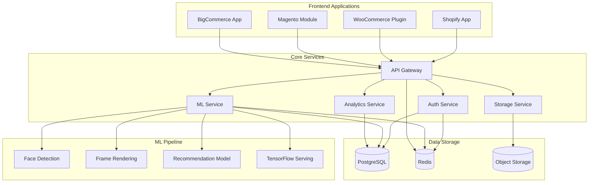
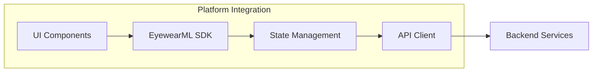
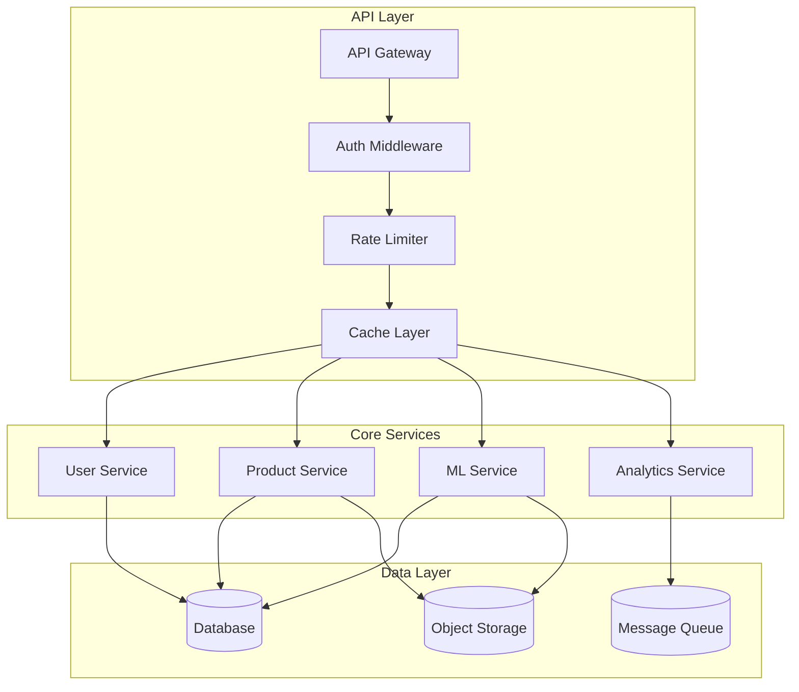
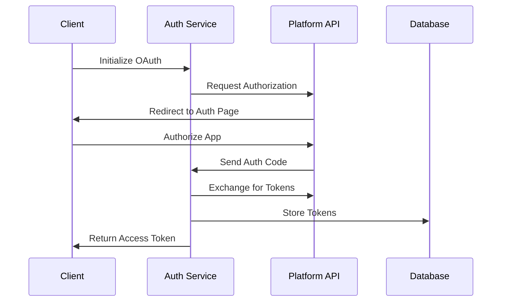
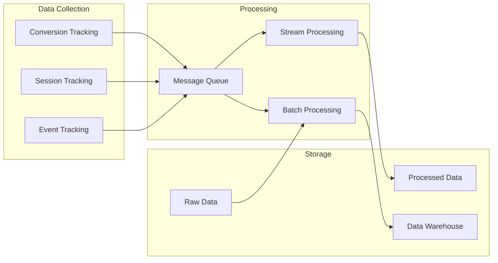
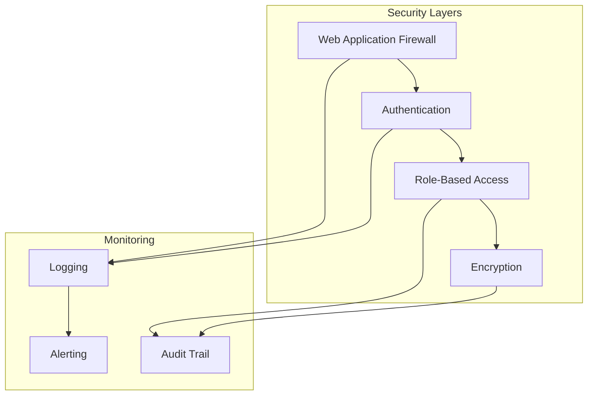
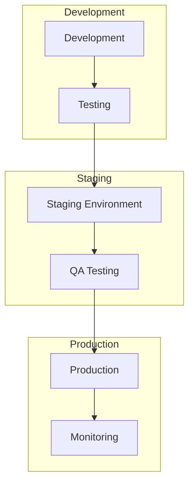

# EyewearML Architecture

## System Overview

## Component Architecture

### 1. Frontend Applications

Each platform integration follows a similar pattern:

### 2. Backend Services

## Service Details

### 1. Auth Service

### 2. ML Service

```mermaid
graph TB
    subgraph "ML Pipeline"
        Input[Image Input]
        Preprocess[Preprocessing]
        Detect[Face Detection]
        Align[Face Alignment]
        Render[Frame Rendering]
        Output[Final Output]
    end

    Input --> Preprocess
    Preprocess --> Detect
    Detect --> Align
    Align --> Render
    Render --> Output

    subgraph "Model Training"
        Data[Training Data]
        Feature[Feature Extraction]
        Train[Model Training]
        Eval[Evaluation]
        Deploy[Deployment]
    end

    Data --> Feature
    Feature --> Train
    Train --> Eval
    Eval --> Deploy
```

### 3. Analytics Service

## Technology Stack

### Frontend
- React/Next.js for admin dashboards
- TypeScript for type safety
- TensorFlow.js for client-side ML
- Three.js for 3D rendering

### Backend
- Node.js/Python for services
- FastAPI for API endpoints
- PostgreSQL for data storage
- Redis for caching
- RabbitMQ for messaging

### ML Pipeline
- TensorFlow/PyTorch for models
- ONNX for model exchange
- OpenCV for image processing
- TensorFlow Serving

### Infrastructure
- Kubernetes for orchestration
- Docker for containerization
- Terraform for IaC
- GitHub Actions for CI/CD

## Security Architecture

## Performance Optimization

1. **Caching Strategy**
   - Browser caching
   - CDN caching
   - API response caching
   - Database query caching

2. **Load Balancing**
   - Geographic distribution
   - Auto-scaling
   - Health checks
   - Failover handling

3. **Resource Optimization**
   - Image optimization
   - Code splitting
   - Lazy loading
   - Bundle optimization

## Deployment Architecture

## Monitoring and Observability

1. **Metrics Collection**
   - System metrics
   - Business metrics
   - User metrics
   - ML model metrics

2. **Logging**
   - Application logs
   - Access logs
   - Error logs
   - Audit logs

3. **Alerting**
   - Performance alerts
   - Error alerts
   - Security alerts
   - Business alerts

## Scalability Considerations

1. **Horizontal Scaling**
   - Service replication
   - Database sharding
   - Load balancing
   - Cache distribution

2. **Vertical Scaling**
   - Resource optimization
   - Performance tuning
   - Memory management
   - CPU optimization

3. **Data Scaling**
   - Data partitioning
   - Archive strategy
   - Backup strategy
   - Recovery plans
